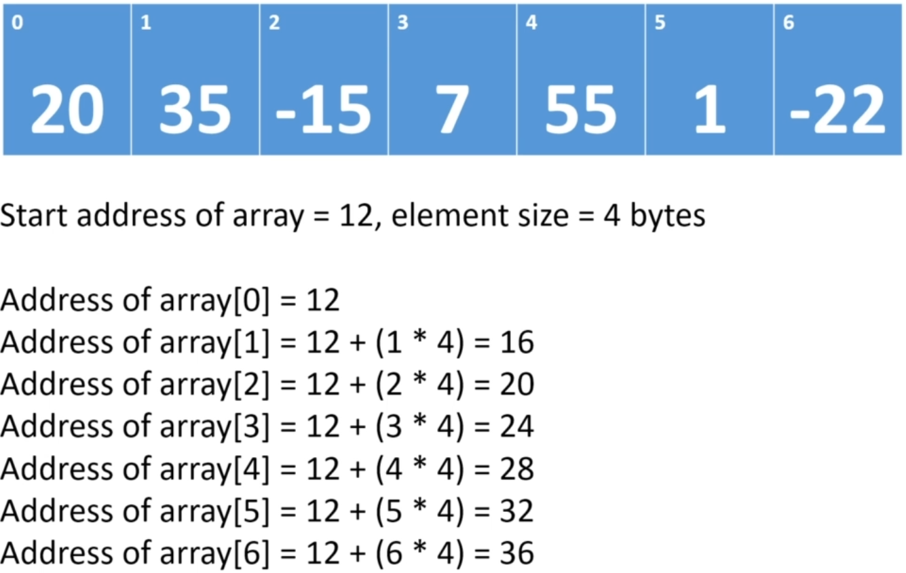

## Arrays

[:arrow_backward:](../algorithms_index)

##### Arrays in memory

- Contiguous block in memory (some space is reserved when array initializes and all elements will be stored there);
- Every element in array occupies the same amount of space in memory (if `int` then 4 bytes for every cell);
- If an array starts at memory address $x$, and the size of each element in the array is $y$, we can calculate the memory address of the $i$'th element by using the following expression: $x + i * y$;
  
  [zero-based because when getting first element we don't need to move bytes ($1*4$ step)]
- for getting an element by index we'll only need 3 steps (get start address of array, multiply and add bytes to it);

##### Big-O values for Array operations:

| Operation                                                    | Time Complexity |
| ------------------------------------------------------------ | --------------- |
| Retrieve with index                                          | O(1)            |
| Retrieve without index                                       | O(n)            |
| Add an element to a full array (create a new array with new size and set all values) | O(n)            |
| Add an element to the end of an array (has space)            | O(1)            |
| Insert or update an element at a specific index              | O(1)            |
| Delete an element by setting it to null                      | O(1)            |
| Delete an element by shifting elements (search element looping all first) | O(n)            |

