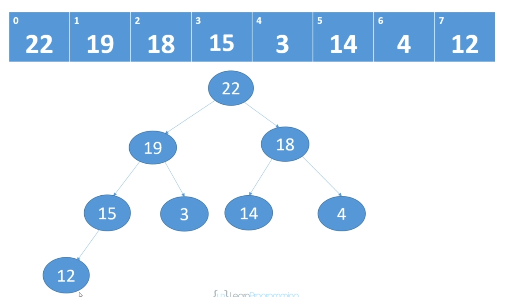

## Heaps

[:arrow_backward:](../algorithms_index)

- A binary heap must be a complete tree (children are added at each level from left to right)
- Usually implemented as arrays
- Max heap: every parent is greater than or equal to its children
- Min heap: every parent is less than or equal to its children
- The max or min value will always be at the root 
- Heapify: process of converting a binary tree into a heap - needs to be done after an insertion or deletion
- No required ordering between siblings

Code implementation in Java can be found [here](https://github.com/SashkoMolodec/algorithms_java/blob/master/src/heaps/Heap.java).

##### Delete an element example:

<video src="../../../../src/video/heaps_delete_example.mp4"></video>

##### Time complexity:

- Insertion - O(logn) 
- Add - O(1)
- Delete - worst case O(n)
- Delete item without index - O(nlogn)
- Fix heap - O(logn)