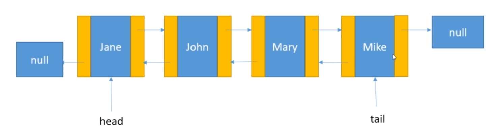

## Lists

[:arrow_backward:](../algorithms_index)

[toc]

### ArrayList

`ArrayList` is the resizable-array implementation of the List interface. **Stores references to objects.** Permits all elements including null. Also the class provides methods to manipulate the size of the array that is used internally to store the list.

##### Time complexity for ArrayList

| Operation                 | Time complexity                                              |
| ------------------------- | ------------------------------------------------------------ |
| `get()`                   | O(1)                                                         |
| `set()`                   | O(1)                                                         |
| `add()`                   | O(1) - but if new array has to be created and values copied then O(n) |
| `add(index, element)`     | O(n)                                                         |
| `remove()`                | O(n) - you have to shuffle the element after removal O(1) - remove from the end of a list |
| `indexOf()`, `contains()` | O(n) - iterates through the internal array                   |

### Vector	

`Vector` is a thread-safe version of `ArrayList`. Due to overhead in synchronization when not using multithreading, choice of `ArrayList` is more preferable.

### LinkedList

*LinkedList* is a doubly-linked implementation of the *List* and *Deque* interfaces.

- Sequential list of objects but rather using arrays it uses links
- Each item in the list is a node, which keeps references to next and previous elements
- Not synchronized
- Maintains insetion order

##### Linked List vs ArrayList

> `ArrayList `should be used where more search operations are required, and `LinkedList` should be used where more insert and delete operation is needed.

- Search operation is O(*n*), compared to *ArrayList* O($1$)
- Insertion, addition and removal operations are faster in *LinkedList* because no need to resize an array
- *LinkedList* consumes more memory than an *ArrayList* because it stores two references
- *Deque* interface for *LinkedList* provides queue behavior.

Simple implementation of linked list can be found here.

##### Operations time complexity 

| Operation             | Time complexity                                          |
| --------------------- | -------------------------------------------------------- |
| `add()`               | O(1) - appends an element to the end of the list         |
| `add(index, element)` | O(n)                                                     |
| `get()`               | O(n)                                                     |
| `remove(element)`     | O(n) - need to find it iterating                         |
| `remove(index)`       | O(n) - first need to follow the links from the beginning |
| `contains()`          | O(n)                                                     |

Useful when working with only head or tail of the list because insertion/remove operations are O($1$) time complexity. But if to insert in the middle of the list this is actually O($n$). 

### CopyOnWriteArrayList

https://www.baeldung.com/java-copy-on-write-arraylist

