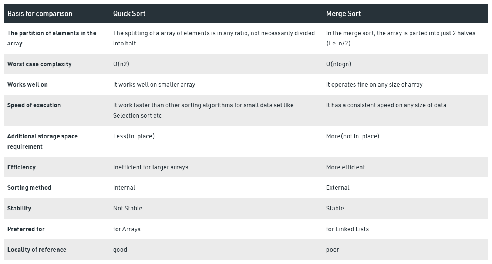
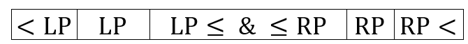
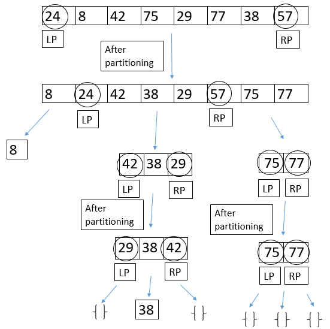

## Quick Sort

[:arrow_backward:](../../algorithms_index)

[toc]

#### Quick Sort vs Merge Sort

- Quicksort is the preferred algorithm, as it has an O(log(n)) space complexity. Mergesort, on the other hand, requires O(n) extra storage, which makes it quite expensive for arrays.

  > Space complexity measures the total amount of memory that an algorithm or operation needs to run according to its input size.

- Quicksort requires to access different indices for its operations, but this access is not directly possible in linked lists, as there are no continuous blocks; therefore to access an element we have to iterate through each node from the beginning of the linked list. Also, Mergesort is implemented without extra space for *LinkedLists.*

  In such case, overhead increases for Quicksort and Mergesort is generally preferred.

- **Merge sort** is more efficient and works faster than quick sort in case of **larger array size** or datasets.
  whereas **Quick sort** is more efficient and works faster than merge sort in case of **smaller array size** or datasets.

- Table comparison below:




#### Single Quick Sort

- O($nlogn$) time  complexity (often performs better then merge sort)
- Algorithm is: divide and conquer, recursive, unstable
- Does this in-place (unlike merge sort)
- Uses a pivot element to partition the array into two parts
- Elements < pivot to its left, elements > pivot to its right
- Pivot will be in its correct sorted position (process is repeating recursively so every element has been the pivot)


##### In action:

<video controls src="../../../../../src/video/quick_sort_in_action.mp4"></video>

##### Implementation:

```java
import java.util.Arrays;

public class QuickSort {

    public static void main(String[] args) {

        int[] intArray = {20, 35, -15, 7, 55, 1, -22};

        quicksort(intArray, 0, intArray.length);

        System.out.println(Arrays.toString(intArray));
    }

    public static void quicksort(int[] input, int start, int end) {
        if (end - start < 2) {
            return;
        }

        // return correct position of the pivot
        int pivotIndex = partition(input, start, end);
        //first quick sort all left sub array
        quicksort(input, start, pivotIndex);
        //then quick sort right sub array
        quicksort(input, pivotIndex + 1, end);
    }

    private static int partition(int[] input, int start, int end) {
        // using first element as the pivot
        int pivot = input[start];
        int i = start;
        int j = end;

        while (i < j) {

            //note: empty loop body for decrementing j
            while (i < j && input[--j] >= pivot) ;
            if (i < j) {
                input[i] = input[j];
            }

            //note: empty loop body for incrementing i
            while (i < j && input[++i] <= pivot) ;
            if (i < j) {
                input[j] = input[i];
            }
        }
        input[j] = pivot;
        return j;
    }
}
```


#### Dual pivot Quicksort

- Offers O(nlog(n)) performance
- Take two pivots, one in the left end of the array and the second in the right end
- The left pivot must be less than or equal to the right pivot, so we swap them if necessary
- We begin partitioning the array into three parts: 
  

##### An example:



##### In action:

<video controls src="../../../../../src/video/dual_pivot_sort_example.mp4"></video>


#### Single pivot vs Dual pivot

- Same performance but dual-pivot doesn't degrade to quadratic performance with bigger data sets, compared to typical one-pivot sort

- Dual-pivot makes better use of processor cache than all other forms of QS, that's why it is used from Java 7 straightforward

  > Multiway partitioning can reduce the number of scanned elements significantly, while it does not save many key comparisons (original [link](https://kluedo.ub.uni-kl.de/frontdoor/deliver/index/docId/4468/file/wild-dissertation.pdf) with research).