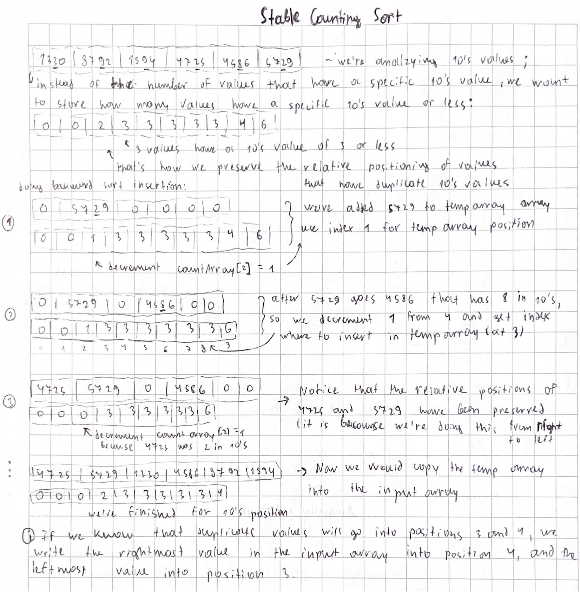

## Radix Sort

[:arrow_backward:](../../algorithms_index)

- O($n$) - can achieve this because we're making assumptions about the data
- Even so, it often runs slower than O($nlogn$) algorithms because of the overhead involved (need to isolate each digit or string single literal)

- Data must have same radix, and width (e.g. 4725, 4578, 1330 or "hello", "sasha", "misha")
- Sort based on each individual digit or letter position
- Start at the rightmost position
- Can be in-place (depends on algorithm sort we choose)
- Must use a stable algorithm at each stage

<video controls src="../../../../../src/video/counting_sort_in_action.mp4"></video>

##### In action:

<video controls src="../../../../../src/video/radix_sort_in_action.mp4"></video>


#### Stable Counting Sort



##### Implementation of Radix stable sort:

```java
import java.util.Arrays;

public class RadixSort {

    public static void main(String[] args) {

        int[] radixArray = {4725, 4586, 1330, 8792, 1594, 5729};

        radixSort(radixArray, 10, 4);

        System.out.println(Arrays.toString(radixArray));
    }

    public static void radixSort(int[] input, int radix, int width) {
        // loop for every position (we have 4)
        for (int i = 0; i < width; i++) {
            radixSingleSort(input, i, radix);
        }
    }

    private static void radixSingleSort(int[] input, int position, int radix) {
        int numItems = input.length;

        int[] countArray = new int[radix];

        for (int value : input) {
            countArray[getDigit(position, value, radix)]++;
        }
        // making our radix sort stable
        for (int j = 1; j < radix; j++) {
            countArray[j] += countArray[j - 1];
        }

        // steps explanation in notes
        int[] temp = new int[numItems];
        for (int tempIndex = numItems - 1; tempIndex >= 0; tempIndex--) {
            temp[--countArray[getDigit(position, input[tempIndex], radix)]] = input[tempIndex];
        }

        //copy temp array to input
        for (int tempIndex = 0; tempIndex < numItems; tempIndex++) {
            input[tempIndex] = temp[tempIndex];
        }
    }

    // want to get hundreds (7 from 4725):
    // call with position 2, 10^2 = 100, 4725 / 100 = 47.25, 47 % 10 = 7
    private static int getDigit(int position, int value, int radix) {
        return value / (int) Math.pow(radix, position) % radix;
    }
}
```