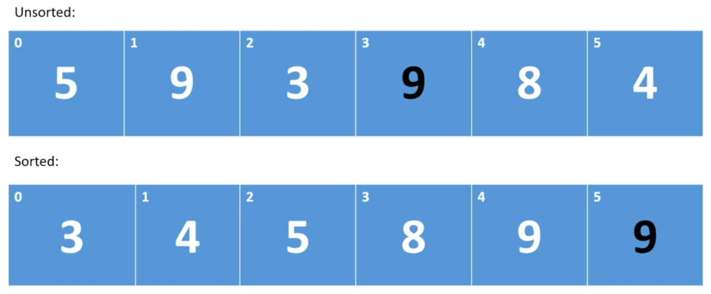

## Stable vs Unstable sort

[:arrow_backward:](../algorithms_index)

If a sort is unstable then the relative order of duplicate items will not be preserved:

"Black" 9 is now before "white" 9 as on picture above. In case of stable sort the relative order won't change:

##### Stable Bubble sort

The Bubble sort we have implemented has a special check for duplicate values in `swap` method: `if (i == j) return;`
So this algorithm is stable.
