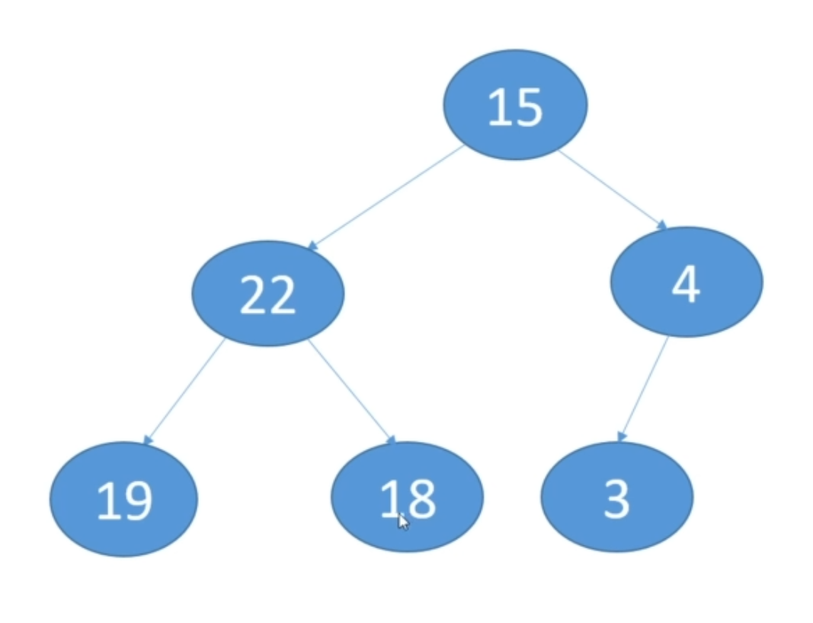
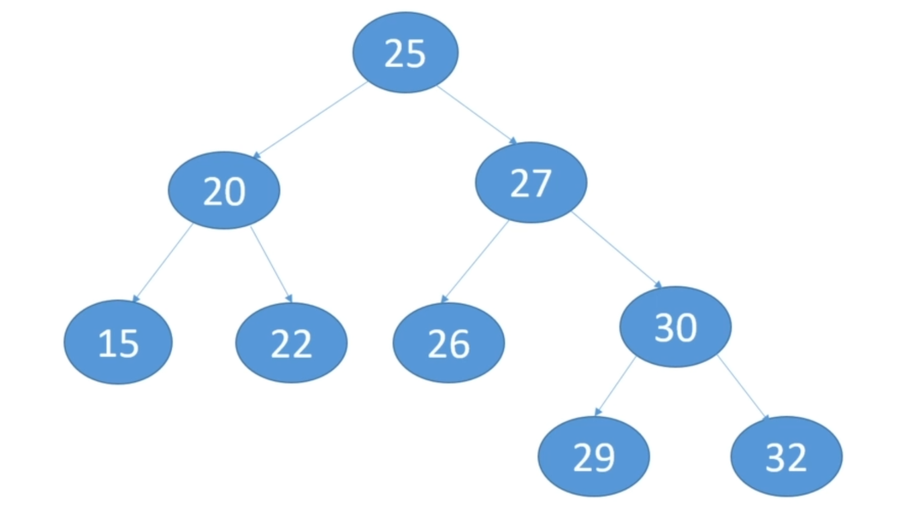

## Trees

[:arrow_backward:](../algorithms_index)

- Every item in the tree is a node
- Root - node at the top of the tree
- Every non-root node has one and only one parent
- A leaf node has no children
- A singleton tree has only one node - the root
- height - longest path from the node to a leaf
- depth - path start from the node to the root

 Implementation in Java can be found [here](https://github.com/SashkoMolodec/algorithms_java/blob/master/src/trees/Tree.java).

### Binary Tree

- Every node has 0, 1 or 2 children

- Can perform insertions, deletions, and retrievals in O($\log n$) time

- Children are referred to as left and right child

- The left child always has a smaller value than its parent and the right child always has a larger value that its parent

- Tree is complete if every level, except the one before leafs, has 2 childrens and leafs are on the left side; below is an example:

  

##### Traversal

- Level - visit nodes on each level
- Pre-order - visit the root of every subtree first
- Post-order - visit the root of every subtree last
- In-order - visit left child, then root, then right child

Level order: 25, 20, 27, 15, 22, 26, 30, 29, 32
Pre-order: 25, 20, 15, 22, 27, 26, 30, 29, 32
Post-order: 15, 22, 20, 26, 29, 32, 30, 27, 25 
In-order: 15, 20, 22, 25, 26, 27, 29, 30, 32\

##### Delete node with two children

- Need to figure out what the replacement node will be
- Want minimal disruption to the existing tree structure
- Can take the replacement node from the delete node's left subtree or right subtree
- If taking it from the left subtree, we have to take the largest value in the left subtree
- If taking it from the right subtree, we hate to take the smallest value in the right subtree
- Choose one and stick to it

##### Example:

<video controls src="../../../../src/video/trees_delete_example.mp4"></video>