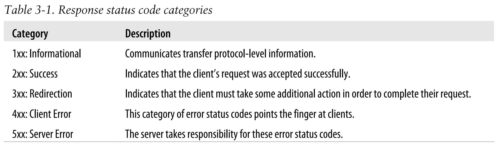

## API Design Rules

[:arrow_backward:](backend_index)

Parts from book [REST API Design Rulebook.pdf - Google Диск](https://drive.google.com/file/d/1ZuzCl9V1_H5kBVefKFLB8XoZcL4jmHG3/view)

[toc]

### URIs

- Forward slash separator (/) must be used to indicate a hierarchical relationship

- A trailing forward slash (/) should not be included in URIs (at the end of URI)

> It adds no semantic meaning and browser can treat with/without slash (/) request equally.

- Use hyphens (-) to improve readability of URIs, underscores should not be used in URIs (_)

> Depending on the application’s font, the underscore (_) character can either get partially obscured or completely hidden by this underlining.

- Lowercase letters should be preferred in URI paths

>  http://api.example.restapi.org/My-Folder/my-doc and http://api.example.restapi.org/my-folder/my-doc are not the same URIs

- File extensions should not be included in URIs

> A REST API should not include artificial file extensions in URIs to indicate the format of a message’s entity body. Instead, they should rely on the media type, as communicated through the **Content-Type** header, to determine how to process the body’s content.

- A plural noun should be used for collection and store names, singular for document names, a verb or verb phrase should be used for controller names

- CRUD function names should not be used in URIs

- The query component of a URI may be used to filter collections or stores

  > GET /users?role=admin

- The query component of a URI should be used to paginate collection or store results

  > GET /users?pageSize=25&pageStartIndex=50

  When the complexity of a client’s pagination (or filtering) requirements exceeds the simple formatting capabilities of the query part, consider designing a special controller resource that partners with a collection or store: POST /users/search + request body

  

### Resource archetypes

#### Document

A document resource is a singular concept that is akin to an object instance or database record.

#### Collection

A collection resource is a server-managed directory of resources. Clients may propose new resources to be added to a collection. However, it is up to the collection to choose to create a new resource, or not.

#### Store

A store is a client-managed resource repository. A store resource lets an API client put resources in, get them back out, and decide when to delete them. On their own, stores do not create new resources; therefore a store never generates new URIs. Instead, each stored resource has a URI that was chosen by a client when it was initially put into the store. 

> The example interaction below shows a user (with ID 1234) of a client program using a fictional Soccer REST API to insert a document resource named alonso in his or her store of favorites: **PUT /users/1234/favorites/alonso**
>
> Ми запихаємо щось існуюче в store (favorites) й можемо звідтам його забрати чи дістати.

#### Controller

A controller resource models a procedural concept (some action). Controller resources are like executable functions, with parameters and return values; inputs and outputs. Controller names **typically appear as the last segment in a URI path**, with no child resources to follow them in the hierarchy. 

> POST /alerts/245743/resend

### Request methods

- **HEAD** should be used to retrieve response headers

  > Clients use HEAD to retrieve the headers without a body. In other words, HEAD returns the same response as  GET, except that the API returns an empty body. Clients can use this method to check whether a resource exists or to read its metadata.

- **PUT** must be used to both insert and update a stored resource

  > The body of the request may or may not be exactly the same as a client would receive from a subsequent GET request, **when doing an update**

- **PUT** must be used to update mutable resources

- **POST** must be used to execute controllers

- **DELETE** must be used to remove a resource from its parent

- **OPTIONS** should be used to retrieve metadata that describes a resource’s available interactions

### Response Status codes

- Rule: 202 (“Accepted”) must be used to indicate successful start of an asynchronous action

- Rule: 204 (“No Content”) should be used when the response body is intentionally empty

  > The 204 status code is usually sent out in response to a PUT, POST, or DELETE request

- Rule: 301 (“Moved Permanently”) should be used to relocate resources

  > The 301 status code indicates that the REST API’s resource model has been significantly redesigned and a new permanent URI has been assigned to the client’s requested resource. The REST API should specify the new URI in the response’s Location header.

- 302 (“Found”) should not be used, but 303 (“See Other”) and 307 (“Temporary Redirect”)

- Rule: 303 (“See Other”) should be used to refer the client to a different URI

  > A 303 response indicates that a controller resource has finished its work, but instead of sending a potentially unwanted response body, it sends the client the URI of a response resource. This can be the URI of a temporary status message, or the URI to some already existing, more permanent, resource.

- Rule: 304 (“Not Modified”) should be used to preserve bandwidth

- Rule: 307 (“Temporary Redirect”) should be used to tell clients to resubmit the request to another URI

  > A 307 response indicates that the REST API is not going to process the client’s request. Instead, the client should resubmit the request to the URI specified by the response message’s Location header. 
  > A REST API can use this status code to assign a temporary URI to the client’s requested resource. For example, a 307 response can be used to shift a client request over to another host.

- Rule: 403 (“Forbidden”) should be used to forbid access regardless of authorization state.  A 403 response is not a case of insufficient client credentials; that would be 401 (“Unauthorized”).

  > REST APIs use 403 to enforce application-level permissions. For example, a client may be authorized to interact with some, but not all of a REST API’s resources.

- Rule: 406 (“Not Acceptable”) must be used when the requested media type cannot be served

- Rule: 415 (“Unsupported Media Type”) must be used when the media type of a request’s payload cannot be processed

  

### HTTP Headers

- The Content-Type header names the type of data found within a request or response message’s body.

- The Content-Length header gives the size of the entity-body in bytes. In responses, this header is important for two reasons. First, a client can know whether it has read the correct number of bytes from the connection. Second, a client can make a HEAD request to find out how large the entity-body is, without downloading it.

- The Last-Modified header applies to response messages only. The value of this response header is a timestamp that indicates the last time that something happened to alter the representational state of the resource.

  > This header should always be supplied in response to GET requests.

- The value of ETag is an opaque string that identifies a specific “version” of the representational state contained in the response’s entity. 

  > Clients may choose to save an ETag header’s value for use in future GET requests, as the value of the conditional If-None-Match request header. If the REST API concludes that the entity tag hasn’t changed, then it can save time and bandwidth by not sending the representation again.

- Stores must support conditional PUT requests

  > A store resource uses the PUT method for both insert and update, which means it is difficult for a REST API to know the true intent of a client’s PUT request. Through headers, HTTP provides the necessary support to help an API resolve any potential ambiguity. A REST API must rely on the client to include the **If-Unmodified-Since** and/ or **If-Match** request headers to express their intent.

- Location must be used to specify the URI of a newly created resource

- Cache-Control, Expires, and Date response headers should be used to encourage caching

### Media Types

The type value may be one of: application, audio, image, message, model, multipart, text, or video. A typical REST API will most often work with media types that fall under the application type.

### Security

- OAuth (Open Authorization) is an open standard that provides secure authorization using a consistent approach for all clients.

- An API reverse proxy is a relatively new type of network-based intermediary that may be used to secure a REST API’s resources.

### Idempotency

Property of a request that can be repeated mutliple times without changing the behaviour in server (and mostly we will get the same response multiple times). 

`GET`, `PUT` and `DELETE` are idempotent.

> Even if second DELETE request will give 404, the behaviour in server application is not changing, we won't break anything in our logic if call DELETE many times.

`POST` is not idempotent, as we will get the new object or other modified.

`PATCH` is not idempotent. It allows clients to update only specific parts of the resource. Because the effect of a PATCH request can depend on the current state of the resource, it is not considered to be idempotent by default.

> However, it is possible to implement PATCH requests in an idempotent way by ensuring that subsequent requests with the same payload have the same effect as the initial request. This can be achieved by using conditional requests, such as If-Match or If-Unmodified-Since headers, to ensure that the resource has not been modified since the previous request.