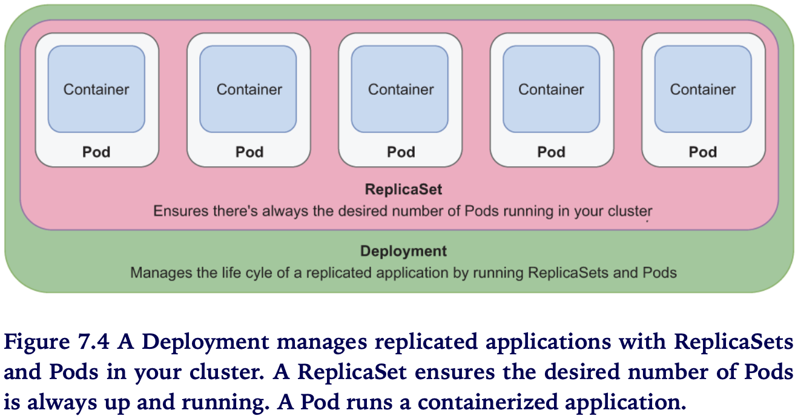
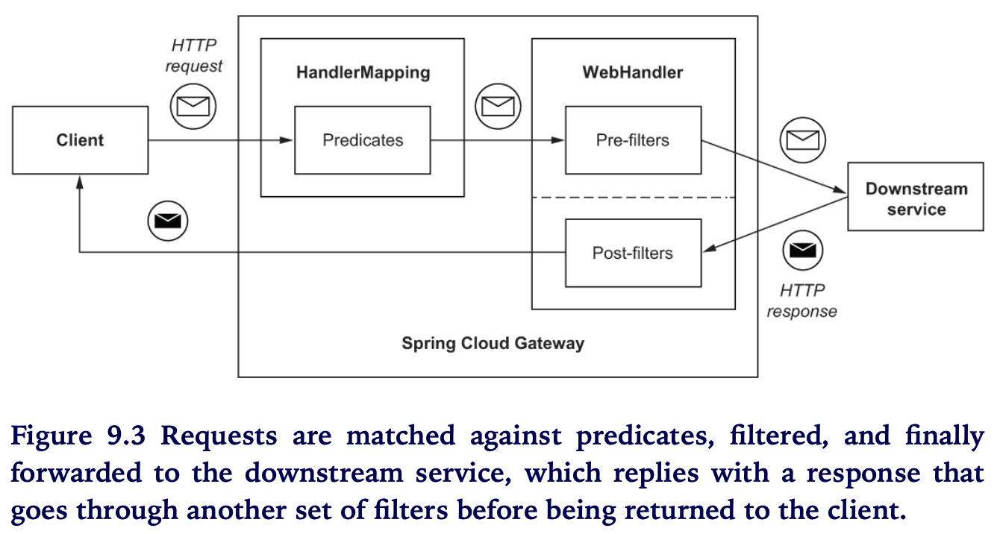
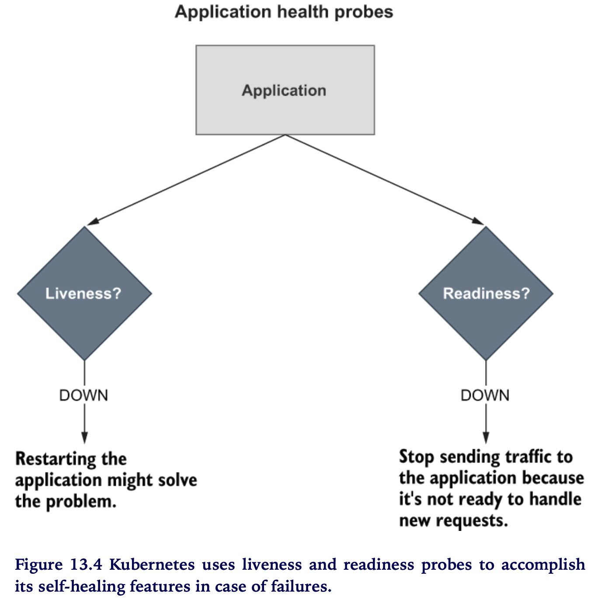
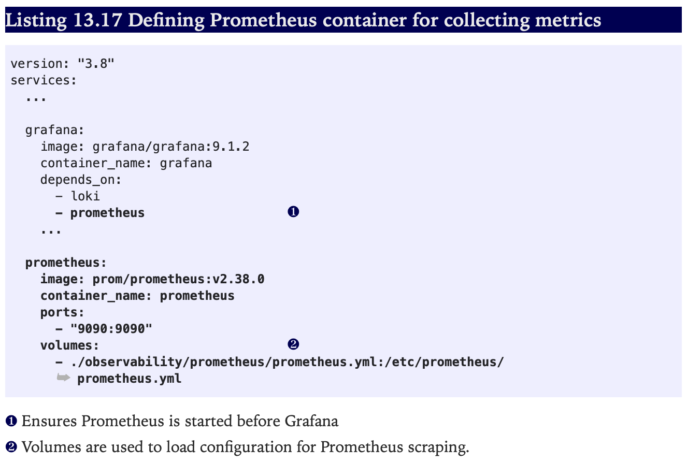
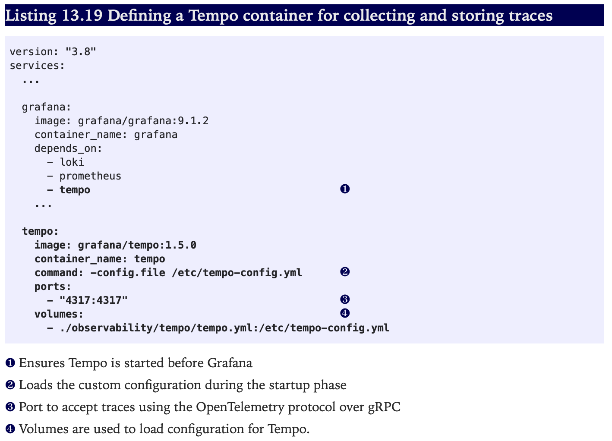

## Cloud Native in Action

[:arrow_backward:](backend_index)

[toc]

Cloud native application are highly distributive (розподілені) systems that are specifically designed for and live in the cloud.

The cloud is an IT infrastructure provided as a commodity (продукт) in terms of computing, storage, and networking resources.

The main properties of cloud native applications:

- *Scalability*
- *Loose coupling*
- *Resilience*
- *Observability* - inferring the internal state of an application from its external outputs
- *Manageability* - changing the internal state and outputs via external inputs. In this and previous case, the application artifact is never changes, it's immutable

Continuous delivery is a holistic engineers practice for delivering high quality software quickly, reliabliy, and safely.

Devops is a culture enabling collaboration among different roles to deliver business value together.

> Modern businesses go cloud native to produce software that can be delivered quickly, can be scaled dynamically depending on demand, and is always available and resilient to failures when optimizing costs.
> But it should consider the cost of migrating and its consequences. Migrating requires specific competencies that employees might not have yet.

Cloud native architectural elements:

 

Dedicated platforms (such as Kubernetes) offer services to manage containers without directly handling the underlying layers. They provide container orchestration, cluster management, network services, and scheduling.

---


### Cloud native patterns and technologies

#### 12 Factors and beyond

1. One codebase, one application
   - Shared code should be tracked in its own codebase as a library that can be included as dependency or backing service
   - No need to rebuild the codebase for different environments
2. API First
   - Design API and how it will distribute among teams
   - API implementation can be changed internally in a future without affecting other application depending on it
3. Dependency management
   - All application dependencies should be declared explicitly in a manifest and be available for the dependency management to download from a central repository
4. Design, build, release, run
   - A codebase goes through that stages and they should be separated
   - No code changes at runtime, the build and the release artifacts should be immutable
5. Configuration, credentials, and code
   - Configuration is everything likely to change between deployments
   - Only default configuration may stay with the application codebase
6. Logs
   - Should be log aggregators for tracing
7. Disposability (одноразовість)
   - Application are ephemeral - if application doens't respond we just terminate it and start a new instance
   - A *graceful shutdown* is when an application, on receivng a signal to terminate, stops accepting new requests, completes the ones already in progress, and finally exits
8. Backing services
   - Backing services can be defined as external resources that an application uses to deliver its functionality (databases, message brokers, caching systems, SMTP /FTP servers, RESTful web services)
   - You should not change code when changing resource (db for example). The attachement is done through resource binding
9. Environment parity
   - Keep all environments as similar as possible
   - Three gaps to solve:
     - time gap - period between a code change and its deployment can be quite large, so promote automation and continouos deployment to reduce this period
     - people gap - developer build applications, and operators manage their deployment in production; this gap can be resolved by embracing a DevOps culture, improving collaboration between devs and operators, "you build it, you run it"
     - tools gap - how backing services are handled, general the same type and version of them should be used in all environments
10. Administrative processes
    - Database migrations, batch jobs, maintance jobs should be treated as one-off processes; they should be tracked in revision control and it's a good idea to frame those tasks as small standalone services that run once (configured as functions)
11. Port binding
    - App is self-contained - it doesn't depend on an external server in the execution environment (for example Srping boot has embedded tomcat to run application, no separate tomcat server and artifact)
    - Export services via port binding, our app can become a backing service for another application
12. Stateless processes
    - To ensure scalability, we design applications as stateless processes and adopt a *share-nothing architecture*: no state should be shared among different application instances (handle states in data sources)
13. Concurrency
    - Allow concurrent processing to serve many users at the same time
    - Processes are first-class citizens, they should be horizontally scalable, distributing the workload across many process on different machines
    - For example web proceses that handle HTTP requests and worker processes that execute scheduled jobs in the background
14. Telemetry
    - Every system should provide the correct data to monitor the system's behavior remotely - logs, metrics, traces, health status, and events
15. Authentication and authorization

---


### Cloud native development

#### Working with embedded servers

*Servlet container* - a component, part of a web server, that provides an execution context for web applications using the Java Servlet API (like for Spring MVC apps). Tomcat (Catalina) is one example.

*Application server* - A server that provides a complete execution environment (like Jakarta EE) for differnt types of applications and supports several protocols, such as WildFly.

In web applications running in a Servlet container like Tomcat, requests are processed based on a model called *thread-per-request*. For each request, the application dedicates a thread exclusively to handling that specific request; the thread will not be used for anything else until a response is returned to the client. When the request-handling involves intensive operations like I/O, the thread will block until the operations are completed. For example, if a database read is required, the thread will wait until data is returned from the database. That’s why we say that this type of processing is synchronous and blocking.

The number of threads defines an upper limit to how many requests are supported concurrently. If the thread concurrency limit hits continiously, we can always tune the thread pool configuration to accept more workload (scale up or scale out).

##### Thread-per-request model


The `DispatcherServlet` component provides a central entry point for request processing. When a client sends a new HTTP request for a specific URL pattern, `DispatcherServlet` asks the `HandlerMapping` component for the controller responsible for that endpoint, and it finally delegates the actual processing of the request to the specified controller. The controller processes the request, possibly by calling some other services, and then returns a response to `DispatcherServlet`, which finally replies to the client with an HTTP response.

Spring MVC relies on the web server to accomplish its functionality. The same is true for any web server implementing the Servlet API, but since we have embedded Tomcat we may even configure it easily.

An example:


#### Testing


Following continous delivery practices, we should aim at achieving fully automated tests in three out of four quadrants.

When tests are focused only on a “slice” of the application and only need a part of the configuration, Spring Boot provides several annotations for more targeted integration tests. When you use those annotations, a Spring application context is initialized, but only the components and configuration parts used by the specific functionality slice are loaded.

#### Deployment pipeline: Build and test

Based on the concepts described by Jez Humble and Dave Farley in their Continuous Delivery book (Addison-Wesley Professional, 2010) and by Dave Farley in his Continuous Delivery Pipelines book (2021), we can identify a few key stages in a deployment pipeline:

- *Commit stage*—After a developer commits new code to the mainline, this stage goes through build, unit tests, integration tests, static code analysis, and packaging. At the end of this stage, an executable application artifact is published to an artifact repository. It is a release candidate. For example, it can be a JAR artifact published to a Maven repository or a container image published to a container registry. This stage supports the continuous integration practice. It’s supposed to be fast, possibly under five minutes, to provide developers with fast feedback about their changes and allow them to move on to the next task.

- *Acceptance stage*—The publication of a new release candidate to the artifact repository triggers this stage, which consists of deploying the application to production-like environments and running additional tests to increase the confidence about its releasability. The tests that run in the acceptance stage are usually slow, but we should strive to keep the whole deployment pipeline execution to under one hour. Examples of tests included in this stage are functional acceptance tests and non-functional acceptance tests, such as performance tests, security tests, and compliance tests. If necessary, this stage can also include manual tasks like exploratory and usability tests. At the end of this stage, the release candidate is ready to be deployed to production at any time. If we are still not confident about it, this stage is missing some tests.

- *Production stage*—After a release candidate has gone through the commit and acceptance stages, we are confident enough to deploy it to production. This stage is triggered manually or automatically, depending on whether the organization has decided to adopt a continuous deployment practice. The new release candidate is deployed to a production environment using the same deployment scripts employed (and tested) in the acceptance stage. Optionally, some final automated tests can be run to verify that the deployment was successful.

---


### External configuration

#### Profiles

Profiles are logical groups of beans registered only when a specific profile is active.

The @Profile annotation marks beans or configuration classes to be considered only when the specified profile is active.


Property files bundled with the application source code are useful for defining some sensible defaults.

Use profiles as feature flags when they're associated with groups of beans to be loaded conditionally. Consider what functionality a profile provides (`vinyl.testdata.enable=true`), and name it accordingly, rather than thinking about where it will be enabled.

Keep `application-dev`, `-stage`, this type props preferably in external configurations because it will remain scalable. As a project grows (other services), new environments might be created to try out new functionality and we can quickly end up with way too many configurations groups, implemented like Spring profiles and requiring new builds.

#### External stuff


---


### Data persistence with Spring Data


#### Spring Data JDBC or Spring Data JPA?

> Spring Data offers two main options for integrating applications with a relational database over the JDBC driver: Spring Data JDBC and Spring Data JPA. How to choose between the two? As always, the answer is that it depends on your requirements and specific context.
>
> Spring Data JPA (https://spring.io/projects/spring-data-jpa) is the most-used module in the Spring Data project. It’s based on the Java Persistence API (JPA), a standard specification included in Jakarta EE (previously known as Java EE). Hibernate is the most popular implementation. It’s a robust and battle-tested object-relational mapping (ORM) framework for managing data persistence in Java applications. Hibernate provides many useful features, but it’s also a complex framework. If you’re not aware of aspects like persistence context, lazy loading, dirty checking, or sessions, you might face issues that will be hard to debug without a sound familiarity with JPA and Hibernate. Once you know the framework better, you’ll appreciate how much Spring Data JPA simplifies things and boosts your productivity. 
>
> Spring Data JDBC (https://spring.io/projects/spring-data-jdbc) is a more recent addition to the Spring Data family. It integrates with relational databases following the domain-driven design (DDD) concepts like aggregates, aggregate roots, and repositories. It’s lightweight, simpler, and an excellent choice for microservices where domains are usually defined as bounded contexts (another DDD concept). It gives developers more control over SQL queries and allows the use of immutable entities. Being a simpler alternative to Spring Data JPA, it’s not a drop-in replacement for every scenario, since it doesn’t provide all the features offered by JPA. I recommend learning both, considering your requirements, and then deciding which module suits the specific scenario better.
>

---


### Containerizing Spring Boot

You can package Spring Boot applications as container images in different ways:

- Dockerfiles give you maximum flexibility but make it your responsibility to configure everything you need.
- Cloud Native Buildpacks (integrated with the Spring Boot Plugin) let you build OCI images directly from the source code, optimizing security, performance, and storage for you.

---


### Kubernetes fundamentals for Spring Boot


- Cluster—A set of nodes running containerized applications. It hosts the Control Plane and comprises one or more worker nodes.

- Control Plane—The cluster component exposing the API and interfaces to define, deploy, and manage the life cycle of Pods. It comprises all the essential elements that implement the typical features of an orchestrator, like cluster management, scheduling, and health monitoring.

- Worker nodes—Physical or virtual machines providing capacity such as CPU, memory, network, and storage so that containers can run and connect to a network.

- Pod—The smallest deployable unit wrapping an application container.

Start a new Kubernetes local cluster:

```shell
minikube start --cpus 2 --memory 4g --driver docker --profile polar
```

##### From containers to Pods

A *Pod* is the smallest Kubernetes object, and it “represents a set of running containers” in a cluster. It’s usually set up to run a single primary container (your application), but it can also run optional helper containers with additional features like logging, monitoring, or security (https://kubernetes.io/docs/reference/glossary).


##### Controlling Pods with Deployments

In Docker you manage your application instances directly be creating and removing containers, in Kubernetes you don't manage Pods - we let Deployment do this for us.

A *Deployment* is an object that manages the life cycle of a stateless, replicated application. Each replica is represented by a Pod. The replicas are distributed among the nodes of a cluster for better resilience (https://kubernetes.io/docs/reference/glossary).

Deployment also let manage replication with *ReplicaSet*, which ensures there's always the desired number of Pods up and running in cluster.



*Declarative configuration* - we declare what we want to achieve (the *desired state*), and we let Kubernetes make it happen (Ansible or Puppet are imperative tools). 

We describe object's desired state in a *manifest* file.

##### Kubernetes manifest


- *apiVersion* defines the versioned schema of the specific object representation. Core resources such as Pods or Services follow a versioned schema composed of only a version number (such as v1). Other resources like Deployments or ReplicaSet follow a versioned schema consisting of a group and a version number (for example, apps/v1). If in doubt about which version to use, you can refer to the Kubernetes documentation (https://kubernetes.io/docs) or use the kubectl explain <object_name> command to get more information about the object, including the API version to use.

- *kind* is the type of Kubernetes object you want to create, such as Pod, ReplicaSet, Deployment, or Service. You can use the kubectl api-resources command to list all the objects supported by the cluster.

- *metadata* provides details about the object you want to create, including the name and a set of labels (key/value pairs) used for categorization. For example, you can instruct Kubernetes to replicate all the objects with a specific label attached.

- *spec* is a section specific to each object type and is used to declare the desired configuration.

An example of manifest:


Create a deployment object from a manifest (from a service folder):

```shell
kubectl apply -f k8s/deployment.yml
```

Check which objects have been created:

```shell
kubectl get all -l app=catalog-service
```

Check logs:

```shell
kubectl logs deployment/catalog-service
```

Delete objects created for catalog-service:

```shell
kubectl delete -f k8s
```

Delete objects created from deployment repository:

```shell
kubectl delete -f services
```


##### Client-side service discovery and load balancing

Implementations: Srping Cloud Netflix Eureka, Spring Cloud Consul, Spring Cloud Zookeper Discovery.
Spring Cloud Load Balancer can be used for client-side load balancing.


Application itself defines a load-balancing strategy, and it can be a benefit because full control over this process. A drawback is that client service discovery assigns more responsibility to developers (if have different languages and frameworks we need to handle in different ways). Also, it results in one more service to deploy and maintain (the service registry).

##### Server-side service discovery and load balancing

Server-side service discovery solutions move a lot of responsiblity to the deployment platform, so that devs can focus on the business logic and rely on the platform.

Such solutions automatically register and deregister application instances and rely on a load-balancer component to route any incoming requests to one of the available instances according to a specific strategy. In this case, the application doesn’t need to interact with the service registry, which is updated and managed by the platform.


The Kubernetes implementation of this service discovery pattern is based on Service objects. A *Service* is “an abstract way to expose an application running on a set of Pods as a network service” (https://kubernetes.io/docs/reference/glossary).

A Service object is an abstraction targeting a set of Pods (typically using labels) and defining the access policy. When an application needs to contact a Pod exposed by a Service object, it can use the Service name instead of calling the Pod directly. The Service name is then resolved to the IP address of the Service itself by a local DNS server running in the Kubernetes Control Plane.

After resolving the Service name to its IP address, Kubernetes relies on a proxy (called *kube-proxy*), which intercepts the connection to the Service object and forwards the request to one of the Pods targeted by the Service. The proxy knows all the replicas available and adopts a load-balancing strategy depending on the type of Service and the proxy configuration. There is no DNS resolution involved in this step, solving the problems I mentioned earlier.


The solution is transparent to your Spring Boot applications and you get it out of the box in Kubernetes.

##### Exposing Sping Boot applications with Kubernetes Services

*ClusterIP* type of service exposes a set of Pods to the cluster.


Apply configured service (from the application folder):

```shell
kubectl apply -f k8s/service.yml
```

Now, the Service makes it possible for other Pods within the cluster to communicate with the Catalog Service application, either using IP (called cluster IP) or through its name.

Expose the application outside the cluster:

```shell
kubectl port-forward service/catalog-service 9001:80
```


##### Ensuring disposability: Graceful shutdown

Gracefully shutting down means the application stops accepting new requests, completes all those still in progress, and closes any open resources, like database connections.

By default, Spring Boot stops the server immediately after receiving a termination signal (`SIGTERM`). You can switch to a graceful mode by configuring the `server.shutdown` property. You can also configure the grace period, which is how long the application can spend processing all the pending requests. After the grace period expires, the application is terminated even if there are still pending requests. By default, the grace period is 30 seconds. You can change it through the `spring.lifecycle.timeout-per-shutdown-phase` property.

Need to enable also this in Deployment manifest. When Kubernetes sends a `SIGTERM` to Spring app it intercepts it and shutdowns gracefully instead. Kub waits for 30 seconds and then sends `SIGKILL`.

When it sends the `SIGTERM` signal to a Pod, Kubernetes will also inform its own components to stop forwarding requests to the terminating Pod. Since Kubernetes is a distributed system, and the two actions happen in parallel, there is a short time window when the terminating Pod might still receive requests, even if it has already started the graceful shutdown procedure. It will result in user errors. To prevent it we daly sending the `SIGTERM` signal to the Pod so that Kubernetes has enough time to spread the news across the cluster (implement with `preStop` hook).


##### Scaling Spring Boot applications

Replication is handled at the Pod level by a ReplicaSet object. Deployment objects are already configured to use ReplicaSets. Need to specify how many replicas want to be deployed in Deployment manifest.


The replication is controlled using labels (`app=catalog-service` in app deployment.yml).

##### Local Kubernetes development with Tilt

Tilt is a tool that automates your local development workflow with Kubernetes: you work on the application while Tilt takes care of building the image, deploying it to your local Kubernetes cluster, and keeping it up-to-date whenever you change something in the code.

##### Octant

The Octant dashboard lets you visualize your Kubernetes workloads.

Octant is a convenient tool that you can use not only for inspecting and troubleshooting a local Kubernetes cluster but also for a remote one.

---


### Reactive Spring: Resiliency and Scalability

As you saw in chapter 3, non-reactive applications allocate a thread per request. Until a response is returned, the thread will not be used for anything. That is the thread-per-request model. When the request handling involves intensive operations like I/O, the thread will block until those operations are completed. For example, if a database read is required, the thread will wait until data is returned from the database. During the waiting time, the resources allocated to the handling thread are not used efficiently. If you want to support more concurrent users, you’ll have to ensure you have enough threads and resources available. In the end, this paradigm sets constraints on the application’s scalability and doesn’t use computational resources in the most efficient way possible.

Reactive applications are more scalable and efficient by design. Handling requests in a reactive application doesn’t involve allocating a given thread exclusively—requests are fulfilled asynchronously based on events. For example, if a database read is required, the thread handling that part of the flow will not wait until data is returned from the database. Instead, a callback is registered, and whenever the information is ready, a notification is sent, and one of the available threads will execute the callback. During that time, the thread that requested the data can be used to process other requests rather than waiting idle.

This paradigm, called *event loop*, doesn’t set hard constraints on the application’s scalability. It actually makes it easier to scale, since an increase in the number of concurrent requests does not strictly depend on the number of threads. As a matter of fact, a default configuration for reactive applications in Spring is to use only one thread per CPU core. With the non-blocking I/O capability and a communication paradigm based on events, reactive applications allow for more efficient utilization of computational resources.


The reactive paradigm is a solution to the problem of blocking I/O operations that require more threads to handle high concurrency and which may lead to slow or entirely unresponsive applications. Sometimes the paradigm is mistaken as a way to increase the speed of an application. **Reactive is about improving scalability and resilience, not speed**.

##### Spring stack


Project Reactor and supports asynchronous and non-blocking operations.

##### Resilient applications with Reactive Spring

The critical point in achieving resilience (or fault-tolerance) is keeping the faulty component isolated until the fault is fixed. 

Use Reactive Spring to configure timeouts, retries and fallbacks.

> Placing the `retryWhen()` operator after `timeout()` means that the timeout is applied to each retry attempt.
>
>
> Placing the `retryWhen()` operator before `timeout()` means that the timeout is applied to the overall operation (that is, the whole sequence of the initial request and retries has to happen within the given time limit).

##### Testing

The Spring WebFlux slice can be tested through the @WebFluxTest annotation.

The persistence slice of a reactive application can be tested using the @DataR2dbcTest annotation and Testcontainers.

---


### API gateway and circuit breakers

An API gateway provides several benefits in a distributed architecture, including decoupling the internal services from the external API and offering a central, convenient place for handling cross-cutting concerns like security, monitoring, and resilience.

Routes are the core of Spring Cloud Gateway. They are identified by a unique ID, a collection of predicates determining whether to follow the route, a URI for forwarding the request if the predicates allow, and a collection of filters that are applied before or after forwarding the request downstream.



##### Request rate limiters

*Client-side rate limiters* is when constraining the number of requests sent to a downstream service in a given period. Useful when the downstream service is a thirdparty and we want to avoid incurring extra costs.

If the downstream service belongs to our system, we might use a *bulkhead* pattern (or *concurrent request limiter*) that sets constraints on how many concurrent requests are allowed and queuing up the blocked ones.

*Server-side limiters* are contraining the number of requets received by an upstream service in a given period. It's handy when implemented in an API gateway to protect the whole system from overloading or from DoS attacks.

> «Scaling your API with Rate Limiters” article about how they use it to implement rate limiters at Stripe (https://stripe.com/blog/rate-limiters)»
>

> What happens if Redis becomes unavailable? Spring Cloud Gateway has been built with resilience in mind, so it will keep its service level, but the rate limiters would be disabled until Redis is up and running again.
>

##### Handling sessions

Redis is a popular option for session management, and it’s supported by Spring Session Data Redis.

##### Ingress object

An *Ingress* is an object that “manages external access to the services in a cluster, typically HTTP. Ingress may provide load balancing, SSL termination and name-based virtual hosting” (https://kubernetes.io/docs). An Ingress object acts as an entry point into a Kubernetes cluster and is capable of routing traffic from a single external IP address to multiple services running inside the cluster.


Ingress objects don’t accomplish anything by themselves. We use an Ingress object to declare the desired state in terms of routing and TLS termination. The actual component that enforces those rules and routes traffic from outside the cluster to the applications inside is the ingress controller.

Edge Service takes care of application routing, but it should not be concerned with the underlying infrastructure and network configuration. Using an Ingress resource, we can decouple the two responsibilities. Developers would maintain Edge Service, while the platform team would manage the ingress controller and the network configuration (perhaps relying on a service mesh like Linkerd or Istio).

---


### Event-driven applications and functions

> «Even if the reactive programming paradigm lets you subscribe to producers and process the incoming data asynchronously, the interaction between the two applications is synchronous. The first application (the client) sends a request to the second one (the server) and expects a response to arrive in a short time.»

Event-driven architectures are distributed systems that interact with each other by producing and consuming events.

> Articles by Martin Fowler: “Focusing on Events” (https://martinfowler.com/eaaDev/EventNarrative.xhtml); “Domain Event” (https://martinfowler.com/eaaDev/DomainEvent.xhtml); and “What do you mean by ‘Event-Driven’?” (https://martinfowler.com/articles/ 201701-event-driven.xhtml), all on his MartinFowler.com blog.
>

In an event-driven architecture, we identify *event producers* and *event consumers*. A producer is a component that detects the event and sends a notification. A consumer is a component that is notified when a specific event occurs. Producers and consumers don’t know each other and work independently. A producer sends an event notification by publishing a message to a channel operated by an event broker that’s responsible for collecting and routing messages to consumers. A consumer is notified by the broker when an event occurs and can act upon it.

There are 2 event-driven models:

- *Publisher/subscriber* - based on subscriptions; producers publish events that are sent to all subscribers, events cannot be replayed after being received, so consumers not able to get the past events (RabbitMQ)
- *Event streaming* - events are written to a log; producers publish events as they occur, consumers don't subscribe to them but can read from any part of the event stream, so events can be replayed (Apache Kafka)


A messaging system requires a protocol (AMQP) and message broker (RabbitMQ). On the application side we use Spring Cloud Stream.
In the AMQP protocol, producers send messages to an exchange in a broker that forwards them to queues according to specific routing algorithms. Consumers then receive messages from the queues in the broker.


##### Functions with Spring Cloud Function

Implement business logic via functions based on the standard Java 8 interfaces:

- *Supplier*—A supplier is a function with only output, no input. It’s also known as a producer, publisher, or source.
- *Function*—A function has both input and output. It’s also known as a processor.
- *Consumer*—A consumer is a function with input but no output. It’s also known as a subscriber or sink.

Functions can be exposed as REST endpoints, packaged, and deployed in a FaaS platform as serverless applications (Knative, AWS Lambda, Azure Function, Google Cloud Functions), or they can be bound to message channels.

- Functions and consumers are activated automatically when new messages arrive.

- Suppliers need to be explicitly activated, such as by explicitly sending a message to a destination binding.

##### Processing messages with Spring Cloud Stream

Spring Cloud Stream is a framework for building scalable, event-driven, and streaming applications. It’s built on top of Spring Integration, which offers the communication layer with message brokers; Spring Boot, which provides auto-configuration for the middleware integration; and Spring Cloud Function, which produces, processes, and consumes events.

Spring Cloud Stream is based on a few essential concepts:

- *Destination binder* — The component providing the integration with external messaging systems, like RabbitMQ or Kafka

- *Destination binding* — The bridge between the external messaging system entities, like queues and topics, and the application-provided producers and consumers

- *Message* — The data structure used by the application producers and consumers to communicate with the destination binders, and therefore with the external messaging systems

They are all handled by the framework itself, the app and business logic is not aware of the external messaging system.


A *destination binding* can be either an input channel or an output channel. Names:

- Input binding: `<functionName> + -in- + <index>`
- Output binding: `<functionName> + -out- + <index>`


##### Making messaging resilient to failures

Event-driven architectures solve some syncronous request/response interactions. We removed temporal coupling between applications, so no need to adopt patterns like circuit breakers. If the consumer is momentarily unavailable while the producer sends a message it doesn't matter. The consumer will receive the message once its up and running again.
But the overall drawback is that we are introducing a new component that needs to be deployed amd maintained: the message broker.

We can make communication between the app and broker more resilient with retries and timeouts. Spring Cloud Stream has such capabilities as error channels and graceful shutdown. We may configure dead-letter queues, acknolwledgment flows, republishing messages on error.

> RabbitMQ guarantees that each message is delivered at least once (consumer might receive the same message twice).

##### Implementing event producers

Unlike functions and consumers, suppliers need to be activated. They act only upon invocation.

> We can bridge the REST layer with the stream part of the application using a `StreamBridge`.

##### Book example illustration


---


### Security: Authentication

Access control systems require identification (who are you?), authentication (can you prove it’s really you?), and authorization (what are you allowed to do?).

Using a dedicated service to authenticate users leads to two aspects:

1. Need to establish a protocol for Edge Service to delegeate user auth to the indentity provider, and the latter provide result. Here we use **OpenID Connect**.
2. Define a data format that the identity provider can use to securely inform Edge Service about the identity of users after they have been succesfully authenticated. Here we use **JSON Web Token**.

A common strategy for implementing authentication and authorization in cloud native applications is based on JWT as the data format, OAuth2 as the authorization framework, and OpenID Connect as the authentication protocol.

When using OIDC authentication, a Client application initiates the flow and delegates an Authorization Server for the actual authentication. Then the Authorization Server issues an ID Token (JSON Web Token) to the Client.


> OAuth2 to OIDC terminology:
>
> OAuth2 Authorization Server - OIDC Provider
> OAuth2 Client - Relying Party (RP)
> OAuth2 User - End-User

The ID Token includes information about the user authentication.

Keycloak is an identity and access management solution that supports OAuth2 and OpenID Connect and can be used as an Authorization Server.

##### Spring support

The Spring Security itself provides its main functionality by relying on *filters* (`SecurityWebFilterChain`). 

Spring Security provides native support for OAuth2 and OpenID Connect, and you can use it to turn Spring Boot applications into OAuth2 Clients.


After user succesfully logs in, Keycloack sends the authorization code to backend. Then backend takes this authorization code + client ID + client secret, sends to Keycloak at receives an Access token and ID token (JWT).


In Spring Security, you can configure both authentication and authorization in a `SecurityWebFilterChain` bean. To enable the OIDC authentication flow, you can use the oauth2Login() DSL.

Independent of the authentication strategy adopted (whether username/password, OpenID Connect/OAuth2, or SAML2), Spring Security keeps the information about an authenticated user (also called the principal) in an `Authentication` object. In the case of OIDC, the principal object is of type `OidcUser`, and it’s where Spring Security stores the ID Token. In turn, `Authentication` is saved in a `SecurityContext` object.


##### User logout

By default, Spring Security exposes a /logout endpoint for logging a user out.

In an OIDC/OAuth2 context, we also need to propagate the logout request to the Authorization Server (such as Keycloak) to log the user out of there. We can do that via the RP-Initiated Logout flow supported by Spring Security via the `OidcClientInitiatedServerLogoutSuccessHandler` class.


##### The Client dillema in OAuth2

Clients can be *public* or *confidential*. We register an application as a public Client if it can’t keep a secret. For example, mobile applications would be registered as public Clients. On the other hand, confidential Clients are those that can keep a secret, and they are usually backend applications like Edge Service. The registration process is similar either way. The main difference is that confidential Clients are required to authenticate themselves with the Authorization Server, such as by relying on a shared secret. It’s an additional protection layer we can’t use for public Clients, since they have no way to store the shared secret securely.

From book:

> «Here is my rule of thumb. If the frontend is a mobile or desktop application like iOS or Android, that will be the OAuth2 Client, and it will be categorized as a public Client. You can use libraries like AppAuth (https://appauth.io) to add support for OIDC/ OAuth2 and store the tokens as securely as possible on the device. If the frontend is a web application (like in Polar Bookshop), then a backend service should be the Client. In this case, it would be categorized as a confidential Client.»
>
> «I recommend basing the interaction between browser and backend on a session cookie (like you’d do for monoliths) and have the backend application be responsible for controlling the authentication flow and using the tokens issued by the Authorization Server, even in the case of SPAs. That is the current best practice recommended by security experts.»
>

From a security perspective, it is virtually impossible to secure tokens in a frontend web application. 

##### Spring Testing

- When a secure Spring Boot application is the backend for an SPA, we need to configure CSRF protection through cookies and implement an authentication entry point that returns an HTTP 401 response when a request is not authenticated (as opposed to the default HTTP 302 response redirecting to the Authorization Server automatically).
- The Spring Security Test dependency supplies several convenient utilities for testing security.
- The WebTestClient bean can be enhanced by mutating its request context through a particular configuration for OIDC login and CSRF protection.

---


### Security: Authorization and auditing

OAuth2 is an authorization framework that enables an application (called a *Client*) to obtain limited access to a protected resource provided by another application (called a *Resource Server*) on behalf of a user. When a user authenticates with Edge Service and asks to access their book orders, OAuth2 provides a solution for Edge Service to retrieve orders from Order Service on behalf of that user. This solution relies on a trusted party (called an *Authorization Server*), which issues an *Access Token* to Edge Service and grants access to the user’s book orders from Order Service.


##### Token relay from Spring Cloud Gateway to other services

After a user successfully authenticates with Keycloak, Edge Service (the OAuth2 Client) receives an ID Token and an Access Token:

- *ID Token*—This represents a successful authentication event and includes information about the authenticated user.

- *Access Token*—This represents the authorization given to the OAuth2 Client to access protected data provided by an OAuth2 Resource Server on the user’s behalf.

In Edge Service, Spring Security uses the ID Token to extract information about the authenticated user, set up a context for the current user session, and make the data available through the `OidcUser` object. That’s what you saw in the previous chapter.

The Access Token grants Edge Service authorized access to Catalog Service and Order Service (the OAuth2 Resource Servers) on behalf of the user. After we secure both applications, Edge Service will have to include the Access Token in all requests routed to them as an Authorization HTTP header. Unlike ID Tokens, Edge Service doesn’t read the Access Token’s content because it’s not the intended audience. It stores the Access Token received from Keycloak and then includes it as-is in any request to a protected endpoint downstream.


For each incoming request containing an Access Token in the `Authorization` header, Spring Security will automatically validate the token's signature using the public keys provided by Keycloack (JWK, JSON Web Key) and decode its claims via a `JwtDecoder` object (auto-configured).

##### Implementation details


##### Scopes

Access to claims is controlled through *scopes*, a mechanism provided by OAuth2 to limit what data an OAuth2 Client can access. You can think of scopes as roles assigned to applications rather than to users. In the previous chapter, we used Spring Security to make Edge Service an OAuth2 Client and configured it with the `openid` scope. That scope grants Edge Service access to the authenticated user’s identity (provided in the sub claim).

---


### Monitoring application

We have logs:


Health information:




And metrics using Prometheus:


Spring Boot Actuator collects application metrics out of the box by leveraging the Micrometer library (https://micrometer.io). Micrometer contains instrumentation code for collecting valuable metrics from common components in a JVM-based application. May export them to Prometheus.

> Need to expose the **metrics** Actuator endpoint. Or if use Prometheus then **prometheus**.
>
> The default strategy used by Prometheus is pull-based, meaning that a Prometheus instance scrapes (pulls) metrics in regular time intervals from the application via a dedicated endpoint, which is /actuator/prometheus
>




For distributed tracking may use OpenTelemetry. We need instrumentation (have OpenTelemetry implementation) and as well need to collect and store traces - use Tempo for that. Tempo follows push-based model where the applicaiton pushed data to the distributed tracing backend.


