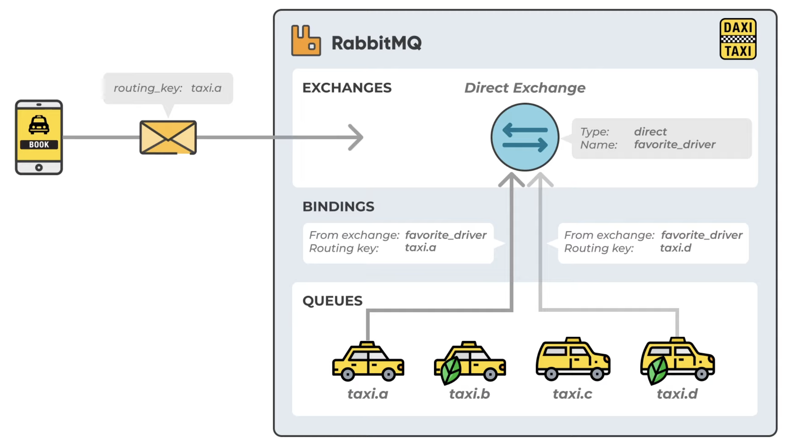
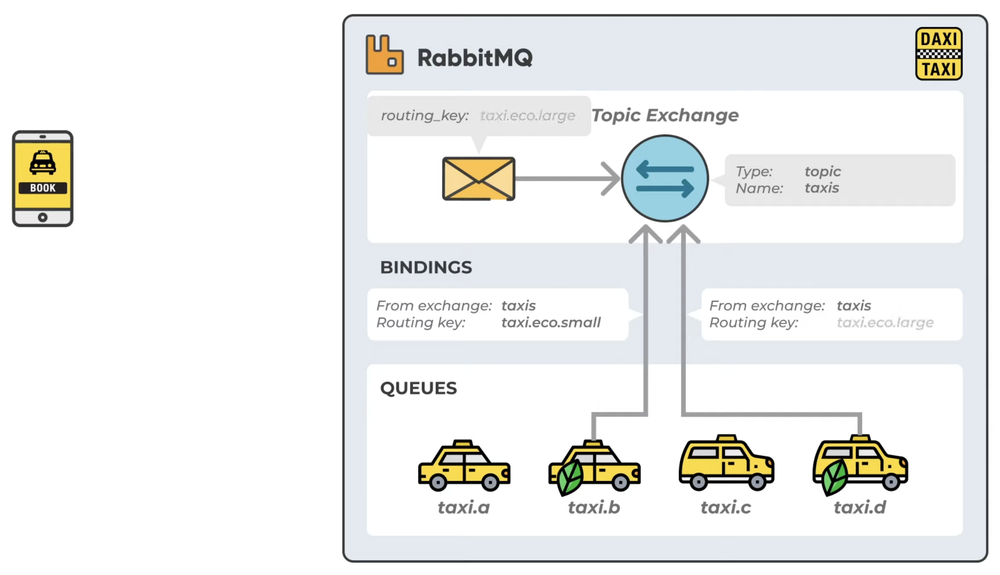
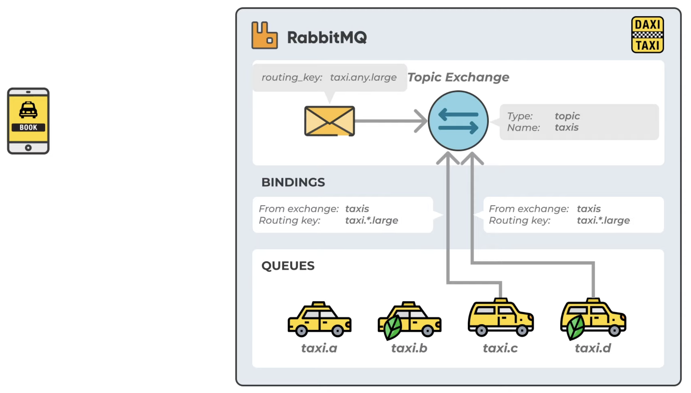
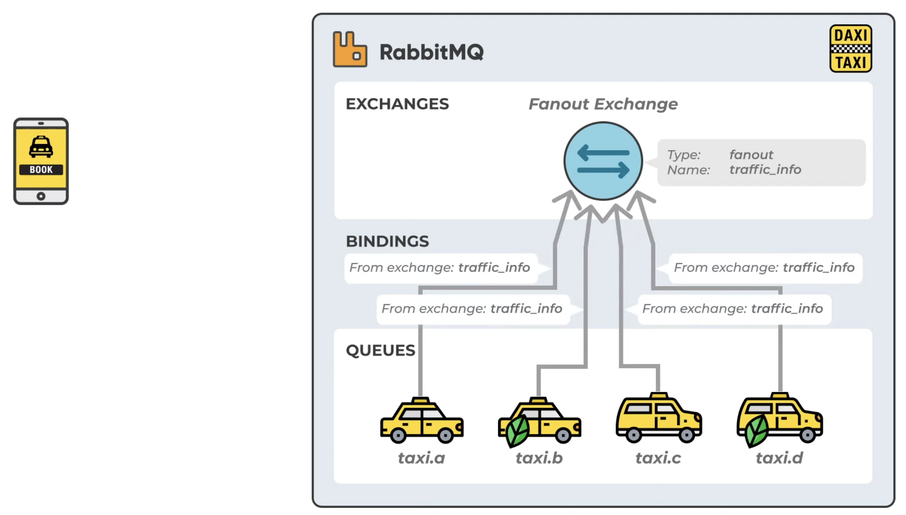
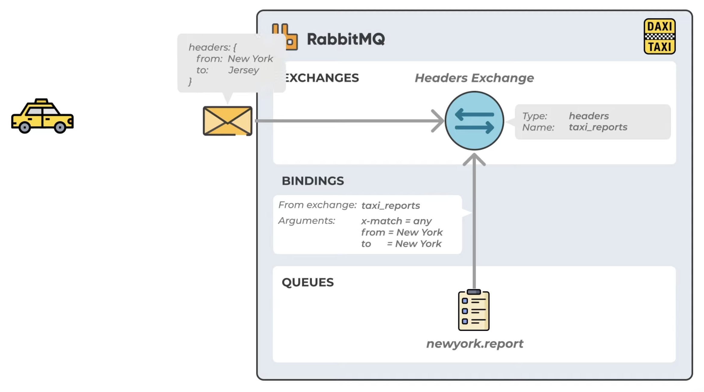
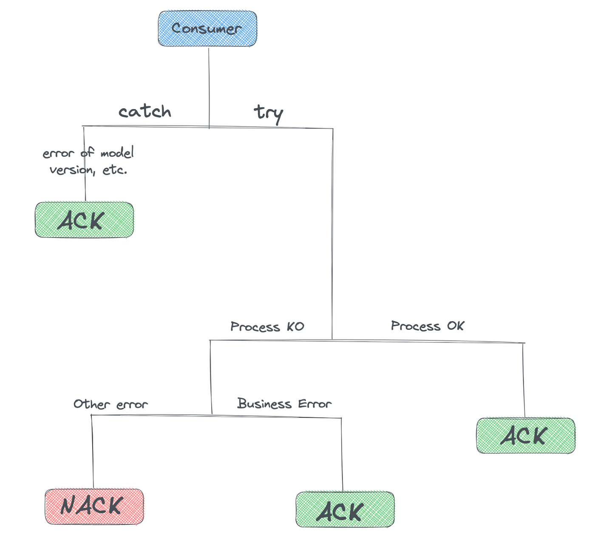

## RabbitMQ Notes

[:arrow_backward:](event_driven_index)

[toc]

#### Event notification architecture

It's advantages:

- May implement it on existing, legacy, services, without compromising existing responsibilities

- Clear definition of source of truth: unlike event sourcing, event notification is not a source of truth - dbs in services are

- High level of decoupling: source may not worry about the processing of its notification, nor to wait for a response from subcribers

- Parallelization of processes: a message can trigger a series of parallel operations on various services, that will be isolated and independent actions

- System resilience: when service goes down, broker still have our messages stored in queues, topics

- Pull instead of push

  > Services are now actors and not spectators: unlike a classic REST call, in which a service can be overwhelmed by a wave of HTTP calls (and potentially fall into overload), in a system distributed around events, this service is responsible for consuming the messages it is interested in. And above all for doing so **at its own pace**. This is a great benefit, especially when the number of workers available to consume messages is properly configured.

- Retry strategy: a maximum number of retries is configured, allowing a message to be replayed if not consumed. It may also go to a Dead Letter Queue for further manual inspection

Disadvantages:

- Observability: need to handle it carefully in a distrbuted system
- Async only: Event notification architecture is reserved for calls that would normally be processed in async
- Desynchronization of models: we may have different model representations (DTOs), message structures, on producer and consumer sides, that will cause some bad behaviour

#### Exchanges

4 types of exchanges: direct, fanout, topic, header.

##### Direct exchange

- We match routing key we send and compare it with the bindings routing key

##### Topic exchange

Route the message to one or many queues 

Using stars:

Here we route message to both taxi.c and taxi.d

##### Fanout exchange

Fanout exchanges copies and routes a message to all queues regardless of a routing key:

##### Header exchange

Very similar to topic exchange, but we route messages based on headers rather then routing keys. Not very common.

Our message will be routed to newyork.report as our `from` header argument matches one of the bindings `from` argument. `x-match` is set to any so we need to have at least one match.

#### Bindings

They are rules that exchanges use to route messages to queues. 

> From exchange E to queue K, K has to be bound to E.

#### Standards

##### Tasks and events

Tasks represent **actions**, for example sending an email async - it knows what action will be performed with the sent message.

Event represent **notifications**, like "Order was created!" - we notified someone with it, but we may not even know to whom.

##### Actions, objects, targets

Terms action, object, and target can be used to describe the interactions between producers, exchanges, queues, and consumers.

- Action: The action represents the operation being performed by the producer or consumer. Examples of actions include sending a message, consuming a message, or acknowledging a message.
  There are 4 actions:

  **→** *create*: action concerning a creation.
  → *change*: action about a state modification.
  → *remove*: action concerning a deletion.
  → *notify*: any other action not corresponding to any of the above cases.

- Object: The object represents the entity being acted upon. Examples of objects include an exchange, a queue, or a message.

- Target: The target represents the destination of the action. Examples of targets include a specific queue or exchange, or a routing key that determines which queue or exchange a message should be sent to.

For example, when a producer sends a message to an exchange, the producer is performing the action of sending a message, the object is the message being sent, and the target is the exchange that the message is being sent to.

#### common-model - Shared library of models

Create and manage this package with different models, that will be used in communications between services (DTOs that will be produced and consumed).

#### Ack & Nack

> The only reason to have a message in a DLQ is to have had a non-business error at consumption.

When to return ack and nack:

So if we throw business error it's still should be a valid ack. 
If some external service is not responding we don't send a message immideately to DLQ - we reque it back again on main queue for another try.