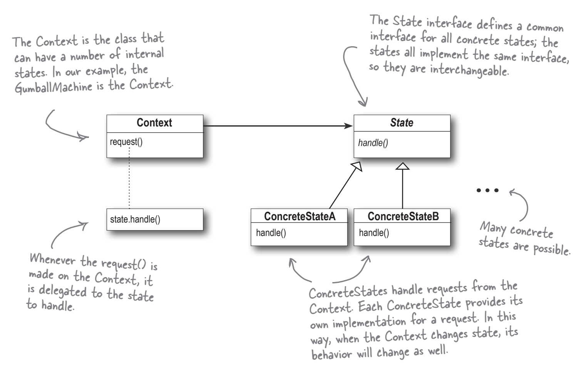
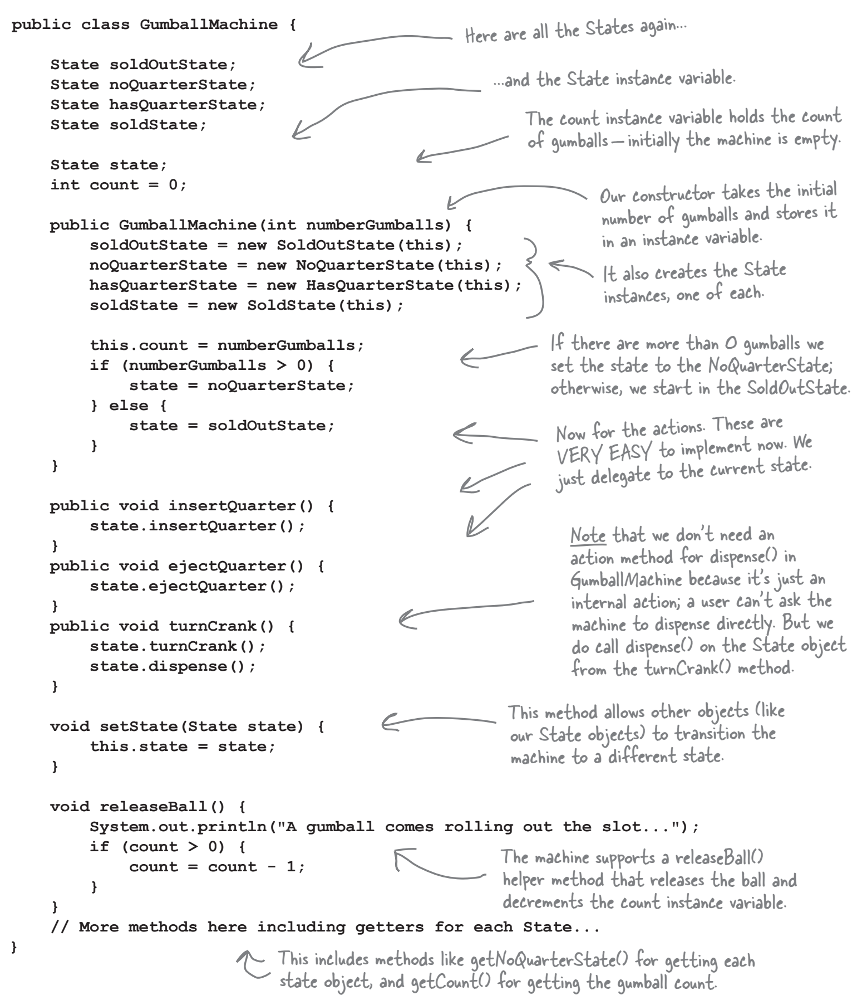
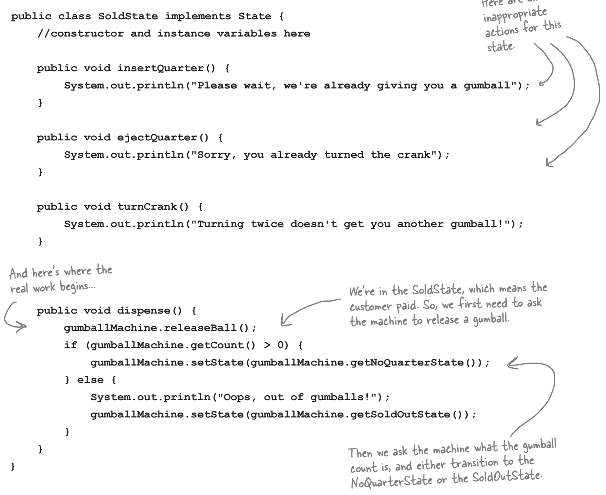
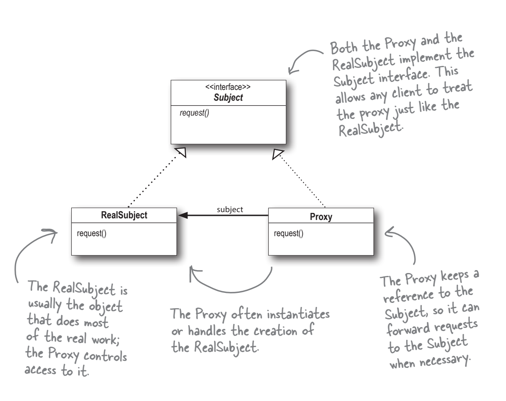
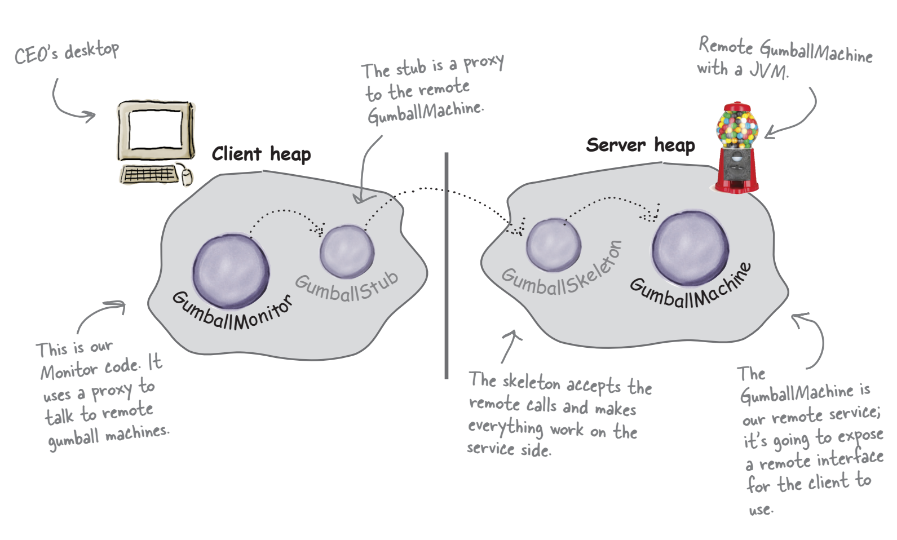
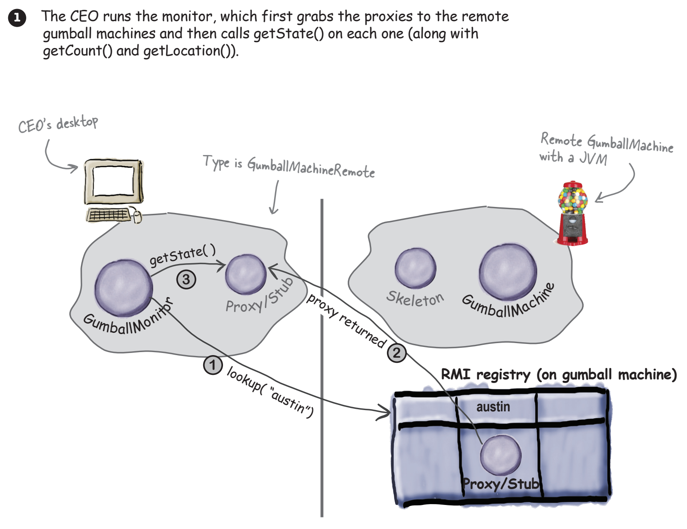
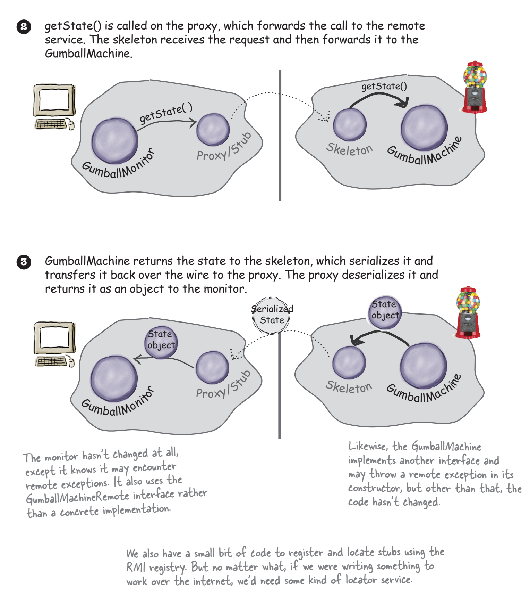
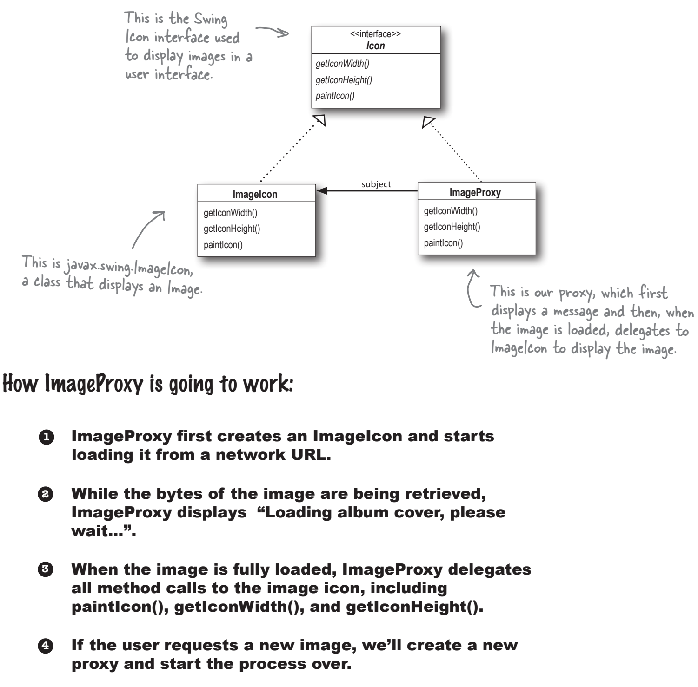
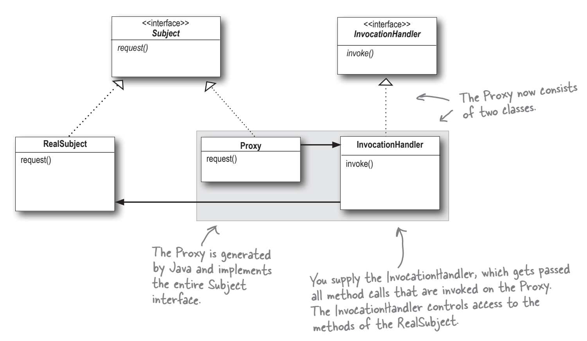
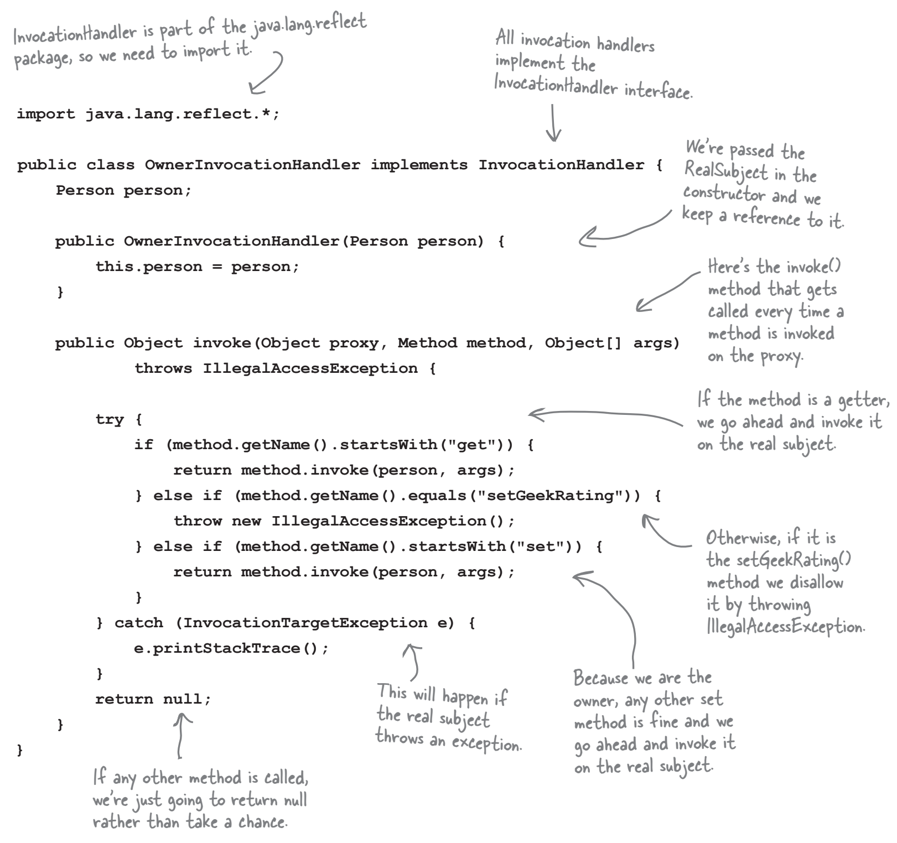

## :classical_building: Head First Design Patterns

[:arrow_backward:](backend_index)

[toc]

### Strategy pattern

**Strategy** - defines a family of algorithms, encapsulates each one, and makes them interchangeable. Strategy lets the algorithm vary independently from clients that use it.

>  NEW OO Principles:
>
> - Encapsulate what varies
> - Favor composition over inheritance
> - Program to interface, not implementations

### Observable pattern

**Observable** - defines a one-to-many dependency between objects so that when one objects changes state, all its dependencies are notified and updated automatically.

> New OO Principle:
>
> - Strive for loosely coupled designs between objects that interact

When two objects are *loosely coupled*, they can interact, but they typically have very little knowledge of each other. How it implements in Observable pattern:

- First, the only thing the **subject** knows about an **observer** is that it implements a certain interface
- We can add new observers at any time. Because the only thing the subject depends on is a list of objects that implement the Observer interface, we can add new observers whenever we want.
- We never need to modify the subject to add new types of observers.
- We can reuse subjects or observers independently of each other.
- Changes to either the subject or an observer will not affect the other.

### Decorator pattern

**Decorator** - Attach additional responsibilities to an object *dynamically*. Decorators provide a flexible alternative to subclassing for extending functionality. 

> NEW OO Principle:
>
> - Classes should be open for extension, but closed for modification

An abstract example:

Pitfalls:

- If you have **code that relies on the concrete component’s** type, decorators will break that code. As long as you only write code against the abstract component type, the use of decorators will remain transparent to your code. However, once you start writing code against concrete components, you’ll want to rethink your application design and your use of decorators.
- A lot of small classes, can be too much (like in java.io classes)
- The complexity creating needed component. Once you’ve got decorators, you’ve got to not only instantiate the component, but also wrap it with who knows how many decorators.

### Factory pattern

**The Factory Method Pattern** defines an interface for creating an object, but lets subclasses decide which class to instantiate. Factory Method lets a class defer instantiation to subclasses.

> New OO Principle:
>
> - **Dependency inversion principle**
>   Depend upon abstractions. Do not depend upon concrete classes. 
>   High-level components should not depend on our low-level components; rather, they should both depend on abstractions.
>   *Inversion* here works in the way that not only high-level component will depend from abstractions, but the low-level would also depend on abstractions.
>   
>
> To avoid OO designs that violate Dependency Inversion:
>
> - No variable should hold a reference to a concrete class (If you use new, you’ll be holding a reference to a concrete class. Use a factory to get around that!)
> - No class should derive from a concrete class (If you derive from a concrete class, you’re depending on a concrete class. Derive from an abstraction, like an interface or an abstract class)
> - No method should override an implemented method of any of its base classes (If you override an implemented method, then your base class wasn’t really an abstraction to start with. Those methods implemented in the base class are meant to be shared by all your subclasses)

An example:

**The Abstract Factory Pattern** provides an interface for creating families of related or dependent objects without specifying their concrete classes.

Abstract Factory vs Factory method vs Simple Factory:

- Simple Factory, while not a bona fide design pattern, is a simple way to decouple your clients from concrete classes.

- Factory Method relies on inheritance: object creation is delegated to subclasses, which implement the factory method to create objects.

  The intent of Factory Method is to allow a class to defer instantiation to its subclasses.

- Abstract Factory relies on object composition: object creation is implemented in methods exposed in the factory interface.

  The intent of Abstract Factory is to create families of related objects without having to depend on their concrete classes.

### Singleton Pattern

**The Singleton Pattern** ensures a class has only one instance, and provides a global point of access to it.

### Command Pattern

**The Command Pattern** encapsulates a request as an object, thereby letting you parametrize clients with different requests, queue or log requests, and support undoable operations.

- A Command object is at the center of this decoupling (receiver from invoker) and encapsulates a receiver with an action (or set of actions)
- An invoker makes a request of a Command object by calling its execute() method, which invokes those actions on the receiver
- Invokers can be parametrized with Commands, even dynamically at runtime
- In practice, it's not uncommon for "smart" Command objects to implement the request themselves rather than delegating to a receiver
- Commands may also be used to implement logging and transactional systems, threads

### The Adapter and Facade Patterns 

**The Adapter** pattern converts the interface of a class into another interface clients expect. Lets classes work together that couldn't otherwise because of incompatible interfaces.

- **Object adapter** that uses *composition*:

Real world Java API example:  

> Enumeration is used in legacy classes like Vector, Hashtable

- **Class adapter** that uses *multiple inheritance* :

  

> New OO Principle:
>
> **Principle of Lease Knowledge** : Talk only to your friends
> The principle guides us to reduce the interactions between objects to just a few close "friends". It prevents us from creating designs that have a large number of classes coupled together so that changes in one part of the system cascade to other parts. If there are a lot of dependencies between many classes, it would be a fragile system that is hard to maintain.
>
> Guidelines for this:
>
> Inside any method of some object, invoke only methods that belong to:
>
> - The object itself
> - Objects passes in as a parameter to the method
> - Any object the method creates or instantiates
> - Any components of the object
>
> And do not call methods on objects that were returned from calling other methods!!

**The Facade Pattern** provides a unified interface to a set of interfaces in a subsystem. Facade defines a higher-level interface that makes the subsystem easier to use.

### The Template Method Pattern

**The Template Method Pattern** defines the skeleton of an algorithm in a method, deferring some steps to subclasses. Template Method lets subclasses redefine certain steps of an algorithm without changing the algorithm's structure.

> New OO Principle:
>
> **The Hollywood Principle**: Don't call us, we'll call you.
>
> With the Hollywood Principle. we allow low-level components to hook themselves into the system, but the high-level components determine then they are needed, and how. High-level components give the low-level components the "don't call us, we'll call you" treatment. 
>
> 
>
> 

 

An abstract example:

Usage of hook:

Array sorting using the Template pattern with *composing* (in example Comparable) but not *inheritance*:

- We'll need to have our object to implement Comparable in order to complete the algorithm in mergeSort()
- It's a composition, because we are using the Arrays object to sort our array 
- That's similar to Strategy, but with the Strategy the class that we compose with, implements the entire algorithm. The algorithm that Arrays implements for sort() is incomplete: it needs a class to implement compareTo() method, so more like a Template

### The Iterator Pattern

**The Iterator Pattern** provides a way to access the elements of an aggregate object sequentially without exposing its underlying representation.

It also places the task of traversal on the iterator object, not on the aggregate (object that we traverse), which simplifies the aggregate interface and implementation, and places the responsibility where it should be.

> New OO Principle: 
>
> A class should have only one reason to change.
>
> - We say that a module or class has **high cohesion** when it is designed around a set of related functions, and we say it has **low cohesion** when it is designed around a set of unrelated functions. 
>
> - Cohesion is a more general concept that SRP (Single Responsibility), but are closely related. Classes that adhere to the principle tend to have high cohesion that take on multiple responsibilities and have low cohesion.
> - Every responsibility of a class is an area of potential change. More than one responsibility means more than one area of change. Need to keep each class to a single responsibility.

>  The **Iterable** interface provides a means of getting an iterator and enables Java enhanced for loop.
>
> 

### The Composite Pattern

**The Composite Pattern** allows you to compose objects into tree structures to represent part-whole hierarches. Composite lets clients treat individual objects and compositions of objects uniformly. 

Using a composite structure, we can apply the same operations over both composites and individual objects. In other words, in most cases we can <u>ignore</u> the differences between compositions of objects and individual objects. 

An implementation example. We want to print the whole menu, that consists of submenus (Pancake, Diner, Cafe) and subsub (Dessert):

> - MenuComponent abstract class throws UnsuportedOperationException in all methods. When implementing the class we override only methods we need.
> - When composite reaches leaf recursion ends.

We could say that we are violating the SRP because The Composite Pattern manages a hierarchy AND it performs operations related to Menus. We trade it for *transparency*. By allowing the Component interface to contain the child management operations *and* the leaf operations, a client can treat both composites and leaves uniformly. 

We still may loose a bit of *safety*, because of some unexpected method calls. Can resolve this by separating interfaces, so inappropriate method calls would be handled at compile time. But in that case we need to use instanceof's and conditionals, that breaks transparency. 

### The State Pattern

The State Pattern allows an object to alter its behavior when its internal state changes. The object will appear to change its class. 

> *Appear* to change its class because from the client perspective we can totally change the object behavior with other state, however we are only using composition (change current state reference) to delegate other behavior.

An implementation example below:

**Context class**

**State class:**

- The State pattern allows an object to have many different behaviors that are based on its internal state
- The Context gets its behavior by delegating to the current state objects it is composed with
- By encapsulating each state into a class, we localize any changes that will need to be made
- The State and Strategy Patterns have the same class diagram,  but they differ in intent:
  - The Strategy Pattern typically configures Context classes with a behavior or algorithm (and maybe not change it because some algorithm would be the most appropriate)
  - The State Pattern allows a Context to change its behavior as the state of the Context changes (it logically can dynamically change as the program goes)
  - State transitions can be controlled by the State classes or by the Context classes (`setState()`)
- State classes may be shared among Context instances (but need to be careful about internal contexts in state instances)

### The Proxy Pattern

**The Proxy Pattern** provides a surrogate or placeholder for another object to control access to it. Use this pattern to create a representative object that controls access to another object, which may be remote, expensive to create (virtual proxy), or in need of securing (protection proxy).

- A Remote Proxy manages interaction between a client and a remote object
- A Virtual Proxy controls access to the methods of an object based on the caller
- A Protection Proxy controls access to the methods of an object based on the caller
- There are other, such as caching proxies, synchronization proxies, firewall proxies, copy-on-write proxies and more

> Proxy is structurally similar to Decorator, but the two patterns differ in their purpose. The Decorator Pattern adds behavior to an object, while Proxy controls access.

Remote proxy example (Gumball monitor wants to get information from GumballMachine object that is remote):

Implementation using Java RMI:

Virtual proxy example (image loading):

Java's built-in support for Proxy can build a dynamic proxy class on demand and dispatch all calls on it to a handler of your choosing.

Protection proxy using Java API's Proxy:

Code example (create proxy so user can change his person fields but not geekScore & opposite proxy to that):

Instantiating the Proxy object:

### The Compound Pattern

**A Compound Pattern** combines two or more patterns into a solution that solves a recurring or general problem. 

The Model View Controller (MVC) is a compound pattern consisting of the Observer, Strategy, and Composite Patterns. MVC has been adapted to the web.

- The model makes use of the Observer Pattern so that it can keep observers updated yet stay decoupled from them
- The controller is the Strategy for the view. The view can use different implementations of the controller to get different behavior
- The view use the Composite Pattern to implement the user interface, which usually consists of nested components like panels, frames, and buttons.
- The Adapter Pattern can be used to adapt a new model to an existing view and controller

### Leftover Patterns

#### Bridge

Use the Bridge Pattern to vary not only your implementations, but also your abstractions.

#### Builder

Use the Builder Pattern to encapsulate the construction of a product and allow it to be constructed in steps.

#### Chain of Responsibility

Use the Chain of Responsibility when you want to give more than one object a change to handle a request.

#### Flyweight

Use the Flyweight Pattern when one instance of a class can be used to provide many virtual instances.

#### Interpreter

Use the Interpreter Pattern to build an interpreter for a language.

#### Mediator

Use the Mediator Pattern to centralize complex communications and control between related objects.

#### Memento

Use the Memento Pattern when you need to be able to return an object to one of its previous states; for instance, if your user requests an "undo".

#### Prototype

Use the Prototype Pattern when creating an instance of a given class is either expensive or complicated

#### Visitor

Use the Visitor Pattern when you want to add capabilities to a composite of objects and encapsulation is not important.
