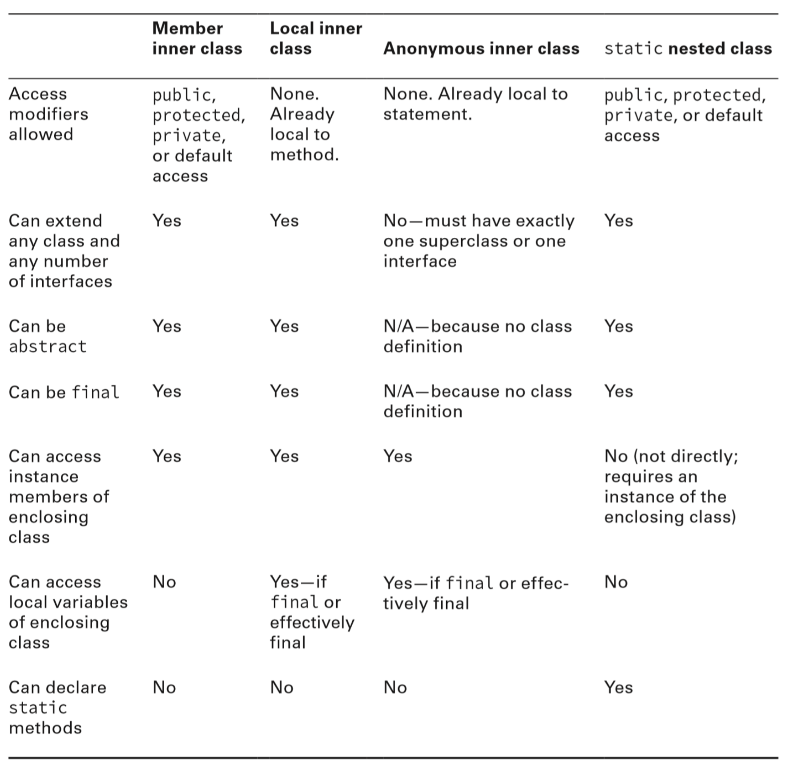

## 🆅  Java Class Design

[:arrow_backward:](../../backend_index)

[toc]

#### Access Modifiers

- private: Only accessible within the same class
- Default (package-private) access: private plus other classes in the same package
- protected: Default access plus child classes, BUT it only works if you use inheritance in child class. Creating parent instance in a child class and trying to access parent methods won't do the job 
- public: protected plus classes in the other packages


#### Order Of Initialization

**Class initalization**. The most important rule with class initialization is that it happens at most once for each class. Class may also never be loaded if it's not used in the program. 
**Initialize Class X:**

1. If there is a superclass Y of X, then initalize class Y first
2. Process all static variable declarations in the order they appear in the classs
3. Process all static initializers in the order they appear in the class

**Instance Initialization**. An instance is initialized anytime the `new` keyboard is used.
**Initialize Instance of X**:

1. If there is a superclass Y of X, then initialize the instance of Y first
2. Process all instance variable declarations in the order they appear in the class
3. Process all instance initalizers in the order they appear in the class
4. Initialize the constructor including any overloaded constructors referenced with this()

##### Simple example:

```java
1. public class ZooTickets {
2: private String name = "BestZoo";
3: { System.out.print(name+"-"); }
4: private static int COUNT = 0;
5: static { System.out.print(COUNT+"-"); }
6: static { COUNT += 10; System.out.print(COUNT+"-"); }
7:
8: public ZooTickets() {
9: System.out.print("z-");
10:}
11:
12: public static void main(String... patrons) {
13: new ZooTickets();
14: }
15: }
```

The output is: 

```
0-10-BestZoo-z-
```


#### Constructor Rules

1. The first statement of every constructor is a call to an overloaded constructor via this(), or a direct parent constructor via super().

2. If the first statement of a constructor is not a call to this() or super(), then the compiler will insert a no-argument super() as the first statement of the constructor.

3. Calling this() and super() after the first statement of a constructor results in a compiler error

4. If the parent class doesn't have a no-argument constructor, then every constructor in the child class must start with an explicit this() or super() constructor call.

5. If the parent class doesn't have a no-argument constructor and the child doesn't define any constructors, then the child class will not compile.

6. If a class only defines private constructors, then it cannot be extended by a top-level class.

   > A top level class is a class that is not a nested class.

7. All final instance variables must be assigned a value exactly once by the end of the constructor. If no then compiler error on the line the constructor is declared.


### Nested Classes



- The reason why inner classes cannot have static methods it's because static methods are usually instantiated when the program starts. However, an inner class depends on having an instance of its enclosing class in order to create it and then access it's members. So without creating an outer instance you wouldn't be able to access inner static method, which sounds reasonably to not just allow such.

- Local variable references are allowed if they are final or effectively final. 
  Explanation: the compiler is generating a .class file from local class and it has no way to refer to local variables. But if the local variable is final, Java can handle it by passing it to the constructor of the local class or by storing it in the .class file. If it weren't effectively final, these tricks wouldn't work because the value could change after the original copy was made.

  

### Interface

Till Java 7 your interfaces could contain only **public abstract** methods. From Java 8 you can also have **public static** and **public default** methods. Starting from Java 9 you will be able to add **private methods** and **private static** method in interfaces.

> One motivation for adding `default` methods to the Java language was for backward compatibility. A default method allows you to add a new method to an existing interface, without the need to modify older code that implements the interface. 
> Another motivation is just for convenience (the Comparator interface includes a default reversed() method; it could be written in every class implementing the interface but why you should?)

##### Difference between an abstract class and interface

- Only interfaces make use of implicit modifiers, consider an example:

  ```java
  abstract class Husky {
  	abstract void play();
  }
  interface Poodle {
  	void play();
  }
  ```

  Their access level is different. In the abstract class is considered default (package-private), whereas method in interface is public. 


#### Default method properties

- May be declared only within an interface

- Must include a method body

- Is assumed to be public

- Cannot be marked abstract, final or static 

  > Cannot be static because it ruins class inheritance when implementing an interface and ability to override, which breaks `default` purpose.

- May be overriden by a class that implements the interface

- If a class inherits two same signature default methods then the class must override the method

##### Calling a hidden default method

```java
public interface Walk {
	public default int getSpeed() { return 5; }
}
public interface Run {
	public default int getSpeed() { return 10; }
}

public class Cat implements Walk, Run { 
	public int getWalkSpeed() {
		return Walk.super.getSpeed();
	}
}
```


#### Static interface methods

```java
public interface Test1 {
    static int firstMethod() {
        return 1;
    }
}

public interface Test2 {
    static int secondMethod() {
        return 2;
    }
}

public class Initialization implements Test1, Test2{
    public static void main(String[] args) {
        Test1.firstMethod();
        Test2.secondMethod();
    }
}
```

Java "solved" the multiple inheritance problem of static interface methods by not allowing them to be inherited.


#### Interface private [static] methods

They main purpose is to reduce code duplication in default methods (interface private methods) and static methods (interface private static methods).
