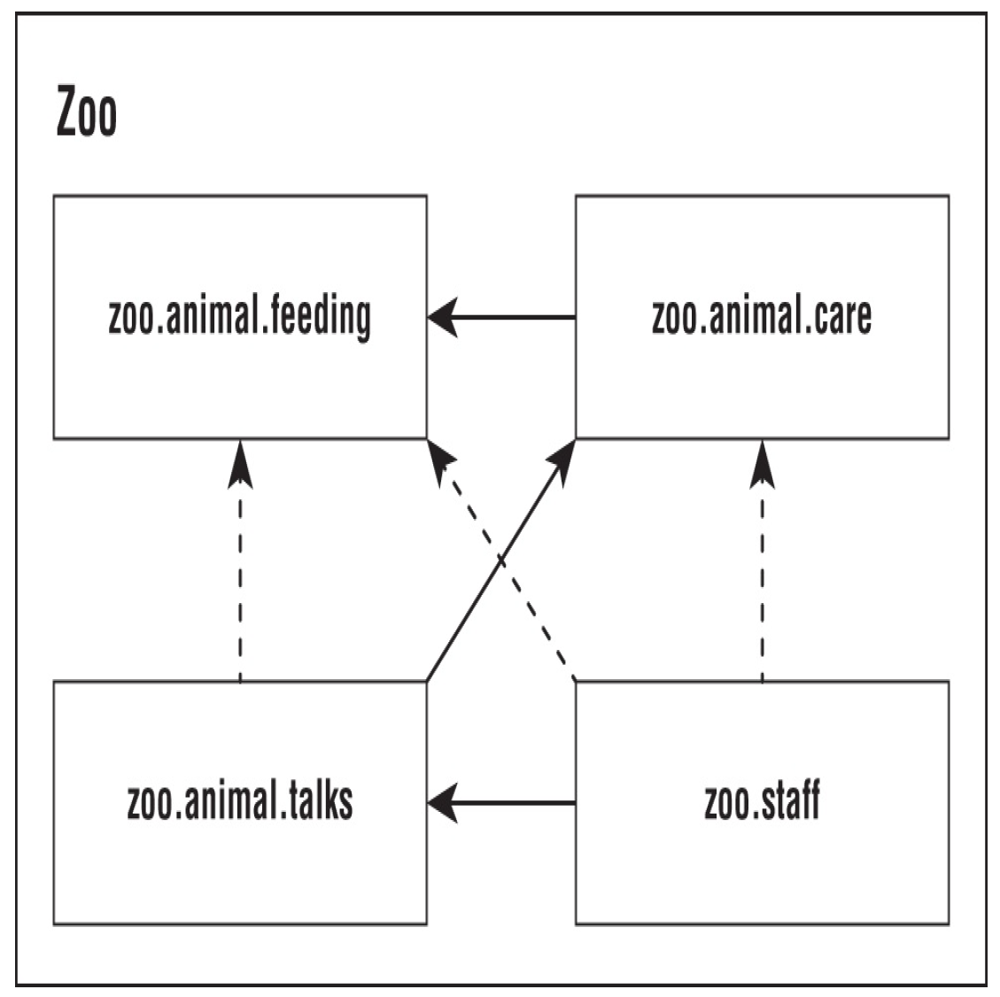

### 🆁:package: Java Modules

[:arrow_backward:](../../backend_index)

[toc]

Java Platform Module System (JPMS) was introduced in Java 9. The main purpose of a module is to provide groups of related packages to offer a particular set of functionality to developers. 
It includes the following:

- A format for module JAR files
- Partitioning of the JDK into modules
- Additional command-line options for Java tools

A *module* is a group of one or more packages plus a special file called `module-info.java`. 

#### Benefits of modules

##### Better Access Control

What if we wanted to restrict some comlex logic to just some packages? For example, we want `zoo.animal.talks` module be available to the packages in the `zoo.staff` module without making them available to any other code (not making it public). Access modifiers as usual cannot handle this scenario.

Modules solve this problem by acting as a fifth level of access control. They can expose packages within a modular JAR to specific other packages.

##### Clearer Dependency Management

In a fully modular environment, each of the open source projects would specify their dependenices in the `module-info.java` file.

##### Custom Java Builds

JPMS allows developers to specify what modules they actually need, because sometimes JDK could be too large for some systems. A tool called `jlink` is used to create this runtime image.

##### Improved Performance

Java knows which modules are required so it only needs to look for them at class loading time. This improves startup time for big programs and requires less memory to run.

##### Unique Package Enforcement

There are cases when the same package is in two JARs. Renaming JARs, for example, could cause it; or just using a package name that is already taken. 

JPMS prevents the scenario so package is only allowed to be supplied by one module. 


#### Module operations

The `exports` keyword is used to indicate that a module intends for some packages to be used outside the module. The `requires` statement specifies that a module is needed. An example of `module-info.java`:

```java
module zoo.animal.care {
	exports zoo.animal.care.medical;
    requires zoo.animal.feeding;
}
```

##### Exports

It's possible to export a package to a specific module, so no other modules would be allowed to access that package:

```java
module zoo.animal.talks {
	exports zoo.animal.talks.content to zoo.staff;
	requires zoo.animal.feeding;
}
```


##### Access control with modules

| Level     | Within module code                   | Outside module                                       |
| --------- | ------------------------------------ | ---------------------------------------------------- |
| private   | Only within class                    | No access                                            |
| default   | Only within package                  | No access                                            |
| protected | Only within package or to subclasses | Accessible to subclasses only if package is exported |
| public    | To all classes                       | Accessible only if package is exported               |


##### Requires Transitive

`requires` *moduleName* specifies that the **current** module depends on moduleName. There's also a `requires transitive` *moduleName*, which means that any module that requires **this** module will also depend on *moduleName*.

An example:



First module remains unchanged:

```java
module zoo.animal.feeding {
	exports zoo.animal.feeding;
}
```

Second `zoo.animal.care`:

```java
module zoo.animal.care {
	exports zoo.animal.care.medical;
	requires transitive zoo.animal.feeding;
}
```

Now, any module that will require `zoo.animal.care` will also require `zoo.animal.feeding`, but transitively (we won't require `feeding` module in others but only require `care` there).
Let's observe third `zoo.animal.talks` module:

```java
module zoo.animal.talks {
	exports zoo.animal.talks.content to zoo.staff;
	exports zoo.animal.talks.media;
	exports zoo.animal.talks.schedule;
	// no longer needed requires zoo.animal.feeding;
	// no longer needed requires zoo.animal.care;
	requires transitive zoo.animal.care;
}
```

Finally, the last one:

```java
module zoo.staff {
	// no longer needed requires zoo.animal.feeding;
	// no longer needed requires zoo.animal.care;
	requires zoo.animal.talks;
}
```


##### Provides

The `provides` keyword specifies that a class provides an implementation of a service:

```java
provides zoo.staff.ZooApi with zoo.staff.ZooImpl
```

##### Uses

The `uses` keyword specifies that a module is relying on a service:

```java
uses zoo.staff.ZooApi
```

##### Opens

Java allows callers to inspect and call code at runtime (that might not be available at compile time) with *reflection*. But it can be dangerous, so the module system requires developers to explicity allow reflection for calling modules:

```java
opens zoo.animal.talks.schedule;
opens zoo.animal.talks.media to zoo.staff;
```


#### Describing a Module

The `java` command can describe a module:

```java
java -p mods
-d zoo.animal.feeding
// or
java -p mods
--describe-module zoo.animal.feeding
```

it might print this:

```java
zoo.animal.feeding
file:///absolutePath/mods/zoo.animal.feeding.jar
exports zoo.animal.feeding
requires java.base mandated
```

##### Listing available modules

To check available modules:

```java
java -p mods --list-modules
```

It will print out built-in Java modules and our created.

##### Module resolution

For more ouput, more like debugging, use `--show-module-resolution`:

```java
java --show-module-resolution
-p feeding
-m zoo.animal.feeding/zoo.animal.feeding.Task
```

##### The JAR command

Like the `java` command, the `jar` command can describe a module.

##### The JDEPS command

Gives an information about dependencies within a module. Tells what dependencies are actually used rather than simpy declared:

```java
jdeps -s mods/zoo.animal.feeding.jar
// or
jdeps -summary mods/zoo.animal.feeding.jar
```

prints following:

```java
zoo.animal.feeding -> java.base
```

Without a `-s`, or `-summary` we'll get a longer output like this:

```
jdeps mods/zoo.animal.feeding.jar
[file:///absolutePath/mods/zoo.animal.feeding.jar]
	requires mandated java.base (@11.0.2)
zoo.animal.feeding -> java.base
	zoo.animal.feeding 	-> java.io
		java.base
	zoo.animal.feeding 	-> java.lang
		java.base
```

##### The JMOD command

JMOD files, not JAR, are recommended only when you have native libraries or something that can't go inside a JAR file. `jmod` commands:

| Operation | Description                                             |
| --------- | ------------------------------------------------------- |
| create    | Creates a JMOD file.                                    |
| extract   | Extracts all files from the JMOD. Works like unzipping. |
| describe  | Prints the module details such as requires.             |
| list      | Lists all files in the JMOD file.                       |
| hash      | Shows a long string that goes with the file.            |