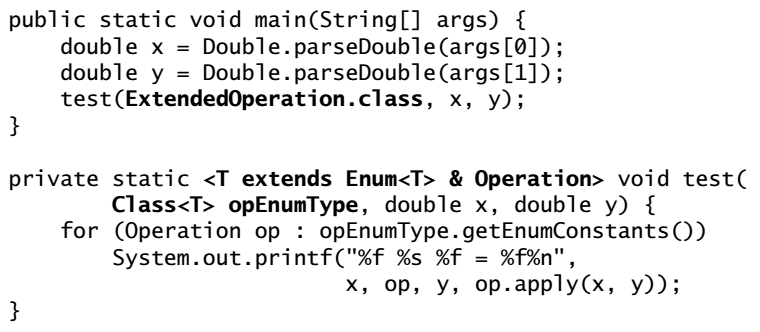

## Effective Java

:arrow_backward:

[toc]

### Creating and Destroying Objects

##### Item 1: Consider static factory methods instead of constructs

from, of, value of, instance or getInstance... (9 page).

Advantages:

- Unlike constructors, they have name (it will help when have mutliple constructors and ambiguity what they create)

- Not required to create new object each time it's invoked; it allows to use preconstructed instances, or to cache instances as they're constructed

  > The ability to return the same objects from repeated invocations allows classes to maintain strict control over existing instances - classes are *instance controlled*.

- Can return an object of any subtype of their return type; we may hide implementation classes and return interface in static factory method (this technique leades to *interface-based* frameworks)

- Depending on input parameters we may return different subclasses

- When we return the interface in the process of compilation we don't need actual class implementation - it will be loaded in the runtime using some proxies, reflection or looking up a service loader

  > *Service provider frameworks* works in such way: it consists of *service interface*, which represents an implementation; a *provider registration API*, which providers use to register implementations; and a *service access API*, which clients use to obtain instances of the service. Optional fourth component is *service provider interface* - descibes a factory object that produce instances of the service interface.
  > in the case of JDBC, `Connection` - service interface, `DriverManager.registerDriver` - provider registration API, `DriverManager.getConnection` - service access API, `Driver` - service provider interface.

Disadvantages:

- Classes without public or protected constructors cannot be subclassed (but in encourages developers to use composition instead)
- Hard for programmers to find

##### Item 2. Consider a builder when faced with many construcor parameters

The builder pattern is a good choise when designing classes whose constructors or static factoris would have more than a handful of parameters (4 or more).

Disadvantage is that we need to create a builder, before creating an object. It may create problem in performance-critical situations.

Better to start from Buiders (if it's suitable) when designing and not use constructor or static factory methods.

##### Item 3. Enfore the singleton property with a private constructor or an enum type

To maintain the singleton guarantee, declare all instance fields `transient` and provide a `readResolve` method. Otherwise, each time a serialized instance is desearilzed, a new instance will be created.

The easiest way is to use a **single-element enum type** to implement a singleton.

##### Item 4: Enfore noninstantiability with a private constructor

*Utility classes* are not designed to be instantiated (such as `util.Arrays`, `util.Collections`). They may be used to group static factory methods. 
We won't be able to enfore this non by makin a class abstract - can be subclassed and then created. But we may create a regular class with a private constructor - it will solve the issue.

##### Item 5: Prefer dependency injection to hardwiring resources

Do not use a singleton or static utility class to implement a class that depends on other resources whose behavior can affect.

- Pass the resource into the constructor when creating a new instance. This is one form of dependency injection.
- Pass a resource factory to the constructor

##### Item 6: Avoid creating unnecessary objects

An object can always be reused if it is immutable. Use static factory methods in preference to constructors in immutable classes. We may also use caching.

##### Item 7: Eliminate obsolete object references

An obsolete reference is simply a reference that will never be dereferenced. Nulling out object references should be an exception rather than the norm. 

You may expect memory leaks in places when class **manages its own memory**, for example working with arrays (*storage pool* that stores object references: some elements in the array may be in active portion (we have access to them) and other unimportant, with no access from our side, - garbage collector don't know we actually don't use those elements, they are totally valid).

Another common source of memory leaks is caches - we may forget about them. Use `WeakHashMap`.

Too many listeners and other callbacks that are accumulating. Store only weak references to them, as keys in a `WeakHashMap`.

Use a *heap profiler* to find memory leaks.

##### Item 8: Avoid finalizers and cleaners

##### Item 9: Prefer try-with-resources to try-finally

Use that approach when working with resources that must be closed. Implement `AutoClosable`. The resulting code is shorter and cleaner, and generated exceptions are more usefull:

> If exceptions are thrown by both the method call and `close` method, the latter exception is *supressed* in favor of the former.


### Method Common to All Objects

##### Item 10. Obey the general contract when overriding equals

Don't override the `equals` method unless you have to. `Object` implementation will be fine when, for example we are working with instance-controlled classes, singletons or enums. If we want to override `equals`, we need to compare all significant fields and preversve 5 positions of the `equals` contract:

- Reflexive - `x.equals(x)` returns true

- Symmetric - `x.equals(y)` and `y.equals(x)` returns true

  > For example `String` and our `CaseInsensitiveString` custom object. we may create good `equals` for our custom object but for the `String` it won't be the same - thus may violate symmetricity.

- Transitivte - `x.equals(y)`, `y.equals(z)`, `x.equals(z)` returns true

  > ```java
  > ColorPoint p1 = new ColorPoint(1, 2, Color.RED);
  > Point p2 = new Point(1, 2);
  > ColorPoint p3 = new ColorPoint(1, 2, Color.BLUE);
  > ```
  >
  > `p1.equals(p2)` and `p2.equals(p3)` returns true, while `p1.equals(p3)` returns false - transitivity violation. The problem here is that we omit the color parameter (because regular point doesn't have such).
  >
  > **There is no way to extend an instantiable class and add a value component while preserving the equals contract.** The only exception is that we can add a value component to a subclass of an *abstract* class because it is impossible to create a superclass instance directly.

- Consistent - multiple invocations of `x.equals(y)` must consistently return true or false

  > Do not write an equals method that depends on unreliable resources. `equals` methods should perform only deterministic computations on memory-resident objects.

- `x.equals(null)` returns false

  > The `instanceoff` operator is specified to return false if its first operand is null.

Recipe for a high-quality `equals` method:

1. Use == operator to check if the argument is a reference to this object

2. `instanceof` operator to check if the argument has the correct type (class type or interface the class implements - to permit comparisons across those classes)

3. Cast the argument to the correct type

4. Check if "significant" fields are matching

   > For float and double use `Float.compare`, `Double.compare`, for other primitive fields `==`
   >
   > Some object references may contain null, use `Object.equals`

5. Ask yourself if it is symetric? Is it transitive? Is it consistent? And also reflexivity and non-nulity

##### Item 11: Always override `hashCode` when override `equals`

[Contract between hashCode and equals](essential/java_object_methods.md#hashcode()).

We should not use any fields in `hashCode` that are not used in `equals` method - we would violate the second contract rule.

```java
//Typical hashCode method
@Override public int hashCode() {
  int result = Short.hashCode(areaCode);
  result = 31 * result + Short.hashCode(prefix);
  result = 31 * result + Short.hashCode(lineNum);
  return result;
}
```

> A nice property of 31 is that the mulitiplication can be replaced by a shift and a substraction for better performance on some archietectures: 31 * i == (i << 5) - i. Modern VMs do this sort of optimization automatically.

If the performance is not critical you may use static Object's method:
```java
@Override public int hashCode() {
  return Objects.hash(lineNum, prefix, areaCode);
}
```

If a class is immutable and the cost of computing hash code is significant, you may consider caching the hash code in the object. We may calculate them when instance is created (if we sure object will be used as hash keys).

Do not be tempted to exclude significant fields from the has code computation to improve performance. If we will meet with a big collection of items and we'll have not so many different hash codes = poor performance.

Don't provide a detailed specification for the value returned by hashCode, so clients can't reasonably depend on it; in future release maybe we'll change it.

##### Item 12: Always override String

Provide pragmattic access to the information contained in the value returned by `toString`.

##### Item 13: Override `clone` judiciously

Using `Cloneable` is bad (creates object without constructor), an easier approach to object copying is to provide a copy constructor or a copy factory. They don't rely on a risk-prone extralinguistic object creation mechanism; don't conflict with the proper use of final fields; don't throw unnecessary chekced exceptions; not require casts.

##### Item 14: Consider implementng Comparable

By implementing `Comparable`, you allow your class to interoperate with all of the many generic algorithms and collection implementations which uses that interface.

`compareTo` must obey the same restriction as in `equals`: reflexivity, symmetry, transitivity. Same caveat applies: no way to extend an instantiable class with a new value component while preserving the `compareTo` contract. Use composition. 

Equality test imposed by the `compareTo` should generally return the same results as the `equals` method - to preserve consistency.

Do not use relational operators < and > in `compareTo`, use `Type.compare` static method or the comparator construction methods in the `Comparator` interface.


### Classes and Interfaces

##### Item 15: Minimize the accessibility of classes and members

Information hiding increases software reuse because components that aren't tightly coupled often prove useful in other contexts. And we may work on the implementation in total isolation (if we did the encapsulation).

You may make fields package-private for testing, but not public.

Instance fields of public classes should rarely bu public - if those fields are mutable they are also **not genereally thread-safe**.

It's wrong for a class to have a public static final array, or an accessor that returns such a field (because it's modifiable). Make the public array private and add a public immutable list.

##### Item 16: In public classes, use accessor methods, not public fields

If a class is accessible outside its package, provide accessor methods to preserve the flexibility to change the class internal representation (though questionable, for public classes to expose immutable fields).

If a class is package-private or is a private nested class, there is nothing inherently wrong with exposing its data fields.

##### Item 17: Minimize mutability

To make a class immutable:

1. Don't provide methods that modify the object's state (*mutators*).

2. Ensure that the class can't be extended.

   > There 2 ways:
   >
   > - Make a class final
   > - Make all of its constructors private or package-private and add public static factories. This approach allows the use of multiple package-private implementation classes (as we may extend the class and access constructors)

3. Make all fields final.

4. Make all fields private.

   > It's permissible to have public final fields containing primitive values or references to immutable objects, but it precludes (виключає) changing the internal representation in a later release.

5. Ensure exclusive access to any mutable components. If we have any fields that refer to mutable objects, ensure that clients of the class cannot obtain references to these objects. Make *defensive* copies in constructors, accessors and `readObject` methods.

6. If some field inside a class is mutable = issue with the default **serializer**. Provide an explicit `readObject` or `readResolve` method, or the use `ObjectOutputStream.writeUnshared`.

Immutable objects are inherently thread-safe; they require no synchronization.

An immutalbe class can provide statc factories that cache frequently requested isntances to avoid creating new instances when exisitng ones would do. **All the boxed primitive classes** **and** `BigInteger` **do this**.

The major disadvantage of immutable classes is that they require a separate object for each distinct value - it provides possible performance issues, especially in a multistep operation that generates a new obect at every step. The solution here is to define common steps and provide some smart internal implementation in the immutable class, using mutable field (or mutable companion class). If hard to predict user multistep operations then provide a *public* mutable companion class (for e.g. String has companions StringBuilder and StringBuffer).

Classes should be immutable unless there's a very good reason to make them mutable. If a class cannot be made immutable, limit it's mutability as much as possible. 

> Reducing the number of states in which an object can exist makes it easier to reasin about the object and reducece the likelihood of errors.

**Constructors should create fully initialized objects with all of their invariants established**. Don't provide a public initalization method separate from constructor or static factory unless a very good reason.

##### Item 18: Favor composition over inheritance

Unlike method invocation, inheritance violates encapsulation. 
A subclass depends on the impl details of its superclass for its proper function. The superclass impl may change from relaese to release and we might forget to update our sublcass accordingly = possible bugs and security holes. So a subclass must evolve in tandem with its superclass - best if they are located in the same package.

Inheritance is appropriate only in circumstances where the subclass really is a subtype of the superclass. A class B should extend a class A only if an "is-a" relationship exists between the two classes.

If you use inheritance where composition is appropriate, you needlessly expose impl details. The resulting API ties you to the original impl, forever limiting the performance of your class. 

##### Item 19: Design and document for inheritance or else prohibit it

The class must document its *self-use* of overridable methods (overridable - nonfinal and either publc or protected). A method that invokes overridable method should contain a description of these invocations at the end of javadoc (@implSpec). This section describes the inner workings of the method (do this and that, that and this, and a little bit of it all). 

> But the good API documentation describes *what* a given does and not *how*? Yes, but the fact that inheritance violates encapsulation, the subclassing is not pretty safe and we should point out all the important stuff that user may override so it won't break.

A class may provide hooks into its internal working in the form of judiciously chosen protected methods (or even protected fields). For example provide user the ability to use other algorithm inside some method.

The only way to test a class designed for inheritance is to write subclasses (3 classes should be good).

**Constructors must not invoke overridable methods**, directly or indirectly. The superclass constructor runs before the subclass constructor, so the overriding method in the subclass will get invoked before the subclass constructors has run - will be nulls, exception and a lot of failures.

Neither `clone` or `readObject` may invoke an overridable method, directly on indirectly. If we decide to implement Serializable in a class designed of inheritance and the class has a `readResolve` or `writeReplace` method - make it **protected**.

If a class implements some interface that captures is essence, such as Set, List, or Map, then you should feel no compunction about prohibiting subclassing. The *wrapper* class pattern provides a superior alternative to inhertance for augmenting the functionality.
If it's not possible, to prohibit subclassing - ensure that the class never invokes any of its overridable methods, and document this as well. To perform this, move the body of each overridable method to a private "helper method".

##### Item 20: Prefer interfaces to abstract classes

Interfaces are ideal for defining *mixins* (type that a class can implement in addition to its "primary" type).

Interfaces allow for the construction of nonhierarchial type frameworks.

We may provide assistance in implementation by using default methods but there are limitations - we cannot provide default methods for `Object` methods (`equals` and `hashCode`). Also, interfaces are not permitted to contain instance fields or nonpublic static members. For a solution consider providing an abstact *skeletal implementation class* to go with an interface. By convention they are called Abstract*Interface* (`AbstractCollection`, `AbstractSet`, `AbstractMap`).

> It's optional to extend a skeletal abstract class - user can always implement the interface directly. The class will still benefit from any default methods inside the interface.

Good documentation is essential in a skeletal implementation.

##### Item 21: Design interfaces for posterity (потомство)

Using default methods to add new methods should be avoided unless the need is critical, in which case we need to look if we could break an existing interface implementation. However, default methods are very useful for providing standard method implementations when an interface is created, to ease the task of implementing the interface.

##### Item 22: Use interfaces to define types

Interfaces should be used only to define types. They should not be used merely to export constants.

##### Item 23: Prefer class hierachies to tagged classes

##### Item 24: Favor static member classes over nonstatic

There are 4 kinds: *static member classes, nonstatic member classes, anonymous classes and local classes*.

One common use of a nonstatic member class is to define an *Adapter* that allows an instance of the outer class to be viewed as an instance of some unrelated class (implementations in Map such as `keySet`, `entrySet` or iterators).

If we declare a member class that does not require access to an enclosing instance, alway put the static modifier in its declaration.

> We may cause an memory leak if we use non-static member classes - when enclosing class instance should be eligible for garbage collecting but it has invisible references to it's nested member classes.

Common use of private static member classes is to represent components of the object represented by their enclosing class (`Entry` in `Map` that not need to reference it's enclosing class).

##### Item 25: Limit source files to a single top-level class

Never put multiple top-level classes or interfaces in a single source file. The only alternative is to use static classes.


### Generics

##### Item 26: Don't use raw types

##### Item 27: Eliminate unchecked warnings

##### Item 28: Prefer lists to arrays

Arrays are *covariant* (deficient as causes runtime exceptions) and *reifiable*, lists are *invariant* and *erased* (cannot use `instanceof` or as an element in an array). 

> *Reifiable* type information is fully avaiable at runtime (primitives, non-generic types, raw types, invocations of unbound wildcards).
>
> *Non-reifiable* types are types where information has been removed at compile-time by type erasure - and discard (or erase) their element type info at runtime.

With an array you find errors on runtime (ClassCastExceptions), and with lists on compile-time, which is much safer. 

> Why can't you make a generic array in Java?
>
> It's because Java's arrays (unlike generics) contain, at runtime, information about its component type. So you must know the component type when you create the array. Since you don't know what `T` is at runtime, you can't create the array.
>
> If generic array creation were legal, then compiler generated casts would correct the program at compile time but **it can fail at runtime, which violates the core fundamental system of generic types**.
>
> You could do such: `(E[]) new Object[]` , but the compiler won't be able to prove the program is typesafe, only you can by your own (if 100% then can supress warning). And also on the runtime the array type won't be E[], it will always be Object[].
> It also causes *heap pollution* - the runtime type of the array does not match its compile-time type (unless E happens to be Object).

>**[Heap](https://en.wikipedia.org/wiki/Memory_management#Manual_memory_management) pollution** is a situation that arises when a variable of a [parameterized type](https://en.wikipedia.org/wiki/Java_syntax#Generics) refers to an object that is not of that parameterized type. It may cause ClassCastException in some time.

##### Item 29: Favor generic types

Generic types are safer and easier to use than types that require casts in client code.

##### Item 30: Favor generic methods

The type paramater list, which declares the type parameters, goes between a method's modifiers and its return type:
```java
public static <E> Set<E> union(Set<E> s1, Set<E2> s2);
```

It is permissible, but rare, for a type parameter to be bounded by some expression involving that type paramatere itself. It's called *recursive type bound*. Common use - `Comparable`:

```java
//Using a recursive type bound to express mutual comparability
public static <E extends Comparable<E>> E max(Collection<E> c);
```

May be read as "any type E that can be compared to itself", which corresponds to mutual comparability. Now, inside the method implementation you may use `compareTo` method.

##### Item 31: Use bounded wildcards to increase API flexibility

Iterable of some subtype of E - `Iterable<? extends E>`, collection of some supertype of E - `Collection<? super E>`.

For maximum flexibility, use wildcard types on input parameters that represent producers and consumers. If a param is both producer and consumer - need an exact type match (so no wildcards here).
**PECS stands for producer-extends, consumer-super**.
If T is producer, use `<? extends T`, if T consumer use `<? super T>`.

```java
public static <T extends Comparable<? super T>> T max(List<? extends T> list)
```

`list` argument produces T instances. The type parameter T is tricky. Originally, T was specified to extend `Comparable<T>` but a comparable of T consumes T instances (and produces integers indicating order relations), so should be `Comparable<? super T>`. This declaration allows to pass a class which super class implements Comparable. More generally, the wildcard is required to support types that do not implement Comparable directly but extend a type that does.

> Comparable and comparators are always consumers.

Do not use bounded wildcards types as return types. It would force users to use wildcard types, which means wrong API design. Wildcards should be invisible for them.

If a type parameter appears only once in a method declaration, replace it with a wildcard (`<?>`).

##### Item 32: Combine generics and varags judiciously

When you invoke a varags method, an array is created to hold the varags parameters; that array is visible so as a consequence, you get compiler warnings when varags params have generic or parameterized types.

The `SafeVarags` annotation constitutes a promise by the author of a method that it is typesafe. 

> **How to ensure it? **
> Generic array is created when the method is invoked, to hold the varags parameters. If the method doesn't store anything into the array (which would overwrite the parameters ) and doesn't allow a reference to the array to escape (which would enable untrusted code to access the array), then it's safe.

It is unsafe to give another method access to a generic varags parameter array, with 2 exceptions: safe to pass if method is `SafeVarags` annotated or if method computes some function of the contents of the array.

##### Item 33: Consider typesafe heterogeneous (неоднорідні) containers

The normal use of generics (using Collections API) restricts you to a fixed number of type parameters per container. You can get around this restriction by placing the type parameter on the key rather than the container. Use `Class` objects as keys for such typesafe heterogeneous containers.

When a class literal is passed among methods to communicate both compile-time and runtime type information, it is called *type token* (`String.class` is of type `Class<String>`).

**Typesafe heterogeneous container pattern implementation** on page 152.

> ```java
> private Map<Class<?>, Object> favorites = new HashMap<>()
> ...
> public <T> void putFavorite(Class<T> type, T instance);
> ```


### Enums and Annotations

##### Item 34: Use enums instead of `int` constants

Enums are more readable, safer, and more powerful.

To associate data with enum constants, declare instane fields and write a constructor that takes the data and stores it in the fields. Enums are immutable, so all fields should be final.

Associate different behavior with each constant - *constant specific method implementation*:


If implemented `toString`, consider also implementing `fromString`:


> Set of constant may be changed. The enum feature was specifically designed to allow for binary compatible evolution of enum types.

Consider the strategy enum pattern if some, but not all, enum consants share common behaviors.

##### Item 35: Use instance fields instead of ordinals

If the constants will be reordered then we may break the code entirely.

Never derive a value associated with an enum from its ordinal; store it in an instance field instead.

```java
public enum Ensemble {
SOLO(1), DUET(2), TRIO(3)
private final int numberOfMusicians;
...
}
```

##### Item 36: Use EnumSet instead of bit fields

##### Item 37: Use EnumMap instead of ordinal indexing

You may see code that uses the `ordinal` method and `values` to index into an array or list. That's bad as requires unchecked cast when implementing. `ints` do not provide type safety - if we use wrong value the program will sliently do the wrong thing or `ArrayIndexOutOfBoundsException`.
Instead use `EnumMap`:


##### Item 38: Emulate extensible enums with interfaces

One compelling use case for extensible enumerated types, which is *operation codes*, also known as *opcodes* - an enumerated type whose elements represent operations on some machine (for example simple calculator).
\


It is possible to pass in an entire extension enum type and use its elements in addidtion to or instead of those of the base type:


##### Item 39: Prefer annotations to naming patterns

It was a common to use *naming patterns* to indicate that some program elements demanded special treatment by a tool or a framework (start with `test` in old junit lib). You may make typographical mistakes here and there is no way to ensure that they are used only on appropraite program elements. Annotations solve this problem.

##### Item 40: Consistently use the Override annotation

You should use the Override annotation on every method declaration that you believe to override a superclass declaration. The one minor exception is when writing a class that's not abstract and implementing abstract method.

In an abstract class or an interface it is worth annotating *all* mehods that you believe to override superclass or superinterface methods, whether concrete or abstract (`Set` interface add no new methods to `Collection` and it should include override annotations to be sure it didn't accidentally add new methods).

##### Item 41: Use marker interfaces to define types

Marker interfaces have two advantages over marker annotations:

- marker interface define a type that is implemented by instances of the marked class; marker annotations do not. The existence of marker interface type allow to catch errors at compile time (in annotation we do this only at runtime)
- it can be targeted more precisely (apply only to some implementations of a particular interface)

The chief advantage of marker annotations is that they are part of the larger annotation facility (allow for consistency in annotation-based frameworks).

"Might I want to write one or more methods that accept only objects that have this marking (implemented that interface)?" - if yes then use marker interfaces, if no then stick to annotations.


### Lambdas and Streams

##### Item 42: Prefer lambdas to anonymous classes

Don't use anonymous classes for function objects unless you have to create instances of types that aren't functional interfaces.

##### Item 43: Prefer method references to lambdas

The more parameters a method has, the more boilerplate you can eliminate with a method reference. 

Where method references are shorter and cleaner, use them: where they aren't, stick with lambdas.

##### Item 44: Favor the use of standard functional interfaces

> Using Template Method pattern is less atractive now. You may provide a static factory or constructor that accepts a function object to achieve the same effect.

##### Item 45: Use streams judiciously

Overusing streams makes programs hard to read and maintain.

Refrain from using streams to process char values.

You may combine streams and iteration (for code blocks) approaches.

##### Item 46: Prefer side-effect-free functions in streams

The essence of programming stream pipelines is side-effect-free function objects. 

The `forEach` operation should be used only to report the result of a stream computation, not to perform the computation. Occasionally, it makes sense to use `forEach` for other purpose, such as adding the results of a stream computation to a preexisting collection.

In order to use stream need to know collectors. Most important are `toList`, `toSet`, `toMap`, `groupingBy` and `joining`.

##### Item 47: Prefer Collection to Stream as a return type

When writing a method that returns a sequence of elements, remember that some of your users may want to process them as a stream while other may want to iterate over them.

##### Item 48: Use caution when making streams parallel


### Methods

##### Item 49: Check parameters for validity

Each time you write a method or constructor, you should think about what restrictions exist on its parameters. You should document these restrictions exist on its parameters + enforce them with explicit checks at the beginning of the method body.

##### Item 50: Make defensive copies when needed

Date is obsolete and should no longer be used in new code (not immutable) - use Instant or LocalDateTime or ZonedDateTime.

It is essential to make a defensive copy of each mutable parameter to the constructor and use the copies as components (if we create immutable object especially).

Defensive copies are made before checking the valiidity of the parameters, so the validity check is performed on the copies.

Return defensive copes of mutable internal fields.

If the cost is big then outline in the documentation not to modify the components.

##### Item 51: Design method signatures carefully

Choose method names carefully.

Every method should "pull it's weight", do not create too many methods. 

Avoid long parameter lists - up to 4. Tecnhiques for shortening long parameter lists:

- break the method up into multiple methods, each of which requires only.a subset of params (may lead to too many methods, but it can help reduce the method count by increasing *orthogonality* - reuse method for various actions)
- create helper classes to hold groups of parameters (static member classes)
- adapt bulider pattern -> pass to it many parameters and run execute metho to do any validity checks and perform actual computation.

Prefer two-element enum types to boolean parameters.

##### Item 52: Use overloading judiciously

The choice of which overloading to invoke is made at compile time - static. Overriding is dynamic.

Avoid confusing uses of overloading. A safe, conservative policy is never to export two overloading with the same number of parameters.

Do not overload methods to take different functional interfaces in the same argument position (problem of *inexact method references*).

We should at least avoid situations where the same set of parameters can be passed to different overloadings by the addition of casts. If we cannot then we need to provide exactly the same behavior.

##### Item 53: Use varags judiciously

Varags are invaluable when need to define methods with a variable number of arguments. Precede (передуй) the varags parameters with any required parameters (`int a1, int a2, int a3, int... rest`). 

Be aware of the performance consequences of using varags.

##### Item 54: Return empty collections or arrays, not nulls

Never return null in place of an empty array or collection. It makes API more difficult and more prone to error with no performance advantages.

##### Item 55: Return optionals judiciously

Never return a null value from an Optional-returnin method: it defeats the entire purpose of the facility.

**You should declare a method to return `Optional` if it might not be able to return a result *and* clients will have to perform special processing if no result is returned.**

Optionals are similar in spirit to checked exceptions, they confront the fact that there may be no value returned (but checked exceptions require boilerplate code).

If you can *prove* that an optional is not empty then you may get the element without specifying an action to take if the optional is empty (just use `get()`).

Use `map` on `Optional` instead of `isPresent` (Java 9):


`Optional` has a `stream()` method, that converts into a stream containing an element if one is present in the optional, or none if it is empty.

Container types should not be wrapped in optionals.

You should never return an optional of a boxed primitive type (use `OptionalInt`, `OptionalLong` and `OptionalDouble`), with the possible exception ofthe "minor" primitive types, `Boolean`, `Byte`, `Character`, `Short` and `Float`.

Finally, you should rarely use an optional in any other capacity than as a return value.(do not use as map keys or instance fields).

##### Item 56: Write doc comments for all exposed API elements

A good example:


### General Programming

##### Item 57: Minimize the scope of local variables

Most powerful rule - declare local variables where it is first used.

Prefer `for` loops to `while` loops (as you may create loop variables).

If you need to access iterator in loop:


##### Item 58: Prefer for-each loops to traditional for loops

For-each loops provide no performance penalties.

3 common situation where can't use for-each:

- Destructive filtering - traverse and remove elements (so need to use iterator with `remove()` or use `removeIf()`)
- Transforming - replace some or all values
- Parallel iteration - traverse multiple collections in parallel, need explicit control over the iterator or index variable

Implement `Iterable` when have a type that represents a group of elements - so be able to use in for-each loop.

##### Item 59: Know and use the libraries

> Every programmer should be familiar with the basics of java.lang, java.util, and java.io, and their subpackages.

##### Item 60: Avoid `float` and `double` if exact answers are required

These types are designed typically for scientific and engineering calculations. They perform *binary floating-point arithmetic*. 

Use `BigDecimal` (if want to keep track of the decimal point and don't care about the cost), `int` or `long` for monetary calculations.

##### Item 61: Prefer primitive types to boxed primitives

Primitives have only their values, whereas boxed primitives have identities distinct from their values (can have the same value and different identities).

Applying the == operator to boxed primitives is almost always wrong.

##### Item 62: Avoid strings where other types are more appropriate 

##### Item 63: Befare the performance of string concatenation

Using the string concatenation (+) repeatedly to concatenate *n* strings requires time quadratic in *n*. The reason is immutability. So don't use the string concatenation operator to combine more than a few strings unless performance is irrelevant.

##### Item 64: Refer to objects by their interfaces

##### Item 65: Prefer interfaces to reflection

If you are writing a program that has to work with classes unknown at compile time, you should, if at all possible, use reflection only to instantiate objects, and access the objects using some interface or superclass that is known at compile time.

##### Item 66: Use native methods judiciously 

The Java Native Interface (JNI) allows Java programs to call native methods, which are methods written in native programming languages such as C or C++.

It is rarely advisable to use native methods for improver performance.

Using native methods are no longer immune to memory corruption errors.

##### Item 67: Optimize judiciously

Strive to write good programs rather than fast ones; speed will follow. But to think about the performance whle desigining systems, APIs, wire-level protocols and persistent data formats. 

Always examine the choice of algorithms.

Use profiler for debugging and fixing performance.

##### Item 68: Adhere to generally accepted naming conventions


### Exceptions

##### Item 69: Use exceptions only for exceptional conditions

##### Item 70: Use checked exceptions for recoverable conditions and runtime exceptions for programming errors 

##### Item 71: Avoid unnecessary use of checked exceptions

Usage of checked exceptions may be justifed if the exceptional condition cannot be prevented by proper use of the API *and* the programmer using the API can take some useful action once confronted with the exception.

Checked exceptions can increase the reliability but when overused = painful to use. 

If callers won't be able to recover from failures, throw unchecked exceptions. If recover may be possible and you want to *force* callers to handle exceptional conditions, first consider returning an optional. If it's not providing insufficient information - throw checked exceptions.

##### Item 72: Favor the use of standard exceptions


### Concurrency

##### Item 78: Synchronize access to shared mutable data (synchronized, volatile)

> A mutex (or mutual exclusion) is **the simplest type of synchronizer – it ensures that only one thread can execute the critical section of a computer program at a time**. To access a critical section, a thread acquires the mutex, then accesses the critical section, and finally releases the mutex.

The `synchronized` keyword ensures that only a single thread can execute a method or block at one time. 

- Not only does synchronization prevent threads from observing an object in an inconsistent state, but it ensures that each thread entering a synchronized method or block sees the effects of all previous modifications that were guarded by the same lock.

- The language specification guarantees that reading or writing a variable is *atomic* unless the variable is of type `long` or `double` (even if multiple threads modify the variable concurrently and without synchronization), but there is a problem. It guarantees that when reading a field it won't be some random value BUT it does not guarantee that a value written by one thread will be visible to another.
  **Synchronization is required for reliable communication between threads as well as for mutual exclusion.**

  > Doing `a = 28` (with `a` being an `int`) is an atomic operation. But doing `a++` is not an atomic operation because it requires a read of the value of `a`, an incrementation, and `a` write to `a` of the result.
  > `AtomicInteger` solves this issue by providing atomic operations.

  > *Memory model* of the language specifies when changes made by one thread become visible to others.

- **Synchronization is not guaranteed to work unless both read and write operations are synchronized.**
  
  Here we provided `synchronized ` not for mutual exclusion but only for the communication purposes. Less verbose and with better performance would be to use `volatile` modifier. It performs no mutual exclusion but it guarantees that any thread that reads the field will see the most recently written value.
  

- It is acceptable for one thread to modify a data object for a while and then to share it with other threads, synchronizing only the act of sharing the object reference. Other threads can then read the object without further synchronization so long as it isn’t modified again. Such objects are said to be *effectively immutable*. Transferring such an object reference from one thread to others is called *safe publication*. Ways to safely publish an object reference:

  - store in static field as part of class initialization
  - volatile field
  - final field
  - field that is accessed with normal locking
  - put it into a concurrent collection


## To read Item 79 and so on....