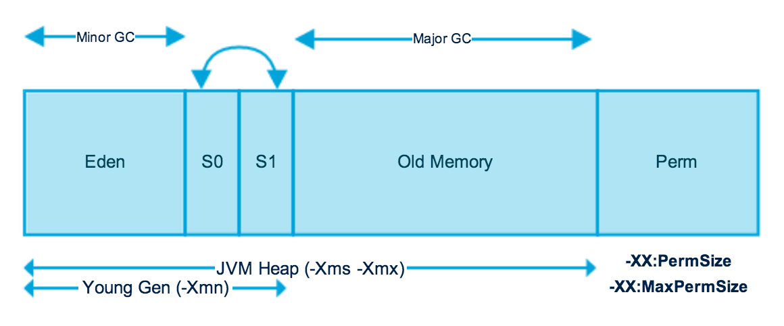

## Java Memory

[:arrow_backward:](java_index)

- String pool is located in Perm

### Garbage Collectors

Source [here](https://www.baeldung.com/jvm-garbage-collectors).

##### Serial Garbage Collector

Used in single-thread applications, so when GC is running in a thread then application fully freezes. Use this GC in a very simple client-like Java apps.

##### Parrallel Garbage Collector

Uses multiple threads for managing heap space, but also freezes all other application threads. This GC is used as a default in JVM.

> If we use this *GC*, we can specify maximum garbage collection *threads and pause time, throughput, and footprint* (heap size).

##### CMS Garbage Collector

Deprecated. The Concurrent Mark Sweep (CMS) implementation uses multiple garbage collector threads. We use it if we want to have shorter GC pauses (it runs more frequently) but do not freeze application threads. So on average app works slower, but it's not stopped when GC runs. 

##### G1 Garbage Collector	

> *G1 (Garbage First) Garbage Collector* is designed for applications running on multi-processor machines with large memory space. It's available from the *JDK7 Update 4* and in later releases.
>
> *G1* collector will replace the *CMS* collector, since it's more performance efficient.

G1 collectors divides a heap into many regions. First it performs Marking globally, then it performs Sweeping firstly on regions that are mostly empty (reduces the amount of work it has to do and minimizes the impact on application performance). Then in copies object that survived into new regions to free up space. 

It will run in parallel with application and won't stop it.

##### Z Garbage Collector

> [*ZGC (Z Garbage Collector)* ](https://www.baeldung.com/jvm-zgc-garbage-collector)is a scalable low-latency garbage collector that debuted in Java 11 as an experimental option for Linux. *JDK* 14 introduced *ZGC* under the Windows and macOS operating systems. *ZGC* has obtained the production status from Java 15 onwards.
>
> *ZGC* performs all expensive work concurrently, **without stopping the execution of application threads for more than 10 ms**, which makes it suitable for applications that require low latency. It uses **load barriers with colored pointers** to perform concurrent operations when the threads are running, and they're used to keep track of heap usage.
>
> Reference coloring (colored pointers) is the core concept of *ZGC*. It means that *ZGC* uses some bits (metadata bits) of reference to mark the state of the object. It also **handles heaps ranging from 8MB to 16TB in size**. Furthermore, pause times don't increase with the heap, live-set, or root-set size.
>
> Similar to *G1, Z Garbage Collector* partitions the heap, except that heap regions can have different sizes.

