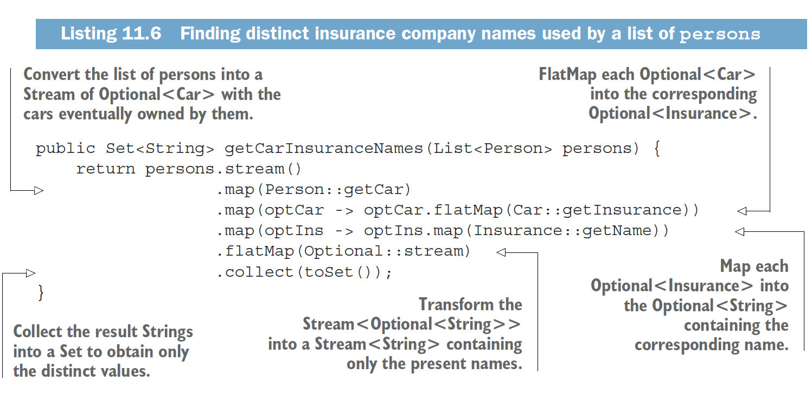
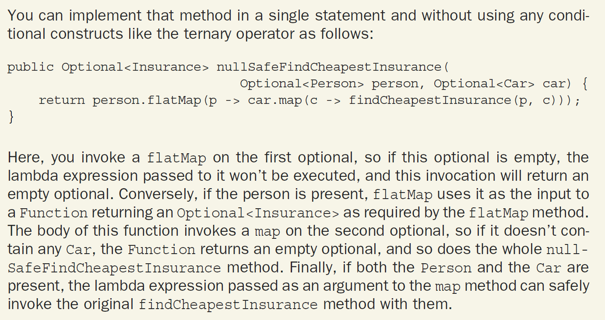
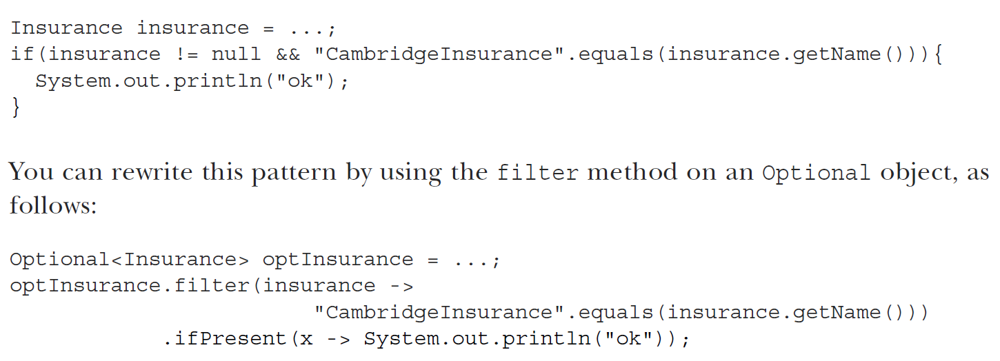

## Modern Java in Action

[:arrow_backward:](java_index)

[toc]

#### Functional programming vs Imperative 

No shared mutable data and the ability to pass methods to functions-code-to other methods are the cornerstones of what's described as *functional programming*.

In the imperative programming you typically describe a program in terms of a sequence of statements that mutate state.


#### Function as a new value

Java 8 adds functions as new forms of value. Why do we need this? 

To help answer this, we’ll note that the whole point of a programming language is to manipulate values, which, following historical programming-language tradition, are therefore called first-class values (or citizens, in the terminology borrowed from the 1960s civil rights movement in the United States). Other structures in our programming languages, which perhaps help us express the structure of values but which can’t be passed around during program execution, are second-class citizens. Values as listed previously are first-class Java citizens, but various other Java concepts, such as methods and classes, exemplify second-class citizens. Methods are fine when used to define classes, which in turn may be instantiated to produce values, but neither are values themselves. Does this matter? Yes, it turns out that being able to pass methods around at runtime, and hence making them first-class citizens, is useful in programming, so the Java 8 designers added the ability to express this directly in Java.


#### Passing code with behavior parameterization

*Behaviour parametrization* means the ability to tell a method to *take* multiple behaviors as parameters and use them internally to accomplish different behaviors.

**Since Java 8 introduced lambdas** (finally), it is now possible to parameterize method’s behavior with anonymous functions.

> Passing behavior as a parameter can help relieve the pain of change.

> The signature of the abstract method of a functional interface is called a *function descriptor*.


#### Restrictions on local variables for stream

Instance variables are stored on the heap, whereas local variables live on the stack. If a lambda could access the local variable directly and the lambda was used in a thread, then the thread using the lambda could try to access the variable after the thread that allocated the variable had deallocated it. Hence, Java implements access to a free local variable as access to a copy of it, rather than access to the original variable.


### Code examples

Sort using *comparing*

```java
Comparator<Apple> c = Comparator.comparing((Apple a) -> a.getWeight());

import static java.util.Comparator.comparing;
inventory.sort(comparing(apple -> apple.getWeight()));
```

Composing stuff

```java
Predicate<Apple> redAndHeavyAppleOrGreen = redApple
    .and(apple -> apple.getWeight() > 150)
    .or(apple -> GREEN.equals(a.getColor()));

Function<String, String> addHeader = Letter::addHeader;
Function<String, String> transformationPipeline = addHeader
    .andThen(Letter::checkSpelling)
    .andThen(Letter::addFooter);
```

Slicing using a predicate (Java 9 feature)

```java
// stop once you found a dish that is greater than (or equal to) 320 calories
List<Dish> slicedMenu1 = specialMenu.stream()
    .takeWhile(dish -> dish.getCalories() < 320)
    .collect(toList());

// finding the elements that have greater than 320 calories
List<Dish> slicedMenu2 = specialMenu.stream()
    .dropWhile(dish -> dish.getCalories() < 320)
    .collect(toList());
```


### Streams

Stream is a sequence of elements from a source that supports data-processing operations.

- *Sequence of elements*—Like a collection, a stream provides an interface to a sequenced set of values of a specific element type. Collections are about data; streams are about computations.
- *Source*—Streams consume from a data-providing source such as collections,
  arrays, or I/O resources.
- *Data-processing operations*—Streams support database-like operations and common
  operations from functional programming languages to manipulate data,
  such as filter, map, reduce, find, match, sort, and so on.


#### External vs internal iteration

Using the Collection interface requires iteration to be done by the user (for example, using for-each); this is called *external iteration*. The Streams library, by contrast, uses *internal iteration*—it does the iteration for you and takes care of storing the resulting stream value somewhere.


#### Using flatMap

How could you return a list of all the unique characters for a list of words? For example, given the list of words ["Hello," "World"] you’d like to return the list ["H," "e," "l," "o," "W," "r," "d"].

```java
List<String> uniqueCharacters =
words.stream()
    .map(word -> word.split("")) // Converts each word into an array of its individual letters
    .flatMap(Arrays::stream) // Flattens each generated stream into a single stream
    .distinct()
    .collect(toList());

//All the separate streams that were generated when using map(Arrays::stream) get amalgamated—flattened into a single stream.
```


#### Reduce

```java
Optional<Integer> min = numbers.stream().reduce(Integer::min); // or max
```


#### Stream operations: stateless vs. stateful

Operations like `map` and `filter` take each element from the input stream and produce zero or one result in the output stream. These operations are in general *stateless*: they don’t have an internal state.

But operations like `reduce`, `sum`, and `max` need to have internal state to accumulate the result. In this case the internal state is small. In our example it consisted of an int or double. The internal state is of *bounded* size no matter how many elements are in the stream being processed.

By contrast, some operations such as `sorted` or `distinct` seem at first to behave like `filter` or `map`—all take a stream and produce another stream (an intermediate operation)—but there’s a crucial difference. Both sorting and removing duplicates from a stream require knowing the previous history to do their job. For example, sorting requires all the elements to be buffered before a single item can be added to the output stream; the storage requirement of the operation is *unbounded*. This can be problematic if the data stream is large or infinite. We call these operations *stateful* operations.


#### Streams and I/O

> Streams are AutoCloseable so there’s no need for try-finally.

```java
try(Stream<String> lines = Files.lines(Paths.get("data.txt"), Charset.defaultCharset())){ uniqueWords = lines.flatMap(line -> Arrays.stream(line.split(" ")))
    .distinct()
    .count();
}
catch(IOException e){
}
```


#### Fibonacci with streams

```java
Stream.iterate(new int[]{0, 1}, t -> new int[]{t[1], t[0]+t[1]})
    .limit(20)
    .forEach(t -> System.out.println("(" + t[0] + "," + t[1] +")"));
```


#### Using parallel streams effectively

- Measure the performance when applying parallel stuff
- Watch out for boxing - autoboxing and unboxing operations can really hurt the performance. Use primitive streams to avoid that
- Some operations naturally perform better in sequential that in parallel. Such operations as ```limit``` and ```findFirst``` that rely on the order of the elements are expensive in a parallel stream. But if we don't need to limit first n elements then we set the stream as ```unordered ```. `findAny` may be used instead of `findFirst`
- Consider the total computational cost of the pipeline of operations performed by the stream. 
  N - number of elements to be processed
  Q - approximate cost of processing one of these elements through the stream pipeline
  N*Q gives a estimation of this cost. A higher value for Q implies a better chance of good performance when using a parallel stream.
- For a small amount of data, choosing a parallel stream is almost never a winning decision. The advantage of using parallel computing doesn't compensate the cost of the parallelization process.
- Take into account how well the data structure decomposes. `ArrayList` can be split much more effectively than `LinkedList`, because first can be divided without traversing it, as it's necessary step for the second. To get full control of decomposing the data use `Spliterator` interface 
- The characteristics of a stream, and how intermediate operations through the pipeline modify them, can change the performance of the decomposition process. `SIZED` stream can be divided into two equal parts and be effectively processed in parallel, but a filter operation can throw unpredictable number of elements, making the size of stream unknown
- Consider whether a terminal operation has a cheap or expensive merge step (`combiner` method in `Collector` for example). If this is expensive, then the cost caused by the combination of the partial results generated by each sub-stream can outweigh the performance benefits of a parallel stream

Stream sources and decomposability:

| Source            | Decomposability |
| ----------------- | --------------- |
| `ArrayList`       | Excellent       |
| `LinkedList`      | Poor            |
| `IntStream.range` | Excellent       |
| `Stream.iterate`  | Poor            |
| `HashSet`         | Good            |
| `TreeSet`         | Good            |


#### Fork/join framework

The infrastructure used behind the scenes by parallel streams to execute operations in parallel is the fork/join framework. 

- It was designed to recursively split a parallelizable task into smaller tasks and then combine the results of each subtask to produce the overall result

- It's an implementation of the `ExecutorService` interface which distributes those subtasks to worker threads in a thread pool, called `ForkJoinPool` . To submit a task to the pool we need to create a subclass of `RecursiveTask<R>`, that has implemented `compute` method (defines the splitting logic and the algorithm to produce the single subtask result when cannot divide)

  ```
  if (task is small enought or no longer divisible) {
  	compute task sequentially
  } else {
  	split task in two subtasks
  	call this method recursively possibly further splitting each subtask
  	wait for the completion of all subtasks
  	combine the results of each subtask
  }
  ```

- Forking a quite large number of fine-grained tasks is in general a winning solution because of *work stealing* feature. Each worker thread has a queue with tasks to complete and if some thread becomes idle, he may steal the task from the queue of other worker thread.


#### Spliterator

It's the mechanism of splitting the stream. `Spliterator` is used to traverse the elements of a source, but also designed to do this in parallel. 

- Java 8 provides a default `Spliterator` implementation for all the data structures from Java Collections


### Refactoring tips

- Method references make code more readable compared with lambda expressions
- Convert iterative collection to use the Stream API
- Lambda expressions can remove boilerplate code associated with OOP design patterns (strategy, template method, observer, factory, chain or responsibility)
- Lambdas can be tested, but in general should focus on testing the behavior of the methods in which the lambda expressions appear
- Extract complex lambda expressions into regular methods
- The `peek` method of a stream is useful for logging intermediate values


### Implement DSL

A DSL is a custom-built language designed to solve a problem for a specific business domain (for example accounting). 

DSL offers the following benefits:

- Conciseness - An API than conveniently encapsulates the business logic allows you to avoid repetitions
- Readability - Using words that belong to the vocabulary of the domain makes the code more understandable to non-technicians from that domain
- Maintainability - for business-related code, which is the part of the app to change most frequently
- Higher level of abstraction - The operations available in a DSL wort at the same level of abstraction as the domain, thus hiding the details that aren't strictly related to the domain's problems
- Focus - code for specifically describing the business rules helps programmers in focusing only at that part
- Separation of concerns - Expressing the business logic in a dedicated language makes it easier to keep the business-related code isolated from the infrastructural part of the application

Disadvantages:

- Difficulty of DSL design 
- Development cost - adding a DSL is a long-term investment with further engineering overhead when maintaining
- Additional indirection - needs to be very thin to avoid performance problems
- Another language to learn
- Hosting-language limitations - Java is being verbose and having rigid syntax for creating a user-friendly DSL (but lambdas fixes this in some way)

#### DSL solutions

- Internal DSLs are implemented on top of the existing hosting language (Java, for example)
- External DSLs are called stand-alone, syntax is independent from hosting language
- Another general-purpose language that runs on JVM, but more flexible (Scala or Groovy) - **polyglot DSL**
- The three main patterns to implement DSLs in Java are method chaining, nested functions, and function sequencing


### Optional

- `ofNullable` - Returns an `Optional` wrapping the given value or the empty `Optional` if this value is null;
  `of` - Returns an `Optional` wrapping the given value or throws a `NullPointerException` if this values is `null`

- Stream<String> from Stream<Optional<String>> without empty optionals
  
  At the end, method transforms each Optional into a Stream with zero or one elements, depending on whether the transformed Optional is empty. In that way we'll have a Set containing only the present names

  > `Optional.stream` method: if a value is present, returns a `Stream` containing only it; otherwise, returns an empty `Stream`.

- Combining two optionals without unwrapping them
  

- Rejecting certain values with filter
  


### More on functional style

- Reducing shared mutable data structures can help you maintain and debug your programs in the long term
- Functional-style programming promotes side-effect-free methods and declarative programming
- Function-style methods are characterized only by their input arguments and their output result
- A function is referentially transparent if it always returns the same result value when called with the same argument value. Iterative constructs such as `while` loops can be replaced by recursion (but recursion is not optimized in Java because we need to store a separate stack frame (which holds the state of function) for each recursive call)
- Tail recursion may be a better than classic recursion in Java because in opens the way to potential compiler optimization (only one stack frame but it doesn't work in Java compiler)

#### Functional program techniques

- First-class functions are functions that can be passed as arguments, returned as results, and stored in data structures
- A higher-order function takes one or more functions as input or returns another function. Examples in Java include `comparing`, `andThen`, and `compose`
- Currying is a technique that lets you modularize functions and reuse code
- A persistent data structure preserves the previous version of itself when it's modified. As a result, it can prevent unnecessary defensive copying
- Streams in Java can't be self-defined
- A lazy list is a more-expressive version of a Java stream. A lazy list lets you produce elements of the list on demand by using a supplier that can create more of the data structure
- Pattern matching is a functional feature that lets you unwrap data types. You can view data matching as generalizing Java's `switch` statement
- Referential transparency allows computations to be cached
- Combinators are functional ideas that combine two or more functions or other data structures

