## Multithreading course notes

[:arrow_backward:](java_index)

[toc]

We need threads for 2 reasons:

- Responsiveness - Concurrency

  Concurrency = Multitasking (illusion that we perform many tasks at the same time, so we don't even need multiple cores)

- Performance - Parallelism
  With multiple cores we can truly run tasks completely in parallel

Single-thread application process:

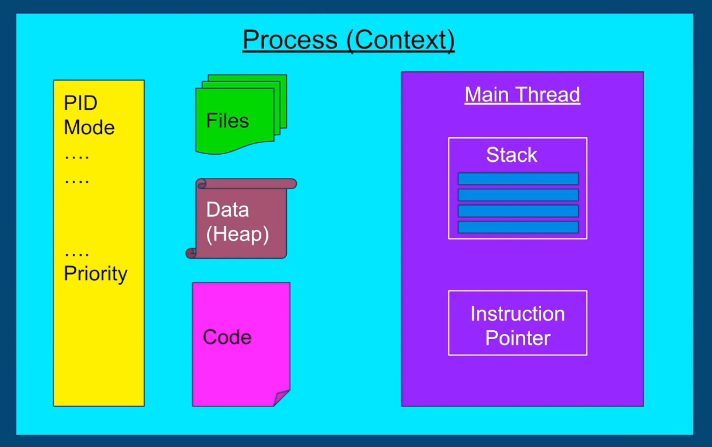

In multithreaded we would have also Thread 1 and others, each with its own stack and instruction pointer

- Stack - region in memory where local variables are stored, and passed into functions
- Instruction Pointer - address of the next instruction to execute

##### Context switch

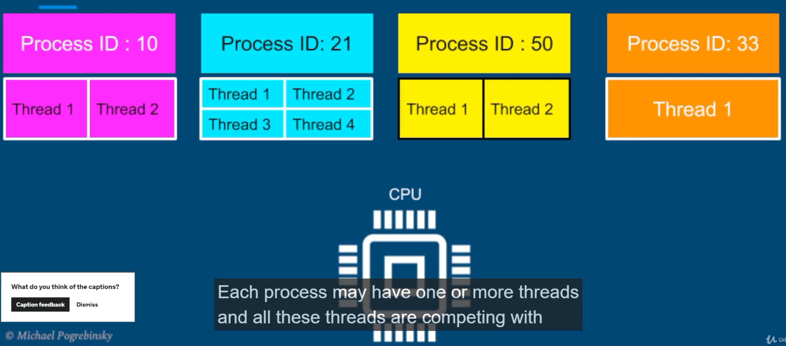

- Threads are competing with each other to get executed on the CPU.
- The process of stoping thread, scheduling other and starting it - Context switch. 
- It's not cheap. When we switch thread we need to store data for onte thread and restore data for another

> Threads consume less resources than processes so context switching between threads from the same process is cheaper than context switch between threads from different processes.

##### Threads scheduling


On each epoch we define different timeslices for each thread to run. The decision if to add to epoch based on formula:

```
Dynamic Priority = Static Priority + Bonus
```

- Static is set by the developer programatticaly
- Bonus is adjusted by the OS in every epoch, for each thread
- Bonus can be negative

Using dynamic priority, the OS will give preference to interactive threads (such as user interface threads) and at the same time give preference to threads that did not complete in last epochs, or did not get enough time to run - preventing *Starvation*.

##### Threads vs processes

When to prefer multithreaded architecture

- Prefer if the tasks share a lot of data
- Threads are much faster to create and destroy
- Switching between threads of the same process is faster

When to prefer multi-process architecture

- Security and stability are of higher importance
- Tasks are unrelated to each other


#### Threads coordination

##### thread.interrupt()

Use it on thread object instance. It will will throw `InterruptedException` inside that instance - and if it has the code to catch this exception, it will do it and end thread.


But if we don't have `catch InterruptedException`, thread object won't stop running even after `thread.interrupt()`. To fix we need to find a hotspot and put if code `Thread.currentThread().isInterrupted()`:


##### Daemon threads

Background threads that do not prevent application from exiting if the main thread terminates. Example: file saving thread in a Text editor, that keeps saving file every 2 seconds.

##### thread.join()

If we need for example for our main thread to wait for results from other threads, we may call on them `join()` method:

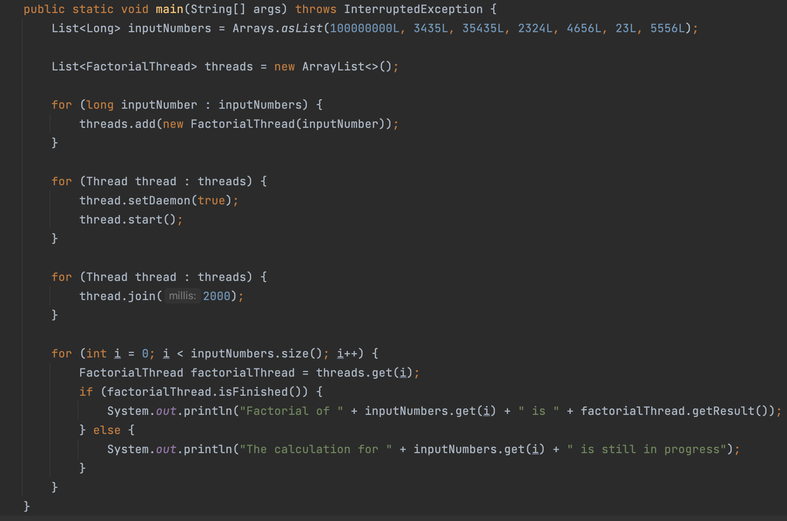

Here, after starting all threads and after join method calls (with limit of 2s), main thread goes into WAIT state. After threads are finished the main will continue.


#### Performance optimization

Latency - the time to completion of a task. Measured in time units

Throughput - The amount of tasks completed in a given period. Measured in tasks/time unit

##### Latency

Break our tasks into subtasks. What could be the number N of subtasks?

On a general purpose: N = number of cores (should be as close as possible) 

> It will run truly parallel.

- An additional thread would give an diverse effect - it will push other threads from their core back and forth, resulting in context switching, bad caching, extra memory consumption.

- \# threads = \# cores is optimal only if all threads are runnable (all the time in RUNNABLE state) and can run without interruption (no IO/ blocking calls/ sleep)

- The assumption is that nothing else is running that consumes a lot of CPU (pretty common, so our solution won't be optimal but very close to that)
- Hyperthreading - Virtual threads
  
- Inherent cost of parallelization and aggregation
  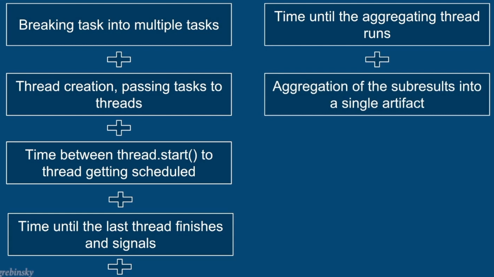

##### Throughput

By serving each task on a different thread, in parallel, we can improve throughput by N (N = #threads = #cores) times.

Can eliminate next costs if comparing with latency approach:
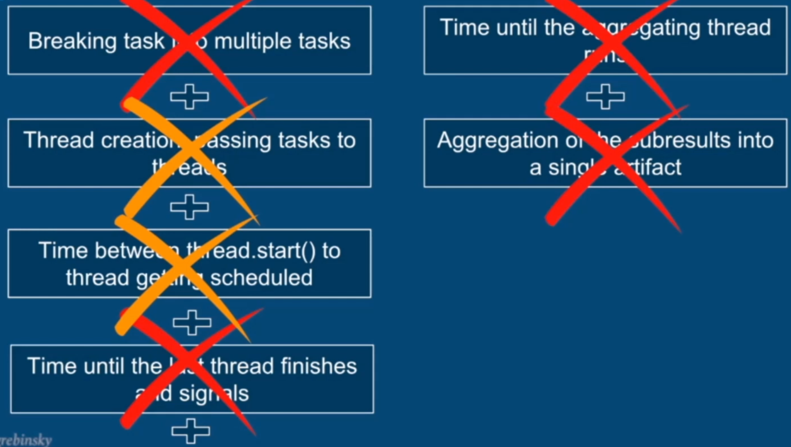


#### Data sharing

##### Stack

Memory region where:

- methods are called
- arguments are passed
- local variables are stored

Stack + Instruction Pointer = State of each thread's execution


Stack's properties:

- All variables (local primitives, local references) belong to the thread executing on that stack
- Statically allocated when the tread is created
- The stack's size is fixed, and relatively small (platform specific)
- If our calling hierarchy is too deep, we may get StackOverflow (with recursion)

##### Heap

> Everything located in heap is shared among threads. Stack stuff cannot be shared.

What is allocated here:

- Objects: String, Object, Collections... our custom

- Members of classes
- Static variables (they actually don't get garbage collected)

Governed and managed by Garbage Collector


#### Concurrency challenges

##### Synchronization

- If put `synchronized` on method then when calling it, the thread will **acquire lock on entire object**.
- May put different object locks for flexibility:
  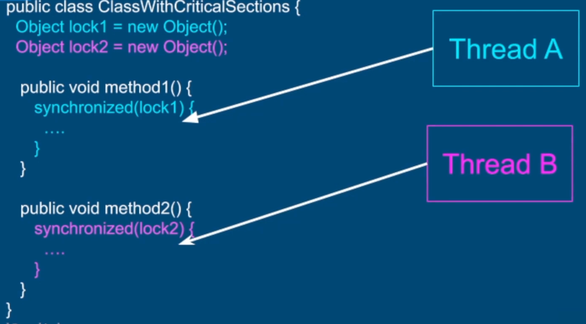

Synhronized block is <u>*Reentrant*</u> - a thread cannot prevent itself from entering a critical section:
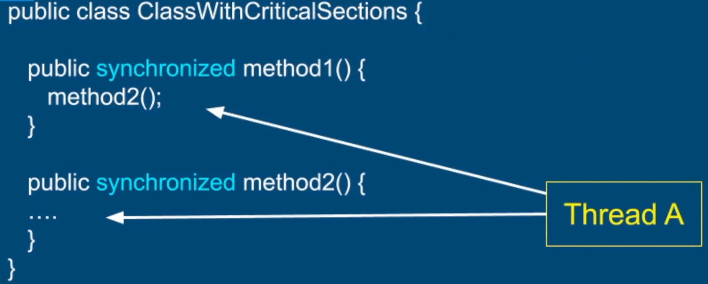

##### Atomicity

An operation or a set of operations is considered **atomic**, if it appears to the rest of the system as if it occured at once. Single step - "all or nothing". No intermediate states.

> `items++` - not atomic
>
> 1) Get current value of `items`
> 2) Increment current value by 1
> 3) Store the result into `items`

- All reference assignments are atomic - can get and set references atomically (getters and setters)

- All assignments to primitive types are safe except <u>long and double</u> (because they are 64 bits, so it may be 2 operations)
  

  We may fix it with volatile

##### Race condition

Condition when multiple threads are accessing a shared resource. The core of a problem is non atomic operations performed on the shared resource.

##### Data Race

> Data race and race condition are two different concurrency issues that can occur in multi-threaded programs. A data race occurs when two or more threads access the same shared memory location concurrently and at least one of them performs a write operation. A race condition, on the other hand, occurs when the behavior of a program depends on the relative timing or interleaving of multiple threads, and the outcome is non-deterministic.

> Read [here](https://blog.regehr.org/archives/490) for good example. 

Compiler and CPU may execute the instructions Out of Order to optimize performance and utilization (but they will maintain the logic corectness of code). 	

> If we have someMethod() {
>
> ​	I++;
> ​	y++;
>
> }, these increment operations may not run in order, as they not depend on each other (so logically we are not breaking anything if run in other order)

To establish a *Happens - Before* semantics:

- *Synchronization* of methods which modify shared variables
- Declaration of shared variables with *volatile* keyword
  It declares that it will run first all instructions before volatile variable and all after 

> Rule of thumb:
>
> Every shared variable should be either guarded by a synchronized block (or other locks) or declared volatile. 

##### Deadlock

Conditions for deadlock:

- Mutual Exclusion - Only one thread can have exclusive access to a resource
- Hold and Wait - At least one thread is holding a resource and is waiting for another resource
- Non-preemptive allocation - A resource is released only after the thread is done using it.
- Circular wait - A chain of at least two threads each one is holding one resource and waiting for another resource

Solution: avoid cirular wait - **Enforce a strict order in lock acquisition**.


#### ReentrantLock

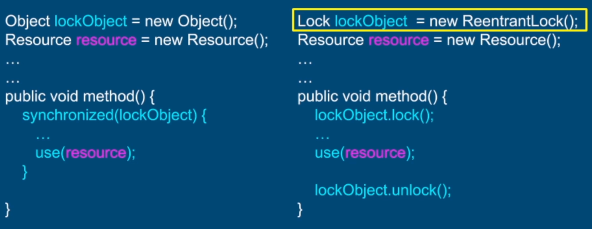

After `lock()` and throwing an exception we never reach `lockObject.unlock()`. We need to follow try-finally pattern (lock before try and unlock object in finally block).

Why use this lock?

- Query methods - For Testing
  - getQueuedThreads() - Returns a list of threads waiting to acquire a lock
  - getOwner() - Returns the thread that currently owns the lock
  - isHeldByCurrent Thread() - Queries if the lock is held by the current thread
  - isLocked() - Queries if the lock is held by any thread
- Fairness
  - ReentrantLock(true)
  - May reduce the throughput of the app
- lockInterruptibly()
- tryLock()

##### lockInterruptibly()

Stop the thread from waiting on the lock (because just calling interrupt() won't do anything). We need to surround the code with try catch block (InterruptedException).

`LockInterruptibly()` - Use Cases

- Watchdog for deadlock detection and recovery
- Waking up threads to do clean and close the application

##### tryLock()

`boolean tryLock()`
`boolean tryLock(long timeout, TimeUnit unit);`

- Returns true and acquires a lock if available
- Returns false and does not get suspended, if the lock is unavailable.

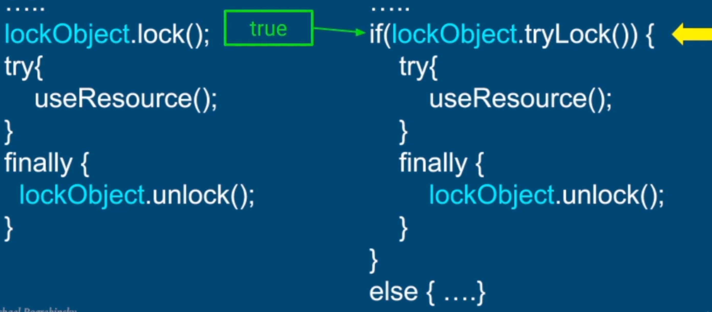

tryLock() - Use Cases

- Real Time applications where suspending a thread on a lock() method is unacceptable.
- Examples:
  - Video/Image processing
  - High Speed/Low latency trading systems
  - User Interface applications

> Financial application where stock prices should be updated. We have UI component, PriceUpdater and PriceContainer - a shared resourced. When we update the prices with PriceUpdater we acquire the lock and update stock prices. At the same time UI component uses tryLock() and if it's available then it updates the prices, in other cases does nothing.

#### ReentrantReadWriteLock

ReentrantReadWriteLock - Use Case

- Synchronized and ReentrantLock <u>do not allow</u> multiple readers to access a shared resource concurrently.

- Not a big problem in the general case (if we keep the critical sections short, the chances of a contention over a lock are minimal)

- When read operations are predominant

  Or when read operations are not as fast

  - Read from many variables
  - Read from a complex data structure

- Mutual exclusion of reading threads negatively impacts the performance

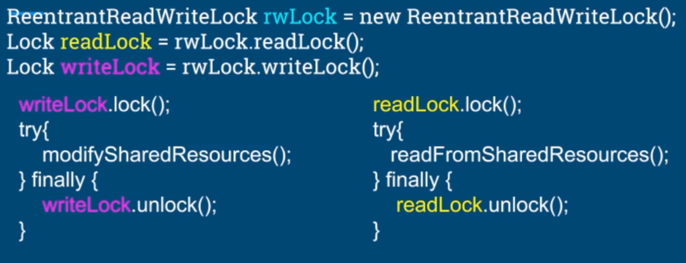

- Multiple threads can acquire the readLock
- Only a single thread is allowed to lock a writeLock
- Mutual exclusion between readers and writers:
  - If a <u>write lock</u> is acquired, no thread can acquire a <u>read lock</u>
  - If at least one thread holds a <u>read lock</u>, no thread can acquire a <u>write lock</u> 

> We have a price inventory service, where we have method for filtering the inventory and getting the sum of some items in a price range (big read operations). At same time we have methods for updating the inventory, add and remove (write operations).
>
> In order to proper calculate prices (avoid race condition) we need to have locks on read and write operations - make those methods synchronized. But here, read operations are much more frequent than write, so we may make reading operations run concurrently.
> We create write lock and set for writing operations, read lock for reading operations. 


#### Semaphore

Can be used to restrict the number of users to a particular resource or a group of resources.

- Unlike the locks that allows only one "user" per resource
- The semaphore can restrict any given number of users to a resource

Semaphore differences with locks

- Semaphore doesn't have a notion of owner thread
- Many threads can acquire a permit
- The same thread can acquire the semaphore multiple times
- The binary semaphore ( initialized with 1) is not reentrant - so when we entered one method, acquired permit, then to another method which requires permit - we get blocked
- Semaphore can be released by any thread
- Even can be released by a thread that hasn't actually acquired it

##### Semaphore - Producer Consumer

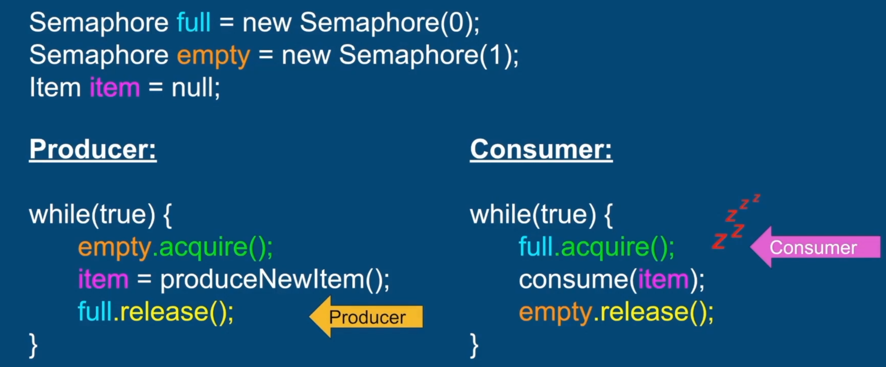

1) Consumer gets to full.acquire(), freezes and wait for producer
2) Producer acquires 1 permit, produced item (shared variable between producer and consumer)
3) Releases full semaphore, allowing Consumer to consumer the item
4) Only after Consumer has released the empty, Producer can acquire permit and produce new item

Producer Consumer with Queue

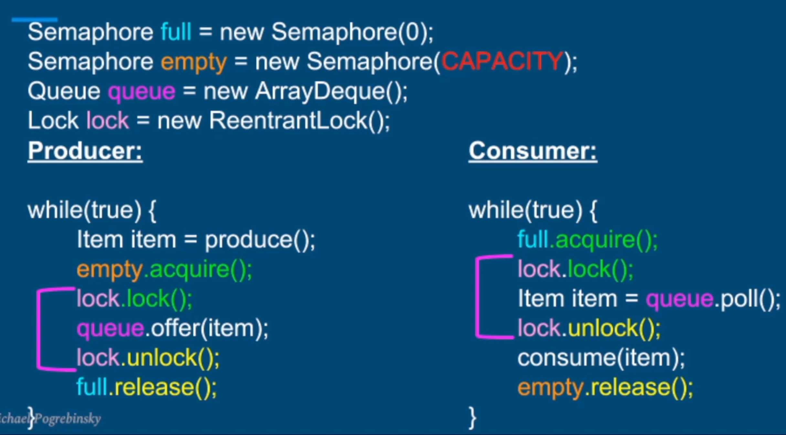

The queue size CAPACITY will guarantee that consumers will keep up with the producers and queue won't grow to infinity (no memory issues).

Semaphore Producer Consumer is used in Actor model, Socket channels, Video (pretty any multithreaded app would use this pattern).


##### Inter-thread communication with Condition

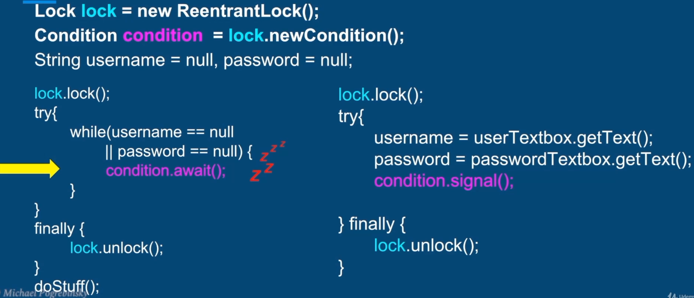

Imagine we try to login, have UI and backend:

1. On backend, left side, we see that username and password are null, so call condition.await() and put current thread to sleep + it also unlocks the lock atomically
2. Now we able to enter UI part (lock available) read username and password, then condition.signal() that will wake up Backend thread. But before it UI needs to finish all methods and call lock.unlock(), after that we get back to Backend thread.

**condition.await()**

- `void await()` - unlock lock, wait until signalled
- `long awaitNanos(long nanos Timeout)` - wait no longer than nanos Timeout
- `boolean await(long time, TimeUnit unit)` - wait no longer than time, in given time units
- `boolean awaitUntil (Date deadline)` - wake up before the deadline date

##### wait, notify() and notifyAll()

- The Object Class contains the following methods:
  - public final void wait() throws InterruptedException
  - public final void notify()
  - public final void notifyAll()

- Every Java Class inherits from the Object Class
- We can use any object as a condition variable and a lock (using the synchronized keyword)

- wait() - Causes the current thread to wait until another thread wakes it up.
  - In the wait state, the thread is not consuming any CPU
- Two ways to wake up the waiting thread:
  - notify - Wakes up a single thread waiting on that object
  - notifyAll() - Wakes up all the threads waiting on that object
- To call wait(), notify() or notifyAlI() we need to acquire the monitor of that object (use synchronized on that object)

It is same as Condition variable but we use object instead:

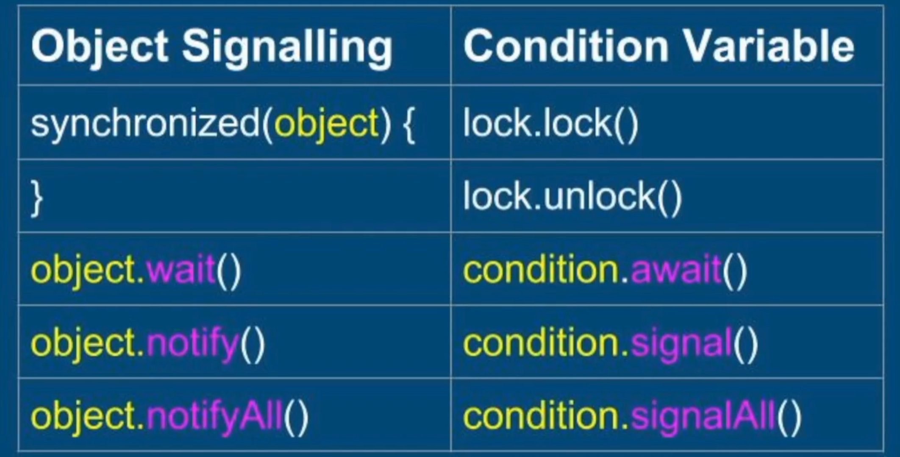

When the object is current object we may remove synchronized(this) and just put synchronized in method declaration

> Producer - Consumer example with custom ThreadSafeQueue (that have synchronized add and remove methods) and applied backpressure:
>
> 1. Before adding an element to queue we check if queue size reached the capacity - if yes then `wait()` (Producer thread will freeze in ThreadSafeQueue and wait for Consumer to be notified)
> 2. In remove method, after consuming we check if queue size is equal to CAPACITY-1 - if yes then we `notifyAll()` and wake up the Producer
>
> Whenever using a queue to decouple multithreaded components, apply back-pressure and limit the size of the queue.


#### Lock-free algorithms

##### Atomic instructions

- Read/assignment on all primitive types (except long and double)
- Read/assignment on all references
- Read/assignment on volatile long and double

> To avoid data races we make all shared variables (primitives and references) <u>volatile</u>.

##### AtomicInteger

\+ Simple, no need for locks or synchronization, no race conditions or data races.

\- Only the operation itself is atomic and there's still race condition between 2 separate atomic operations.

**AtomicReference**

- `boolean compareAndSet(V expectedValue, V newValue)`

  - Assigns new value if current value == expected value

  - Ignores the new value if the current value != expected value

Stack lock-free implementation notes:

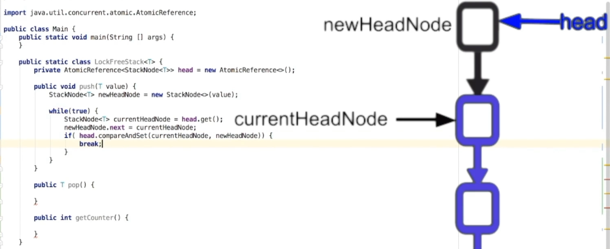

- We read the head, calculate the new head, and then we hope that our head hasn't changed during previous operations - if didn't then we set the new calculated head; if head has changed then we retry the operation
- Only if our head is equal to currentHeadNode (so head hasn't changed) then we set this head with our newly created 