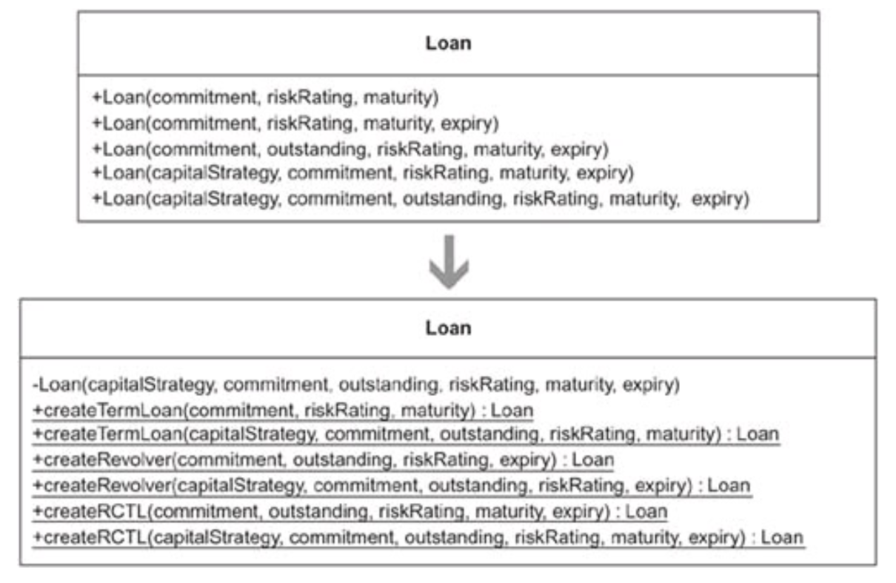
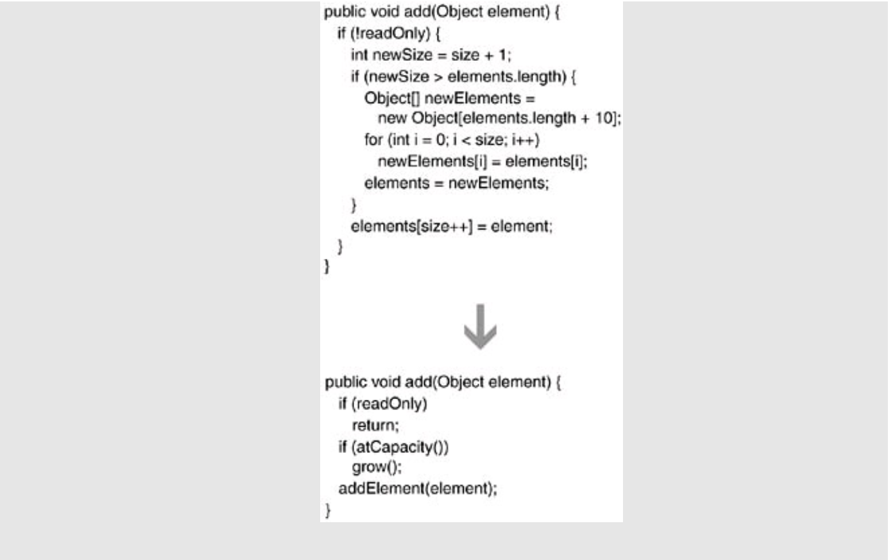

## Refactoring: Improving the Design of Existing Code & Refactoring to Patterns

[:arrow_backward:](backend_index)

[toc]

Refactoring is the process of changing a software system in a way that does not alter the external behavior of the code yet improves its internal structure.

Brevity is the soul of wit, but clarity is the soul of evolvable software.

**Refactoring (noun)**: a change made to the internal structure of software to make it easier to understand and cheaper to modify without changing its observable behavior.

**Refactoring (verb)**: to restructure software by applying a series of refactorings without changing its observable behavior.

> The point of refactoring isn't to show how sparkly a code base is - it is purely economic. We refactor beacuse it makes us facter - faster to add features, faster to fix bugs.


#### Best practices

When doing refactorings in small steps with reruning automated tests after each change you don't need to debug.

If there is a need to do a long-term refactoring you may plan it in a way to gradually work on the problem in the next few weeks - make a lot of little improvements.

Refactoring in the process of code review is a good practice. You may be sitting one-on-one with the original author, going through the code and refactoring as we go. It's called *pair programming.*

Instead of speculating on what flexibility I will need in a future and what mechanimcs will best enable that, I build software that solves only the currently understood need, and I make this software excellently designed for those needs (*yagni - "you aren't going to need it"*). With refactoring we adapt the architecture to those new demands. If it's harder to refactor - maybe need to add a flexibility mechanim. 

Build program in a well-factored manner without paying attention to performance. Then use profilers that monitors the programm and tells where it is consuming time and space - we may see hot spots, small parts of the program that needs to be optimized. Make changes and run performance test again - revert if no significant result.


#### Cases

If we try to extract function (106) and we end up with passing so many parameters, then may use:

- replace temp with query (178)
- introduce parameter object (140)
- preserve whole object (319)
- heavy artillery - replace function with command (337)

Even a single line is worth extracting if it need explanation.


#### TDD

The Test-Driven Development relies on short cycles of writing a (failing) test, writing the code to make that test work, and refactoring to ensure the result is as clean as possible.


### Refactoring to Patterns 

Треба додавати 41 сторінку, по тій навігації що в книзі.

#### Chapter 1. Creation

##### Replace Constructors with Creation Methods (98)

Constructors on a class make it hard to decide which constructor to call during development. *Replace the constructors with intention-revealing Creation Methods that return object instances.*



**Benefits and Liabilities**

\+ Communicates what kinds of instances are available better than constructors.

\+ Bypasses constructor limitations, such as the inability to have two constructors with the same number and type of arguments.

\+ Makes it easier to find unused creation code.

– Makes creation nonstandard: some classes are instantiated using new, while others use *Creation Methods*.

> Нотатки:
>
> Якщо параметрів забагато - можливо винести групи параметрів у окремі класи.
> Якщо самих Creation методів забагато - створюємо кілька найпопулярніших загальних (чуть роздутих)
>
> Якщо надто багато логіки створення різних об'єктів, яка переважає над бізнес логікою класу - виносимо у Factory клас

---


##### Encapsulate Classes with Factory (119)

Clients directly instantiate classes that reside in one package and implement a common interface. *Make the class constructors non-public and let clients create instances of them using a Factory.*


**Benefits and Liabilities**

\+ Simplifies the creation of kinds of instances by making the set available through intention-revealing methods.

\+ Reduces the “conceptual weight” of a package by hiding classes that don’t need to be public.

\+ Helps enforce the mantra “program to an interface, not an implementation”.

– Requires new/updated Creation Methods when new kinds of instances must be created.

– Limits customization when clients can only access a Factory’s binary code, not its source code.

> Нотатки:
>
> Ховаємо за пекеджом різні варіації створення об'єкту - потрібно, якщо юзеру можна про них і не знати, а тільки використовувати спільний інтерфейс. 
>
> Незручно використовувати Factory, коли потрібно часто змінювати конструктори сабкласів, добавляти нові, бо відразу треба змінювати чи добавляти Creation методи, що є залежністю. Можливо вартує відкрити користувачу доступ до створення тих об'єктів напряму, з різними параметрами які вони захочуть.

**Implemented in practice**: add unmodifable and synchronized behavior for collections with protection proxies, which are instantiated via factory methods in Collections class (*synchronnizedCollection*(), *unmodifiableList()*...).


---


##### Introduce Polymorphic Creation with Factory Method (127)

Classes in a hierarchy implement a method similarly, except for an object creation step. *Make a single superclass version of the method that calls a Factory Method to handle the instantiation.*


> Суть в тому, що два класи імплементують один і той же функціонал, який можна було б винести вгору (суперклас), однак вони по різному створюють певні об'єкти. Ми можемо для них створити спільний інтерфейс (OutputBuilder), у суперкласі заімплементувати метод з його використанням (*testAddAboveRoot()*), і найголовніше -  при створенні сабкласу ми <u>перевизначаємо метод, який створює для нас необхідний об'єкт</u> (*createBuilder()*) - це Factory method.

- Можна Factory Method імплементувати у класовій структурі, а можливо за допомогою спільних інтерфейсів.

- Дуже часто у фреймворках використовуюється Factory method, коли нам дають шанс перевизначити метод й повернути якийсь об'єкт (це може бути як і обов'язковий крок, так і дефолтна імплментація могла існувати).

- Factory Method часто використовують в патерні Template method

**Benefits and Liabilities**

\+ Reduces duplication resulting from a custom object creation step.

\+ Effectively communicates where creation occurs and how it may be overridden.

\+ Enforces what type a class must implement to be used by a Factory Method.

– May require you to pass unnecessary parameters to some Factory Method implementers.

> Одному сабкласу треба буде цей параметр, іншому можливо ні, тому треба зважати.

---


##### Encapsulate Composite with Builder (135)

Building a Composite is repetitive, complicated, or error-prone. *Simplify the build by letting a Builder handle the details.*


> About builder pattern:
> "Separate the construction of a complex object from its internal representation so that the same construction process can create different representations", also builder is simplifying construction or decoupling client code from a complex object are also equally good reasons for using it.

**Benefits and Liabilities**

\+ Reduces the repetitive and error-prone nature of Composite creation.

\+ Creates a loose coupling between client and Composite.

\+ Allows for different representations of the encapsulated Composite or complex object.

– May not have the most intention-revealing interface.

> Робить дуже багато всього, тому перед тим як юзати можна почитати документацію й полазити в імплементації.

---


##### Inline Singleton (153)

Code needs access to an object but doesn’t need a global point of access to it. *Move the Singleton’s features to a class that stores and provides access to the object. Delete the Singleton.*


**Benefits and Liabilities**

\+ Makes object collaborations more visible and explicit.

\+ Requires no special code to protect a single instance.

– Complicates a design when passing an object instance through many layers is awkward or difficult.

---


#### Chapter 7. Simplification

##### Compose Method (163)

You can’t rapidly understand a method’s logic. *Transform the logic into a small number of intention-revealing steps at the same level of detail.*



> Good Composed Methods have code at the same level of detail.

**Benefits and Liabilities**

\+ Efficiently communicates what a method does and how it does what it does.

\+ Simplifies a method by breaking it up into well-named chunks of behavior at the same level of detail.

– Can lead to an overabundance of small methods.

– Can make debugging difficult because logic is spread out across many small methods.

---


##### Replace Conditional Logic with Strategy (169)

Conditional logic in a method controls which of several variants of a calculation are executed. *Create a Strategy for each variant and make the method delegate the calculation to a Strategy instance.*


> Якщо наший хост клас, де ми хочемо втулити стратегію, має ієрархію (сабкласи), то можемо використати Replace Conditional Logic with Polymorphism, і до кожного з них замапити різні варіації алгоритму. Якщо такого нема, то думаємо чи не легше використати object-compositional підхід, тобто стратегія.
>
> Може бути кейс, коли в класі хості використовуються types (enums) для різних типів чогось -> кожний тип виносимо у сабклас з відповідним для нього функціоналу.
>
> Якщо у рантаймі прийдеться щось змінювати - ясно, що стратегія. Коли імплементимо, потрібно думати як у нього будем параметри передавати (окремим аргументами чи повністю хост this об'єкт, залежить чи дуже баато параметрів чи ні).
>
> Можливо використати Factory метод для створення стратегії.

**Benefits and Liabilities**

\+ Clarifies algorithms by decreasing or removing conditional logic.

\+ Simplifies a class by moving variations on an algorithm to a hierarchy.

\+ Enables one algorithm to be swapped for another at runtime.

– Complicates a design when an inheritance-based solution or a refactoring from “Simplifying Conditional Expressions” is simpler.

– Complicates how algorithms obtain or receive data from their context class.

---


##### Move Embellishment to Decorator (184)

Code provides an embellishment (прикраса) to a class’s core responsibility. *Move the embellishment code to a Decorator.*


> Decorator vs Strategy
>
> • You can’t share Decorator instances—each instance wraps one object. On the other hand, you can easily share Strategy instances by means of the Singleton or Flyweight patterns [DP].
>
> • A Strategy can have whatever interface it wants, while a Decorator must conform to the interface of the classes it decorates.
>
> • Decorators can transparently add behavior to many different classes, as long as the classes share the same interface as the Decorators. On the other hand, classes that want to use Strategy objects must know about their existence and how to use them.
>
> • Using one or more Strategies within a class that holds a lot of data or implements many public methods is common practice. On the other hand, Decorator classes become too heavy and require too much memory when they’re used to decorate classes with lots of data and many public methods.

**Benefits and Liabilities**

\+ Simplifies a class by removing embellishments from it.

\+ Effectively distinguishes a class’s core responsibility from its embellishments.

\+ **Helps remove duplicated embellishment logic in several related classes.**

\- Changes the object identity of a decorated object. Can make code harder to understand and debug.

\- Complicates a design when combinations of Decorators can adversely affect one another.

> Треба дивитись чи не забагто публічних методів імплементує клас (орієнтовно до 10), поверх якого хочемо натягнути декоратор - він також повинен все це імплементити, аби юзер і не підозрював потім, що він юзає якийсь декораторо поверх класу.

---


**Replace State-Altering Conditionals with State (208)**

The conditional expressions that control an object’s state transitions are complex. *Replace the conditionals with State classes that handle specific states and transitions between them.*


> Якщо без проблем розуміємо як відбувається перехід станів, і їх не так багато, то можна і не рефакторити до state патерну.

**Benefits and Liabilities**

\+ Reduces or removes state-changing conditional logic.

\+ Simplifies complex state-changing logic.

\+ Provides a good bird’s-eye view of state-changing logic.

– Complicates a design when state transition logic is already easy to follow.

---


##### Replace Implicit Tree with Composite (221)

You implicitly form a tree structure, using a primitive representation, such as a String. *Replace your primitive representation with a Composite.*


> Робити рефактор у тому випадку, якщо це implicit дерево стає важко самому менеджити.

**Benefits and Liabilities**

\+ Encapsulates repetitive instructions like formatting, adding, or removing nodes.

\+ Provides a generalized way to handle a proliferation of similar logic. + Simplifies construction responsibilities of a client.
 – Complicates a design when it’s simpler to construct implicit trees.

---


##### Replace Conditional Dispatcher with Command (234)

Conditional logic is used to dispatch requests and execute actions. *Create a Command for each action. Store the Commands in a collection and replace the conditional logic with code to fetch and execute Commands.*


**Benefits and Liabilities**

\+ Provides a simple mechanism for executing diverse behavior in a uniform way.

\+ Enables runtime changes regarding which requests are handled and how.

\+ Requires trivial code to implement.

– Complicates a design when a conditional dispatcher is sufficient.

> Можна створити мапку з різних назв хендлеру й кожне відповідне value буде конкретна його імплементація 

---


#### Chapter 8. Generalization

##### Form Template Method (248)

Two methods in subclasses perform similar steps in the same order, yet the steps are different. *Generalize the methods by extracting their steps into methods with identical signatures, then pull up the generalized methods to form a Template Method.*


**Benefits and Liabilities**

\+ Removes duplicated code in subclasses by moving invariant behavior to a superclass.

\+ Simplifies and effectively communicates the steps of a general algorithm.

\+ Allows subclasses to easily customize an algorithm.

– Complicates a design when subclasses must implement many methods to flesh out the algorithm.

> Сабкласом можемо перевизначити в принципі головний метод (алгоритм) темплейту, викликати super.method() і додатково ще свої дії.

---


##### Extract Composite (257)

Subclasses in a hierarchy implement the same Composite. *Extract a superclass that implements the Composite.*


> If you have two or more classes with similar features, it makes sense to move the common features to a superclass. This refactoring is similar: it addresses the case when the similar feature is a Composite [DP] that would be better off in a superclass.

**Benefits and Liabilities**

\+ Eliminates duplicated child-storage and child-handling logic.

\+ Effectively communicates that child-handling logic may be inherited.

---


**Replace One/Many Distinctions with Composite (267)**

A class processes single and multiple objects using separate pieces of code. *Use a Composite to produce one piece of code capable of handling single or multiple objects.*


\+ Removes duplicate code associated with handling one or many objects.

\+ Provides a uniform way to process one or many objects.

\+ Supports richer ways to process many objects (e.g., an OR expression).

– May require runtime checks for type safety during construction of the Composite.

---


##### Replace Hard-Coded Notifications with Observer (236)

Subclasses are hard-coded to notify a single instance of another class. *Remove the subclasses by making their superclass capable of notifying one or more instances of any class that implements an Observer interface.*


```java
public class TestRunner implements TestListener...
	protected TestResult createTestResult() {
		TestResult testResult = new TestResult(); 											testResult.addObserver(this);
		return testResult;
}

public class TestResult...
	public synchronized void addError(Test test, Throwable t) {
		fErrors.addElement(new TestFailure(test, t));
		for (Iterator i = observers.iterator();i.hasNext();) { 						TestListener observer = (TestListener)i.next(); 								observer.addError(this, test, t);
		}
}
```

> Маємо TestResult, який збирає дані чи успішний тест чи зафейлився, аби потім заріпортити цю інформацію до TestRunner, яка відмалює користувачу UI результату тестів. 
> По ріквайрментах, кожен раз як ми добавляємо результат тесту, повинно і відмальовуватись результати юзеру. Отже TestRunner має стати слухачем до TestResult.
>
> Якщо брати до увагу найпростіше рішення, то попросту кидаєм TestRunner інстанс поле у TestResult й потім через конструктор при створенні ініціалізуємо. Далі як добавляємо якийсь failure з тестів, то за ним `frunner.addFailure(...)`. 
> Проблема полягає в тому, що для TestResult може бути тільки один слухач + high coupling між двома конкретними класами.
>
> Створюємо інтерфейс TestListener, який відповідає суто за нотіфікейшн активності. У кінцевому, коли створюємо TestResult, у якого буде масив зі слухачів TestListener (його імплементує TestRunner). Як у TestResult шось зробиться, то відразу заапдейтяться зміни до кожного слухача ( TestListener).

**Benefits and Liabilities**

\+ Loosely couples a subject with its observers.

\+ Supports one or many observers.

– Complicates a design when a hard-coded notification will suffice. 

– Complicates a design when you have cascading notifications.

– May cause memory leaks when observers aren’t removed from their subjects.

---


##### Unify Interfaces with Adapter (289)

Clients interact with two classes, one of which has a preferred interface. *Unify the interfaces with an Adapter.*


> Коли використовувати:
>
> - 2 класи роблять одне й те саме і мають різні інтерфейси
> - Клієнтський код буде простіший і зрозуміліший, якщо дуже схожі класи будуть ділитись спільним інтерфейсом
> - Не можемо змінити інтерфейс одного з класів, бо це частина third-party, або частина фреймворку яка вже дуже широко використовується іншими клієнтами

**Benefits and Liabilities**

\+ Removes or reduces duplicated code by enabling clients to communicate with alternative classes via the same interface.

\+ Simplifies client code by making it possible to communicate with objects via a common interace.

\+ Unifies how clients interact with alternative classes.

– Complicates a design when you can change the interface of a class rather than adapting it.

---


##### Extract Adapter (300)

One class adapts multiple versions of a component, library, API, or other entity. *Extract an Adapter for a single version of the component, library, API, or other entity.*


> Можна цей патерн використати коли треба підтримувати різні версії чогось, вони можуть змінюватись швидко, з'являються купа if.

**Benefits and Liabilities**

\+ Isolates differences in versions of a component, library, or API.

\+ Makes classes responsible for adapting only one version of something. 

\+ Provides insulation from frequently changing code.

– Can shield a client from important behavior that isn’t available on the Adapter.

---


##### Replace Type Code with Class (328)

A field’s type (e.g., a String or int) fails to protect it from unsafe assignments and invalid equality comparisons. *Constrain the assignments and equality comparisons by making the type of the field a class.*


**Benefits and Liabilities**

\+ Provides better protection from invalid assignments and comparisons.

– Requires more code than using unsafe type does.

> Хорошою альтернативою є використання enum, які теж дають type-safe властивості, однак якби ми розширяли далі код в сторону патерну state (тут нову поведінку добавляємо), то не факт що enum-based підхід дасть нам таку можливість - треба йти через класовий підхід.

---


#### Chapter 10. Accumulation

**Move Accumulation to Collecting Parameter (313)**

You have a single bulky method that accumulates information to a local variable. *Accumulate results to a Collecting Parameter that gets passed to extracted methods.*


**Benefits and Liabilities**

\+ Helps transform bulky methods into smaller, simpler, z methods. 

\+ Can make resulting code run faster.

---


##### Introduce Null Object (301)

Logic for dealing with a null field or variable is duplicated throughout your code. *Replace the null logic with a Null Object, an object that provides the appropriate null behavior.*


Null Objects are often (though not always) implemented by subclassing or by implementing an interface. Creating a Null Object by subclassing involves overriding all inherited public methods to provide the appropriate null behavior. A risk associated with this approach is that if a new method gets added to the superclass, programmers must remember to override the method with null behavior in the Null Object.

**Benefits and Liabilities**

\+ Prevents null errors without duplicating null logic.

\+ Simplifies code by minimizing null tests.

– Complicates a design when a system needs few null tests.

– Can yield redundant null tests if programmers are unaware of a Null

– Complicates maintenance. Null Objects that have a superclass must override all newly inherited public methods.

---


##### Limit Instantiation with Singleton (338)

Your code creates multiple instances of an object, and that uses too much memory or slows system performance. *Replace the multiple instances with a Singleton.*


> If you want to be a good software designer, don’t optimize code prematurely. Prematurely optimized code is harder to refactor than code that hasn’t been optimized. In general, you’ll discover more alternatives for improving your code before it has been optimized than after.

Wait for a good reason to limit instantiaion and when you find one, then refactor to a Singleton.

**Benefits and Liabilities**

\+ Improves performance.

– Is easily accessible from anywhere. In many cases, this may indicate a design flaw (see Inline Singleton, 153).

– Is not useful when an object has state that can’t be shared.

---


#### Chapter 11. Utilities

##### Chain Constructors (381)

You have multiple constructors that contain duplicate code. *Chain the constructors together to obtain the least amount of duplicate code.*


Unify Interfaces (343)
Extract Parameter (346)
Move Creation Knowledge to Factory (68)
Move Accumulation to Visitor (320)
Replace Implicit Language with Interpreter (269)