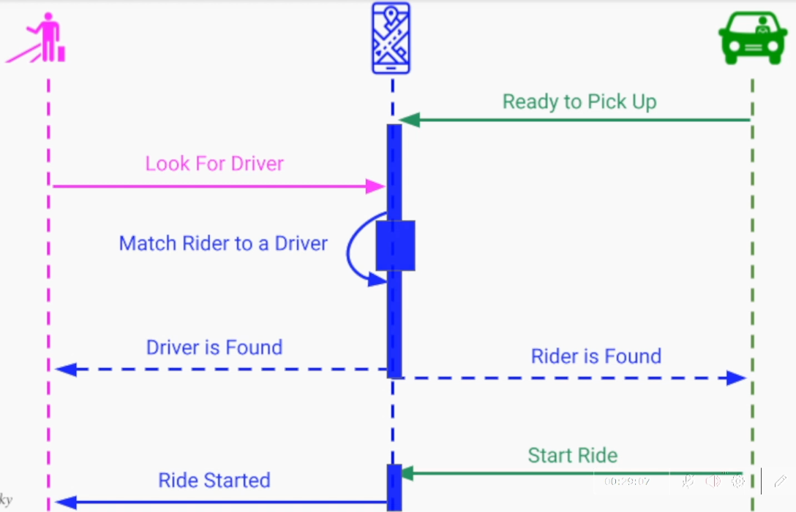
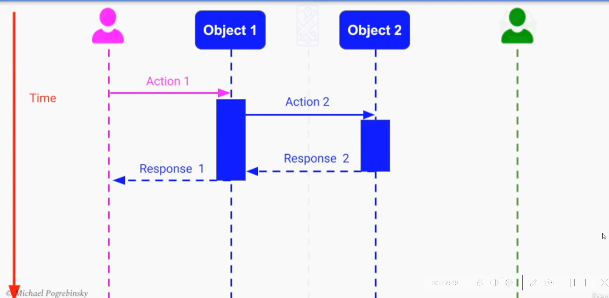

## Software Architecture & Design of Modern Large Scale Systems

[:arrow_backward:](backend_index)

[toc]

The software architecutre of a system is a high-level description of the system's structure, its different components, and how those components communicate with each other to fulfil the systems' requirements and constraints.

Software architecture is not about the technologies and implementation but about the abstraction (components). Components itself are a "black box" elements defined by their behavior and APIs. They may themselves be complex systems with their own software architecture diagrams.

It can have many levels of abstraction:

- Classes/structs
- Modules/packages/libraries
- **Services (processes/groups of processes)**

We cannot prove Software Architecture to be either:

- Correct
- Optimal

What we can to do guarantee success is follow:

- Methodical design process
- Architectural patterns
- Best practices

Software architecture is the output of the design phase and the input to the implementation. 

### System Requirements and Architectural drivers

1. Features of the System
   - Functional requirements, describe the system behavior's - what it should do 

2. Quality Attributes
   - Non-functional requirements
   - System properties that "the system much have" (scalability, availability, reliability, security, performance)
   - Quality attributes dictate the software architecture of our system
3. System constraints
   - Time constraints - strict deadlines
   - Financial constraints - limited budget
   - Staffing constraints - small number of available engineers

They all are **Architectural Drivers**.

#### Functional requirements

Good method of gathering requirements:

- Use Cases
  - situation / scenario in which our system is used
- User Flows
  - step-by-step / graphical representation of each use case

Steps:

1. Identify all the actors/users in our system (driver, rider)

2. Capture and describe all the possible use-cases/ scenarios (rider first time registration, driver registration, rider login, driver login, successful match and ride)

3. User Flow - expand each use case through flow of events

   - Each event contain **Action** and **Data**
   - We may describe it with a sequence diagram (but the data is not represented in this diagram)
     

   

> Sequence Diagram - diagram that represents interactions between actors and objects. Part of the UML design language. 
> 

#### Quality attributes

Non-functional requirements.

Systems are frequently redesigned NOT because of functional requirements, but because isn't fast enough, doesn't scale, slow to develop, hard to maintain, not secure enough.

System quality attributes provides a **quality measure** on how well our system performs on a **particular dimension**.

> Development team can deploy a new version of the online store at least twice a week - Deployability Quality Attribute.

**Important considerations**

Quality attributes need to be:

- Measurable
- Testable

So we can prove that our system satisfied the requirements.

Certain quality attributes contradict one another. So we need to make the right **tradeoff**.

We need to make sure that the system is capable of delivering with the client asking for. Client may something that is either technically impossible or extremely expensive to implement.

#### **System constraints**

A system constraint is essentially a decision that was already either fully or partially made for us, restricting our degrees of freedom. They may be as pillars for software architecture because:

- They provide us with a solid starting point
- The rest of the system need to be designed around them

There are:

- Technical constraints (being locked to a particular cloud vendor; need to use only a particular programming language; need to support certain platforms)
- Business constraints (limited budget or a strict deadline; different arch patterns are based on suitability between small startups or bigger organizations; usage of third-party services with their own APIs)
- Regulatory/legal constraints (global or local)
  - GDPR in EU - data protection regulation (sets limitation on collecting, storing and sharing users' data)

**Important considerations**

- We shouldn't tale any given constraint lighly
  External rules and regulations may not have room to negotiate, but internal rules (project budget) can be negotiated. Also may be an opportunity to use other technologies (because going back will be very hard).
- Use loosely coupled architecture
  if limited to db/third-party service, we need to make sure our system is not tightly coupled to that technology. Usage of different technology should need minimal changes