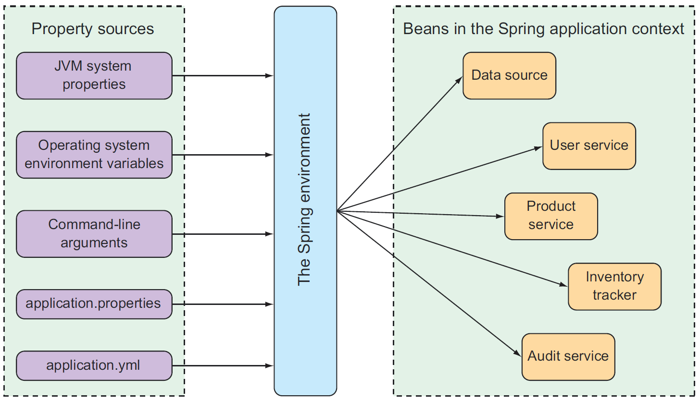
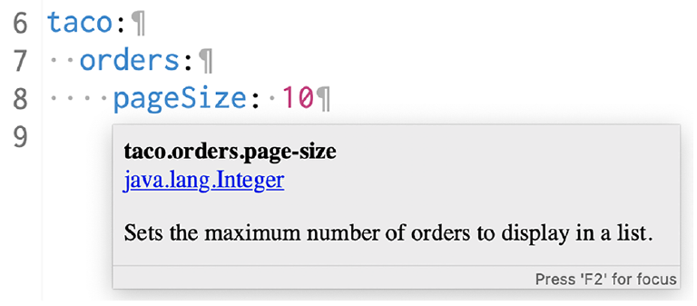

## Configuration Properties

[:arrow_backward:](../spring_index)

[toc]

For any configurable property we use Spring environment abstraction, which pulls properties from several sources, including the following:

- JVM system
- Operating system environment variables
- Command-line arguments
- Application property configuration files

It then aggregates those properties into a single source from which Spring beans can be injected:



For example we want to specify a different port. We can specify it by setting the `server.port` in properties file, which can also be YAML type:

```yaml
server:
	port: 9090
```

To configure that property externally, we can use a command-line argument:

```bash
java -jar tacocloud-0.0.5-SNAPSHOT.jar --server.port=9090
```

If we want to always start the application on a specific port, just set an operating system environment variable:

```bash
export SERVER_PORT=9090
```

Spring is able to interpret `SERVER_PORT` as `server.port` with no problems.


#### @ConfigurationProperties

To support property injection of configuration properties, Spring Boot provides the @ConfigurationProperties annotation. When placed on any Spring bean, it specifies that the properties of that bean can be injected from properties in the Spring environment.

```java
@Controller
@RequestMapping("/orders")
@SessionAttributes("order")
@ConfigurationProperties(prefix="taco.orders")
public class OrderController {
	private int pageSize = 20;
	public void setPageSize(int pageSize) {
	this.pageSize = pageSize;
	}
	...
@GetMapping
public String ordersForUser(@AuthenticationPrincipal User user, Model model) {
	Pageable pageable = PageRequest.of(0, pageSize);
	model.addAttribute("orders",
	orderRepo.findByUserOrderByPlacedAtDesc(user, pageable));
	return "orderList";
	}
}
```

The new pageSize property defaults to 20. But you can easily change it to any value you want by setting a taco.orders.pageSize property.

In the case of the pageSize property in OrderController, you could extract it to a separate class. The following listing uses the OrderProps class in such a way:

```java
package tacos.web;
import org.springframework.boot.context.properties.ConfigurationProperties;
import org.springframework.stereotype.Component;
import lombok.Data;
@Component
@ConfigurationProperties(prefix="taco.orders")
@Data
public class OrderProps {
	private int pageSize = 20;
}

```


##### Declaring configuration property metadata

The metadata can be useful for providing some documentation around properties. Need to create a file under the `META-INF` folder (under `main/resources/META-INF`) named `additional-spring-configuration-metadata.json`:

```json
{"properties": [{
"name": "taco.orders.page-size",
"type": "java.lang.Integer",
"description": "Sets the maximum number of orders to display in a list."
}]}
```

 After configuring it:




#### Configuring with profiles

Create YAML or properties file with name following `application-{profile name}` convention. Next we can activate them with `spring.profiles.active` property which can be set:

- in properties file (not the best way)
- with command-line argument (`--spring.profiles.active=prod`)
- setting OS environment variable (`export SPRING_PROFILES_ACTIVE=prod`)

Another way works only with YAML. It allows placing profile-specific properties alongside nonprofiled in `application.yml`, separated by three hyphens and the `spring.profiles` property to name the profile:

```yaml
logging:
	level:
		tacos: DEBUG
---
spring:
	profiles: prod
	datasource:
		url: jdbc:mysql:/ /localhost/tacocloud
		username: tacouser
		password: tacopassword
logging:
	level:
		tacos: WARN
```

> You can activate many profiles at once.


##### Conditionally creating beans with profiles

```java
@Profile({"!prod", "!qa"})
@Configuration
public class DevelopmentConfig {
	@Bean
	public CommandLineRunner dataLoader(IngredientRepository repo,
		UserRepository userRepo, PasswordEncoder encoder) {
		...
	}
}
```

