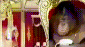

## :tulip: spring

[:arrow_backward:](../backend_index)

#### :gear: Configuration

​	:gear: [Configuration properties](configuration/sb_conf_props)

​	:gear: [Spring Data](configuration/sb_data)

​	:gear: [Spring DevTools](configuration/sb_dev_tools)

#### :books: Books

​	:deciduous_tree: Spring microservices in action [notes](spring_microservices_in_action)  

​	:information_source: Spring data persistence with hibernate [notes](spring_data_persistence_with_hibernate)
