## Spring Microservices in Action

[:arrow_backward:](spring_index)

[toc]

A microservice is a small, lousely coupled, distributed service. We can decompose big application into easy-to-manage components with narrowly defined responsibilies. 

##### Cloud computing models

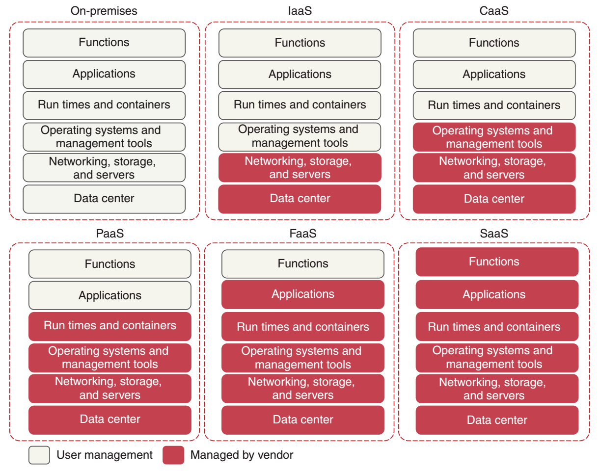

Spring Cloud is collection of tools that wraps work of open source companies (VMware, Netflix, HashiCorp) in delivery patterns.

##### Technologies to implement microservices patterns

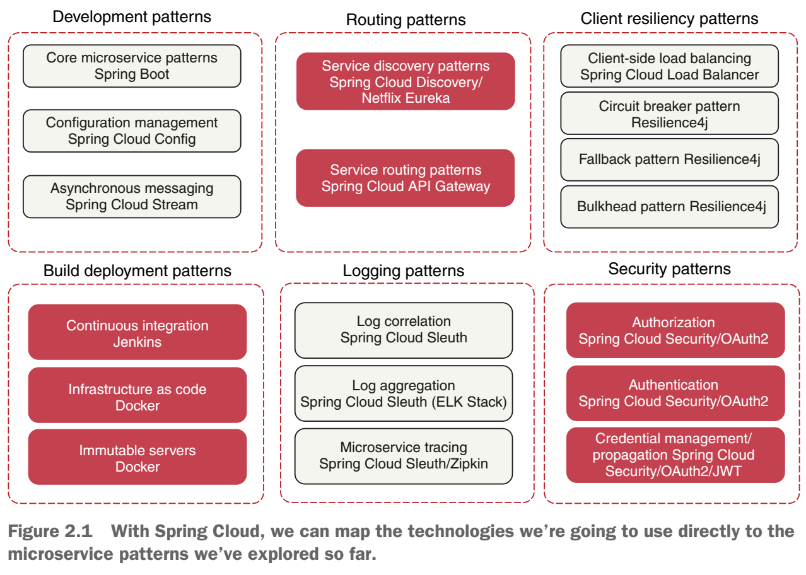

> Use `dependency:tree` for checking pulled maven dependencies.

*Cloud-native* application are built with scalable components like containers, deployed as microservices, and managed on virtual infrastructures through DevOps processes with continious delivery workflows.

> DevOps - software development methodology that focuses on communication, collaboration, and integration between software developers and IT operations. The primary goal is to automate the process of software delivery and infrastracture changes at lower costs.

The twelve-factor application manifesto, provided by Heroku, provides best practices for building cloud-native microservices.

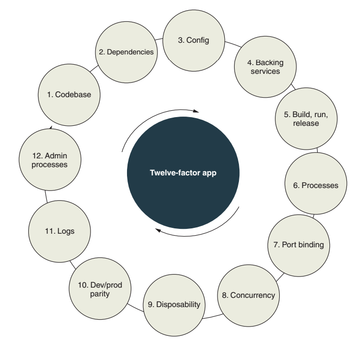

> Description of each on page 40.

---


### Build microservices with Spring Boot

Determine the correct right level of granularity:

- Start broad with our microservices and refactor to smaller services, don't go overboard (harder to change in future)
- Focust first on how our services interact one another - helps establish coarse-grained interfaces of your problem domain
- Service responsibilites change over time as our understanding of the problem domain grows - single microservice might grow into multiple services, with the original microservice ascting as an orchestration layer

The service is likely coarse-grained if:

- Too many responsibilites - an overly diverse array of rules
- A service that manages data across a large number of tables - if persist data to multiple tables or reaching out to tables outside of the service database
- A service with too many test cases - from small number of test cases to hundreds

Microservice is too fine-grained if:

- The microservices in one part of the problem domian breed like rabbits - the number of services to get a piece of work works tremendously 
- Microservices are heavily dependant on one another - microservice keep calling back and forth between each other to complete a single user request
- Microservice become a collection of simple CRUD (create, replace, update, delete) service - microservices are an expression o business logic and not an abstraction layer over your data sources

A microservice architecutre should be developed with an evolutionary thought process, where we know that we won't get the design right the first time.

#### Perspectives when designing microservices

Need to have an integrated view:


##### When not to use microservices

- *Complexity when building distributed systems*
  Microservice architectures require a high degree of operational maturity, organization must invest in the automation and operational work (monitoring, scaling, and so on) - if not ready then no microservices.
- *Virtual server or container sprawl*
  The operational complexity and cost of managing and monitoring too many servers or containers (50-100) can be tremendous. The flexibility of microservices has to be weighed against the cost of running all of those servers.
- *Application type*
  If you're building small, department-level application, or apps with a small user base, the complexity might generate more expense than it's worth
- *Data transaction and consistency*
  A microservice works well as a mechanism for performing "operational" tasks like creating, adding, and performing non-complex queries against a data store. If app needs to do complex data aggregation or transformation across multiple data sources, the distributed nature will make this work difficult.

##### Operational lifecycles of a microservice

- *Service assembly* - how you package and deploy service to guarantee repeatability and consistency so the same service code and run-time engine are deployed the same way
  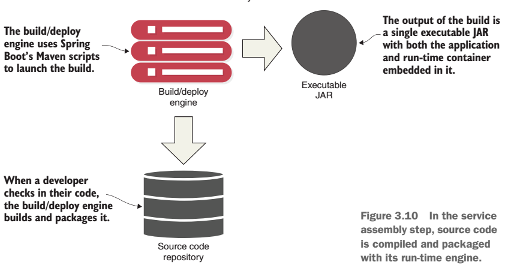
- *Service bootstrapping* - how you separate your app and environment specific config code from the run-time code so that you can start and deploy a microservice instance quickly in any env
  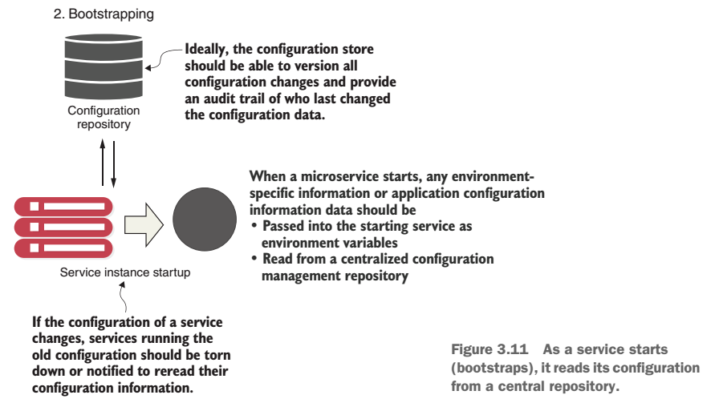
- *Service registration/discovery* - how you make the new deployed service instance discoverable by other application clients
  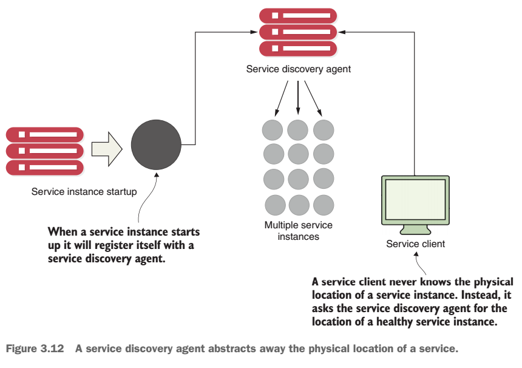
- *Service monitoring* - need to monitor instances and ensure that any faults are routed around failing service instance, and these are taken down
  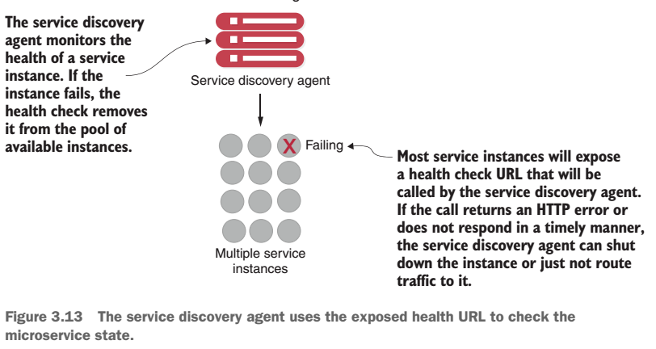

---


### Docker Integration

Difference between VMs and containers:

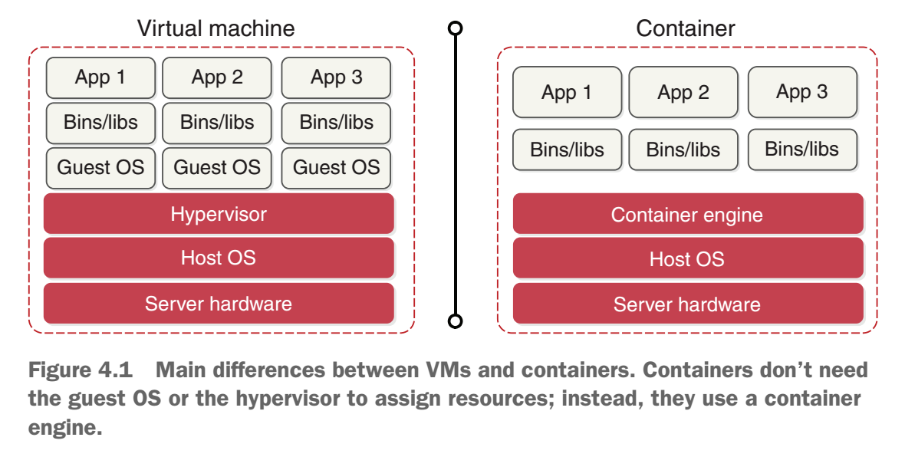

Docker architecture:

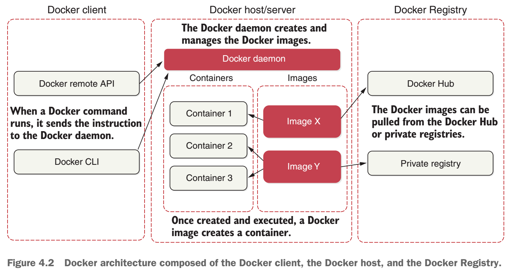

#### Docker maven plugin

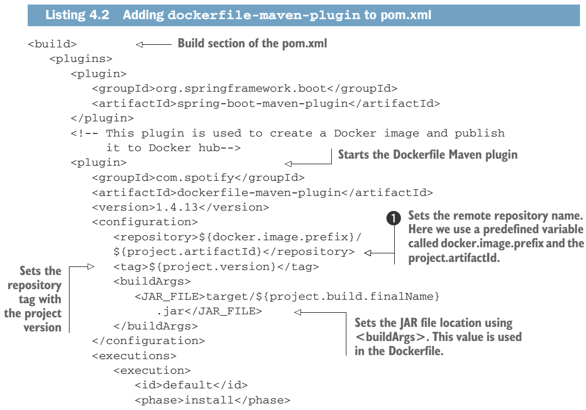

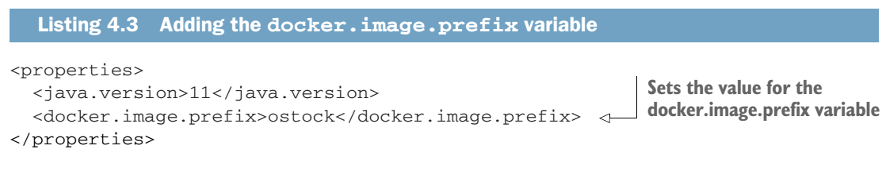

There are various ways to build the jar - using a basic Dockerfile or with a multistage build (more optimized, page 101). Springboot supports Buildpack with layered JARs.

---


### Spring Cloud Configuration Server

With a cloud-based model, the application configuration data should be segregated completely from the application. The appropriate configuration data needs are then injected at run time so that the same server/application artifacts are consistently promoted throughout all environments.

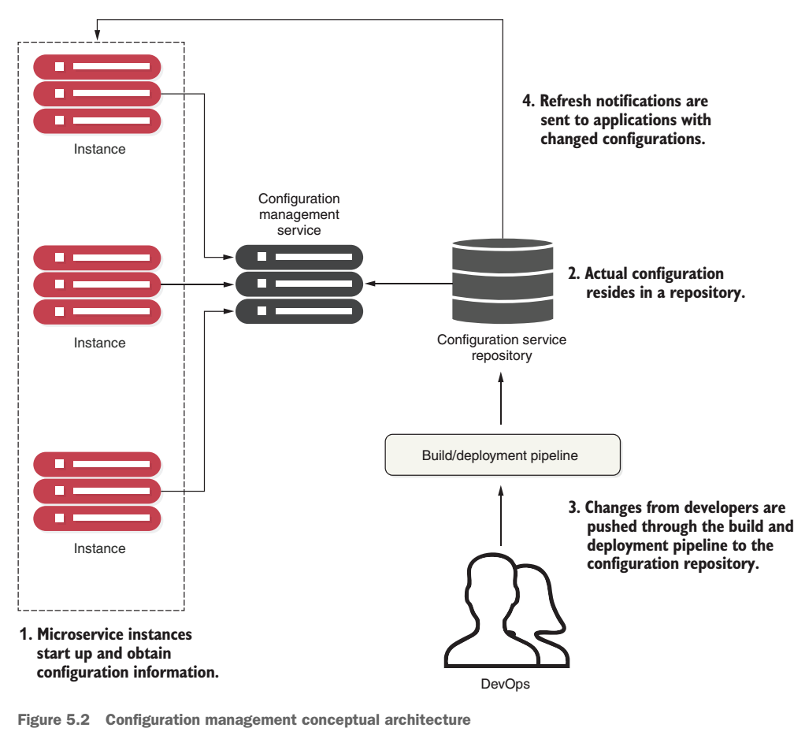

Comparison of various implementations:
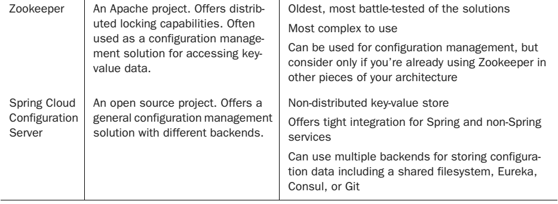

#### Spring Cloud Config Server

Spring uses profiles to launch a service to determine what environment properties are to be retrieved from the Spring Cloud Config service.

The Spring Cloud Config service can use a file-based, Git-based, or Vault-based application configuration repository to store application properties.

The Spring Cloud Config service lets you encrypt sensitive property files using symmetric and assymetric encryption.

Naming conventions are *appname-env.properties* or *appname-env.yml*. The env names translate directly into the URLs that will be accesses to browse the configuration.

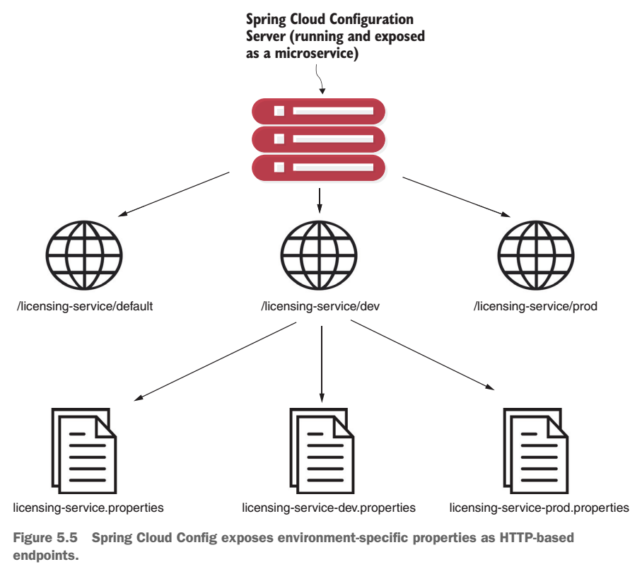

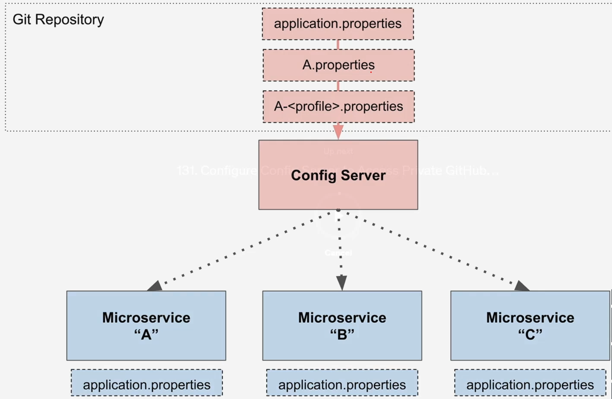

Retrieving config information on service startup:

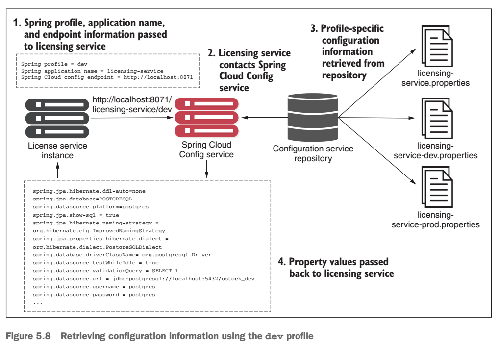

##### Spring Cloud Bus

Update dynamically configuration without restarting services. Need to set up messaging broker (RabbitMQ) for Spring Cloud Bus to push update about config update to other services (when each of this service starts it also connects to RabbitMQ as listener). 

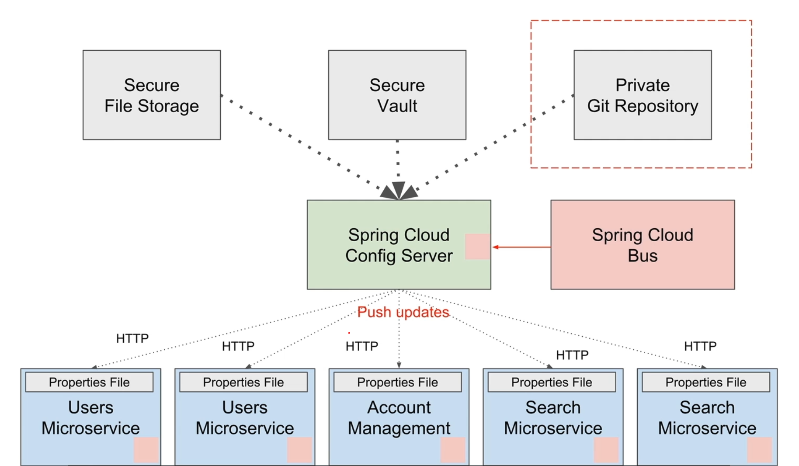

---


### On service discovery

A mechanism for finding the hostname or IP address of where a machine is located - *service discovery*. 

Monolithic approach usually drives development teams down the path of overbuying their capacity needs. Capacity increases come in clumps and spikes and are rarely a smooth, steady process.
Microservices allow us to scale out (horizontally) resources on demand.
Service discovery helps increase application resiliency, because it automatically removes an instance from "healthy list" when it not passes health checks.

##### Legacy way

DNS + network load balancer.

Access service by using a generic DNS (`my.app.com`) along with a path that uniquely represented the service that application want to invoke (`/service1`). The DNS would resolve to commercial or open source load balancer which has a routing table with servers hosting the service. The number of those servers is usually static and persistent (when crashes then restarts to same point). To achieve high availiablity there is secondary idle balancer that may become active when primary dies.  


Drawbacks:

- While the load balancer can be highly available, it's a single point of failure for your entire infrastructure
- Centralizing your services into a single cluster of load balancers limits the ability to scale horizontally load-balancing infrastructure across multiple servers.
  Also, commercial load balancers have restrictive licensing model geared toward a fixed capacity rathen than a more variable model 
- Most traditional load balancers are statically managed, they aren't designed for fast registration and deregistration of services, usually there are centralized databases with routes and proprietary API to somehow change them
- Because a load balancer acts as a proxy to the services, service consumer requests need to have them mapped to the physical services, that translation layer adds complexity  

So in general it's okay to have such approach for some big corporate system with a few static servers, but not for the cloud applications. 

##### Service discovery in the cloud

The solution for a cloud-based microservice environment lies in:

- *Highly available* - need to support "hot" clustering environment where service lookups can be shared across multiple nodes in a service discovery cluster

  > Service dicsovery cluster - group of multiple service discovery instances which have identical configuration and work together to provide availability, reliablity and scalability.

- *Peer-to-peer* - each node in the service discovery cluster shares the state of a service instance

- *Load balanced* - service discovery needs to dynamically load balance requests across all service instances 

- *Resilient* - service discovery's client should cache service information locally. If service discovery dies, application can still function and locate other services (based on locally cache stored info)

- *Fault tolerant* - service discovery need to detect when a service isn't healthy and remove it from a list of available services


##### Client-side load balancing

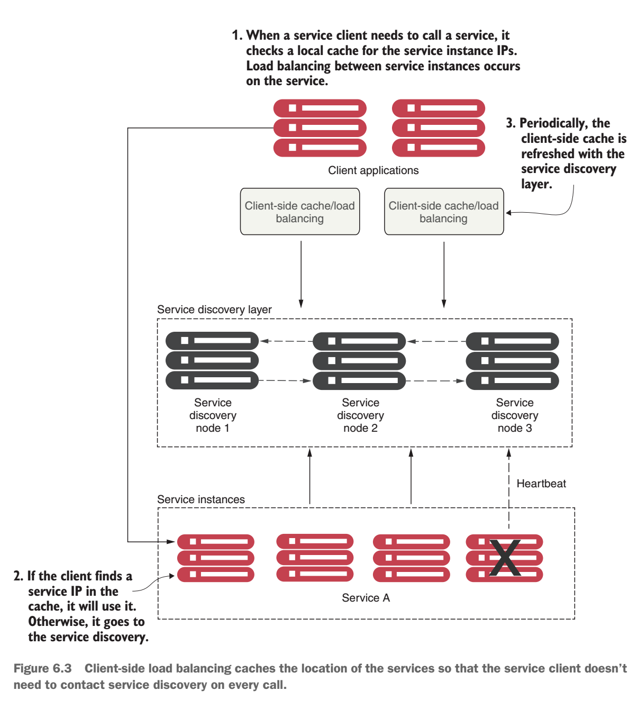

When a consuming client needs to invoke a service

1. It contacts the discovery service for all the instances a service consumer (client) is asking for and then caches data locally on the service consumer's machine.
2. Each time client wants to call the service it looks up the location information for the service from the cache. It will use a simple load-balancing algorithm like the round-robin to ensure service calls are spread across multiple services
3. The client periodically contacts the discovery service and refreshed its cache of service instances. The client cache is eventually consistent, but sometimes there can be errors. If fails, the local service discovery cache is invalidated and client will attempt to refresh its entries from service discovery agent.

##### Implementation notes

You may use 3 different mechanism to invoke a service: 

- Spring Cloud Discovery Client (lowest abstraction, bad to use)
- Spring Cloud Load Balancer and backed RestTemplate (better)
- Netflix's Feign client (best, configure with only annotations but need to handle specific Feign exceptions)

---


### Resiliency patterns with Spring Cloud and Resilience4j

A single, poorly performing service can trigger a cascading effect of resource exhaustion as the threads in the calling client are blocked when waiting for a service to complete.

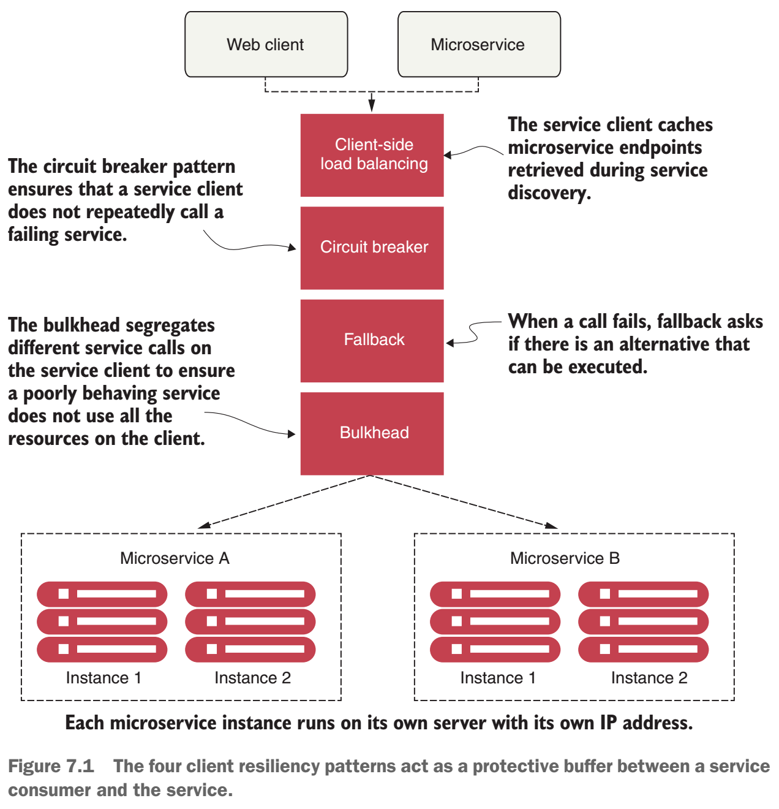

Resilience4j is a fault tolerance library that offers patterns:

- *Circuit breaker* - Stops making requests when an invoked service is failing
- *Retry* - Retries a service when it temprarly fails
- *Bulkhead* - Limits the number of outgoing concurrent service requests to avoid overload
- *Rate limit* - Limits the number of calls that a service receives at a time
- *Fallback* - Sets alternative paths for failing requests

We may combine them, they will have such default order:
```
Retry ( CircuitBreaker ( RateLimiter ( TimeLimiter ( Bulkhead ( Function) ) ) ) )
```

##### Bulkhead pattern

There are 2 implementations:

- *Semaphore bulkhead* - Uses a semaphore isolation approach, limits the number of concurrent requests to the service. Once the limit is reached, it starts rejecting requests
  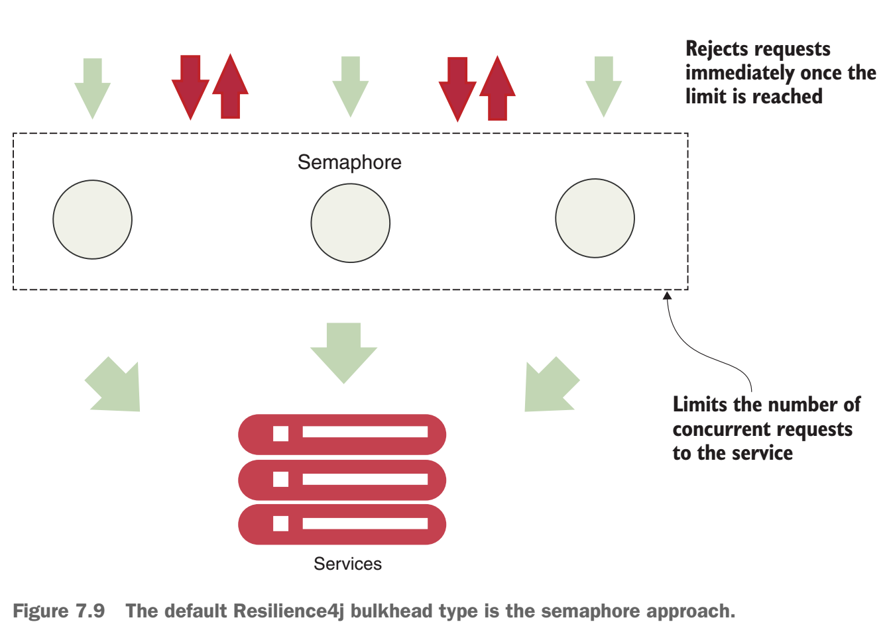

  > Works fine if we have small number of remote resources being accessed within an application, and the call volumes to different services are relatively evenly distributed.
  > If we have services with far higher volumes or longer completion time than other services, we can end up introducing thread exhautstion into our thread pools because one service ends up dominating all of the threads in the default thread pool.

- *Thread pool bulkhead* - Uses a bounded queue and a fixed thread pool. This approach only rejects a request when the pool and the queue are full.

  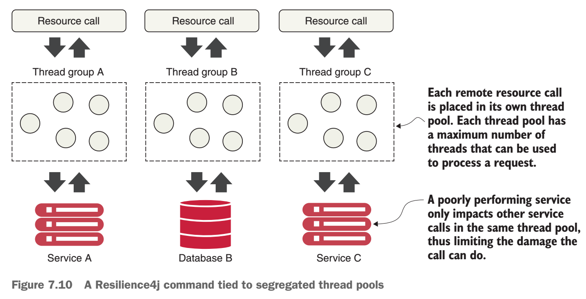

> Proper sizing for a custom thread pool formula:
>
> ```
> (requests per second at peak when the service is healthy * 99th percentile latency in seconds) + small amount of extra threads for overhead
> ```

##### Semaphore vs thread pool

A semaphore is used to limit resources and that resource can be the number of threads. The difference is using a semaphore this way limits the number of threads that’s actively running, not the number of threads created. For example say you are using 10 threads to handle 1000 jobs. Thread 1 finishes first and is destroyed, and then a new thread can be created to handle job 11. At any time there are only 10 threads running, but in the end a total number of 1000 threads are created and destroyed. The thread pool on the other hand, creates only 10 threads. When thread 1 is done, it is not destroyed but then continues to handle the next job. Creating and destroying threads take a lot of time so thread pool is obviously the recommended way to handle situations like this.

---


### Spring Cloud Gateway

Spring Cloud Gateway provides a library for building API gateways on top of Spring and Java. It provides a flexible way of routing requests based on a number of criteria, as well as focuses on cross-cutting concerns such as security, resiliency, and monitoring.

A Spring Cloud Gateway is a *reverse proxy*. A *reverse proxy* is an intermediate server that sits behind the client trying to reach a resource and the resource itself.

> Isn't a service gateway a single point of failure and potential bottleneck? To avoid this need to follow next rules:
>
> - Load balancers are useful when placed in front of individual groups of services. In this case, a load balancer sitting in front of multiple service gateway instances is an appropriate design and ensures that your service gateway implementation can scale as needed. But having a load balancer sitting in front of all your service instances isn't a good idea because it becomes a bottleneck
> - Keep any code you write for your service gateway stateless. Don't store any information in memory for the service gateway. If you aren't careful, you can limit the scalability of the gateway. Then, you will need to ensure that the data gets replicated across all service gateway instances.
> - Keep the code you write for your service gateway light. The service gateway is the "chokepoint" for your service invocation. Complex code with multiple database calls can be the source of difficult-to-track performance problems in the service gateway.

#### Predicate and Filter Factories

Architecture overview:


- Predicates are objects that allows us to check if the requests fulfill a set of given conditions before executing or processing a request.

- Filters alllow us to modify the incoming and outgoing HTTP requests and responses.

- The Spring Cloud Gateway integrates with Netflix's Eureka Server and can automatically map services registered with Eureka to a route.

  > If use automatically locator enabled and try to send request to unvailable service -> 404 error, as Spring Gateway didn't even built such route. However, if routes were built manually then 500 error, when trying to access dead service. 

- With Spring Cloud Config Server, you can dynamically reload the route mappings without having to restart the Gateway server.
- You may create custom business logic with pre- and post-filters
- Pre-filters can be used to generate a correlation ID that can be injected into every service flowing through the gateway
- Post-filters can be used to inject a correaltion ID into every HTTP service responce back to a service client

---


### Securing your microservices

Proper security involves multiple layers of protection, including these:

- *The application layer* - Ensures that the proper user controls are in place so that we can validate that a user is who they say they are (authentication) and that they have permission to do what they're trying to do (authorization)
- *Infrastructure* - Keeps the service running, patched, and up to date to minimize the risk of vulnerabilities
- *Network layer* - Implements network access controls so that a service is only accessible through well-defined ports and only to a small number of authorized servers

OAuth2 is a token-based authorization framework that provides different mechanisms for protecting web service calls. These mechanism are called *grants* (password,).

OpenID Connect (OIDC) is a layer on top of the OAuth2 framework that provides authentication and profile information about who is logged in to the application (identity).

Keycloak is an open source identity and access management solution for microservices and applications.

You should also build your microservices around the following practices:

- Use HTTPS/Secure Sockets Layer (SSL) for all service communications
- Use an API gateway for all service calls
- Provide zones for your microservices by locking down unneeded network ports (inbound and outbound)

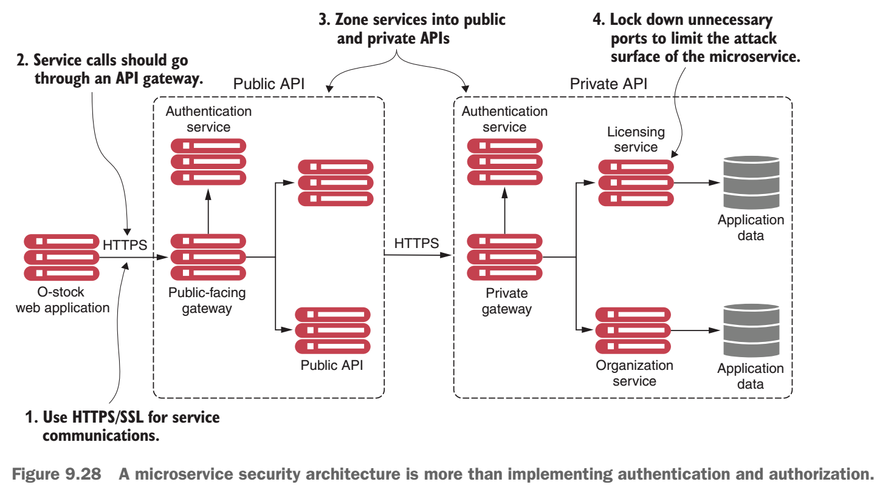

---


### Event-driven architecture with Spring Cloud Stream

Using messaging to communicate state changes between services:

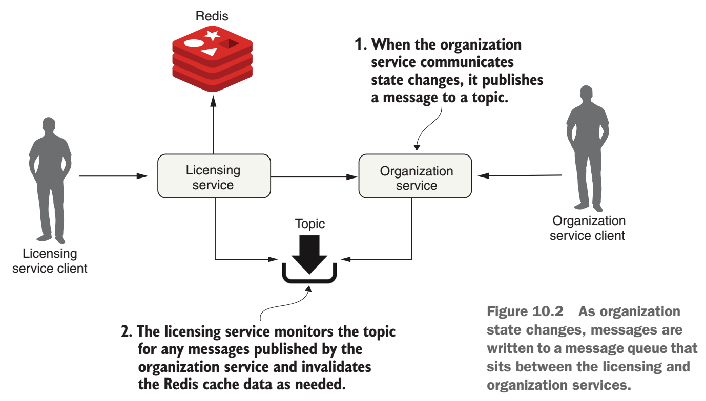

Provides benefits:

- *Loose coupling* - when it comes to communicating state changes between 2 services, neither service knows about each other; so no hard dependencies and tight coupling 

- *Durability* - the presence of queue guarantees that a message will be delivered even if the consumer of the service is down; so if licensing server is down the organization service still works good and sends messages to queue - it doesn't care; it works as well in other way - when organization service is down licence server can still use cache data

- *Scalability* - if a consumer reading a message from the queue isn't processing messages fast enough, it's a trivial task to spin up more consumers and have them process the messages

  > Traditional scaling mechanism for reading messsages in a queue involved increasing the number of threads that a message could process at one time - we are limited by number of CPUs available.

- *Flexibility* - the sender of a message has no idea who is going to consume it, so we can easily add new consumers

Downsides:

- *Message-handling semantics* - need to handle the logic of message order, how it may affect (maybe there should be a strict order), if a message fails do we retry processing the error or let fail? How to handle future messages related to that customer, if one of his messages failed, so we have inconsistent state?
- *Message visibility* - the async nature of messages means they might not be received or processed in close proximity to when the message is published or consumed; having things like correlation IDs is essential for debugging purposes
- *Message choreography* - more difficult to reason through its business logic because its code is no longer processes in a linear fashion - harder to debug

#### Spring Cloud Stream

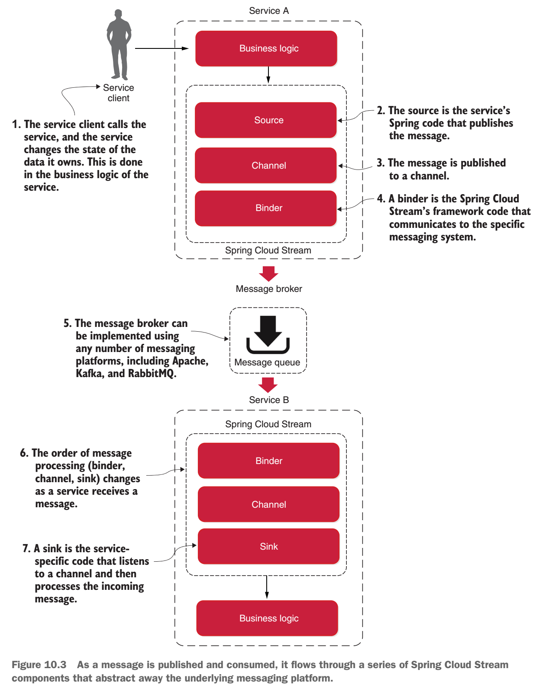

- When a serive gets ready to publish a message, it will publish the message using a *source* - Spring-annotated interface that takes a POJO, which represents the message, serializes it and publishes to a channel

- A *channel* is an abstraction over the queue that's going to hold the message after it's published by a message producer or consumed by a message consumer. We can describe a channel as a queue that sends and receives messages.

  > A channel name is always associated with a target queue name, but that queue name is never directly exposed to the code (only through environmental variables). Instead, the channel name is used in the code, which means we can switch the queues the channel reads or writes from by changing the application configuration, not the application code:
  > ```properties
  > spring.cloud.stream.bindings.output.destination=orgChangeTopic
  > ```

- The *binder* is part of the Spring Cloud Stream framework, that talks to a specific message platform

- When a service receives a message from a queue, it does it through a *sink* - it listens to a channel for incoming messages and deserializes the message back into a POJO object

A Spring Cloud Stream message *source* is an annotated Java method that's used to publish messages to a message broekr's queue.
A Spring Cloud Stream message *sink* is an annotated Java method that receives messages form a message broker's queue.

##### Consumer group

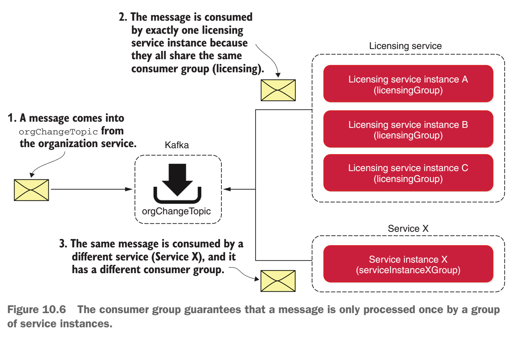

The concept of a consumer group is this: we can have multiple services with each service having multiple instances listening to the same message queue. We want each unique service to process a copy of a message, but we **only want one service instance within a group of service instances to consume and process a message**.
As long as all the service instances have the same group name, Spring Cloud Stream and the underlying message broker will guarantee that only one copy of the message will be consumed by a service instance belonging to that group.


---

### Distributed tracing with Spring Cloud Sleuth and Zipkin

Spring Cloud Sleuth allows us to seamlessly add tracing information (correlation IDs) to our microservices calls.

We integrate our Docker containers with the ELK (Elasticsearch, Logstash, Kibana) Stack. This lets us transform, store, visualise, and query the logging data from our services. 


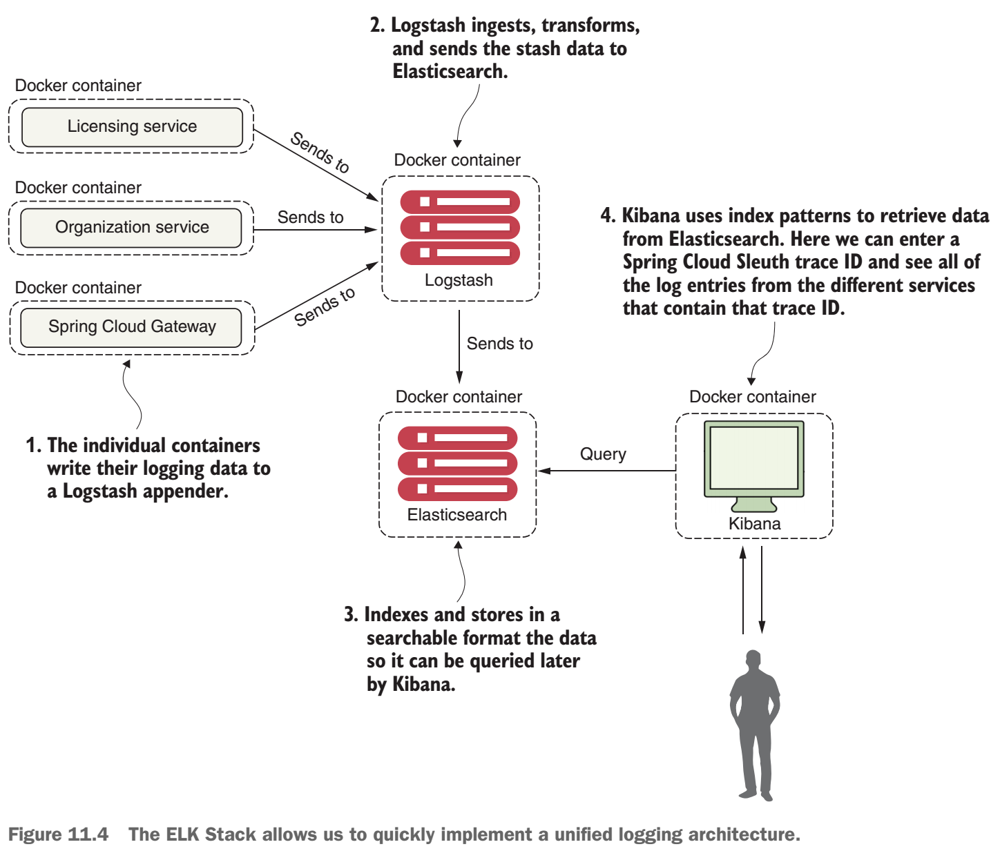

Zipkin allows us to see the dependencies that exist between services and the flow of our transactions, and understand the performance characteristics of each microservice involved in a user's transaction.

Spring Cloud Sleuth easily integrates with Zipkin. 
Sleuth maps each service call to the concept of a span. Zipkin then allows us to see the performance of a span.
Spring Cloud Sleuth and Zipkin let us define our own custom spans so that we can understand the performance of non-Spring-based resources (a database server such as Postgres or Redis).


---

### Deplyoing shite

