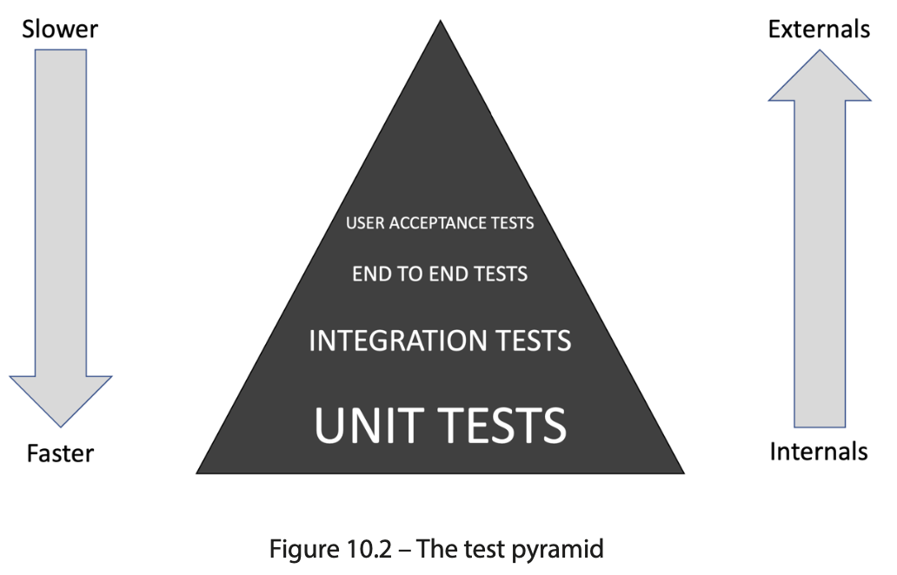
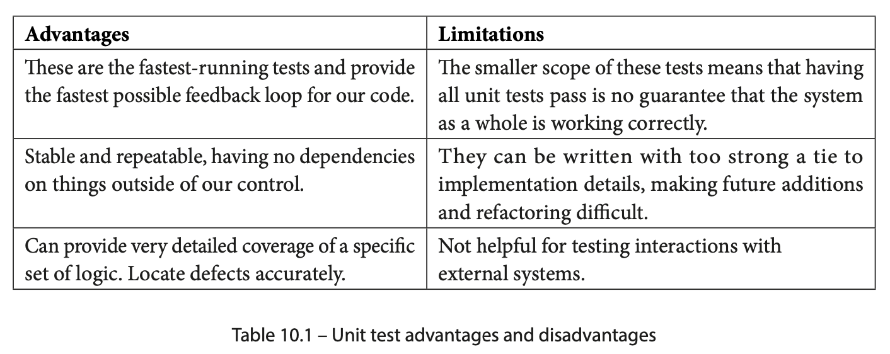
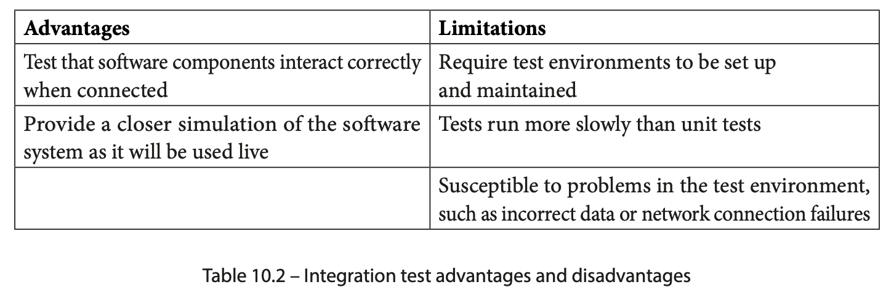
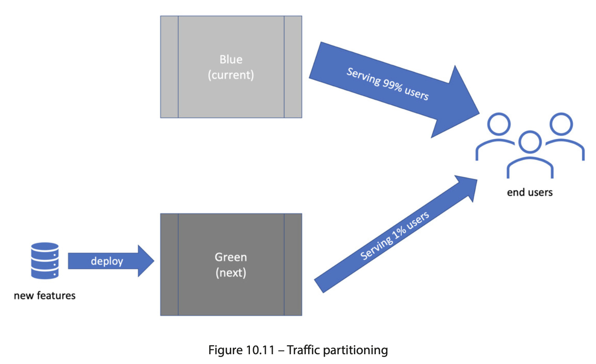
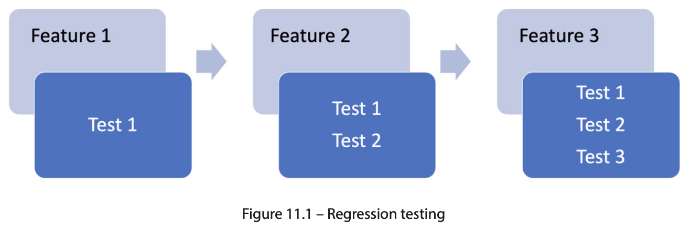
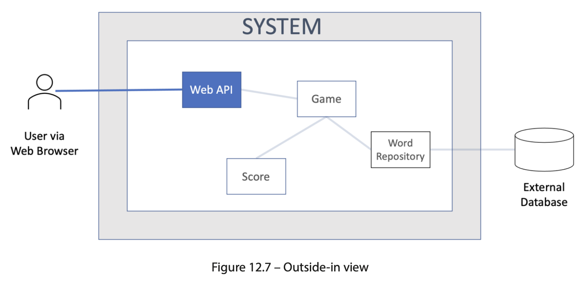

## TDD with Java

[:arrow_backward:](backend_index)

[toc]

##### Benefits of writing tests before implementing

- Revealing design flaws
  strive with *outside-in* thinking - consider the usage of the code from outside callers before we consider any inside implementation
- When writing tests after implementation:
  - Missing tests - undetected error
    we write tests after implementation and forget about some edge conditions, just because we didn't thought about it when writing code and having a lots of ideads; if we would write tests before then we could think only about design and possible conditions
  - Leaky abstractions - exposing irrelevant things
    focus too much on the inside of the method and also forget about the initial design = high level abstractions are mixed together with low level, creating coupling; 

- Preventing logic flaws - did it work right?
  manual testing can reveal these logic flows but manual test plans are fragile (more expensive), better to automatize it with code tests
- Protecting against future defects
  team has the confidence to make changes safely, with confidence, and know they have tests automatically looking after them - this is true agility, the freedom to change
- Documenting our code
  tests are like documentation for developers, they should be as close as possible to them; the worst documentation is often contained in the glossiest productions (these artifacts was created a long time ago by teams with separate skillsets - copywriting, graphic design and so on, which is not maintainable)

##### FIRST

- Fast
- Isolated
- Repetable
- Self-veryfying
  step of veryfying whether the outputs are expected should be automated
- Timely

##### Learning from our tests

- messy Arrange step
  too many parameters in a constructor or too many optional parameters left as null, too many dependencies injected, to many primitive data to pass
- messy Act step
  unclear parameters we pass, when act step requires multiple calls to made in some order (that's error-prone and bad)
- messy Assert step
  whether the results are difficult to use, return some code smells

> Must we stick to one test class per production class?
>
> No, and this is a common misunderstanding when using unit tests. The goal of each test is to specify and run a behavior. This behavior will be implemented in some way using code – functions, classes, objects, library calls, and the like – but this test in no way constrains how the behavior is implemented. Some unit tests test only one function. Some have one test per public method per class. Others give rise to more than one class to satisfy the test. 

##### RGR

Once we have written our test, we turn to creating the code that is inside our object - the private fields and methods, use RGR (Red, Green, Refactor) for that. This is a three-step process that helps us to build confidence in out test, create a basic implementation of our code, and then refine it safely.

**Red phase** - use AAA template to get our test up and running and ready to test the code we will write next.

**Green phase** - write the code that will make test pass, called production code.

- Use the simplest code that could possibly work - at this stage our goal is to get the test to pass and nothing more
- Don't overthink the implementation details - no need to create a perfect code on first attempt, as we will improve this code in the next step

**Refactoring** - refine that passed code into clean code, may use:

- Extracting a method to remove duplicated code
- Renaming a method to express what it does better
- Renaming a variable to express what it contains better
- Splitting a long method into several smaller ones
- Extracting a smaller class
- Combining a long parameter list into its own class

Remember to keep that green test passing throughout these changes!

##### Using mocks and stubs

**Stubs** are useful whenever our SUT (System under test) uses a *pull model* of collaborating. Use DI and dependency injection to plug in (*wiring*) stub object instead of production one (some db object, call to third party service). 

Some objects use *push model*, when calling a method on our SUT, we expect it to call another method on some other object. Our test must confirm that some method was called with proper parameters. For that we use **mock objects**, they record interactions.

> Stub provides a simple, pre-determined response to a function call, while a mock is a more complex object that can be used to verify that the code being tested interacts correctly with it.

##### When not to use mocks

- Avoiding the overuse of mock objects

  > Test verifies *behaviors* and is independent of *implementation*.

  It's easy to create a mock for an implementation details, not abstraction - don't do this; once a test is coupled to an implementation then changing the impl requires change to the test - but test should really pass without any changes

- Don't mock code you don't own
  There is a third-party library class that we may mock but after version update the test may still run (as we mocked the change) but won't compile; a good aproach is to wrap the third-party library, and place it behind an interface to invert the dependency on it, isolating it fully

- Don't mock value objects 
  Value objects just hold values, we should easily create them so no mocking required

- You can't mock without dependency injection
  If in production code we are creating real object without injections then we cannot test it; better to redesign and allow injection

- Don't test the mock
  *Testing the mock* describes a test with too many assumptions built into a test double. If the stub is very hard, in a future it can result in an invalid test that passes but with stubbed responses that can no longer happen in reality
  SUT may not have any real logic inside, so no point in writing a unit test at this level 

##### When to use mocks

- Requesting an action from a remote service, such as sending an email to a mail server
- Inserting or deleteing data from a db
- Sending a command over a TCP socket or serial interface
- Invalidating a cache
- Writing logging information either to a log file or distributing logging endpoint

##### Hexagonal architecture

Isolating of our core application logic from technical stuff = decoupling external systems from our domain code using the Dependency Inversion principle = Hexagonical architecture (ports and adapters technique).
Hexagon shape has sides, and each side represents one external system.

4 spaces:

- External systems like web browsers, db, other computing services

- Adapters implement the specific APIs required by the external systems (technical specific)

  > Adapters encapsulate all the knowledge our system needs to interact with an external system – and nothing else. This knowledge is defined by the external system’s specifications. Some of those may be designed by ourselves.

- Ports are abstraction of what our application needs from the external system (domain specific)

  > Ports use dependency inversion to isolate our domain code from knowing any details about the adapters.
  >
  > Ports provide a logical view of what our application needs from an external system, without constraining how those needs should be met technically.

- The domain model contains our app logic, free of external system details

  > The domain model contains code that describes how the user’s problem is being solved. This is the essential logic of our application that creates business value.

The golden rule - the domain never connects directly to adapters.

As a bonus, we isolate ourselves from future changes in those external systems, limiting the amount of rework that would be required to support new technologies

We can easily replace ports with test doubles. Benefits:

- Write TDD tests first with ease
- Gain FIRST unit test benefits
- It unlocks our team - build the core logic of our system without having to wait for test envs to be designed and built

##### Unit testing bigger units

The combined approach of designing with the hexagonal architecture and testing behaviors instead of implementation details leads to an interesting system layering. Instead of having traditional layers, as we might do in a three-tier architecture, we have circles of increasingly higher-level behavior. Inside our domain model, we will find those tests-in-the-small. But as we move outward, toward the adapter layer, we will find bigger units of behavior.

Think of tests as covering behavior - entire user stories, better confirms that our core logic is correct.

> Traditionally, testing user stories involved slower integration tests in a test environment. The hexagonal architecture enables unit tests to replace some of these integration tests, speeding up our builds and providing greater repeatability of our testing.

##### When not to use hexagonal architecture

When we have no real logic in our domain model. This is common for very small CRUD microservices that typically frontend a database table. With no logic to isolate, putting in all this code has no benefit. We may as well do TDD with integration tests only and accept that we won’t be able to use FIRST unit tests.

##### Test pyramid

**Unit tests** only test components of our domain model.

**Integration tests** exist to test that our code will successfully integrate with external systems.

##### Consumer-driving contarct testing

We consider our code as having a contract with the external service. We agree to call certain API functions on the external service, supplying data in the form required. We need the external service to respond to us predictably, with data in a known format and well-understood status codes. This forms a *contract* between the two parties – our code and the external service API.

A contract test is two tests:

- One confirms that the outside interface is compatible with our code

  > We may generate a stub of the external service and use it as a test double as we write our adapter code. We test our adapter logic without accessing the external system - verify that it sends appropriate request and handle response correctly.

- Other confirms that the implementation of that interface works and gives the expected results

  > Run tests against the real external service - possibly in sandbox mode (if we cannot run live-like external service locally). We are not testing the functionality of the external service - we are verifying that we believe about its API is true.

##### End-to-end and user acceptance tests

We start up the software fully configured to run in its most live-like test environment, or possibly in production. The system is tested as whole from one end to the other.

One specific use of an end-to-end test is for **user acceptance testing (UAT)**. This is often a contractual stage in commercial development, where the software buyer agrees that the development contract has been satisfied. It's still end-to-end testing.

The goal is not to verify the behaviors we already tested (unit+integration) but to verify that we have injected the correct production objects, confirming that the system as a whole behaves correctly when connected to prod services.

Those tests have legal contract nature: *Have we built what was asked of us?* With iterative approach we should achieve that.

> May use RestAssured as a tool for HTTP testing.

##### CI/CD

- CI stands for **continuous integration**
  Integration is where we take individual software components and join them together to make a whole. CI means we do this all the time as we write new code.
- CD stands for either **continuous delivery** or **continuous deployment** 
  The idea is that we are taking the latest and greatest version of our integrated software and delivering it to a stakeholder. The goal of continuous delivery is that we could – if we wanted to – deploy every single code change to production with a single click of a button.

The idea if **integration** is fundamental to building software as we in solo or in a team are building something from block components (code blocks, features, services) and then integrating - bringing together as a whole.

- **Continuous delivery**

  We deliver software to internal stakeholders, such as product owners and QA engineers

- **Continuous deployment**

  We deliver software into production and to end users

Types of production deployments:

- Blue-green deployment
  
  Once the code has been deployed to the green group, we switch over the production configuration to connect to green group servers. We retain the previous working production code on the blue servers. If our testing goes well against the green group, then we’re done. Production is now working with the latest green group code. If the testing fails, we revert that configuration to connect to the blue servers once again. It’s a fast rollback system that enables our experimentation.
- Traffic partitioning
  Limit the amount of traffic that we send to our test servers
  

##### Exploring TDD with QA

The main manual steps we replace with automation are feature testing during development and regression testing before release. TDD replaces test plans written in a word processor with test code written in an IDE.

The biggest threat to our sucess with TDD lies in our ability to think about all the conditions our software needs to handle. Automated tests cannot:

- Ask a stakeholder what they want the software to do
- Spot a missing test

**Manual exploratory testing** helps with it.

TDD is primarly concerned with the design of our code, but not with the implementation. For us, software developers, we need **code reviews**, **pair programming**, **ensemble (mob) programming** with other teammates and **static code analysis tools** such as SonarQube.

> Difference is that a code review happens after the code is written (frequently happen to late to allow meaninful changes to be made) but pair programming and mobbing (when the whole team is developing) happen while the code is being written (changes are made the instant they are identified).

Other types of manual testing:

- **User interface** 
- **User experience testing**
- **Security testing** (penetration testing)
- **Operations monitoring** 

##### Test First, Test Later, Test Never

Coding Arrange step helps us think:

- What configuration data will be needed?
- What connections to other objects or function will be needed?
- What behavior should this code provide?
- What extra inputs are needed to provide that behavior?

Coding Act step recommendations:

- The method name should describe the outcome of calling the method.
- Pass in as few parameters as possible. Possibly group parameters into their own object.
- Avoid Boolean flags that modify the behavior of the code. Use separate methods with appropriate names.
- Avoid requiring multiple method calls to do one thing. It is too easy to miss out on an important call in the sequence if we are unfamiliar with the code.

The code in our Assert step is the first consumer of the results of our code. If the result is easy to obtain then good.

About test-later:

- Test-later makes it harder to test every code path
- Test-later makes it harder to influence the software design
  - It gets harder to incorporate feedback, after writing a lot of code we just may leave it as it is (even if it's bad)
- Test-later may never happen

##### Inside-out development

One place to start building, then, is on the *inside* of this software system. Starting with an overall user story, we can imagine a small component that is likely to be of use to us. We can begin our TDD efforts around this component and see where that leads us. This is a bottom-up approach to the design, composing the whole from smaller parts.

Advantages:

- **Quick start to development**: no setup for user interfaces, web service stubs, or databases - just dive right in and code 
- **Good for known designs**: as we gain experience, we recognize some problems as having known solutions (can use some design patterns)
- **Works well with hexagonal architecture**

Disadvantages:

- **Possibility of waste**: maybe the component we creates firstly won't be needed at all
- **Risk of implementation lock-in**: always a temptation to keep using a component we wrote earlier even if it no longer fits as well, just because we investend time and money in it

Inside-out works well with the domain model.

##### Outside-in development

Outside-in TDD begins with the external users of the system. They may be human users or machines, consuming some API offered by our software. This approach to TDD begins by simulating some external input, such as the submission of a web form.

The test will typically use some kind of test framework – such as Selenium or Cypress for web applications – that allows the test to call up a specific web view, and simulate typing text into fields, then clicking a submit button. We can then make this test pass in the normal way, only we will have written some code that directly deals with the input from a user this time. In our hexagonal architecture model, we will end up writing the user input adapter first.

Advantages:

- **Less waste**: Outside-in TDD encourages a quite minimal approach to satisfying external behavior. The code produced tends to be highly customized to the application at hand.
- **Delivers user value quickly**: Because we start from a test that simulates a user request, the code we write will satisfy a user request. We can deliver value to users almost immediately.

Disadvantages:

- **Fewest abstractions**: On a related note, when writing the minimum code necessary to make a test pass, outside-in TDD may lead to application logic being present in the adapter layer. This can be refactored later but can lead to a less organized code base.
- **Inverted test pyramid**: If all our TDD test efforts focus on the external responses, they are, in fact, end-to-end tests. This opposes the recommended pattern of the test pyramid, which prefers faster unit tests inside the code base. Having only slower, less repeatable end-to-end tests can slow development.

Outside-in works well with adapters.

##### User stories can be tested across the domain model

