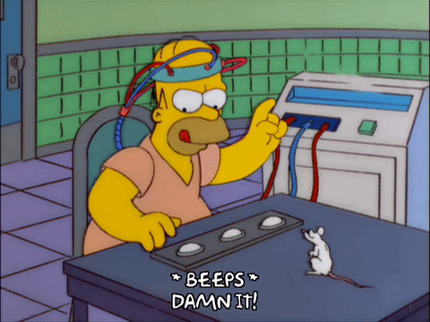

## :thinking: data science

[:arrow_backward:](../index)

#### NLP [HERE](nlp/index) :arrow_backward::scream::heavy_heart_exclamation::heavy_exclamation_mark:

#### Andrew Ng Machine Learning course :arrow_down_small:

  :straight_ruler: [Linear Regression](machine learning/andrew ng ml course/linear_regression) 
​		*(model representation, cost function, gradient descent, normal equation)*	

​	:bulb: [Logistic Regression](machine learning/andrew ng ml course/logistic_regression) 
​		*(hypothesis, cost function, multiclass classification: one-vs-all)*

​	:policeman: [Overfitting & Regularization](machine learning/andrew ng ml course/overfitting_regularization)
​		*(problem of overfitting, cost function, regularized linear and logistic regression)*

​	:monkey: [Neural Networks](machine learning/andrew ng ml course/neural_networks)
​		*(neural network representation and learning, backpropagation algorithm)*

​	:older_man: [Advice for applying ML](machine learning/andrew ng ml course/advice_applying_ml)
​		*(evaluating hypothesis, model selection, diagnosing bias vs. variance, learning curves, decision process, error analysis, skewed classes)*

​	:classical_building: [Support Vector Machines](machine learning/andrew ng ml course/support_vector_machines)
​		*(optimization objective, large margin, SVM decision boundary, SVM in practice)*

​	:monkey_face: [Kernels](machine learning/andrew ng ml course/kernels)
​		*(training model using gaussian kernel)*

​	:cat2: [Unsupervised Learning](machine learning/andrew ng ml course/unsupervised_learning)
​		*(k-means algorithm)*

​	:champagne: [Dimensionality Reduction](machine learning/andrew ng ml course/dimensionality_reduction)
​		*(principal component analysis)*

​	:ghost: [Anomaly Detection](machine learning/andrew ng ml course/anomaly_detection)
​		*(detection system, mutlivariate gaussian distribution, collaborative filtering)*

​	
