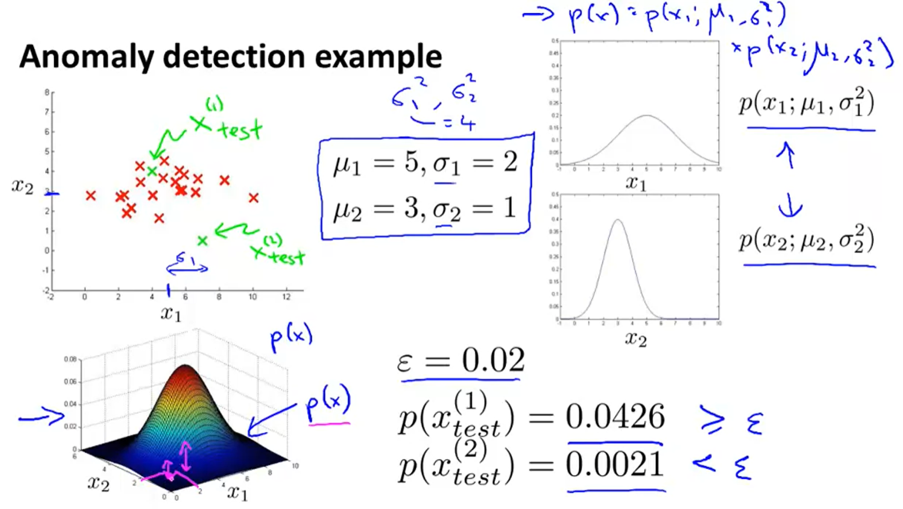
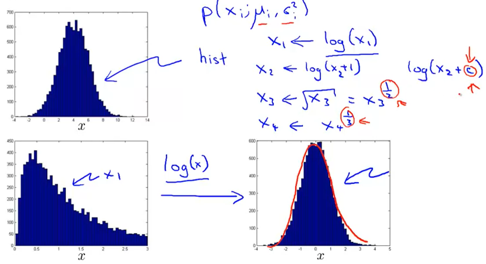
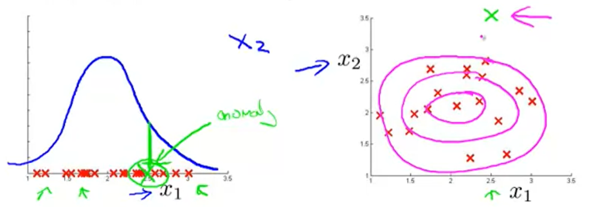
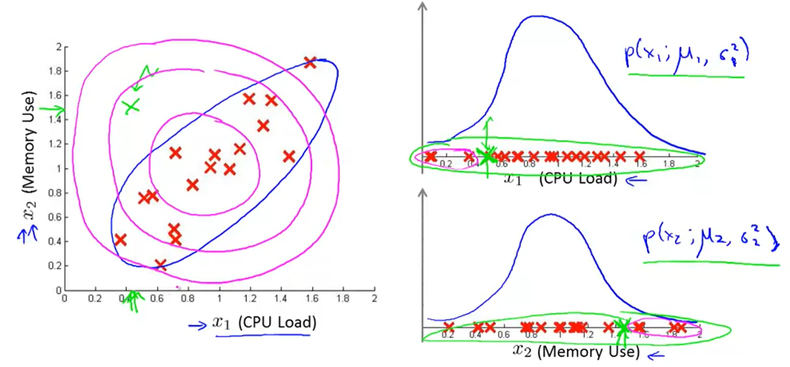
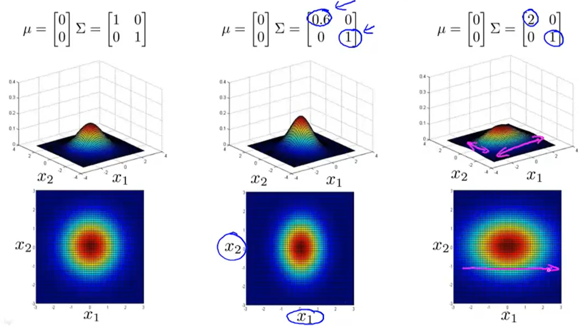
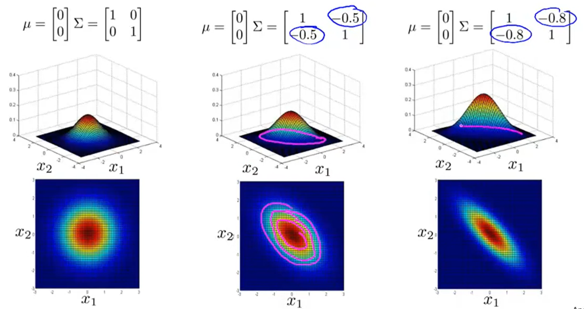
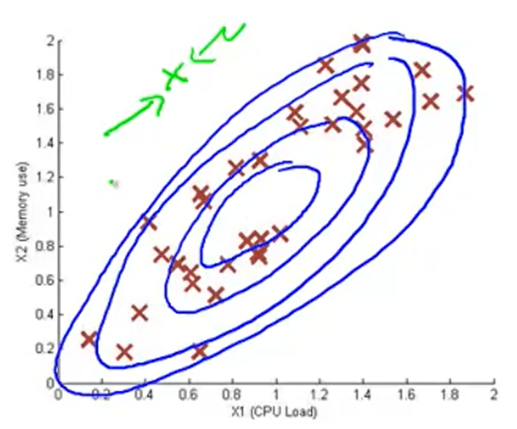
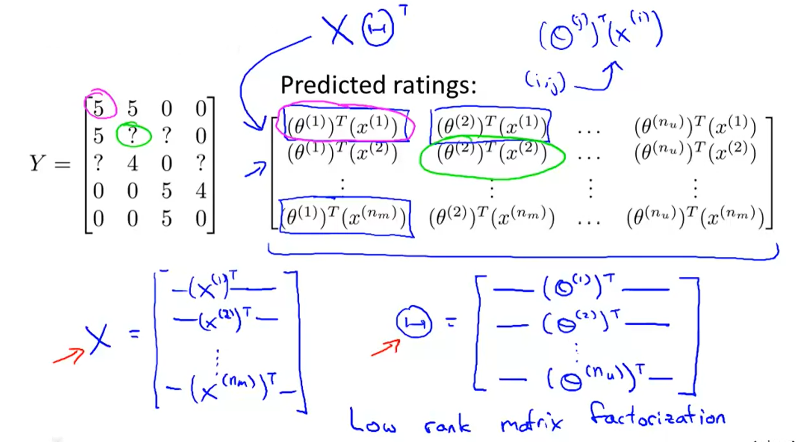

## :ghost: Anomaly Detection

[:arrow_backward:](../../ds_index)

[toc]

### 1. Building an Anomaly Detection System

#### Anomaly detection algorithm

1. Choose features $x_{i}$ that you think might be indicative of anomalous examples

2. Fit parameters $\mu_{i}...,\mu_{n},\ \sigma_{1}^2,...,\sigma_{n}^2$
   $$
   \mu_{j} = \frac{1}{m} \sum_{i=1}^{m}x_{j}^{(i)} \\
   \sigma_{j}^{2} = \frac{1}{m} \sum_{i=1}^{m}(x_{j}^{(i)} - \mu_{j})^2
   $$

3. Given new example $x$, compute $p(x)$:
   $$
   p(x) = \prod_{j=1}^{n}p(x_{j};\mu_{j},\sigma_{j}^{2}) = \prod_{j=1}^{n} \frac{1}{\sqrt{2\pi}\sigma_{j}} exp (-\frac{(x_{j}-\mu_{j})^2}{2\sigma_{j}^{2}})
   $$
   Anomaly if $p(x) < \epsilon$.

#### Developing and Evaluating an Anomaly Detection System

Algorithm evaluation:
	Fit model $p(x)$ on training set $\{x1,..., x(m)\}$
	On a cross validation/test example x, predict
$$
y = \left\{ \begin{array}{}
1 &  \ \text{if} \  p(x) \lt \epsilon \\
0 &  \ \text{if} \ p(x) \geqslant \epsilon  
\end{array} \right.
$$
Possible evaluation metrics:

- True positive, false positive, false negative, true negative
- Precision/Recall
- $F_{1}$-score

Classification accuracy is a bad method for measuring algorithm's performance because of skewed classes (so an algorithm that **always** predicts $y=0$ will have high accuracy).

> Classification accuracy is a metric that summarizes the performance of a classification model as the number of correct predictions divided by the total number of predictions.

Can also use cross validation set to choose parameter $\epsilon$.

#### Anomaly detection vs. Supervised learning

Pluses for **anomaly detection**:

- very small number of positive examples ($y=1$) and large number of negative (y=0);
- many different "types" of existing or new anomalies with inability to learn all of them from positive examples;

Use-cases: fraud detection, manufacturing (aircraft engines), monitoring machines in a data center.

Pluses for **supervised learning**:

- large number of positive and negative examples;
- enough positive examples from training set to get a sense what future examples will be;

Use cases: email spam classification, simple weather prediction, cancer classification.

#### Choosing features to use

- check if existing features are gaussian, because maybe there are non-gaussian (plot hist to check). If it not looks like gaussian then try changing $x \to log(x)$ or other variants to reach gaussian look for $x$ hist:

  

- error analysis for examining one known anomaly and trying to come up with a new feature so we could identify this anomaly with an algorithm:

  

- choose features that might take on unusually large or small values (we can also define them).

---

### 2. Multivariate Gaussian Distribution

**Problem:** when computing $p(x)$'s we do it separately for each feature and because of that sometimes it's impossible to identify anomalies when some features intersect:

**Solution:** $x \in \mathbb{R}^{2}$. Don't model $p(x_{1}), p(x_{2}),...,$ etc. separately.
Model $p(x)$ all in one go.
Parameters: $\mu \in \mathbb{R}^{n}, \Sigma \in \mathbb{R}^{n\times n} $ (covariance matrix)

Changing $\mu$ will shift the center location of our distribution.

#### Anomaly detection using the Multivariate Gaussian Distribution

Parameters $\mu, \Sigma$
$$
p(x;\mu,\Sigma) = \frac{1}{(2\pi)^{\frac{n}{2}}|\Sigma|^\frac{1}{2}}exp(-\frac{1}{2}(x-\mu)^T\Sigma^{-1}(x-\mu))
$$

1. Fit model $p(x)$ by setting
   $$
   \mu=\frac{1}{m} \sum_{i=1}^{m} x^{(i)} \\
   \Sigma = \frac{1}{m}\sum_{i=1}^{m}(x^{(i)} - \mu)(x^{(i)} - \mu)^T
   $$

2. Given a new example $x$, compute
   $$
   p(x;\mu,\Sigma) = \frac{1}{(2\pi)^{\frac{n}{2}}|\Sigma|^\frac{1}{2}}exp(-\frac{1}{2}(x-\mu)^T\Sigma^{-1}(x-\mu))
   $$

3. Flag an anomaly if $p(x) < \epsilon$.

Below we can see ranges of model distribution and $x$ example that now identifies as anomaly:

#### Original model vs. Multivariate Gaussian

| Original model                                               | Multivariate Gaussian                                |
| ------------------------------------------------------------ | ---------------------------------------------------- |
| Manually create features to capture anomalies where $x_{1}, x_{2}$ take unusual combinations of values | Automatically captures correlations between features |
| Computationally cheaper (alternatively, scales better to large $n$) | Computationally more expensive                       |
| OK even if $m$ (training set size) is small                  | Must have $m>n$, or else $\Sigma$ is non-invertible  |

---

### 3. Collaborative filtering

Given  $x^{1},...,x^{(n_{m})}$ can estimate $\theta^{(1)},...,\theta^{(n_{u})} $ and it's possible to do this reversed way.

##### Collaborative filtering algorithm

1. Initialize $x^{(1)},...,x^{(n_{m})}$, $\theta^{(1)},...,\theta^{(n_{u})} $ to small random values.

2. Minimize $J(x^{(1)},x^{(n_{m})}$, $\theta^{(1)},...,\theta^{(n_{u})}) $ using gradient descent (or some advanced algorithm):
   $$
   x^{(i)}_{k} := x^{(i)}_{k} - \alpha (\sum_{j:r(i,j)=1}^{}((\theta^{(j)})^{T}x^{(i)}-y^{(i,j)})\theta^{(j)}_{k}+\lambda x^{(i)}_{k})
   \\
   \theta^{(j)}_{k} := \theta^{(j)}_{k} - \alpha (\sum_{j:r(i,j)=1}^{}((\theta^{(j)})^{T}x^{(i)}-y^{(i,j)})x^{(i)}_{k}+\lambda \theta^{(j)}_{k})
   $$

3. For a user with parameters $\theta$ and learned features $x$, predict a star rating of $\theta^Tx$.

##### Low rank matrix factorization

It's very similar to collaborative filtering but vectorized.
