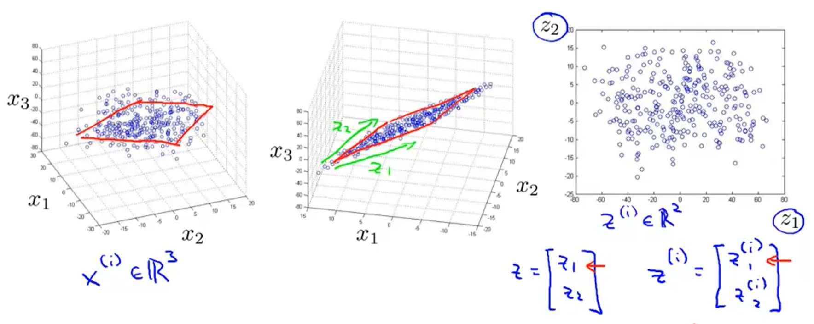
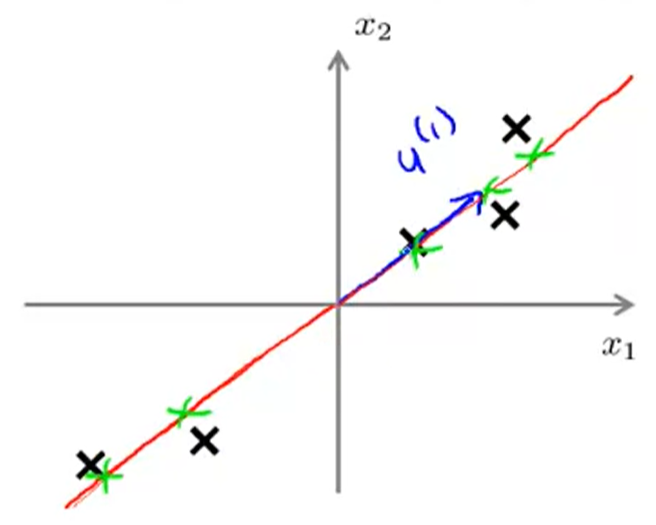
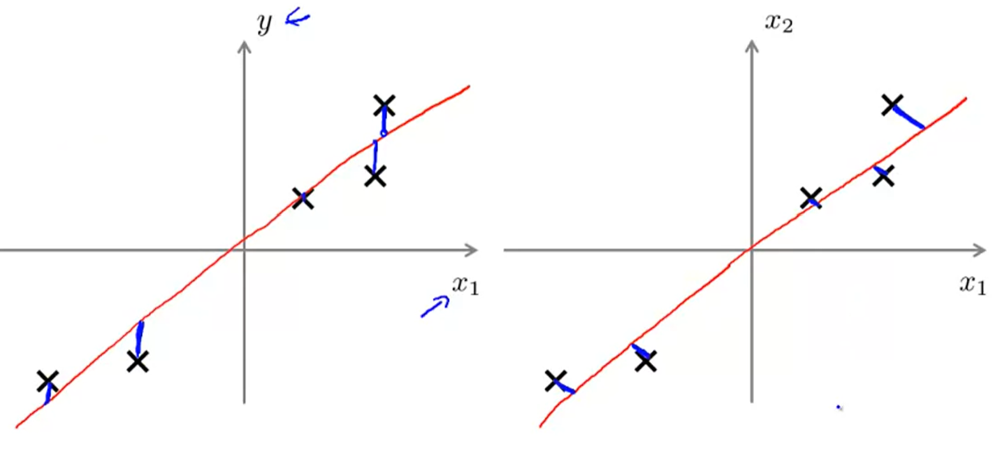

## :champagne: Dimensionality Reduction

[:arrow_backward:](../../ds_index)

Very often there can be very dependant features (like $x_1$ in cm and the same value $x_2$, but in inches) that are redundant. We can reduce them to new feature $z$ and improve our training set quality, reduce memory/disk needed to store data and speed up the learning algorithm.

Visualization of how we can reduce data from 3D to 2D:



[TOC]

#### Principal Component Analysis

We use PCA for finding a lower dimensional surface efficiently. 
Problem: reduce from 2-dimension to 1-dimension. Solution: Find a direction (vector $u^{(1)}$) onto which to project the data so as to minimize the projection error:



>PCA is not a linear regression:
> 
> On linear regression plot (left side) our points are squared magnitude distance from a line (not the shortest distance for each point to line) whereas PCA tries to find the shortest magnitudes from points to the line (right side).


##### PCA algorithm

Data preprocessing (important to perform mean normalization and feature scaling if possible)
Reduce data from $n$-dimensions to $k$-dimensions
Compute "covariance matrix":

$$\Sigma = \frac{1}{m}\sum_{i=1}^{n}(x^{(i)})(x^{(i)})^T$$

Compute "eigenvectors" of matrix $\Sigma$:

```[U, S, V] = svd(Sigma)```


##### Choosing the number of principal components $k$

Try PCA with different $k$ to recieve a smallest value of
$$
\frac{average \ squared \ projection \ error}{total \ variation \ in \ the \ data} \le 0.01
$$
"99% of variance is retained".

This is quite inneficient process. Another way is to retrieve ```S``` param from the result of ```svd``` function and do much cheapear calculation with the same checking:
$$
\frac{\sum_{i=1}^{k}S_{ii}}{\sum_{i=1}^{m}S_{ii}} \ge 0.99
$$

##### Advice for applying PCA

**Bad** use of PCA: to prevent overfitting
(use $z^{(i)}$ instead of $x^{(i)}$ to reduce the number of features to $k<n$).
Use regularization **instead**.
