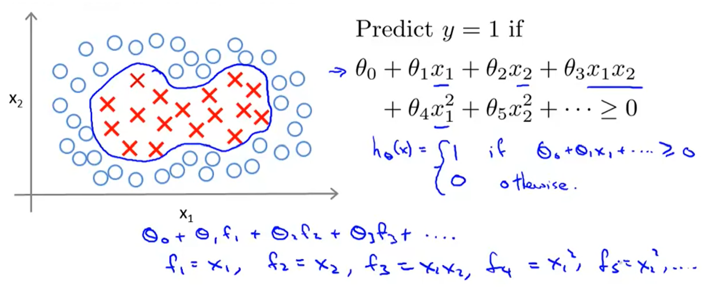
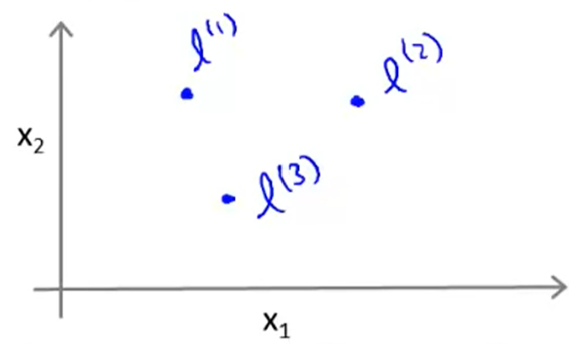
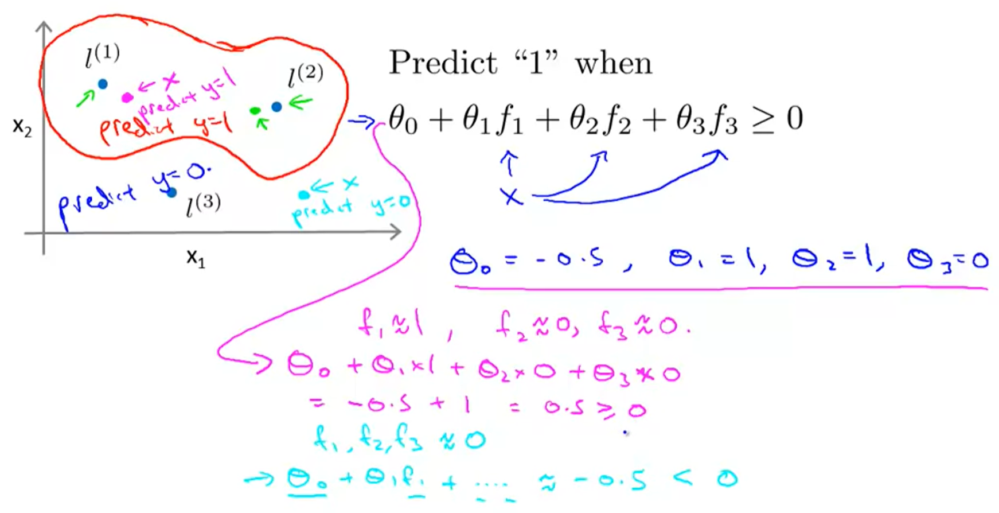
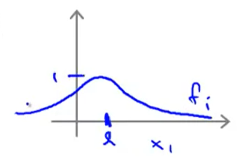

## :monkey_face: Kernels

[:arrow_backward:](../../ds_index)

Often for finding non-linear decision boundary to distinguish positive and negative examples the choice of a complicated polynomial regression isn't the best. We need to come up with another hypothesis, so for example let's define new $f$ parameters: 

$f$ parameters come from $similarity$ function that we compute with given $x$ to compute how close they are to landmarks $l^{(1)}, l^{(2)}, l^{(3)}$:

$f_1 = similarity(x, l^{(1)}) \\ f_2 = similarity(x, l^{(2)}) \\ f_3 = similarity(x, l^{(3)})$

$similarity$ is a kernel function, in our case Gaussian kernels (there can be other variants). Consider $f_1$ example:

$f_1 = similarity(x, l^{(1)}) = \exp \left( \cfrac{\| x - l^{(1)} \|^2 }{2 \cdot \sigma^2} \right)$

If $x ≈ l^{(1)}$: 

​	$f_1 ≈ \exp(- \frac{0^2}{2\sigma^2}) ≈ 1$

If $x$ if far from $l^{(1)}$:

​	$f_1 ≈ \exp(- \frac{(large \ number)^2}{2\sigma^2}) ≈ 0$

We have calculated if our $x$ is close to landmark $l^{(1)}$ (so our $f_1$ is close to 1) or far from it ($f_1$ close to zero). So each of our landmark $l$ defines new feature $f$.

##### How it works in action

#### Training model using kernel

##### Choosing landmarks & getting feature:

Suppose we have $m$ training examples and for each example we will put a landmark at exactly the same location.

For training example ($x^{(i)}, y^{(i)}$):
		   	$f_1^{(i)}$ = $sim(x^{(i)}, l^{(1)})$
$x^{(i)}$ $\rightarrow$   $f_2^{(i)}$ = $sim(x^{(i)}, l^{(2)})$   $\rightarrow$   $f^{(i)}$ (we also add extra feature $f_0=1$) 
			   $...$		  	 
			  $f_m^{(i)}$ = $sim(x^{(i)}, l^{(m)})$

##### Getting $\theta$:

$$
\min_{\theta}  C \sum_{i = 1}^{m} \left [ y^{(i)} \cdot \text{cost}_{1}(\theta^T f^{(i)}) + (1 - y^{(i)}) \cdot \text{cost}_{0}(\theta^T f^{(i)})    \right]  + \cfrac{1}{2} \sum_{j = 1}^{n} \theta_j^2 \ \ \ (n=m)
$$

##### SVM parameters:

- large C ($=\frac{1}{\lambda}$): lower bias, high variance;
- small C: higher bias, low variance;
- large $\sigma^2$: features $f_i$ vary more smoothly,
  higher bias, lower variance:
  
- small $\sigma^2$: features $f_i$ vary less smoothly,
  lower bias, higher variance:
  

