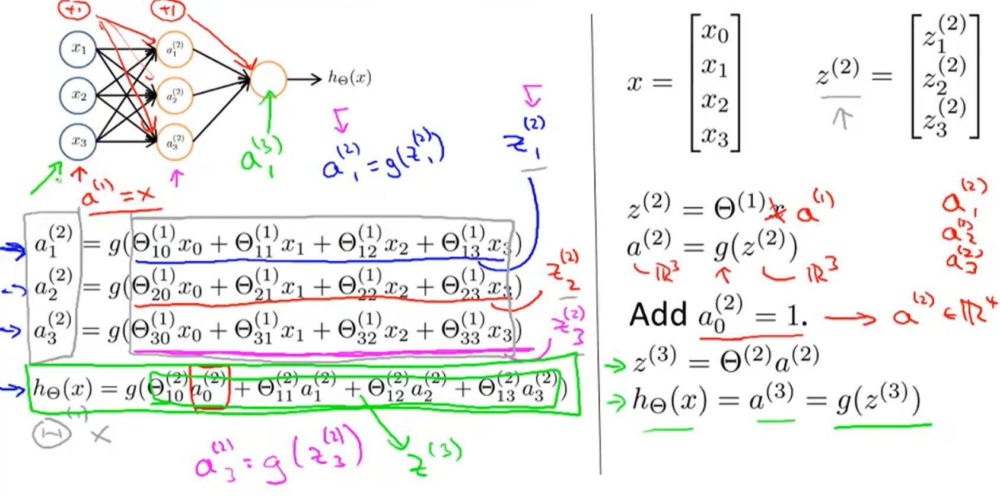
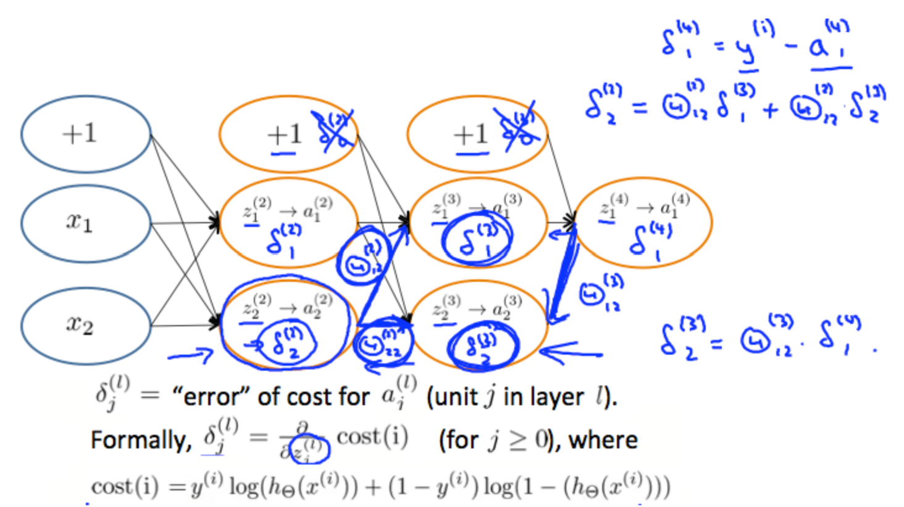

## :monkey: Neural Networks

[:arrow_backward:](../../ds_index)

[toc]

### 1. Neural Networks: Representation

#### Model Representation

Neurons are basically computational units that take input features $x_1...x_n$, and the output is the result of hypothesis function. $x_o$ input node is called "bias unit" and it's always equal to 1. We use the same logistic function as in classification, $\frac{1}{1+e^{-\theta^Tx}}$, called sigmoid **activation** function. Our theta parameters are called "weights".

We can have intermediate layers of nodes between the input and output layers called "hidden layers". Nodes itself are called "activation units" ($a_0^2...a^2_n$).

$\begin{align*}& a_i^{(j)} = \text{"activation" of unit $i$ in layer $j$} \newline& \Theta^{(j)} = \text{matrix of weights controlling function mapping from layer $j$ to layer $j+1$}\end{align*}$

With one hidden layer it will look like:

$\begin{bmatrix}x_0 \newline x_1 \newline x_2 \newline x_3\end{bmatrix}\rightarrow\begin{bmatrix}a_1^{(2)} \newline a_2^{(2)} \newline a_3^{(2)} \newline \end{bmatrix}\rightarrow h_\theta(x)$

The values for each of the "activation" nodes is obtained as follows:

$\begin{align*} a_1^{(2)} = g(\Theta_{10}^{(1)}x_0 + \Theta_{11}^{(1)}x_1 + \Theta_{12}^{(1)}x_2 + \Theta_{13}^{(1)}x_3) \newline a_2^{(2)} = g(\Theta_{20}^{(1)}x_0 + \Theta_{21}^{(1)}x_1 + \Theta_{22}^{(1)}x_2 + \Theta_{23}^{(1)}x_3) \newline a_3^{(2)} = g(\Theta_{30}^{(1)}x_0 + \Theta_{31}^{(1)}x_1 + \Theta_{32}^{(1)}x_2 + \Theta_{33}^{(1)}x_3) \newline h_\Theta(x) = a_1^{(3)} = g(\Theta_{10}^{(2)}a_0^{(2)} + \Theta_{11}^{(2)}a_1^{(2)} + \Theta_{12}^{(2)}a_2^{(2)} + \Theta_{13}^{(2)}a_3^{(2)}) \newline \end{align*}$

Each layer gets its own matrix of weights, $\Theta^{(j)}$. The dimensions of matrices of weight is determined as follows by example: 
If layer 1 has 2 input nodes and layer 2 has 4 activation nodes. Dimension of $\Theta^{(1)}$ is going to be 4x3 where $s_j = 2$ and $s_{j+1}$ = 4, so $s_{j+1} \times (s_j +1)=4 \times 3$ (the $j+1$ comes from the addition in thethas "bias nodes" that we not include for $x_0$).

#### Forward propagation: Vectorized implementation

**Forward propagation** steps: 

1) Assign $a^{(1)} = x$.
2) Compute $z^{(2)} = \Theta^{(1)}a^{(1)}$ where $z^{(2)}$ becomes $\mathbb{R}^3$.
3) Activate next layer $a^{(2)} = g(z^{2})$.
4) Add $a_0^{(2)} = 1$ (bias unit) so $a^{(2)}$ becomes $\mathbb{R}^4$.
5) Compute $z^{(3)} = \Theta^{(2)}a^{(2)}$.
6) Activate last layer that actually is our final hypothesis: $h_{\theta} = a^{(3)} = g(z^{(3)})$.

#### Simple example of neural network

Let's predict $x_1$ AND $x_2$ using neural networks. The graph of our functions will look like: 

$\begin{align*}\begin{bmatrix}x_0 \newline x_1 \newline x_2\end{bmatrix} \rightarrow\begin{bmatrix}g(z^{(2)})\end{bmatrix} \rightarrow h_\Theta(x)\end{align*}$

Our first theta matrix: $\Theta^{(1)} =\begin{bmatrix}-30 & 20 & 20\end{bmatrix}$

This will cause the output of our hypothesis to only be positive if both $x_1$ and $x_2$ are $1$. Look below:

$\begin{align*}& h_\Theta(x) = g(-30 + 20x_1 + 20x_2) \newline \newline & x_1 = 0 \ \ and \ \ x_2 = 0 \ \ then \ \ g(-30) \approx 0 \newline & x_1 = 0 \ \ and \ \ x_2 = 1 \ \ then \ \ g(-10) \approx 0 \newline & x_1 = 1 \ \ and \ \ x_2 = 0 \ \ then \ \ g(-10) \approx 0 \newline & x_1 = 1 \ \ and \ \ x_2 = 1 \ \ then \ \ g(10) \approx 1\end{align*}$

#### Multiclass Classification

To classify data into multiple classes, we let our hypothesis return a vector of values. For example, one of four categories: 

Each $y^{(i)}$ represents some category. We work with this as usual but with vectors so our resulting hypothesis for one set may look like: 

$h_\Theta(x) =\begin{bmatrix}0 \newline 0 \newline 1 \newline 0 \newline\end{bmatrix}$

This hypothesis result represents third category.

---

### 2. Neural Networks: Learning

#### Cost function

Define new variables:

- $L$ = total number of layers in the network
- $s_j$ = number of units (without bias) in layer $l$
- $K$ = number of output units/classes

Also we may have many output nodes so we denote $h_{\theta}(x)_k$ as being a hypothesis that results in the $k^{th}$ output.

Cost function formula:
$\begin{gather*} J(\Theta) = - \frac{1}{m} \sum_{i=1}^m \sum_{k=1}^K \left[y^{(i)}_k \log ((h_\Theta (x^{(i)}))_k) + (1 - y^{(i)}_k)\log (1 - (h_\Theta(x^{(i)}))_k)\right] + \frac{\lambda}{2m}\sum_{l=1}^{L-1} \sum_{i=1}^{s_l} \sum_{j=1}^{s_{l+1}} ( \Theta_{j,i}^{(l)})^2\end{gather*}$

Note:

- The double sum realizes costs calculated for each cell in the output layer.
- The tripple sum adds up the squares of all the individual $\Theta$s in the entire network.
- The $i$ in the tripple sum does **not** refer to training example $i$.

#### Backpropagation Algorithm

Backpropagation is used for minimizing our cost function: $\min_\Theta J(\Theta)$. The biggest problem here is to compute partial derivative of $J(\Theta)$: 

$\dfrac{\partial}{\partial \Theta_{i,j}^{(l)}}J(\Theta)$

To do so, we use the following algorithm:

Given training set $\lbrace (x^{(1)}, y^{(1)}) \cdots (x^{(m)}, y^{(m)})\rbrace$ , also define set $\Delta^{(l)}_{i,j} :=0$ for all $(l,i,j)$
For $i=1$ to $m$
	Set $a^{(1)} := x^{(t)}$
	Perform forward propagation to compute $a^{(l)}$ for $l=2,3,...,L$
	Using $y^{(i)}$, compute $\delta^{(L)} = a^{(L)} - y^{(t)}$
	Compute $\delta^{(L-1)}, \delta^{(L-2)},\dots,\delta^{(2)}$ using $\delta^{(l)} = ((\Theta^{(l)})^T \delta^{(l+1)})\ .*\ a^{(l)}\ .*\ (1 - a^{(l)})$ [take deltas from next layer $l+1$ and theta params from current $l$ layer]
	$\Delta^{(l)}_{i,j} := \Delta^{(l)}_{i,j} + a_j^{(l)} \delta_i^{(l+1)}$ or with vectorization, $\Delta^{(l)} := \Delta^{(l)} + \delta^{(l+1)}(a^{(l)})^T$

After for cycle we calculate next:

- $D^{(l)}_{i,j} := \dfrac{1}{m}\left(\Delta^{(l)}_{i,j} + \lambda\Theta^{(l)}_{i,j}\right)$, if j≠0.
- $D^{(l)}_{i,j} := \dfrac{1}{m}\Delta^{(l)}_{i,j}$ if j=0

$\frac \partial {\partial \Theta_{ij}^{(l)}} J(\Theta)$ = $D^{(l)}_{i,j}$, we've got partial derivative, as we wanted to.

Example calculations of some $\delta_j^{(l)}$:

#### Gradient checking

Gradient checking will assure that our backpropagation algorithm works as intended. We can approximate the derivative of our cost function with: 

$\dfrac{\partial}{\partial\Theta}J(\Theta) \approx \dfrac{J(\Theta + \epsilon) - J(\Theta - \epsilon)}{2\epsilon}$

A small value for $\epsilon$ (epsilon) such as $\epsilon = 10^{(-4)}$, guarantees that the math works out properly. If the value $\epsilon$ is too small, we can end ip with numerical problems.

---

### 3. Putting it together

Firstly, we need to define several things:

- Number of input units = dimension of features $x^{(i)}$
- Number of output units = number of classes
- Number of hidden units per layer = usually more the better (must balance with cost of computation as it increases with more hidden units)
- Defaults: 1 hidden layer. If you have more than 1 hidden layer, then it is recommended that you have the same number of units in every hidden layer.

##### Training a Neural Network:

1. Randomly initialize the weights
2. Implement forward propagation to get $h_\Theta(x^{(i)})$ for any $x^{(i)}$
3. Implement the cost function
4. Implement backpropagation to compute partial derivatives
5. Use gradient checking to confirm that your backpropagation works. Then disable gradient checking.
6. Use gradient descent or a built-in optimization function to minimize the cost function with the weights in theta.