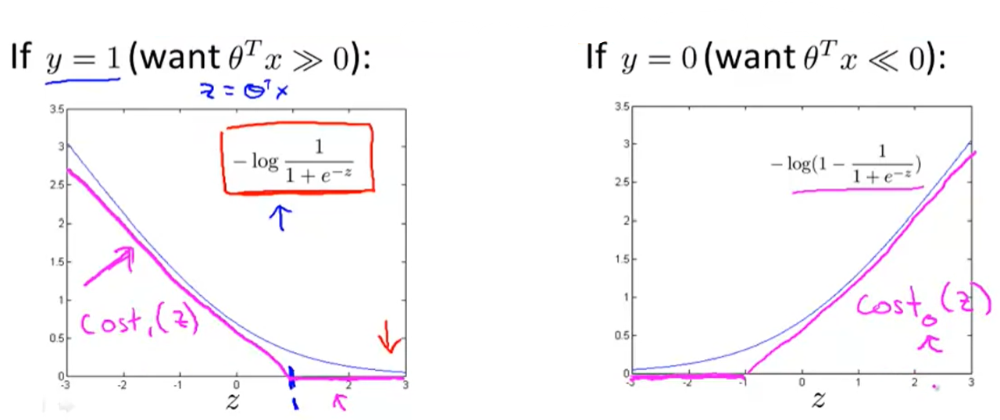
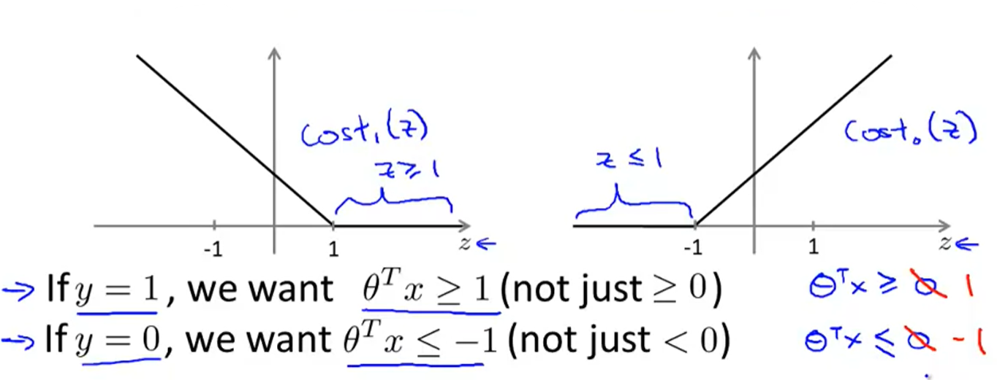
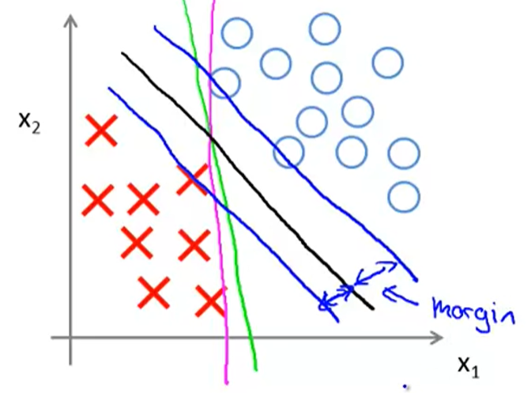
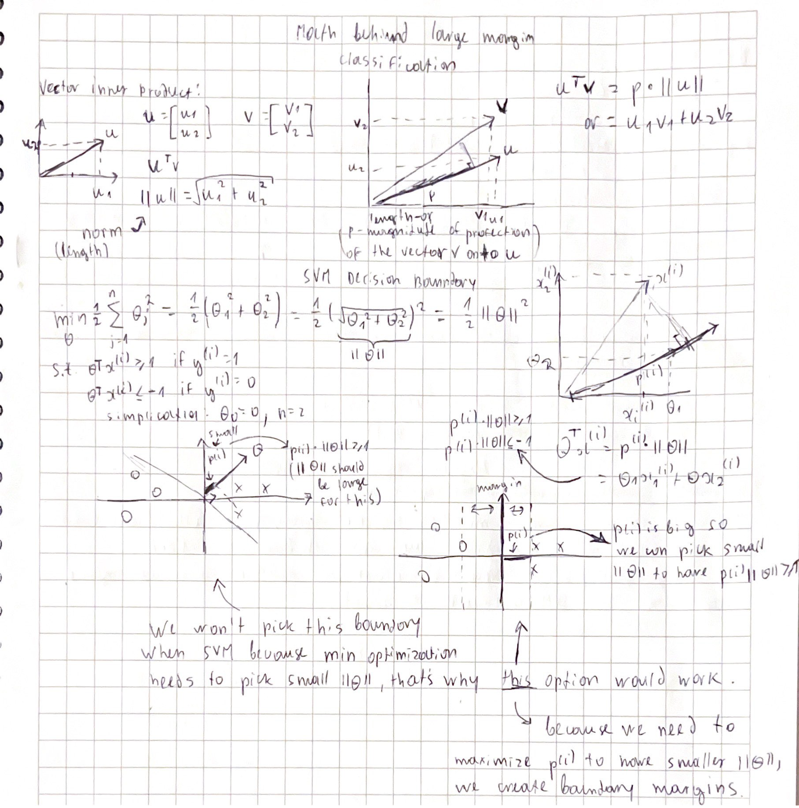
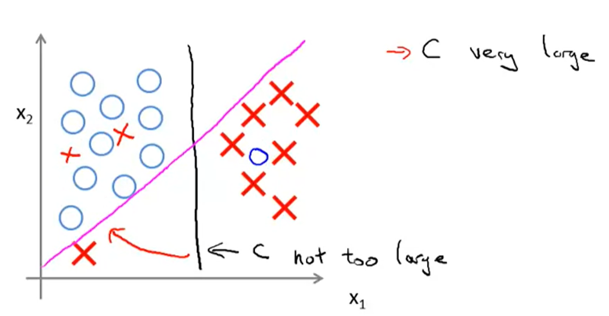

## :classical_building: Support Vector Machines

[:arrow_backward:](../../ds_index)

[toc]

**SVM** sometimes gives a cleaner and more powerful way of learning complex non-linear functions.

#### 1. Optimization Objective

Let's plot cost functions of logistic regression when $y = 1$ and $y = 0:$

We may draw vectors near logistic costs as above (magenta color). That will be our new SVM cost functions. 

Optimization objective function:

$\min_{\theta} C \sum_{i = 1}^{m} \left [ y^{(i)} \cdot \text{cost}_{1}(\theta^T x^{(i)}) + (1 - y^{(i)}) \cdot \text{cost}_{0}(\theta^T x^{(i)})    \right]  + \cfrac{1}{2} \sum_{j = 1}^{n} \theta_j^2$

Hypothesis:  $h_{\theta}(x) = \left\{ \begin{array}{l l} 1 & \text{ if  } \theta^T x \geqslant 0 \\ 0 & \text{ otherwise }   \end{array} \right.$

#### 2. Large Margin

Here's the SVM cost functions:

So changing $0$ to 1 (when compared) gives larger margin for SVM.

#### 3. SVM Decision Boundary

SVM sometimes is referred as **Large Margin classifier** because SVM tries to find a decision boundary that has the widest distance (margin) between classes:

The reason for that those margins are the consequence of optimizing objective. Below is explanation of how it mathematically works:

##### Presence of outliers with Large margin classifier

When $C$ is big, the algorithm becomes sensitive to outliers, decreasing $C$ makes it less sensitive:

#### 4. SVM in Practise

Need to specify:

- Choice of parameter C

- Choice of kernel (similarity function):
  E.g **No kernel** ("linear kernel") (predict "$y=1$" if $\theta^Tx \ge 0 $), Gaussian kernel, polynomial kerne, string kernel, ch-square kernel...

  > Perform feature scaling before using the Gaussian kernel.

##### Logistic regression vs. SVMs

$n$ = number of features, $m$ = number of training examples

- if $n$ is large (relative to $m$): use logistic regression, or SVM without a kernel (e.g $n = 10000$, $m$ = $10...1000$);
- if $n$ is small, $m$ is intermediate: Use SVM with Gaussian kernel ($n$ = 1-1000, $m$ = 10-10k);
- if $n$ is small, $m$ is large: Create/add more features, then use logistic regression or SVM without a kernel ($n$=1-1000, $m$=50k+);
