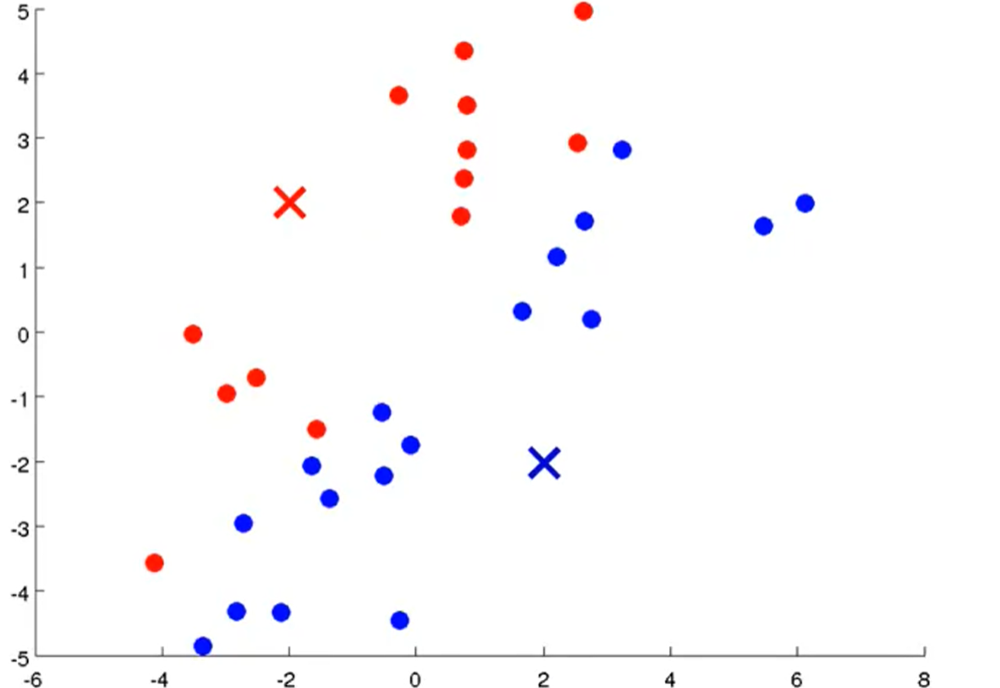
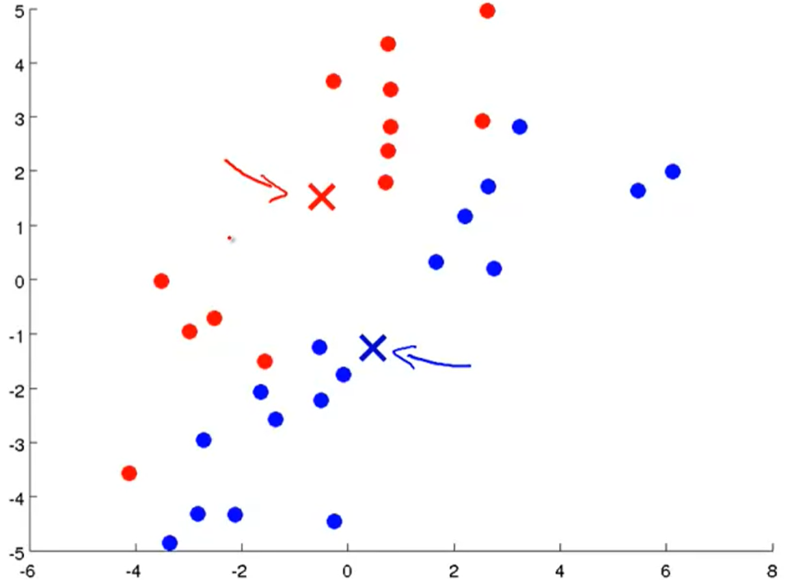
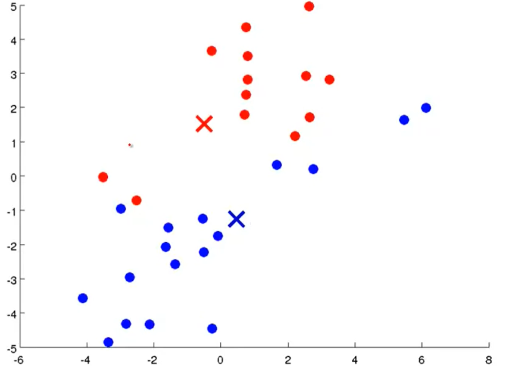
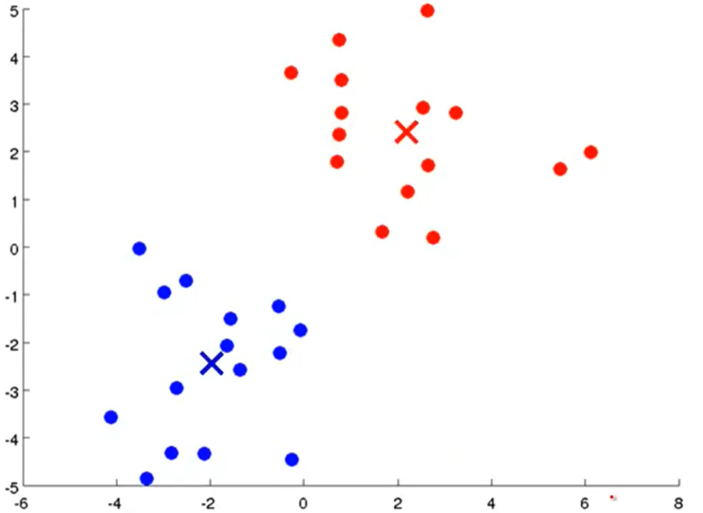
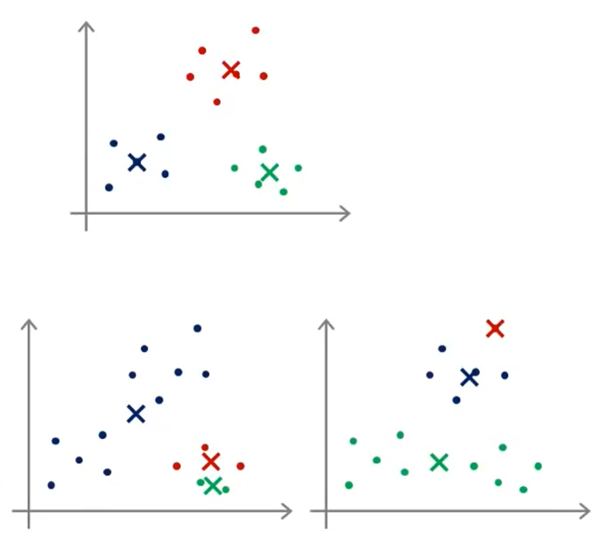
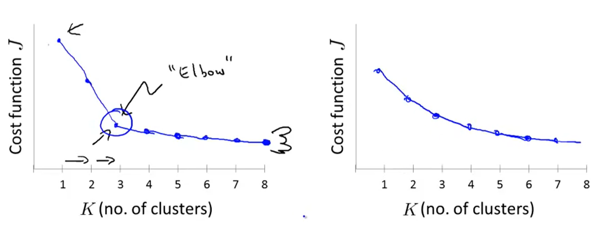

## :cat2: Unsupervised Learning

[:arrow_backward:](../../ds_index)

[toc]

### 1. K-Means Algorithm

K-means is an iterative clustering algorithm.

Input:
	- $K$ (number of clusters)
	- training set

Steps:

- Randomly initialize $K$ clusters centroids $\mu_1$, $\mu_2$,..., $\mu_k$ $\in \mathbb{R}^n$ 

- Repeat {

  *[cluster assignment step]*
  for $i$ = 1 to $m$

  ​	$c^{(i)}:=$ index (from 1 to $K$) of clust centroid closts to $x^{(i)}$ ($\min_k||x^{(i)}-\mu_k||^2 \rightarrow c^{(i)}$)

  *[move centroid step]*
  for $k$ = 1 to $K$
  	$\mu_k := $ average (mean) of points assigned to cluster $k$  

  } 

Below is how this iteration process works till the end: 

 

                     

#### Optimization Objective

> We are doing optimization ($\min J(...)$)  with respect to $c^{(1)}, c^{(2)},...,c^{(m)}$ on cluster assignment step and holding $\mu_1,...,\mu_k$ fixed.
> And also we $\min J(...)$ with respect to $\mu_1,...,\mu_k$ on move centroids step.

$c^{(i)}$ = index of cluster (1,2,...,$K$) to which example $x^{(i)}$ is currently assigned
$\mu_k$ = cluster centroid $k$ ($\mu_k \in \mathbb{R}^n$)
$\mu_c^{(i)}$ = cluster centroid of cluster to which example $x^{(i)}$ has been assigned 

E.g. $x^{(i)} \rightarrow 5,\ c^{(i)}=5, \ \mu_c^{(i)} = \mu_5$

Optimization objective (cost function, or *distortion*): $J(c_1, \ ... \ , c_m,  \mu_1, \ ... \ ,  \mu_k) = \cfrac{1}{m} \sum_i \left\| x_i -  \mu_{c_i} \right\|^2$
we want to find $\min J(c_1, \ ... \ , c_m, \mu_1, \ ... \ , \mu_k)$ with respect to $c_1,...,c_m,\mu_1,...,\mu_k$

#### Random Initialization

- Should have $K < m$
- Randonly pick $K$ training examples
- Set  $\mu_1, \ ... \ ,  \mu_k$ equal to these $K$ examples

E.g. for $k=2$: 

##### Local optima

Sometimes we can get bad local optimas like here:

Solution: try multiple random initializations and pick clustering that gave lowest cost.

#### Choosing the number of clusters

The common way is to choose the number manually. And also there is **Elbow method:**

But often we can end up like on the right side with total ambiguity, that's why this method isn't so popular.