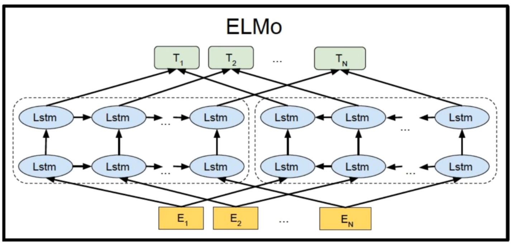
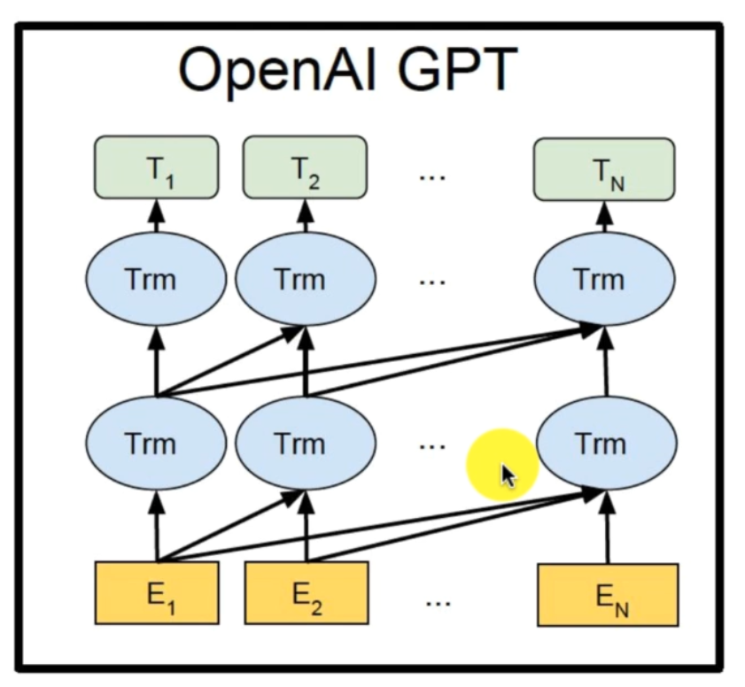
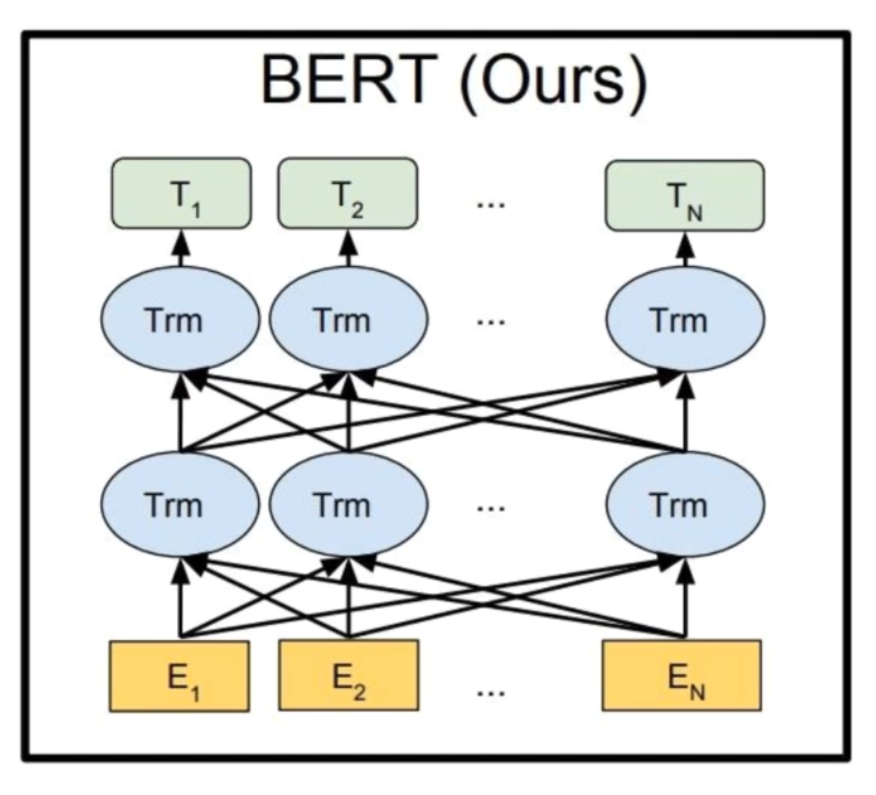
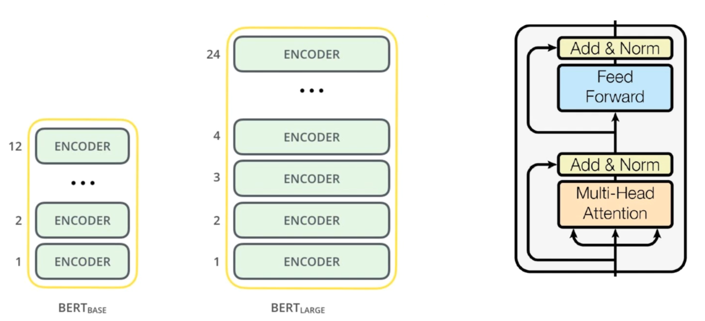
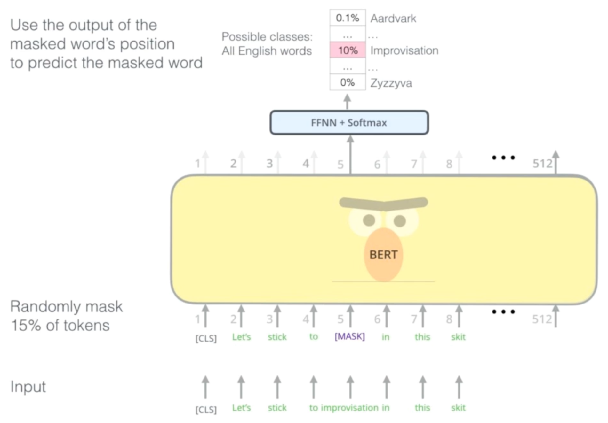
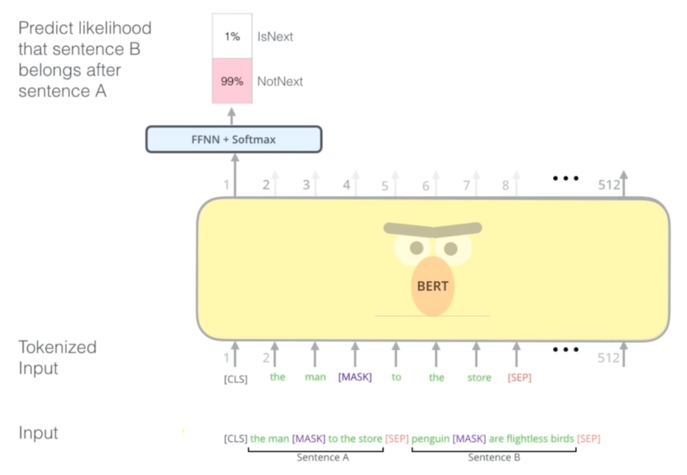
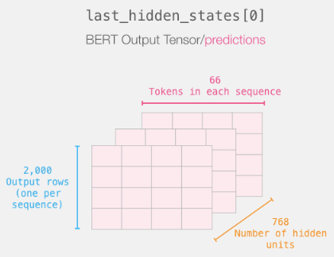
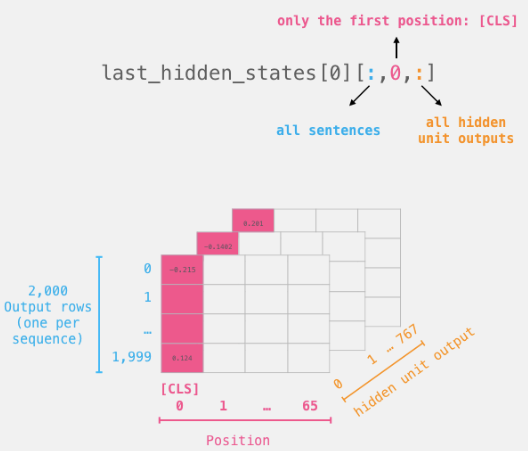

## :japanese_goblin: BERT

[:arrow_backward:](nlp_index)

CNN model (sentiment analyzer) using BERT as an embedding layer [colab](https://colab.research.google.com/drive/15YIsJP3GsbLn5HVmmo6jehmcGxaafny-?usp=sharing).
QA with fine-tuning BERT using SQuAD dataset [colab](https://colab.research.google.com/drive/1_g8fJDwFXDNZATaK6Ub4-WOnhZOzXgBM?usp=sharing). 

[toc]

BERT stands for *Bidirectional Encoder Representations from Transformers*:

- **Encoder Representations**: language modeling system, pre-trained with unlabeled data. Then fine-tuning
- **from Transformer**: based on powerful NLP algorithm. Defines the architecture of BERT
- **Bidirectional**: uses with left and right context when dealing with a word. Defines the training process

### Transfer learning

- Semi-supervised block is a **pre-training** part. We give a text as an input and receive a vector representation of it (one vector per word).

- Supervised part is called **fine-tuning**. We use our pre-trained model with our additional layers for a specific task. This part is way less heavy than the first.

#### Previous transfer learning in NLP

##### ELMo

The first one was ELMo. It used LSTM's, better version of RNNs. The idea was to be bidirectional, but it only was pseudo. On the image we see two blocks: 

Block of LSTM's going from right to left and the opposite. At the end we concatenate the results from both and receive vector representation of a word.

##### OpenAI GPT

GPT uses transformers like BERT but is isn't bidirectional. Each word has access to all other words. But for the training purposes we can't allow the information to go everywhere if we want to predict next word.

##### BERT (Current)

Combines both principles (Transformer and fully bidirectional) thanks to its training model (masked language model).

### BERT's architecture

Few parameters to consider:

**L**: number of encoder layers

**H**: hidden size (embedding dimension)

**A**: number of self-attention heads

- BERT_base: L=12, H=768, A=12
  parameters: 110M
- BERT_large: L=24, H=1024, A=16
  parameters: 340M

### BERT's pre-training

Consists of two phases:

- MLM (Masked Language Model) -> vector for each token
- NSP (Next Sentence Prediction) -> a vector for classification

##### Masked Language Model

With T2 word predict E3 only having a look on E1 and E2. That was a standart way to build proper model. But it only allows to work from left to right, which means we have an access to only previous context words, but not in both directions.

With BERT we'll give an bidirectional access to all contexts. To achieve that we mask words we want to predict. 15% of the words are replaced by:

- [MASK] token 80% of the time

- random token 10% of the time (for better generality and avoid fine-tunning)
- left unchanged 10% of the time

Flow:

##### Next Sentence Prediction

- Get a higher level understanding, from words to sentences
- Get access to more tasks, like question answering

#### BERT output

Huggingface documentation on BERT output [here](https://huggingface.co/docs/transformers/v4.17.0/en/main_classes/output#transformers.modeling_outputs.BaseModelOutputWithPoolingAndCrossAttentions).

- `hidden_states` is a tuple that contains the hidden representations for each token in each sequence of the batch. The size is `(batch_size, seq_len, hidden_size)`:

  
  `batch_size` - blue, `seq_len` - purple, `hidden_size` - orange

  > [0] index near `last_hidden_states` means that we took output of the first layer (there must be [12 of them](https://github.com/huggingface/transformers/issues/1827)). 

- `pooler_output` contains a "representation" of each sequence in the batch, and is of size `(batch_size, hidden_size)`. What it basically does is take the hidden representation of the [CLS] token of each sequence in the batch (which is a vector of size `hidden_size`), and then run that through the [`BertPooler`](https://github.com/huggingface/transformers/blob/de4d7b004a24e4bb087eb46d742ea7939bc74644/src/transformers/modeling_bert.py#L498) nn.Module

  > We retrieve it with like that: `last_hidden_states[0]`:
  >
  > 

