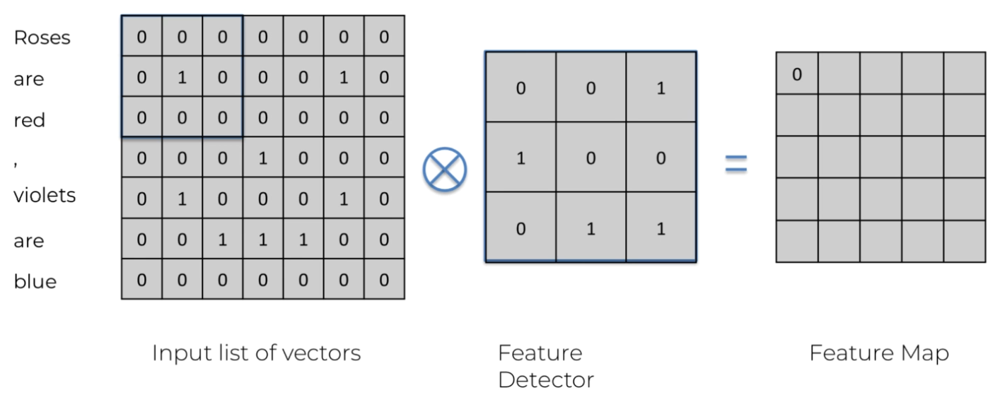
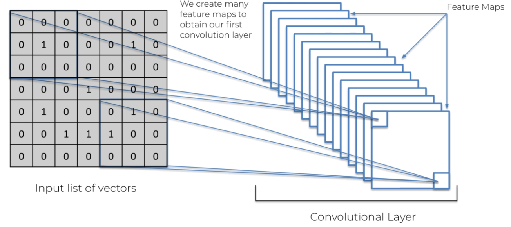
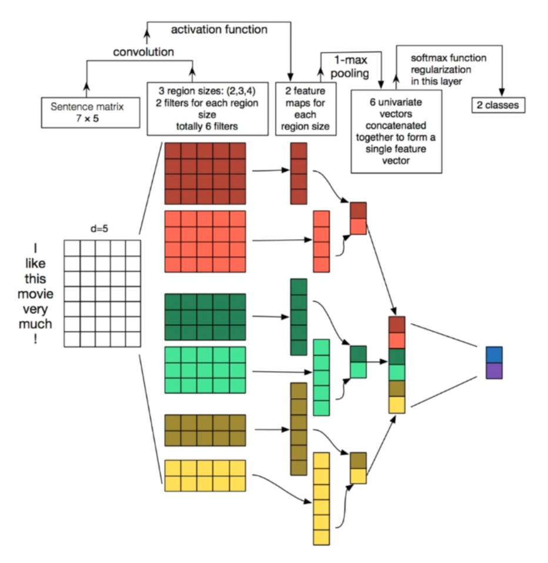

## :cancer: Convolutional Neural Network

[:arrow_backward:](nlp_index)

CNN is useful for classification task. 

#### CNN for images

Flow:

1. Convolution: create "feature detectors" that go through the image
2. Max pooling: reduce size and cost by being more global
3. Flattening: make everything a single 1D vector
4. Full Connection: standard FCN to learn classification task

#### CNN for words

Steps are the same as with an images.

##### Implementation of CNN for NLP

CNN implementation for NLP in Colab [here](https://colab.research.google.com/drive/1CMsVnsIR5KXWm8KDZJzAWOAaBJmqj0-o?usp=sharing), following next architecture:

To keep in mind:

- each filter has width = d_model. Splitting the embedding dimension doesn't make sense;
- we take one max for each filter. Position of a feature in the sentence not that important;
- 3 different size of filters, to capture different scale of correlation between words;
- on the image there are pairs of filters for each size, in the training there will be much more of them (like 50 filters with height=2).
