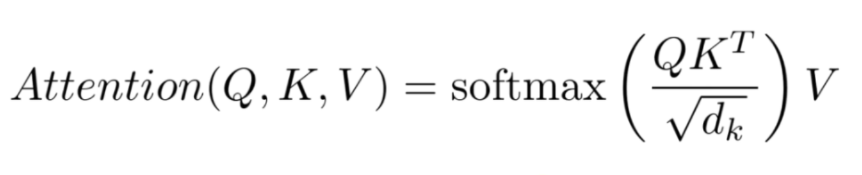
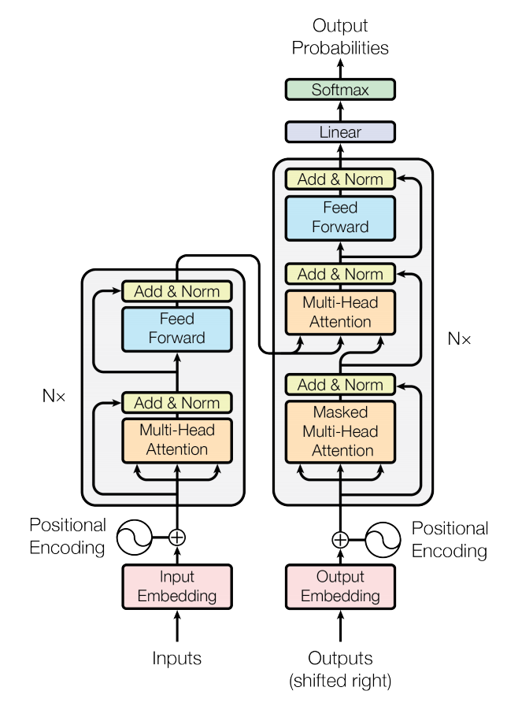
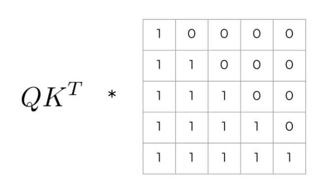
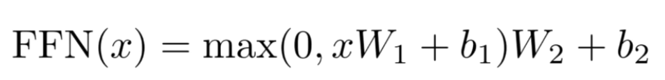

## :robot: Transformers

[:arrow_backward:](nlp_index)

Implementation of transformers from scratch in Colab [here](https://colab.research.google.com/drive/1s4K4g5AGRzqeEy7sXtHxJIxJYahLBXFm?usp=sharing).

[toc]

### Scaled-dot product

Q - context

K, V - what we want to rearrange (input sequence)

$QK^T$ - new matrix that conveys all the information about how each element of Q is related to each element of K

$\sqrt{d_k}$ - scaling, optimization

$softmax$ - transform each element of matrix to have values between 0 and 1; also the sum of all elements from the $softmax$ output should equal 1; 

Multiply by $V$ - use computed previously weights to recompose elements from our input sentence to get a new rearranged version

### Attention layer

**Self-attention**: beginning of encoding and decoding layers. We recompose a sequence to know how each element is related to the others, grabbing global information about a sentence/sequence: $Q=K=V$

**Encoder-decoder attention**: we have an internal sequence in the decoder (Q) and a context from the encoder (K = V). Our new sequences are a combination of information from out context, guided by the relation decoder sequence - encoder output: $K = V$

For example, to translate an English sentence into a French, we'll need to pass English sentence (K and V, that are equal) that we want to recompose with the context made of a French sentence (Q). We will get a new rearranged version of the English sentence according to the work that have already done with the translation.

**Look-ahead mask**: during training, we feed a whole output sentence to the decoder, but to predict word n, he must not look at words after n. Need to change the attention matrix:

**Linear projections**: let's apply our attention mechanism to multiple learned subspaces.

**"Multi-head" attention** allows the model to jointly attend to information from different representation subspaces at different positions. With a single attention head, averaging inhibits this".

Let's say each word after embedding has dimension 12. Instead of applying scale-dot product to sequence made of 12 dimensions, we will split it into 4 sequences, each element being of dimension equals 3. Then we compute for each and concatenate in the end.
Among the first three dimensions we want to get something between the first and the third words, but it only appears in those 3 dimensions. Then we would really like to have our attention mechanism to be able to focus on those three dimensions so that the information is not faded into the 12 initial dimension of the embedding.

So splitting the space into subspaces allows the attention mechanism to attend more information and able to get more relations between the elements of a sequence. But still before all of this we should run a huge linear transformation.

#### Positional encoding

The model has no clue about the order of the sentence (prior to convolution or recurrence networks). So we add positional encoding to preserve the order.

#### Feed forward layers

They are at the end of each encoding/decoding sub layer:

- composed of 2 linear transformations:
  
  At the end we'll have a sequence of the same length and the same embedding dimension

- applied to each position separately and identically
  It means that for a single sequence, we will apply those linear transformations to each of the elements (to each word)

- different for each sub layer
  For each encoding/decoding layers we apply different feed forward suppliers

#### Add & norm

Output of those suppliers are added to the inputs of the suppliers and we do a standard normalization.

For instance, in the self attention mechanism, after we compose a sentence with regard to the relations between each words, we still want to remember at least the bits, how the sentence was before.

This is also called *residual connections*.

 

#### Dropout

Only apply in the training phase in order to improve the performance of our model. Helps keeping a **generality**.

"We apply dropout to the output of each sub-layer before it is added to the sub-layer input and normalized. In addition, we apply dropout to the sums of the embeddings and the positional encodings in both the encoder and decoder stacks".

Shuts down some neurons during training to prevent overfitting.

#### Last linear

Output of the decoder goes through a dense layer with `vocab_size` units and a $softmax$, to get probabilities for each word.

The output dimension of this dense layer will be the `vocab_size` of our target language. After a $softmax$ we get actual probabilities. 

