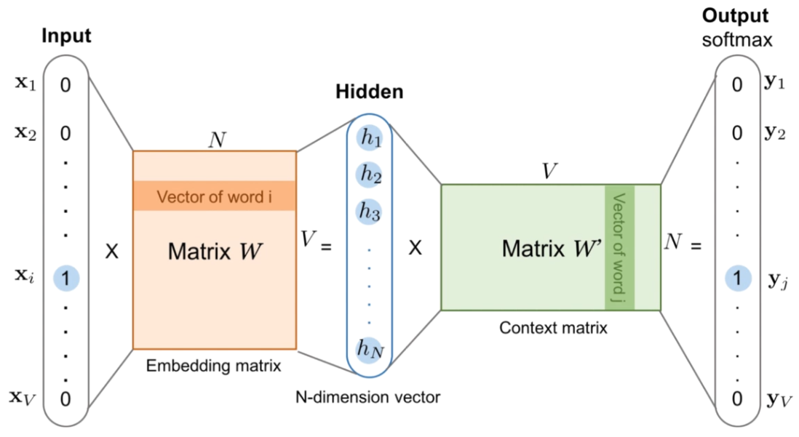
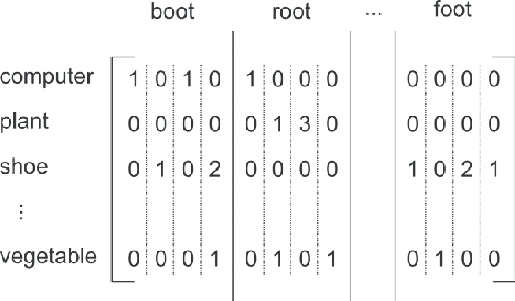
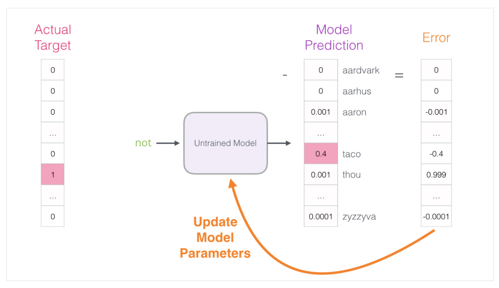

## :pisces: Word embedding

[:arrow_backward:](nlp_index)

We want to train an embedding matrix (matrix **W** on the image) to be able to represent our words with vectors. Below is an illustration and steps to follow:

1. From a single one-hot encoded vector (simply one word), by multiplying it on **Embedding matrix**, get a smaller vector - embedded word vector representation.

2. Multiply this vector with a **Context matrix** (matrix W`) and get a vector of vocab_size (same as input) that will semantically be related with our input vector. 

   > Context matrix represents 0 and 1 correlations between words that we receive from analysis of some huge text corpus. Looks like this:
   >
   > 

Suppose we have a sentence *"In spite of everything, I still believe people are really good at heart"*. We want to represent a word "**good**" as vector:

* After multiplying it (as a one-hot encoded vector) on embedding matrix (that will initially have some random values) we'll get some N-dimension vector

- Our word "good" produces pairs ("good", "are"), ("good", "really"), ("good", "at"), ("good", "heart"). This method is called the *skipgram* architecture. This pairs will be represented in our context matrix. After we multiply our N-dimension vector on this context matrix we'll get a big output vector with each value representing a correlation between word "good" and some other. Most of them will be zeros but values that represent words "are", "really", "at" and "heart" will be like 0.5, 0.7 and so on
- After first time we probably won't get the best result, that's why we calculate an error and tune coefficients for our untrained model to produce more accurate results in the future:
  

> In a word2vec implementation we use skipgram with negative sampling to avoid expensive neural network computations and use simple logistic regression model (compute 0 or 1). Detailed explanation [here](http://jalammar.github.io/illustrated-word2vec/). 

At the end we are only interested in extracting the final embedding matrix from our trained model, context matrix is also used only for training. 

