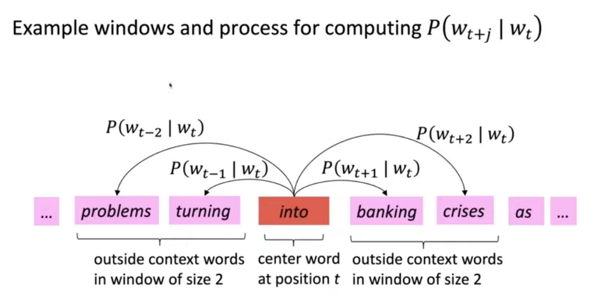

## :ok_man: Word vectors 

[:arrow_backward:](../nlp_index)

[toc]

#### Problem of words as discrete symbols

1. Enormous size of features
   hotel, conference, motel - a localist representation

   Such symbols for words can be represented by **one-hot** (means one 1, the rest 0s) vectors, dimension for each different word:
   motel = [0 0 0 0 0 0 0 0 0 0 1 0 0 0 0]
   hotel =  [0 0 0 0 0 0 0 1 0 0 0 0 0 0 0]

   Vector dimension = number of words in vocabulary (e.g., 500,000)

2. Don't have notion of word, relationships and similarity
   Example: user searches for "Seattle motel", we would like to match documents containing "Seattle hotel" but these two vectors are different.

   Solution: could rely on list of synonyms to get similarity? It **failed** badly because of incompleteness 

   Instead: learn to encode similarity in the vectors themselves

#### Representing words by their context

- Distributional semantics: A word's meaning is given by the words that frequently appear close-by:
  

  

##### Word vectors

We will build a dense vector for each word, chosen so that it is similar to vectors of words that appear in similar contexts:

> Note: word vectors are also called **word embeddings** or **(neural) word representations**. They are distributed representation  (because spread over n dimensional vectors).

#### Word2vec (2013) Overview

##### Idea

- we have a large corpus ("body") of text
- Every word in a fixed vocabulary is represented by a vector
- Go through each position $t$ in the text, which has a center word $c$ and context ("outside") words $o$
- Use the similarity of the word vectors for $c$ and $o$ to calculate the probability of $o$ given $c$ (or vice versa)
- Keep adjusting the word vectors to maximize this probability

##### Example

*(compute probability of the words that actually occurred in the context of center word; it gives some probability but we need it higher)*

##### Objective function

Question: How to calculate $P(W_{t+j}|W_t;\theta)$? (probability of word occurring in the context, given the center word)
Answer: we will use two vectors per word $w$:

- $v_{w}$ when $w$ is a center word
- $u_w$ when $w$ is a context word

Then for a center word $c$ and a context word $o$:
$$
P(o|c) = \frac{\exp(u_o^Tv_c)}{\sum_{w \in V}^{}\exp(u_w^Tv_c)}
$$

