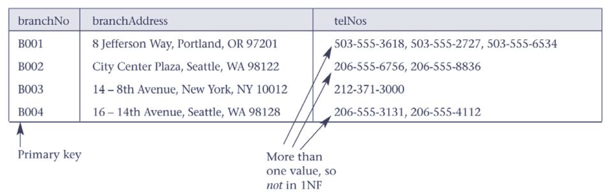
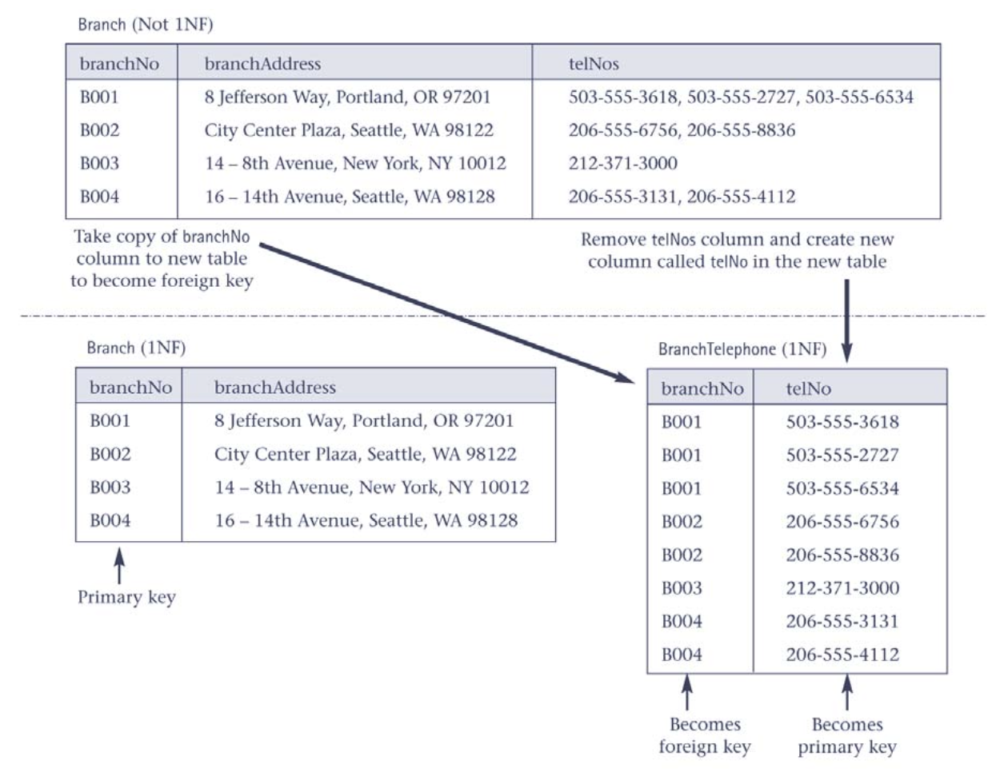
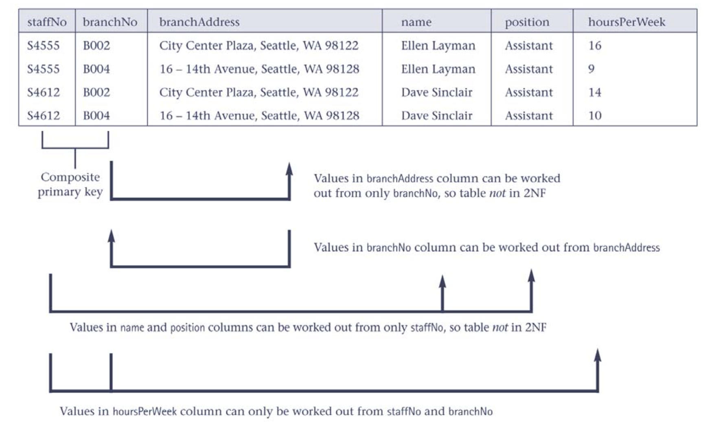
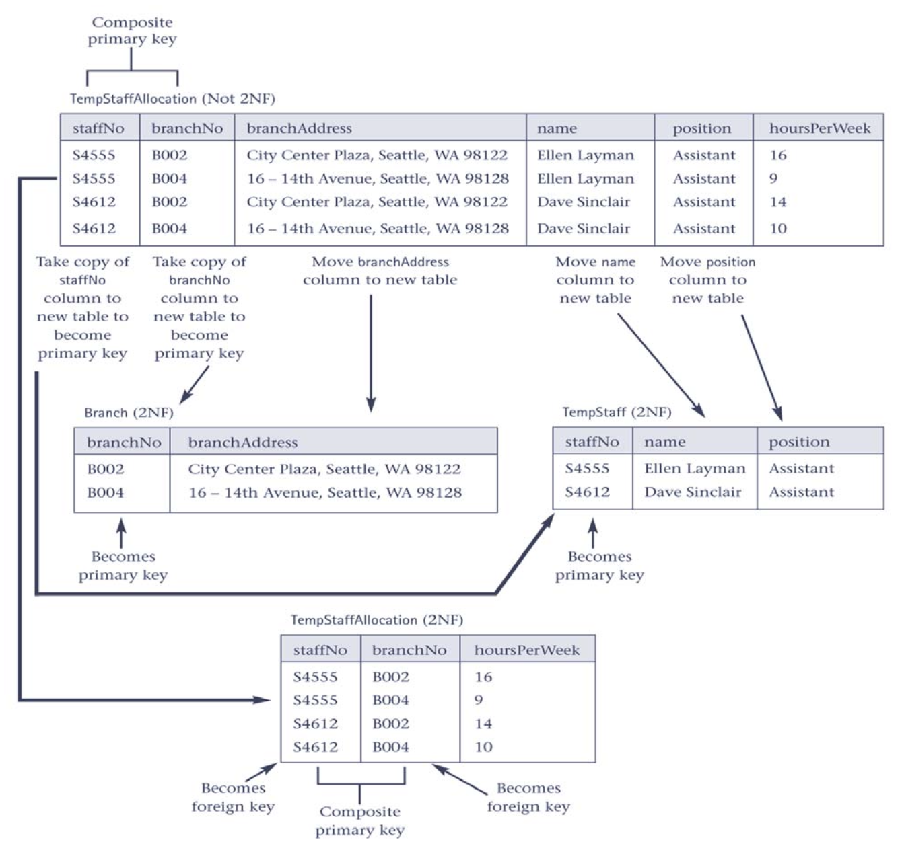
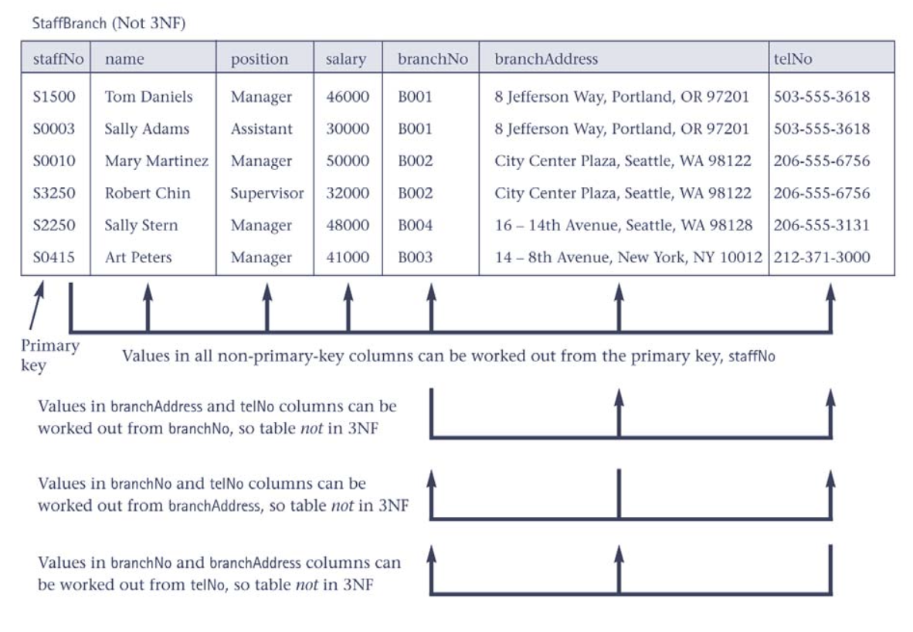
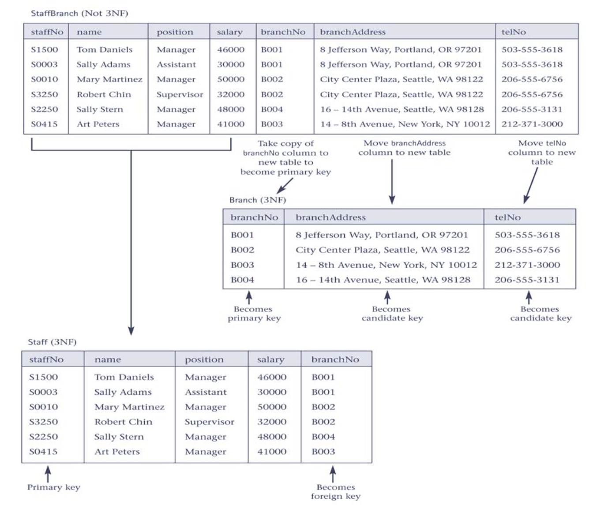
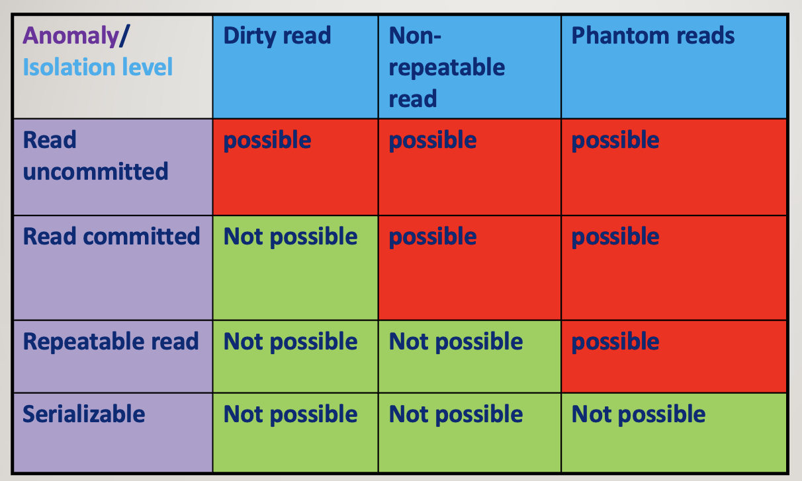

## DB relational notes

[:arrow_backward:](databases_index)

[toc]

#### Normalization

**1NF**: Avoid arrays in single columns 

Solution: decompose arrays in some other table and make reference by key

**2NF**: Avoid partial dependencies on the candidate (can be primary, composite) keys

Solution: 

**3NF**: all non-primary keys columns can be worked out only from the primary key column(s) and no other usual columns. Should avoid any **transitive** dependencies.

Only primary key here is staffNo (because this table is all about the staff) For example, here we can make branchAdress from **staffNo**, and at the same time branchAdress from **branchNo**. 

A - staffNo, B - branchAdress, C - branchNo 
B depends on A, C depends on B, so C depends on A via B (transitive dependency).

Solution:

#### Transactions

**Транзакція** – це неподільна з точки зору бази даних операція, котра виконується цілком, або не виконується зовсім і переводить базу даних з одного **узгодженого стану** в інший.

Optimistic locking (оптимістичне блокування) - це підхід, при якому транзакції не блокують доступ до даних, а замість цього перевіряють, чи не змінилися ці дані в інших транзакціях під час їх виконання. Якщо дані не змінилися, тоді транзакція може продовжуватися. Якщо ж дані були змінені, тоді транзакція переривається.

Pessimistic locking (песимістичне блокування) - це підхід, при якому транзакції блокують доступ до даних, щоб інші транзакції не могли їх змінювати або зчитувати. Цей підхід використовується, коли очікується велика кількість конфліктних запитів до бази даних.

