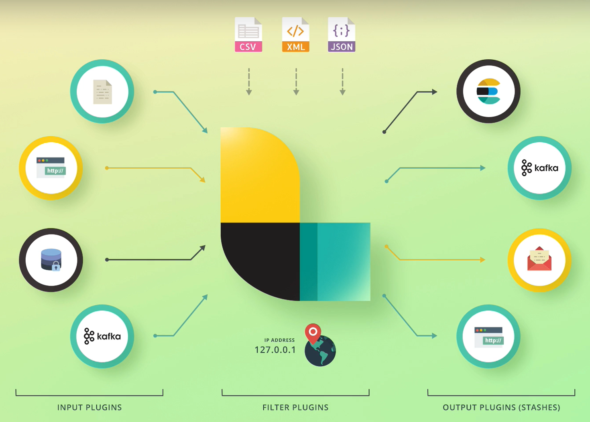
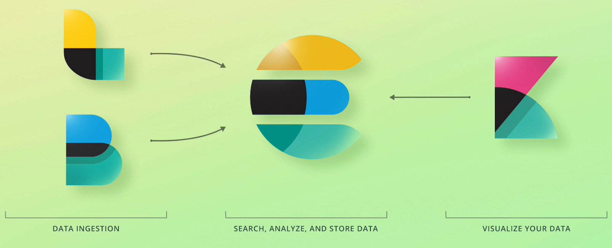

## :thumbsup: Elastic Stack Overview

[:arrow_backward:](es_index)

[toc]

### Elasticsearch

- Full-text search engine
- Query structured data (use as an analytics platform, charts)

### Elastic Stack

##### Kibana

An analytics & visualization platform. Provides an interface for creating ES queries.

##### Logstash

Process log from an application and send them to ES. But now it evolved to a data processing pipeline. We can create pipelines with various data:

##### X-Pack

Additional functionality for ES and Kibana:

- Adds authentication and authorization
- Integrate with authentication providers
- Control permissions
- Monitoring (CPU, memory usage, disk space)
- Alerting for some behaviours
- Export Kibana reports
- Generate reports scheduled or on-demand (or when special conditions)
- Enables machine learning for Elasticsearch & Kibana
- Graph - analyze relationships in data
- Elasticsearch SQL

##### Beats

A collection of data shippers that send data to ElasticSearch or Logstash. We configure Filebeat to collect some log files. There are also metricbeat, packetbeat, winlogbeat, auditbeat, heartbeat.

##### Summary

> **ELK** - ES, Logstash and Kibana.
>
> In a perfect world, all events (as well as modifying data) go through Logstash and we only query the data through ES.   

