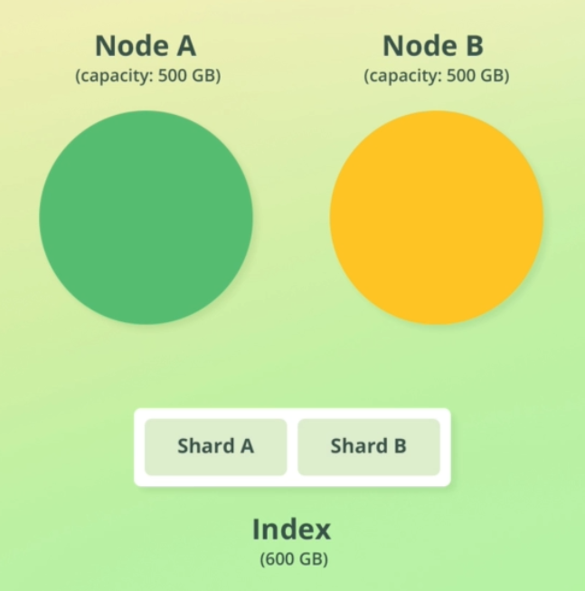

## :a: Elasticsearch Architecture

[:arrow_backward:](es_index)

[toc]

*Cluster* is a collection of nodes.

*Node* refers to an instance of ES. Each node should run on a different machine. Nodes store the data that we add to ES.

Data is stored as *documents* (similar to row in relational database). A document's data is separated into *fields* (like columns in rdbms). 

Documents are grouped together with *indices*.

Cluster -> Node -> Index -> Shard -> Document -> Field.

#### Sharding

The main purpose is to horizontally scale the data volume. Parallelization of queries increases the throughput of an index.

- A way to divide indices into smaller pieces
- Each piece is referred to as a *shard*
- Sharding is done at the index level



- A shard is an independent index (almost)
- Each shard is an Apache Lucene index
- ES index consists of one or more Lucene indices

##### Configuring the number of shards

- An index contains a single shard by default
- Indices in ES < 7.0.0 were created with five shards
  - This often led to *over-sharding* 
- Increase the number of shards with the Split API
- Reduce the number of shards with the Shrink API


#### Replication

- It is supported natively and enabled by default
- ES supports replication for fault tolerance

##### How it works

- It is configured at the index level
- Replication works by creating *replica shards* (shard that has been replicated is a *primary shard*)
- Replica shard is **never** stored on the same node as its primary shard

##### Increasing query throughput with replication

- Replica shards of a replication group can serve different search requests simultaneously
  - This increases the number of requests that can be handled at the same time
- ES intelligently routes requests to the *best* shard
- CPU parallelization improves performance if multiple replica shards are stored on the same node


#### Node roles

A node will typically store shards, but it might not always be the case. Each node can have one or more roles, defining what the node is used for.

##### Master node

Responsible for creating and deleting indices, among others. May be used for having dedicated master nodes. Having a master node role does not mean this node is actually master (it is chosen by voting process). 

##### Data node

Enables a node to store data. It includes performing queries related to that data.

##### Ingest node

Enables a node to run ingest pipelines. This is a simplified version of Logstash, directly within Elasticsearch.

> Ingest pipelines are a series of steps (processors) that are performed when indexing documents. Processors may manipulate documents, e.g. resolving an IP to lat/lon.    

##### ML node

```node.ml``` identifies a node as a machine learning node.

##### Coordination node

Refers to the distribution of queries and the aggregation of results. Useful for coordination-only nodes (for large clusters).

##### Voting-only node

Rarely used, this node will participate in voting for a new master node but won't be able to be elected as the master node itself