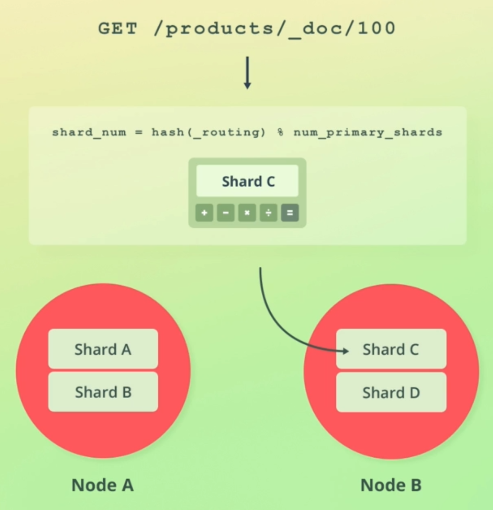
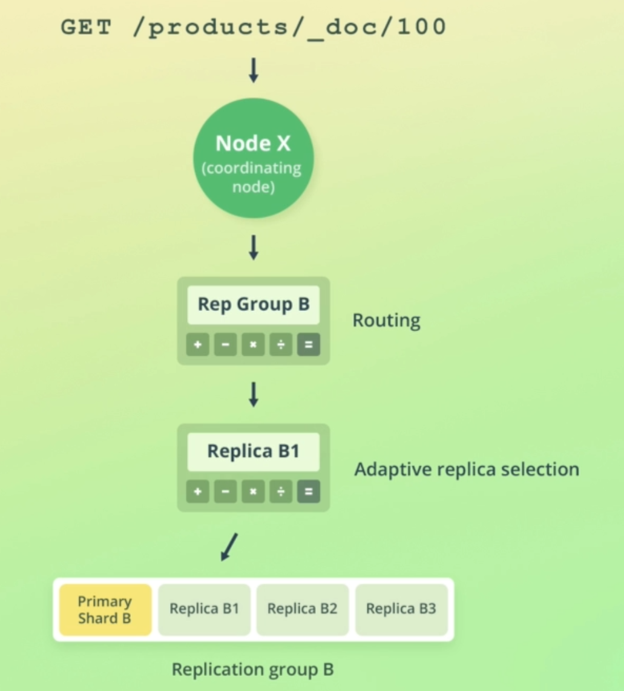
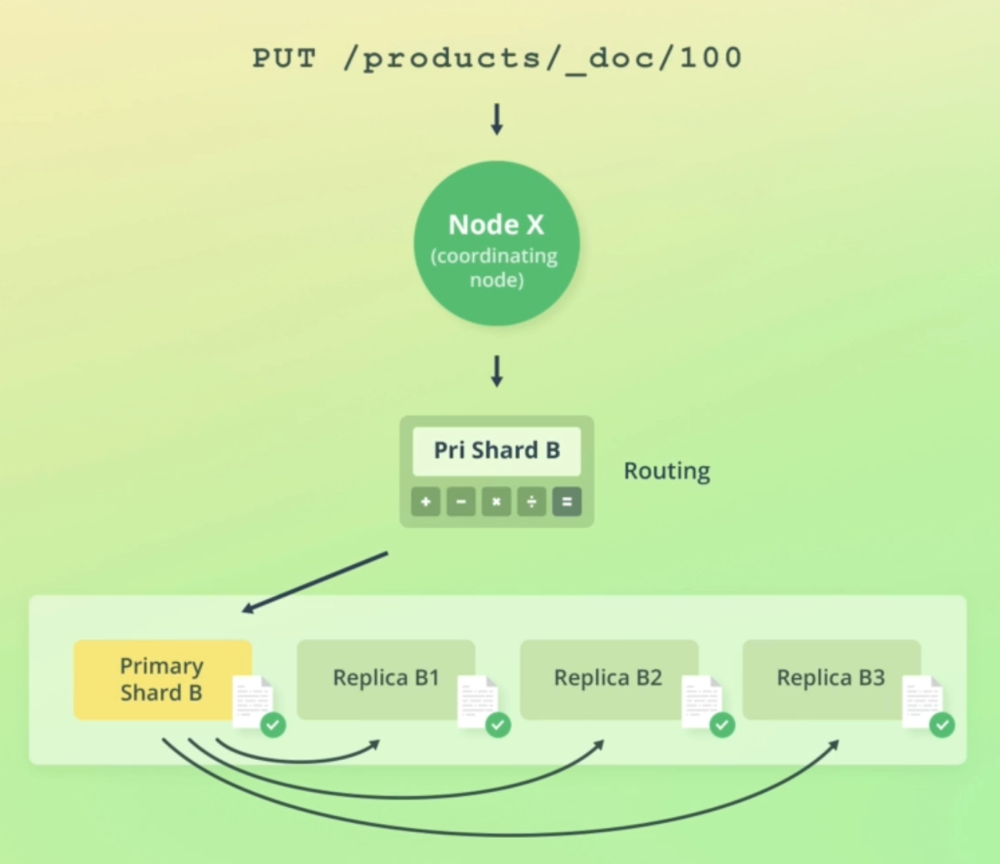
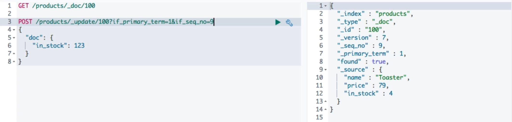

## :notebook: ES Managing Documents

[:arrow_backward:](es_index)

[toc]

Elasticsearch documents are immutable (!), so we are actually *replacing* with the Update API (retrieves a document, changes fields values and replaces the existing document with modified one).

#### Basic operations

```json
// create an index
PUT /products
{
  "settings": {
    "number_of_shards": 2,
    "number_of_replicas": 2
  }
}

GET /products

// index a document
POST /products/_doc
{
  "name": "Cofee Maker",
  "price": 64,
  "in_stock": 10
}

// identify _id when doing insertion
PUT /products/_doc/100
{
  "name": "Toaster",
  "price": 49,
  "in_stock": 4
}

GET /products/_doc/100

// update the document
POST /products/_update/100
{
  "doc": {
    "tags":["electronics"]
  }
}
```


#### Scripted updates

Reducing the current value of `in_stock` by one:

```json
POST /products/_update/100
{
  "script": {
    "source": "ctx._source.in_stock--"
  }
}
```

Assigning an arbitrary value to `in_stock`:

```json
POST /products/_update/100
{
  "script": {
    "source": "ctx._source.in_stock = 10"
  }
}
```

Using parameters within scripts:

```json
POST /products/_update/100
{
  "script": {
    "source": "ctx._source.in_stock -= params.quantity",
    "params": {
      "quantity": 4
    }
  }
}
```

Conditionally setting the operation to `noop`:

```json
POST /products/_update/100
{
  "script": {
    "source": """
      if (ctx._source.in_stock == 0) {
        ctx.op = 'noop';
      }
      
      ctx._source.in_stock--;
    """
  }
```

> NOOP or NOP means no operation.

Conditionally delete a document:

```js
POST /products/_update/100
{
  "script": {
    "source": """
      if (ctx._source.in_stock < 0) {
        ctx.op = 'delete';
      }
      
      ctx._source.in_stock--;
    """
  }
}
```


#### Upserts

Conditionally update or insert a document based on whether or not the document already exists:

```json
POST /products/_update/101
{
  "script": {
    "source": "ctx._source.in_stock++"
  },
  "upsert": {
    "name": "Blender",
    "price": 399,
    "in_stock": 5
  }
}
```


#### Routing

This is a process of resolving a document's shard, both in the context of retrieving the document and figuring out where it should be stored at the first time. Uses next formula:



- `_routing` value by default equals `_id` column value
- Index shards cannot be changed, because routing formula would then yield different results (we wouldn't be able to properly calculate shard number where our desired data lies)
- It is possible to customize routing. 


#### Under the hood

##### Reading single document



When a search request is received, Elasticsearch first determines which shards needs to be queried, and then determines which nodes contain copies of that shard. Then it sends a single request to each shard copy. One of the nodes could work slow so ES needs to determine best nodes for performing search. Here *Adaptive replica selection* comes in action.

##### Adaptive replica selection

ES ranks each copy of the shard to determine the "best" copy to send the request to. Uses next formula:
$$
Ψ(s) = R(s) - 1/µ̄(s) + (q̂(s))^3 / µ̄(s)
$$
where $q̂(s)$ is:
$$
q̂(s) = 1 + (os(s) * n) + q(s)
$$

- os(s) is the number of outstanding search requests to a node
- n is the number of data nodes in the system
- R(s) is the [EWMA](https://en.wikipedia.org/wiki/Moving_average#Exponential_moving_average) (exponentially weighted moving average) of the response time
- q(s) is the EWMA of the number of events in the search thread pool queue
- µ̄(s) is the EWMA of service time of search events on the data node in milliseconds 

Response time is the time measured for a request from the coordinating node, whereas service time is the time measured on the node executing the request.

Official documentation [link](https://www.elastic.co/blog/improving-response-latency-in-elasticsearch-with-adaptive-replica-selection).

##### How ES writes the data



When routing to a primary shard, next step is validating the request (structure, field values). The primary shard then performs the write operation locally and forwards the operation to its replica shards in parallel. The operation will succeed even if the operation cannot be replicated to the replica shards.

##### Primary term

A way to distinguish between old and new primary shards (counter for how many times the primary shard has changed).

##### Sequence number

- Appended to write operation together with the primary term
- Essentially a counter that is incremented for each write operation
- Enables Elasticsearch to order write operations

##### Recovering when a primary shard fails

Primary terms and sequence numbers helps ES to figure out which write operations need to be applied to fix the problem. But for large indicies, this process is really expensive so ES uses *checkpoints*.


#### Global and local checkpoints

- Essentially sequence numbers

- Each replication group has a *global* checkpoint

- Each replica shard has a *local* checkpoint

- Global checkpoints

  - The sequence numbers within a replication group are aligned *at least up to*, which means that any operations containing a sequence number lower than the global checkpoint, have already been performed on all shards within the replication group

    > If a primary shard fails and rejoins the cluster at a later point, ES only needs to compare the operations that are above the global checkpoint that it last knew about.

- Local checkpoints

  - The sequence number for the last write operation that was performed

    > If a replica shard fails, only the operations that have a sequence number higher that its local checkpoint need to be applied later.


#### Versioning

- Stores `_version` field with every document
- If we index a new document with the same ID within 60 seconds, the version will be incremented; otherwise it will be reset to one
- The value is retained for 60 seconds when deleting a document
- Versioning is hardly used anymore (thing from the past), previously was used to do optimistic concurrency control

##### Types of versioning

- The default type is *internal* versioning
- The *external* versioning 
  - Useful when versions are maintained outside of ES
  - When docs are also stored in RDBMS


#### Optimistic concurrency control

- Prevent accidentally overwriting documents due to concurrent operations
- We use `if_seq_no` and `if_primary_term` params when doing POST:
  
  we'll update only if `_primary_term` and `seq_no` values of a product matches our passed values.


#### Update by query

1. Snapshot of the index is created
2. A search query is sent to each of the index' shards to find all of the documents that match the supplied query
3. Whenever a search query matcher any documents, a bulk request is sent to update those documents
4. The "batches" key within the results specifies how many batches were used to retrieve the documents. 
5. Each pair of search and bulk requests are sent sequentially, one at a time. The reason is related to how errors are handled
6. It is not run within a transaction so in case of some errors (query *abortion*) the modified documents won't be rolled back

##### Usage of the snapshot

- Prevents overwriting changes made *after* the snapshot was taken (when updating something there can be other query that could change the same values)
- A document is only updated if the values match the ones from the snapshot (primary terms and sequence numbers)
- \# of version conflicts is returned within the `version_conflicts` key 

**Delete by query** works the same.


#### Bulk API

Index, update and delete documents with a *single* query.

Indexing documents:

```json
POST /_bulk
{ "index": { "_index": "products", "_id": 200 } }
{ "name": "Espresso Machine", "price": 199, "in_stock": 5 }
{ "create": { "_index": "products", "_id": 201 } }
{ "name": "Milk Frother", "price": 149, "in_stock": 14 }
```

Other commands can be found [here](https://github.com/codingexplained/complete-guide-to-elasticsearch/blob/master/Managing%20Documents/batch-processing.md).

Things to be aware of:

- The HTTP `Content-Type` header should be `application/x-ndjson` (`application/json` is accepted, but not correct)
- Each line must end with a newline character (`\n` or `\r\n`)
- A failed action will **not** affect other actions