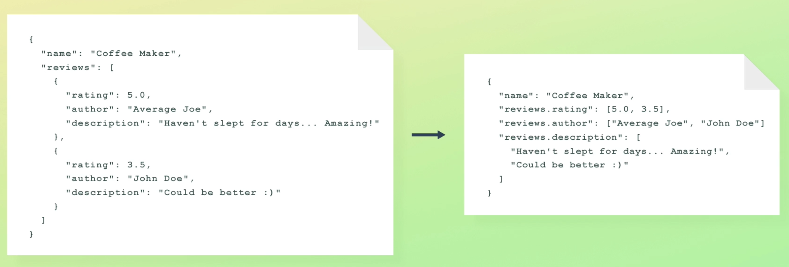
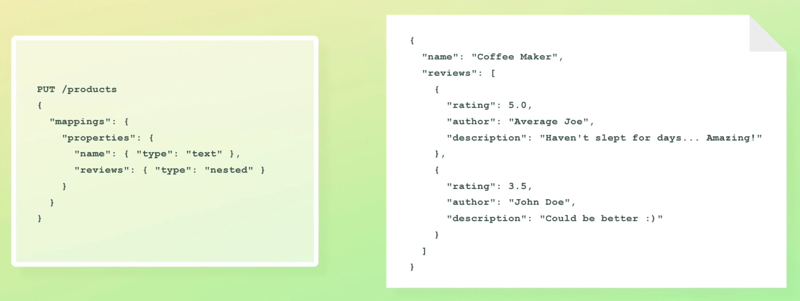
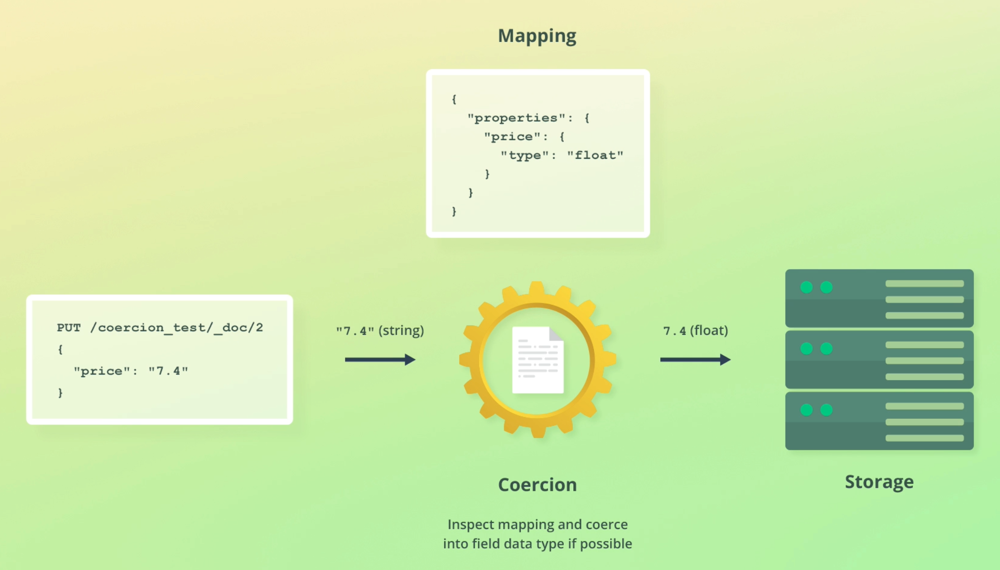
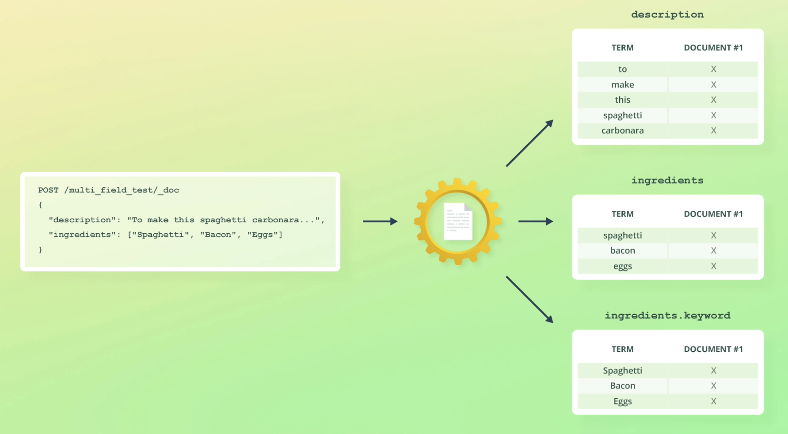
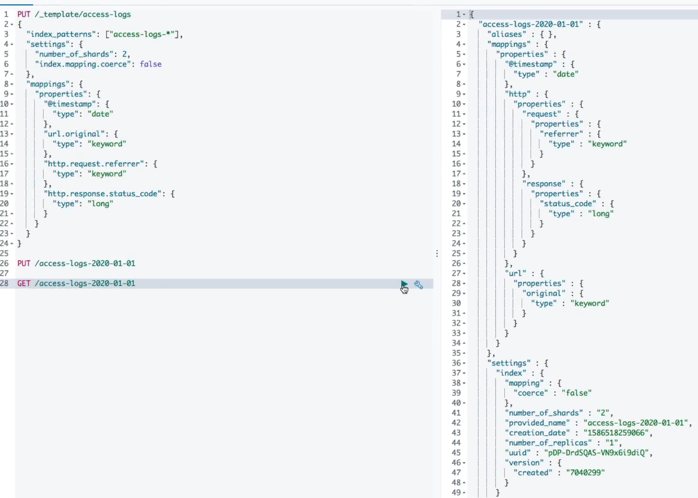

## :calendar: ES Mapping & Analysis

[:arrow_backward:](es_index)

[toc]

### Text analysis

Before document is stored it goes through analyzing process. **Analyzer** is used to process the text and it consists of 3 building blocks: character filters, tokenizer and token filters.

##### Character filters

- May transform text by adding, removing, changing characters
- Can be zero or more character filters that are applied in the order. For example filter `html_strip` removes html code

##### Tokenizer

An analyzer contains **one** tokenizer, which is responsible for tokenizing (splitting the text into tokens).

##### Token filters

These receive the tokens that the tokenizer produced as input and they may add, remove, or modify tokens. They are applied in the order in which they are specified. An example could be the `lowercase` filter.

Equivalent to `standard` analyzer:

```json
POST /_analyze
{
  "text": "2 guys walk into   a bar, but the third... DUCKS! :-)",
  "char_filter": [],
  "tokenizer": "standard",
  "filter": ["lowercase"]
}
```


#### Inverted Indices

- Values for a text field are analyzed and the results are stored within an inverted index (mapping between terms and which documents contain them)
- Each field has a dedicated inverted index

- Inverted indices contains terms, document IDs, information for relevance scoring
- Fields with other data types use different data structures. Numeric, date and geo fields are all stored as BKD trees
- Created and maintained by Apache Lucene, *not* Elasticsearch


### Mapping

There are two types: explicit and dynamic mapping. In explicit, if we'll define new field with a new type it will add this field just as in dynamic one.

#### Data types

##### object data type

- used for any JSON object

- mapped using the `properties` parameter

- objects are **not** stored as objects is Apache Lucene (they are *flattened* like `manufacturer.name`, `manufacturer.country`)

- if there are duplicates the values will be indexed as an array. It can be quite bad because we are loosing relationships:

  
  when trying to query product with author `"John Doe"` **and** rating `4.0`, it will turn into **or** because of an array data type stored. To solve it there is `nested` data type

##### `nested` data type

- similar to the `object` data type, but maintains object relationships
  
- enables to query objects independently (because they are stored as **hidden documents**)

##### `keyword` data type

- used for exact matching of values
- used for filtering, aggregations, sorting (e.g. articles with a status of PUBLISHED)
- are analyzed with the `keyword` analyzer 
  - no-op analyzer, just outputs the unmodified string as a single token
  - this token is then places into the inverted index

##### array data type

- array values *should* be of the same data type 

  - coercion can save us in some cases to preserve this constraint, but when inserting, the array should have been already created

  - if creating a field mapping with dynamic mapping, an array **must** contain the same data type to make coercion work
- before analyzed the strings are simply concatenated; in case of non-text fields, the values are not analyzed, and multiple values are stored within Apache Lucene


`date` data type

- supported formats:
  - a date *without* time
  - a date *with* time
  - milliseconds since the epoch (long)
- UTC time zone if none is specified
- stored as milliseconds since the epoch (long), will cast to it if other valid format


#### Type coercion



- Coercion will cast the data but in the `_source` we'll get `"7.4"`, because it contains the original values that we indexed
- But these (`_source`) are not the values that ES uses internally when searching for data (`7.4`), it uses indexed values (in our case `float`'s, not `string`'s)
- Type coercion won't work for dynamic mapping
  - Supplying `"7.4"` for a new field will create a `text` mapping 


#### Adding explicit mapping

```json
PUT /reviews
{
  "mappings": {
    "properties": {
      "rating": { "type": "float" },
      "content": { "type": "text" },
      "product_id": { "type": "integer" },
      "author": {
        "properties": {
          "first_name": { "type": "text" },
          "last_name": { "type": "text" },
          "email": { "type": "keyword" }
        }
      }
    }
  }
}
```

Indexing a test document:

```json
PUT /reviews/_doc/1
{
  "rating": 5.0,
  "content": "Outstanding course! Bo really taught me a lot about Elasticsearch!",
  "product_id": 123,
  "author": {
    "first_name": "John",
    "last_name": "Doe",
    "email": "johndoe123@example.com"
  }
}
```

##### Retrieving mapping

Examples can be found [here](https://github.com/codingexplained/complete-guide-to-elasticsearch/blob/master/Mapping%20%26%20Analysis/retrieving-mappings.md).

##### Put mapping

Examples [here](https://github.com/codingexplained/complete-guide-to-elasticsearch/blob/master/Mapping%20%26%20Analysis/adding-mappings-to-existing-indices.md).


#### Missing fields

- All fields in Elasticsearch are optional
- We can leave out a field when indexing documents
- Need to perform integrity check at the application level, like required fields
- Adding a field mapping does *not* make a field required

 

### Mapping parameters

**`format` parameter**

- customize the format for `date` fields

**`properties` parameter**

- defines nested fields for `object` and `nested` fields 

**`coerce` parameter**

- enable or disable coercion of values (enabled by default)

**`doc_values` parameter**

- another data structure used by Apache Lucene for a different data access pattern (instead of looking up terms and finding the documents, we look up the document and find its terms for a field)
- "uninverted" inverted index (*additional* data structure, not replacement)
- used for sorting, aggregations, scripting (if not using then we can disable `doc_values`)
- cannot be changed without reindexing documents into new index

**`norms` parameter**

- refers to the storage of various normalization factors that are used to compute relevance scores
- can be disabled to save disk space 
- for some filter (or aggregation) fields, like "tags", we can disable `norms` parameter because this is just a waste of disk space

**`index` parameter**

- disable indexing for a field (still stored within `_source`)
- save disk space and slightly improves indexing
- often used for time series data

**`null_value` parameter**

- use this parameter to replace NULL values with another value
- in the `_source` there will be still NULL

**`copy_to` parameter**

- used to copy multiple field values into a "group field"
- specify the name of the target field as the value
- *values* are copied, not terms/tokens (so they are then analyzed with the analyzer of the target field)
- not the part of the `_source` object


#### Update existing mapping

Generally, ES field mapping **cannot be changed**, because we'll need fully reindexing.  Only a few parameters can be updated (like for a `text` field we can add parameter `ignore_above`).

Also field mappings cannot be removed, so we just ignore such fields we don't need.


#### Reindexing documents

Often there is a need to configure moving documents from one index to another. Reindex API helps with that with performing reindexing operations in batches. An example:

```json
POST /_reindex
{
  "source": {
    "index": "reviews"
  },
  "dest": {
    "index": "reviews_new"
  }
}
```

Suppose we have changed `product_id` from `integer` (`reviews` index)  to `keyword` (`reviews_new` index). Some important information about `_source` after reindexing:

- `_source` contains the field values supplied at index time
- we use `_source` values from search results and we would expect a string for a `keyword` field, so we'll need modify the `_source` value while reindexing

##### Modifying documents when reindexing

Suppose we need to convert `product_id` values to strings:

```json
POST /_reindex
{
  "source": {
    "index": "reviews"
  },
  "dest": {
    "index": "reviews_new"
  },
  "script": {
    "source": """
      if (ctx._source.product_id != null) {
        ctx._source.product_id = ctx._source.product_id.toString();
      }
    """
  }
}
```

##### Reindex documents matching a query

```json
POST /_reindex
{
  "source": {
    "index": "reviews",
    "query": {
      "match_all": { }
    }
  },
  "dest": {
    "index": "reviews_new"
  }
}
```

##### Removing fields (source filtering)

```json
POST /_reindex
{
  "source": {
    "index": "reviews",
    "_source": ["content", "created_at", "rating"]
  },
  "dest": {
    "index": "reviews_new"
  }
}
```

##### Changing a fields name

```json
POST /_reindex
{
  "source": {
    "index": "reviews"
  },
  "dest": {
    "index": "reviews_new"
  },
  "script": {
    "source": """
      # Rename "content" field to "comment"
      ctx._source.comment = ctx._source.remove("content");
    """
  }
}
```


#### Field aliases

Field names can be changed without reindexing documents using *field aliases*. Actually it won't be changed but there will be another variant of how we could query a certain field. An example:

```java
PUT /reviews/_mapping
{
  "properties": {
    "comment": {
      "type": "alias",
      "path": "content"
    }
  }
}
```

Now, we are able to query with both "comment" and "content" names for a field.

Other facts about aliases:

- aliases doesn't affect indexing, because it's only for query-level construct
- ES also supports *index* aliases


#### Multi-field mapping

```json
PUT /multi_field_test
{
  "mappings": {
    "properties": {
      "description": {
        "type": "text"
      },
      "ingredients": {
        "type": "text",
        "fields": {
          "keyword": {
            "type": "keyword"
          } } } } }
}
```

It leads to:




#### Index templates

- They are applied to indices that match one or more patterns
- Patterns may include wildcards (*)
- Useful for naming log files

  


### Elastic Common Schema (ECS)

This is a specification of common fields and how they should be mapped. Was created to overcome the challenges of having different field names for the same things, such as @timestamp (can get logs from several applications). There are many of those system fields that can be found [here](https://www.elastic.co/guide/en/ecs/current/ecs-field-reference.html).

In ECS, documents are referred to as *events*.


### Dynamic mapping

We can disable dynamic mapping with setting `"dynamic": false`. It will result in:

- New fields are ignored (still part of the `_source` but not indexed); the value not being indexed is a consequence of no field mapping being added

There is third possible option called `strict`:

- ES will reject unmapped fields

#### Dynamic templates

They are used when dynamic mapping is enabled and a new field is encountered. An example:

```json
PUT /dynamic_template_test
{
  "mappings": {
    "dynamic_templates": [
      {
        "integers": {
          "match_mapping_type": "long",
          "mapping": {
            "type": "integer"
          } } }
    ]
  }
}
```

Now, when we'll try to post a document with an `long` field, it will be casted to an `integer`.

There are number of other options:

- `match` and `unmatch` parameters
  - specify conditions for field names
  - match include, unmatch - exclude
  - support patterns with wildcards (*)
- `path_match` and `path_unmatch` parameters
  - match the full field path, instead of just field name


#### Mapping recommendations

1. Use explicit mappings

   * Dynamic mapping is convenient, but often not a good idea in production
   * Save disk space with optimized mappings
   * Set `dynamic` to "strict", not false

2. Don't always map strings as both `text` and `keyword`

   - For full-text search use `text` and for sorting, filtering, aggregations on `keyword`

3. Disable coercion

4. Mapping parameters

   - Set `doc_values` to false if no need in sorting, aggregations and scripting
   - Set `norms` to false if no need in relevance scoring
   - Set `index` to false if no need to filter on values

   Only worth the effort (in changing this parameters) when storing lots of documents (more than a million)


### Built-in analyzers

`standard` analyzer

- splits text at word boundaries and removes punctuation
  - done by the `standard` tokenizer
- lowercases with the `lowercase` token filter

`simple` analyzer

- splits into tokens when encountering anything else than letters
- lowercase letters with the lowercase `tokenizer`
  - performance hack to avoid passing through the input twice

`whitespace` analyzer

- splits text into tokens by whitespace
- does not lowercase letters

`keyword` analyzer

- no-op analyzer that leaves the input text intact
  - simply outputs it as a single token

`pattern` analyzer

- regular expression is used to match token separators
- by default lowercases

language analyzers


#### Custom analyzers

Configure the analyzer to remove Danish stop words:

```json
PUT /analyzer_test
{
  "settings": {
    "analysis": {
      "filter": {
        "danish_stop": {
          "type": "stop",
          "stopwords": "_danish_"
        }
      },
      "char_filter": {
        # Add custom character filters here
      },
      "tokenizer": {
        # Add custom tokenizers here
      },
      "analyzer": {
        "my_custom_analyzer": {
          "type": "custom",
          "char_filter": ["html_strip"],
          "tokenizer": "standard",
          "filter": [
            "lowercase",
            "danish_stop",
            "asciifolding"
          ]
        }
      }
    }
  }
}
```

More examples [here](https://github.com/codingexplained/complete-guide-to-elasticsearch/blob/master/Mapping%20%26%20Analysis/creating-custom-analyzers.md).


#### Adding analyzers to existing indices

##### Open & closed indices

- An open index is available for indexing and search queries
- A closed index will refuse requests
- If we can't close an index then the alternative will be to reindex documents into a new index 
  - with the updated settings
  - use an index alias for the transition

##### Dynamic and static settings

- Dynamic settings can be changed without closing the index first
- Static settings require the index to be closed first
- Analysis settings are static settings


#### Updating analyzers

All queries for an updating can be found [here](https://github.com/codingexplained/complete-guide-to-elasticsearch/blob/master/Mapping%20%26%20Analysis/updating-analyzers.md). Note, that after updating an analyzer our index obtains a red flag - it is indexed by two different analyzers. So there is a need to reindex to:

```json
POST /analyzer_test/_update_by_query?conflicts=proceed
```

