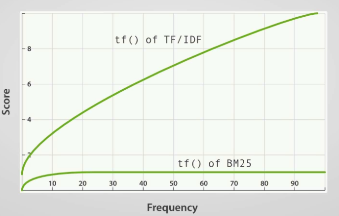
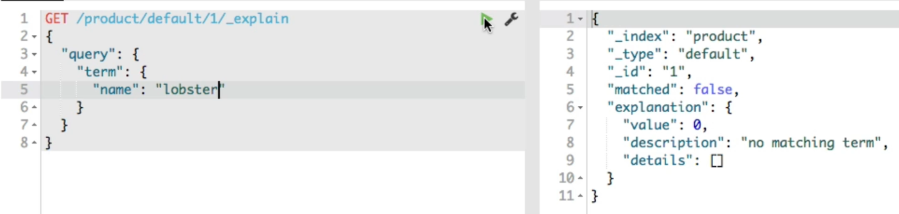
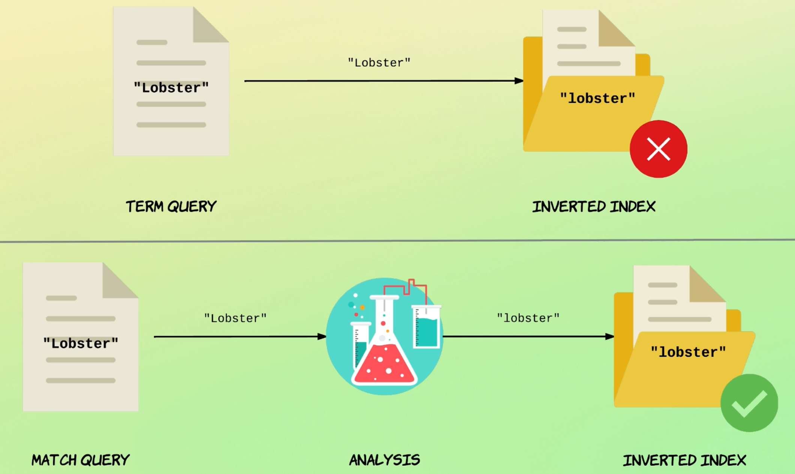
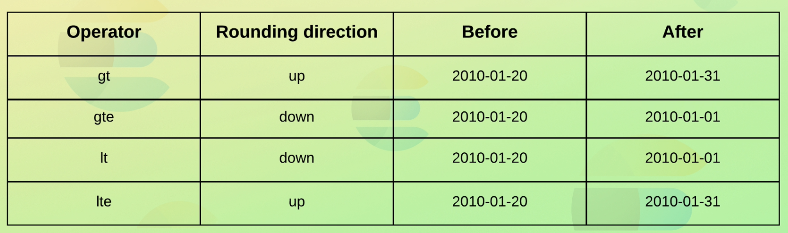
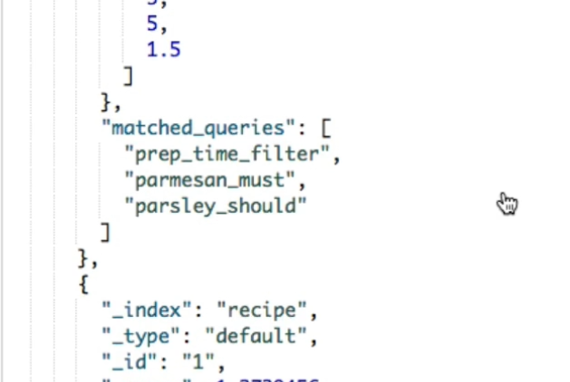

## :mag: ES Searching

[:arrow_backward:](es_index)

[toc]

### How searching works

- Each node can work as a coordinating node
- It can contain a shard that needs to be searched so it can look within himself
- Coordinated node then broadcasts the request to every other shard in the index, being either a primary or replica shard
- When each shard responds, the coordinated node merges all the results, sorts them and sends back to client

 :shipit

#### Relevance score

Until recently ES used **Term Frequency / Inverse Document Frequency** algorithm. Now, **Okapi BM25** is used.

##### Term Frequency (TF)

How many times does the term appear in the field for a given document?

**Inverse Document Frequency (IDF)**

How often does the term appear within the index (across all documents). The more it appears - the lower score is.

**Field-length norm**

How long is the field? The longer the field, the less likely the word within a field are to be relevant. The term "salad" in a description of 50 characters is more significant (so more weight) than in 5000 characters description.

#### BM25

- Better at handling stop words
- Uses **Nonlinear Term Frequency Saturation** (has an upper limit of how much a term relevance can be boosted)
  

- Improves the field-length norm factor
- Can be configured with parameters


#### Debugging queries

In case when we aren't sure why our query didn't work, we can call Explain API for some explanation:




#### Query Context vs Filter Context

We can also add query clauses within a filter context (in the case above from debugging queries we had "query"). It almost works the same but within a filter context **no relevance scores** are calculated (because it's only a boolean evaluation). 

Filtering is commonly used on dates, status, ranges. etc.


#### Full text queries vs Term level queries

- When running full text query (`match` parameter in query) our request string will be automatically analyzed and will look up for the same value in inverted index; in term level queries we omit analysis process

  


### Term level queries

##### Single term search

```json
GET /products/_search
{
  "query": {
    "term": {
      "is_active": true
    }
  }
}
```

##### Searching for multiple terms

```json
GET /products/_search
{
  "query": {
    "terms": {
      "tags.keyword": [ "Soup", "Cake" ]
    }
  }
}
```

##### Searching with non-null values 

```json
GET /products/_search
{
  "query": {
    "exists": {
      "field": "tags"
    }
  }
}
```

##### Searching with wildcards

Should start with `"Veg"` and end with `"ble"`:

```json
GET /products/_search
{
  "query": {
    "wildcard": {
      "tags.keyword": "Veg*ble"
    }
  }
}
```

For a single character we add a question mark (`Veget?ble`) to match.

##### Searching with regex

```json
GET /products/_search
{
  "query": {
    "regexp": {
      "tags.keyword": "Veg[a-zA-Z]+ble"
    }
  }
}
```

##### Other examples

- Searching with ids [examples](https://github.com/jamescalam/transformers/blob/main/course/attention/01_dot_product_attention.ipynb)

- Searching with range values [examples](https://github.com/codingexplained/complete-guide-to-elasticsearch/blob/master/Term%20Level%20Queries/matching-documents-with-range-values.md)

- Matching based on prefixes [example](https://github.com/codingexplained/complete-guide-to-elasticsearch/blob/master/Term%20Level%20Queries/matching-based-on-prefixes.md) 

  

#### Working with relative dates



Subtracting one year from `2010/01/01`:

```json
GET /products/_search
{
  "query": {
    "range": {
      "created": {
        "gte": "2010/01/01||-1y"
      }
    }
  }
}
```

Matching documents with a `created` field containing the current date or later:

```json
GET /products/_search
{
  "query": {
    "range": {
      "created": {
        "gte": "now"
      }
    }
  }
}
```

Other examples [here](https://github.com/codingexplained/complete-guide-to-elasticsearch/blob/master/Term%20Level%20Queries/working-with-relative-dates.md).


### Full text queries

**Standard `match` query**

```json
GET /recipe/_search
{
  "query": {
    "match": {
      "title": "Recipes with pasta or spaghetti"
    }
  }
}
```

##### Specifying a boolean operator

```json
GET /recipe/_search
{
  "query": {
    "match": {
      "title": {
        "query": "pasta or spaghetti",
        "operator": "and"
      }
    }
  }
}
```

The order of words in query doesn't matter.

##### Matching phrases

If we want to follow the order of words and search for a concrete phrase:

```json
GET /recipe/_search
{
  "query": {
    "match_phrase": {
      "title": "spaghetti puttanesca"
    }
  }
}
```

##### Searching multiple fields

```json
GET /recipe/_search
{
  "query": {
    "multi_match": {
      "query": "pasta",
      "fields": [ "title", "description" ]
    }
  }
}
```


### Querying with bool logic

We can use bool logic both inside query and filter context. 

##### With query context

```json
GET /recipe/_search
{
  "query": {
    "bool": {
      "must": [
        {
          "match": {
            "ingredients.name": "parmesan"
          }
        },
        {
          "range": {
            "preparation_time_minutes": {
              "lte": 15
            }  }  }  ]  }  }
}
```

##### With filter context

```json
GET /recipe/_search
{
  "query": {
    "bool": {
      "must": [
        {
          "match": {
            "ingredients.name": "parmesan"
          }
        }
      ],
      "filter": [
        {
          "range": {
            "preparation_time_minutes": {
              "lte": 15
            }  }  }  ]  }  }
}
```

Above example would be more applicable because parameter `preparation_time_minutes` should work only as a filter (relevance score is redundant so it will omit in the calculation of final score).

##### The `should` key

It will boost the score if query within `should` key will match but it's actually not required to.

##### Debugging bool queries with named queries

```json
GET /recipe/_search
{
    "query": {
        "bool": {
          "must": [
            {
              "match": {
                "ingredients.name": {
                  "query": "parmesan",
                  "_name": "parmesan_must"
                }  }  }
          ],
          "must_not": [
            {
              "match": {
                "ingredients.name": {
                  "query": "tuna",
                  "_name": "tuna_must_not"
                }  }  }
          ],
          "should": [
            {
              "match": {
                "ingredients.name": {
                  "query": "parsley",
                  "_name": "parsley_should"
                }  }  }
          ],
          "filter": [
            {
              "range": {
                "preparation_time_minutes": {
                  "lte": 15,
                  "_name": "prep_time_filter"
                }  }  }  ]  }  }
}
```

In the result for each document we'll see `matched_queries`:



##### How the `match` query works

Match query is a wrapper around the `bool` query that simplifies writing common queries. The two queries below are equivalent:

```json
GET /recipe/_search
{
  "query": {
    "match": {
      "title": {
        "query": "Pasta carbonara",
        "operator": "and"
      }  }  }
}
```

```json
GET /recipe/_search
{
  "query": {
    "bool": {
      "must": [
        {
          "term": {
            "title": "pasta"
          }
        },
        {
          "term": {
            "title": "carbonara"
          }  }  ]  }  }
}
```

The only difference is that `match` query goes through analyzing and `term` query no (immediately compares within inverted index table). That's why it produces the same result.

