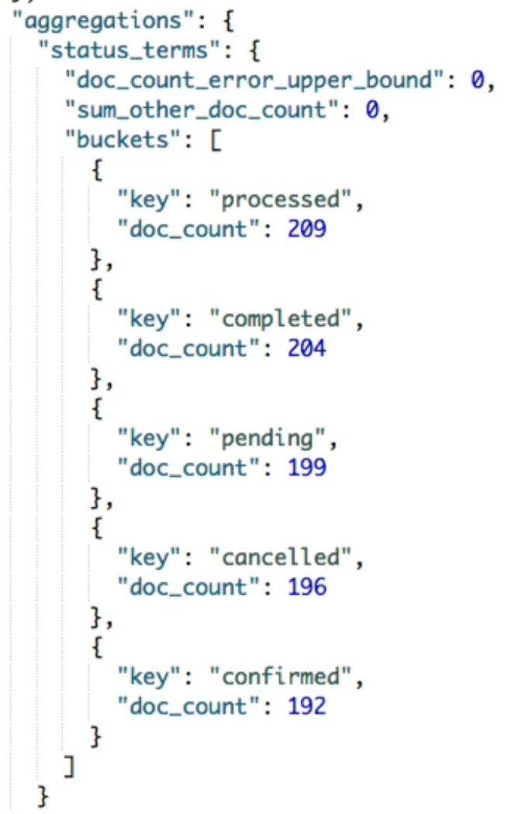
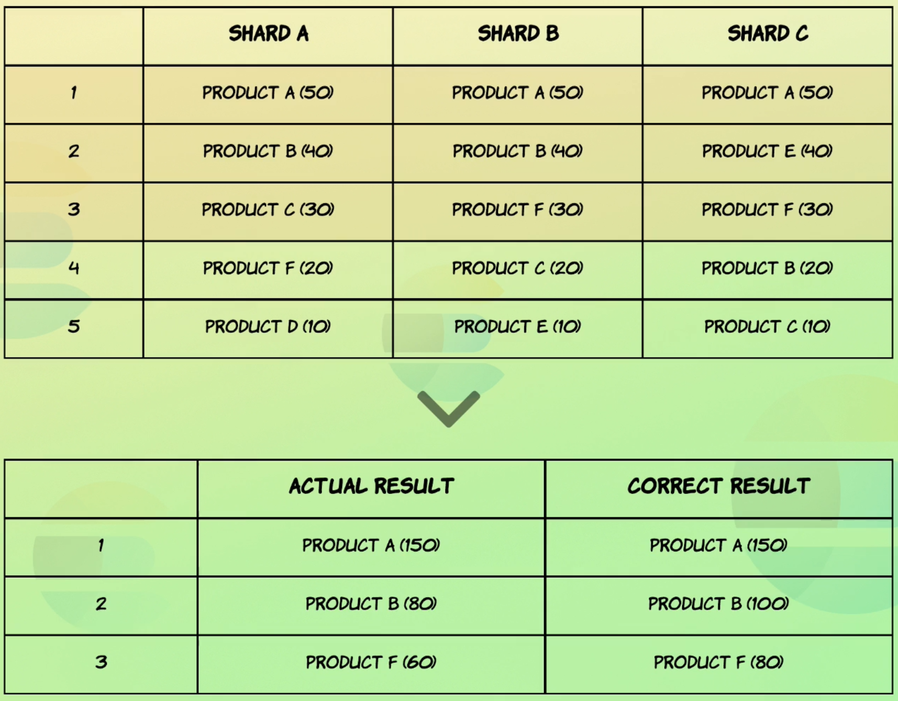
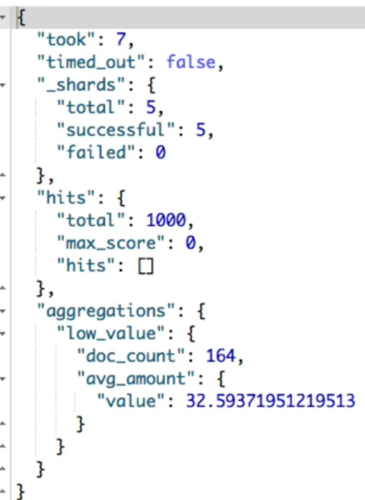
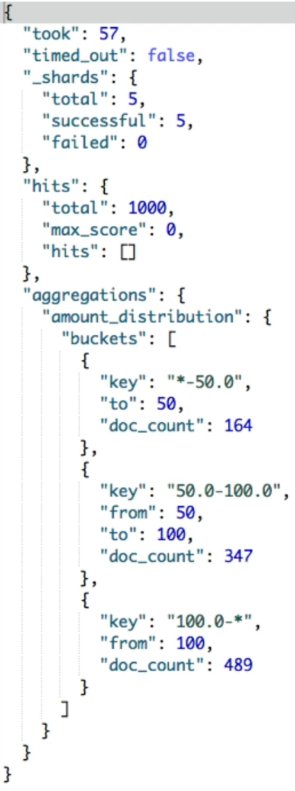
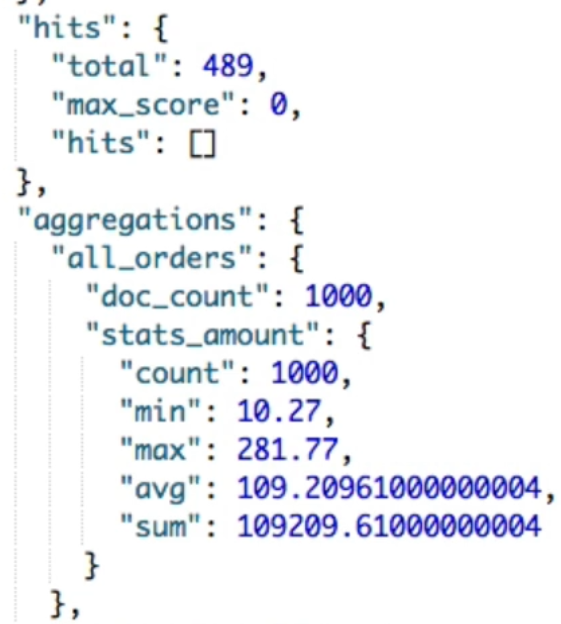

## :ant: Aggregations

[:arrow_backward:](es_index)

[toc]

### Metric aggregations

Calculating statistics with `sum`, `avg`, `min`, and `max` aggregations:

```json
GET /order/_search
{
  "size": 0,
  "aggs": {
    "total_sales": {
      "sum": {
        "field": "total_amount"
      }
    },
    "avg_sale": {
      "avg": {
        "field": "total_amount"
      }
    },
    "min_sale": {
      "min": {
        "field": "total_amount"
      }
    },
    "max_sale": {
      "max": {
        "field": "total_amount"
      }
    }
  }
}
```

Retrieving the number of distinct values:

```json
GET /order/_search
{
  "size": 0,
  "aggs": {
    "total_salesmen": {
      "cardinality": {
        "field": "salesman.id"
      }
    }
  }
}
```

Retrieving the number of values:

```json
GET /order/_search
{
  "size": 0,
  "aggs": {
    "values_count": {
      "value_count": {
        "field": "total_amount"
      }
    }
  }
}
```

Using `stats` aggregation for common statistics:

```json
GET /order/_search
{
  "size": 0,
  "aggs": {
    "amount_stats": {
      "stats": {
        "field": "total_amount"
      }
    }
  }
}
```


### Bucket aggregations

Instead of calculating metrics for fields, bucket aggregations create buckets of documents.

Lets create a bucket for each `status` value:

```json
GET /order/_search
{
  "size": 0,
  "aggs": {
    "status_terms": {
      "terms": {
        "field": "status"
      }
    }
  }
}
```

It gives the next result:



##### Documents counts are approximate




#### Nested aggregations

Bucket aggregations combined with inner metric aggregations. For example retrieving statistics for each status:

```json
GET /order/_search
{
  "size": 0,
  "aggs": {
    "status_terms": {
      "terms": {
        "field": "status"
      },
      "aggs": {
        "status_stats": {
          "stats": {
            "field": "total_amount"
          }  }  }  }  }
}
```

##### Filtering out documents

```json
GET /order/_search
{
  "size": 0,
  "aggs": {
    "low_value": {
      "filter": {
        "range": {
          "total_amount": {
            "lt": 50
          }
        }
      },
      "aggs": {
        "avg_amount": {
          "avg": {
            "field": "total_amount"
          }  }  }  }  }
}
```

First it aggregates `filter` and then `avg` aggregation in that context. Produces next output:




#### Defining bucket rules with filters

```json
GET /recipe/_search
{
  "size": 0,
  "aggs": {
    "my_filter": {
      "filters": {
        "filters": {
          "pasta": {
            "match": {
              "title": "pasta"
            }
          },
          "spaghetti": {
            "match": {
              "title": "spaghetti"
            }
          } } } } }
}
```


### Range aggregations

##### `range` aggregation

```json
GET /order/_search
{
  "size": 0,
  "aggs": {
    "amount_distribution": {
      "range": {
        "field": "total_amount",
        "ranges": [
          {
            "to": 50
          },
          {
            "from": 50,
            "to": 100
          },
          {
            "from": 100
          }
        ]
      }
    }
  }
}
```

Produces:



##### `date_range` aggregation

```json
GET /order/_search
{
  "size": 0,
  "aggs": {
    "purchased_ranges": {
      "date_range": {
        "field": "purchased_at",
        "ranges": [
          {
            "from": "2016-01-01",
            "to": "2016-01-01||+6M"
          },
          {
            "from": "2016-01-01||+6M",
            "to": "2016-01-01||+1y"
          }
        ]
      }
    }
  }
}
```


### Histograms

Distribution of `total_amount` with interval `25`:

```json
GET /order/_search
{
  "size": 0,
  "aggs": {
    "amount_distribution": {
      "histogram": {
        "field": "total_amount",
        "interval": 25
      }
    }
  }
}
```

We can add next parameters within `histogram`:

- `min_doc_count` - requiring minimum number of documents
- `extended_bounds` - fixed bucket boundaries

##### `date_histogram` aggregation

```json
GET /order/_search
{
  "size": 0,
  "aggs": {
    "orders_over_time": {
      "date_histogram": {
        "field": "purchased_at",
        "calendar_interval": "month"
      }
    }
  }
}
```


### `global` aggregation

Break out of the aggregation context and use all docs:

```json
GET /order/_search
{
  "query": {
    "range": {
      "total_amount": {
        "gte": 100
      }
    }
  },
  "size": 0,
  "aggs": {
    "all_orders": {
      "global": { },
      "aggs": {
        "stats_amount": {
          "stats": {
            "field": "total_amount"
          } } } } }
}
```

Next result: 



  

### Missing field values

Aggregating documents with missing field value:

```json
POST /order/_doc/1001
{
  "total_amount": 100
}
POST /order/_doc/1002
{
  "total_amount": 200,
  "status": null
}

GET /order/_doc/_search
{
  "size": 0,
  "aggs": {
    "orders_without_status": {
      "missing": {
        "field": "status.keyword"
      }
    }
  }
}
```

