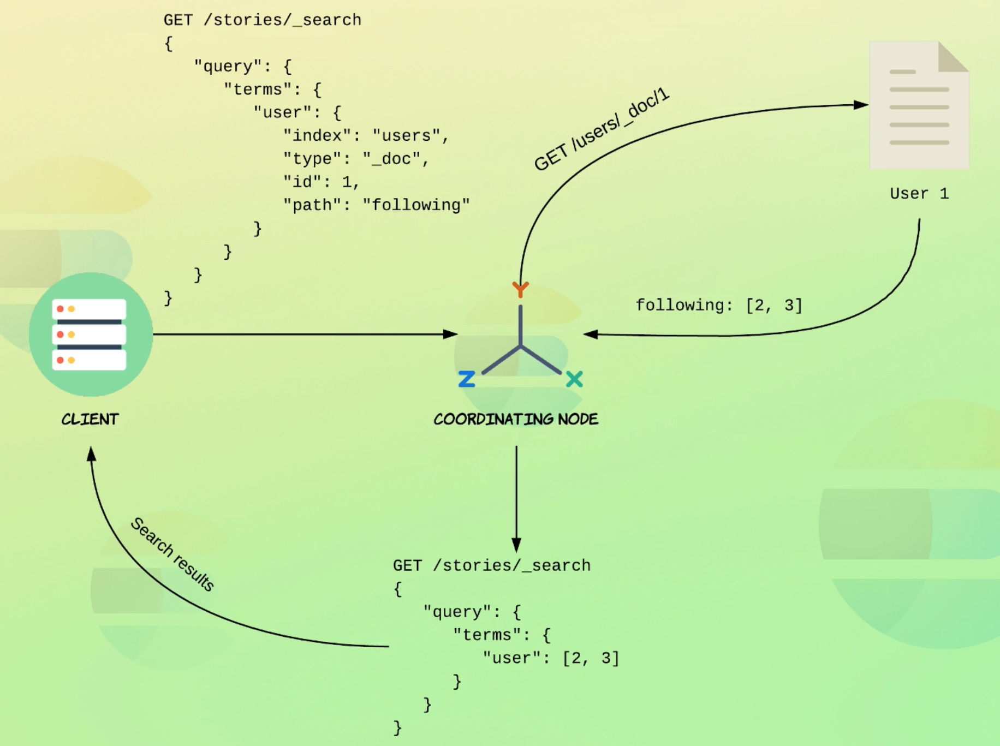

## :two_women_holding_hands: Joining Queries

[:arrow_backward:](es_index)

[toc]

#### Querying nested objects

```json
GET /department/_search
{
  "query": {
    "nested": {
      "path": "employees",
      "inner_hits": {},
      "query": {
        "bool": {
          "must": [
            {
              "match": {
                "employees.position": "intern"
              }
            },
            {
              "term": {
                "employees.gender.keyword": {
                  "value": "F"
                }  
              }  }  ]  }  }  }
  }
}
```

- It wouldn't work without `nested` key because the associations between the object properties are lost (`persons.name: ["Bo Andersen", "Fogell McLovin"]`)

- `inner_hits` means that it will show not just hits on department that contained such nested objects but will show what specific nested objects were hit.

  

####  Mapping document relationships

 Define `department` as parent for `employee` with `join` field:

```json
PUT /department/_mapping
{
  "properties": {
    "join_field": { 
      "type": "join",
      "relations": {
        "department": "employee"
      }
    }
  }
}
```

##### Adding documents

Adding departments:

```json
PUT /department/_doc/1
{
  "name": "Development",
  "join_field": "department"
}
```

and employees for departments:

```json
PUT /department/_doc/3?routing=1
{
  "name": "Bo Andersen",
  "age": 28,
  "gender": "M",
  "join_field": {
    "name": "employee",
    "parent": 1
  }
}
```

Parent document and all of it's child documents must be placed on the same shard. That's why we add a `routing` parameter which is the same as `_id` of a parent.

##### Querying by parent

By parent `id`:

```json
GET /department/_search
{
  "query": {
    "parent_id": {
      "type": "employee",
      "id": 1
    }
  }
}
```

ES automatically uses `id` value of the parent document to figure out which shard the documents are placed on.  

We can specify conditions that the parent document should satisfy:

```json
GET /department/_search
{
  "query": {
    "has_parent": {
      "parent_type": "department",
      "score": true,
      "query": {
        "term": {
          "name.keyword": "Development"
        }
      }
    }
  }
}
```

We've also incorporated the parent documents' relevance scores (score will be added to child's).

##### Querying parent by child documents

```json
GET /department/_search
{
  "query": {
    "has_child": {
      "type": "employee",
      "score_mode": "sum",
      "query": {
        "bool": {
          "must": [
            {
              "range": {
                "age": {
                  "gte": 50
                }
              }
            }
          ],
          "should": [
            {
              "term": {
                "gender.keyword": "M"
              } } ] } } } }
}
```

`score_mode: "sum"` means that all relevance score from child will be summed and displayed as for parent.

##### Terms lookup mechanism

Querying stories from a user's followers:

```json
PUT /users/_doc/1
{
  "name": "John Roberts",
  "following" : [2, 3]
}
PUT /users/_doc/2
{
  "name": "Elizabeth Ross",
  "following" : []
}

PUT /stories/_doc/2
{
  "user": 1,
  "content": "Just another day at the office... #coffee"
}

GET /stories/_search
{
  "query": {
    "terms": {
      "user": {
        "index": "users",
        "id": "1",
        "path": "following"
      }
    }
  }
}
```

Work as following:




#### Join limitations

- Documents must be stored within the same index (for performance reasons)
- Parent & child documents must be on the same shard
- Only one join field per index
- Only one parent document (but multiple children, aka many-to-one is possible)


#### Join field performance considerations

- Generally slow
- The more child documents pointing to unique parents, the slower the `has_child` query is
- The number of parent documents slows down the `has_parent` query

You need to **denormalize** data instead of mapping document relationships.