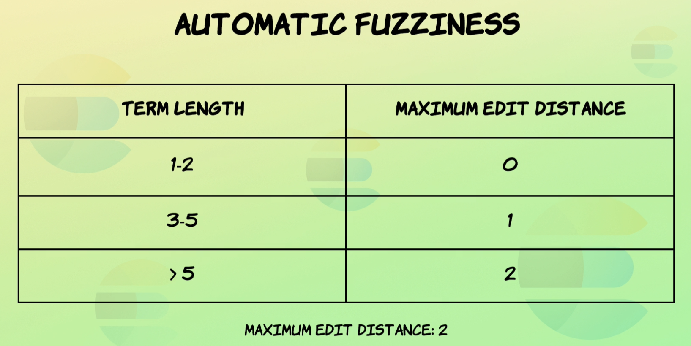
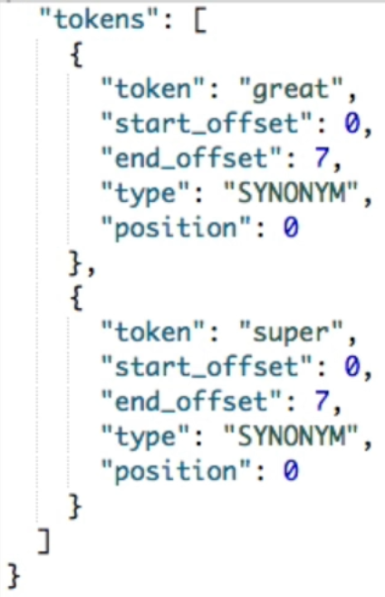
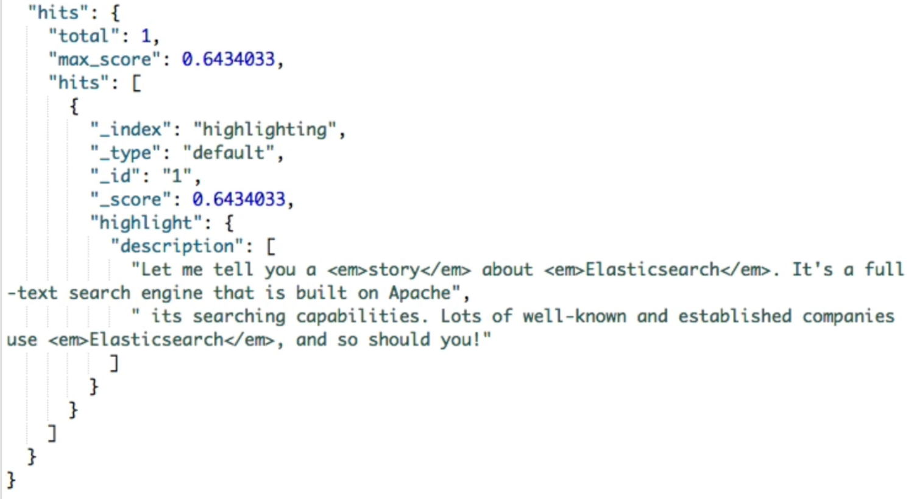

## :restroom: Improving Search Results

[:arrow_backward:](es_index)

[toc]

#### Proximity searches

When writing a `match_phrase` query sometimes it can be too strict in case of strict word-to-word position. Adding the `slop` parameter can help us:

```json
GET /proximity/_search
{
  "query": {
    "match_phrase": {
      "title": {
        "query": "spicy sauce",
        "slop": 1
      }
    }
  }
}
```

In this example the string "Spicy tomato sauce" will match the query.


#### Affecting relevance scoring with proximity

We can boost the relevance score by adding `match_phrase` after query match: 

```json
GET /proximity/_search
{
  "query": {
    "bool": {
      "must": [
        {
          "match": {
            "title": {
              "query": "spicy sauce"
            }
          }
        }
      ],
      "should": [
        {
          "match_phrase": {
            "title": {
              "query": "spicy sauce"
            }
          } 
        } ] } }
}
```

So if there will be specific phrase `"spicy sause"` in the document then the relevance score will be much higher then other matched documents with just containing those words. 


#### Fuzzy match query (handling typos)

*Fuzziness* is how much characters we need to change to have our query match the phrase. We can set this parameter to `auto` or a specific number. Fuzziness applies to each term individually. 

##### `auto` fuzziness



```json
GET /products/_search
{
  "query": {
    "match": {
      "name": {
        "query": "l0bster",
        "fuzziness": "auto"
      } } }
}
```

##### Transpositions

```json
GET /products/_search
{
  "query": {
    "match": {
      "name": {
        "query": "lvie",
        "fuzziness": 1
      } } }
}
```

 We can also disable it with `"fuzzy_transpositions": false`.

##### `fuzzy` query

This is a term type query (not goes through analyzer) that uses fuzziness.

```json
GET /products/_search
{
  "query": {
    "fuzzy": {
      "name": {
        "value": "LOBSTER",
        "fuzziness": "auto"
      } } }
}
```


#### Adding synonyms

Creating index with custom analyzer:

```json
PUT /synonyms
{
  "settings": {
    "analysis": {
      "filter": {
        "synonym_test": {
          "type": "synonym", 
          "synonyms": [
            "awful => terrible",
            "awesome => great, super",
            "elasticsearch, logstash, kibana => elk",
            "weird, strange"
          ]
        }
      },
      "analyzer": {
        "my_analyzer": {
          "tokenizer": "standard",
          "filter": [
            "lowercase",
            "synonym_test"
          ]
        }
      }
    }
  },
  "mappings": {
    "properties": {
      "description": {
        "type": "text",
        "analyzer": "my_analyzer"
      }
    }
  }
}
```

Testing the analyzer:

```json
POST /synonyms/_analyze
{
  "analyzer": "my_analyzer",
  "text": "awesome"
}
```

Produces next result:



They both have the same `0` position. That's how it is stored within inverted index.

We can upload synonyms with parameter `synonyms_path`.


#### Highlighting matches in fields

```json
GET /highlighting/_search
{
  "_source": false,
  "query": {
    "match": { "description": "Elasticsearch story" }
  },
  "highlight": {
    "fields": {
      "description" : {}
    }
  }
}
```

Result:



We can also add `pre_tags` and `post_tags` for specifying a custom tag.