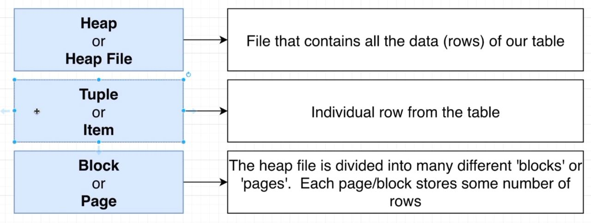
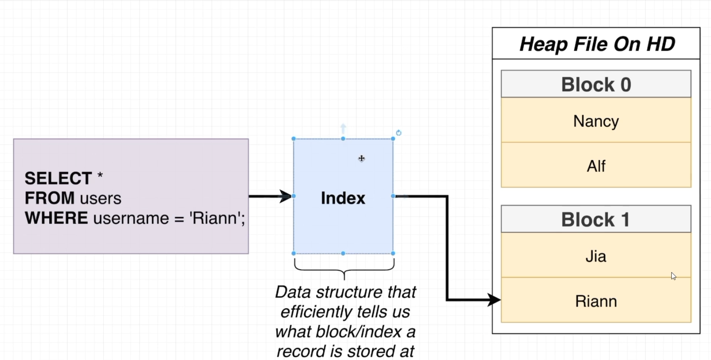
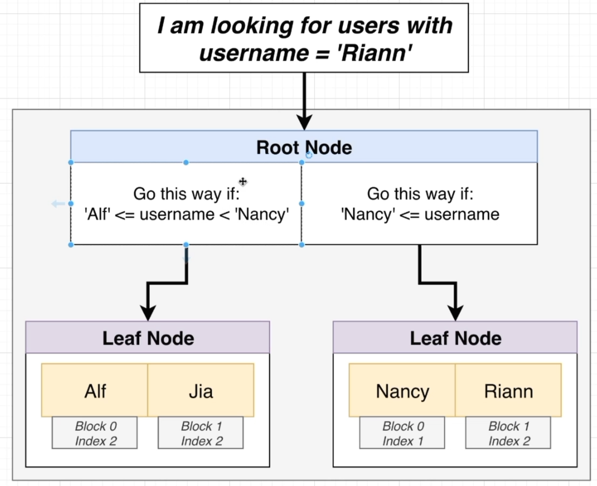

## PostgreSQL notes

[:arrow_backward:](databases_index)

[toc]

#### Performance

Need to minimize data that is going from a heap file to memory (RAM) when performing queries.

Full table scan - when it needs to load almsot all rows from the table = poor performance 

#### Index

Index structure - mostly B-tree

Downsides:

- Extra space 
- Slows down insert/update/delete - the index has to be updated
- Index might not get used

Postgres automatically creates an index for any 'unique' constraint, and also creates for every primary key in each table.

Clustered vs nonclustered (not in PostgreSQL):

> Since a database has to make two searches, first in the non-clustered index and then in the actual table, non-clustered indexes can be slower for search operations. However, for INSERT and UPDATE operations, non-clustered indexes are faster since the order of the records only needs to be updated in the index and not in the actual table.
>
> The INSERT and UPDATE operations are faster with non-clustered indexes since the actual records are not required to be sorted when an INSERT or UPDATE operation is performed. Rather only the non-clustered index needs updating.
>
> For example, if you have created an index on the “name” column and you want to select only the name, non-clustered indexes will quickly return the name.