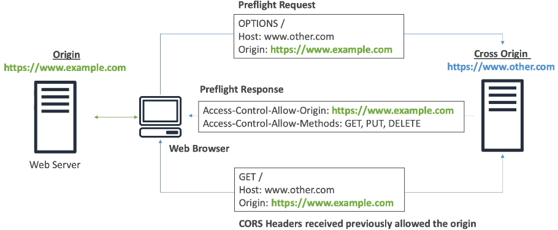
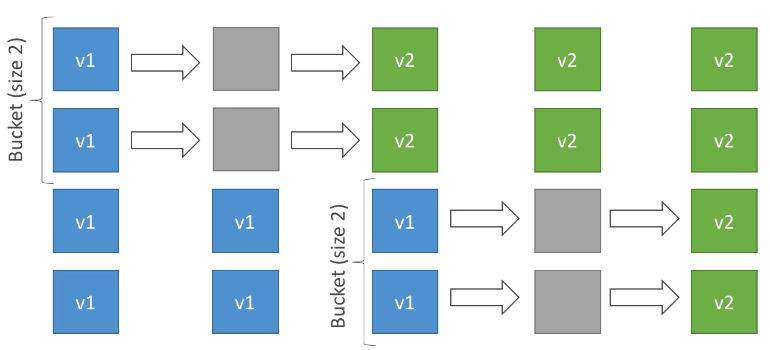

## AWS notes

[toc]

### EC2

Storage space:

- Network-attached (EBS & EFS)
- hardware (EC2 Instance Store

Security groups are acting as a "firewall" on EC2 instances, they regulate:

- Access to ports
- Authorized IPv4 and IPv6 IP ranges
- Control of inbound network (from other to the instance)
- Control of outbound network (from instance to other)

> When changing a region we should also create new security groups

> It's good to maintain one security group for SSH access

Errors:

- if the application is not accessible (timeout), then it could be a security group issue
- If gives a "connection refused" error, then it's an application error or it's not launched

#### Referencing other security groups


Connect via SSH:

```shell
 ssh -i .\ec2_tutorial.pem ec2-user@54.91.195.204
```

> :heavy_exclamation_mark: :heavy_exclamation_mark: :heavy_exclamation_mark:  Bad idea to configure aws from instance.


### EBS

- An EBS (Elastic Block Store) volume is a network drive you can attach to your instances while they run.
- Allows your instances to persist data, even after their termination 
- They only can be mounted to one instance at at time
- locked to an Availability Zone (AZ)
  - using snapshot we could move volume across
- We can move a snapshot to an "archive tier" that is 75% cheaper

#### EC2 instance store

If we need a high-performance hardware disk we use EC2 Instance store

- EC2 Instance store lose their storage if they're stopped (ephemeral)
- Good for buffer / cache / scratch data / temporary content

#### EFS

EFS - Elastic File System, works with EC2 instances in multi-AZ

- Mounting 100s of instances across AZ 

- Use cases: content management, web serving, data sharing, Wordpress
- Capacity scales automatically
- Move file after N days (for infrequent access, EFS-IA)


### AMI

AMI = Amazon Machine Image, customization of an EC2 instance

- May built an AMI from EC2 - this will also create EBS snapshots


### ELB

#### Scalability


Scalability means that an application can handle greater load by adapting. Two kinds of scalability: 

- Vertical scalability

  > increasing the size of the instance.

- Horizontal scalability (= elasticity)

  > It means increasing the number of instances.

#### High availability

High availability means running your application in at least 2 data centers (== Availability Zones). The goal of high availability is to survive a data center loss.

#### Load balancing

Why use it?

- Spread load across multiple downstream instances
- Expose a single point of access (DNS)
- Seamlessly handle failures of downstream instances
- Do regular health checks to your instances
- Provide SSL termination (HTTPS) for your websites
- Enforce stickiness with cookies
- High availability across zones
- Separate public traffic from private traffic

#### Classic Load Balancers (v1)

- Supports TCP (layer 4), HTTP & HTTPS (layer 7)

#### Application Load Balancer (v2)

- ALB is layer 7 (HTTP)
- Load balancing to multiple application on the same machine
- Support for HTTP/2 and WebSocket
- Routing tables to different target groups
  - Routing based on path in URL (example**/users** & example.com**/posts**)
  - Routing based on hostname in URL (one.example.com & other.example.com)
  - Routing based on Query String, Headers 
- Good for micro services & container-based application
  

- The application servers don't see the IP of the client directly
  - The true IP of the client is inserted in the header **X-Forwarded-For**
  - We can also get Port (X-Forwarded-Port) and proto (X-Forwarded-Proto)

#### Network Load Balancer (v2)

- Network load balancers (layer 4) allow to:
  - Forward TCP & UDP traffic to your instances
  - Handle millions of requests per seconds
  - Less latency ~ 100ms (vs 400ms for ALB)
- We may chain NLB with ALB

#### Gateway Load Balancer

- Deploy, scale, and manage a fleet of 3rd party network virtual appliances in AWS
- Operates at Layer 3 (Network layer) - IP packets
- Combines the following functions:
  - Transparent Network Gateway - single entry/exit for all trafic
  - Load Balancer - distributes traffic to your virtual appliances

#### SSL/TLS

- And SSL certificate allows traffic between your clients and your load balancer to be encrypted in transit (in-flight encryption)


### S3

Objects structure:

- Object (files) have a key (FULL path)
- Object values are the content of the body
  - Max object size is 5TB
  - If uploading more than 5GB, must uses multi-part upload
- Metadata (list of text key / value pairs)
- Tags
- Version ID

#### Encrypting

There are 4 methods of encrypting objects in S3:

- SSE-S3: encrypts S3 objects using keys handled & managed by AWS
  - Object is encrypted server side
  - AES-256 encryption type
  - Must set header: "x-amz-server-side-encryption":"AES256"
- SSE-KMS: leverage AWS Key Management Service to manage encryption keys
  - Advantages: user control + audit trail
  - Object is encrypted server side 
- SSE-C: server-side encryption using data keys fully managed by the customer outside of AWS
  - HTTPS must be used
  - Encryption key must provided in HTTP headers, for every HTTP request made
  - Server side encryption
- Client Side Encryption
  - Fully managing the keys and encryption cycle

#### Security

- User Based
  - IAM policies - which API calls should be allowed for a specific user from IAM console
- Resource Based 
  - Bucket Policies - bucket wide rules from the S3 console - allows cross account
    - Use it for granting public access to the bucket
    - Force objects to be encrypted at upload
    - Grant access to another account (Cross Account)
  - Object Access Control List (ACL) - finer grain
  - Bucket Access Control List (ACL) - less common

An IAM principal can access an S3 object if 

- the user IAM permissions allow it OR the resource policy ALLOWS it
- AND there's no explicit DENY

#### CORS

- An origin is a scheme (protocol), host (domain) and port
- CORS means Cross-Origin Resource Sharing
- Web Browser based mechanism to allow requests to other origins while visiting the main origin




### ECS

ECS = Elastic Container Service

- Launch Docker containers on AWS = Launch ECS Tasks on ECS Clusters

#### EC2 launch type
- With EC2 launch type you must provision & maintain the infrastructure (the EC2 instances)

- Each EC2 instance must run the ECS agent to register in the ECS Cluster

  


#### Fargate launch type

- You do not provision the infrastructure (no EC2 instances to manage)

- It's all Serverless

- AWS just runs ECS tasks based on the CPU / RAM needed4

  


#### IAM Roles for ECS

- EC2 Instance Profile (EC2 launch type only):

  - Used by the ECS agent
  - Makes API calls to ECS service
  - Pull Docker image from ECR

- ECS Task Role:

  - Allows each task to have a specific role
  - Use different roles for the different ECS Services you run

  


#### Scaling ECS

- ECS Auto Scaling uses AWS Application Auto Scaling
  - ECS Service CPU Utilization
  - ECS Service Average Memory Utilization - Scale on Ram
  - ALB Request Count Per Target - metric coming from the ALB

- Target Tracking - scale based on target value for a specific CloudWatch metric
- Step Scaling - scale based on a specified CloudWatch Alarm
- Scheduled Scaling - scale based on a specified date/time 

- ECS Service Auto Scaling (task level) != EC2 Auto Scaling (EC2 instance level)
- Fargate Auto Scaling is much easier to setup (because serverless)

#### Load Balancing ECS

##### EC2 Launch Type

- We get a Dynamic Host Port Mapping if you define only the container port in the task definition
- The ALB find the right port on your EC2 instances
- You must allow on the EC2 instance's Security Group any port from the ALB's Security Group


##### Fargate Launch Type

- Each task has a unique private IP
- Only define the container port (host port is not applicable)


In example above we enable:

- ECS ENI Security Group
  - Allow port 80 from the ALB
- ALB Security Group
  - Allow port 80/443 from web

#### IAM Roles in ECS


#### Environment Variables in ECS

- Hardcoded
- SSM Parameter Store - sensitive variables (API keys, shared configs)
- Secrets Manager - sensitive variables (DB passwords)


#### Data Volumes (Bind Mounts) in ECS

- Share data between multiple containers in the same Task definition
- Works for both EC2 and Fargate tasks
- EC2 Tasks - using EC2 instance storage
  - Data are tied to the lifecycle of the EC2 instance 
- Fargate Tasks - using ephemeral storage
  - Data are tied to the container(s) using them
  - 20 GiB - 200 GiB


### Elastic Beanstalk

Elastic Beanstalk is a developer centric view of deploying an application on AWS.

#### Deployment modes


#### Deployment options for updates

- All at once (deploy all in one go) - fastest, but instances aren't available to server traffic for a bit (downtime)
- Rolling: update a few instances at a time (bucket), and then move onto the next bucket once the first bucket is healthy



- Rolling with additional batches: like rolling, but spins up new instances to move the batch (so that the old application is still available)


- Immutable: spins up new instances in a new ASG, deploys version to these instances, and then swaps all the instances when everything is healthy

