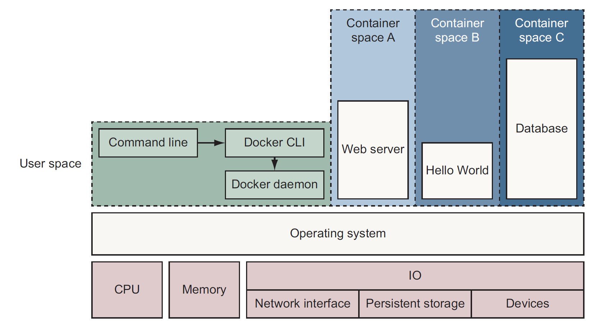
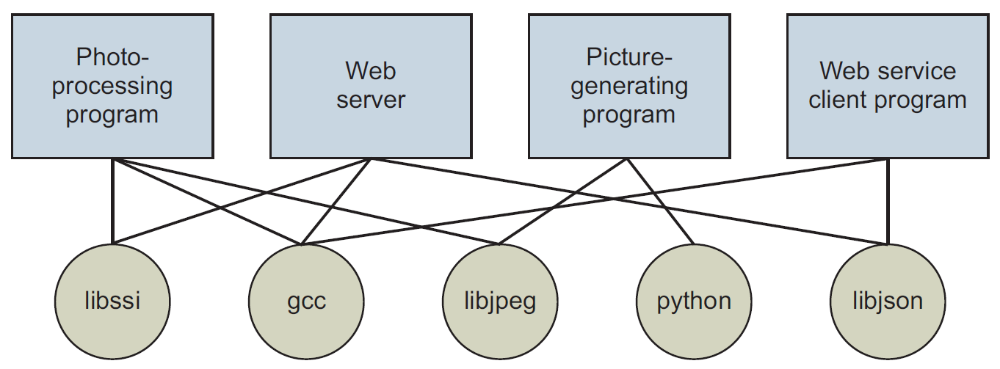
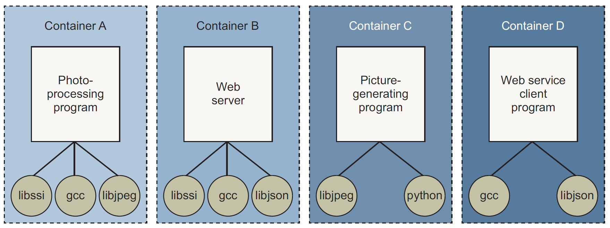
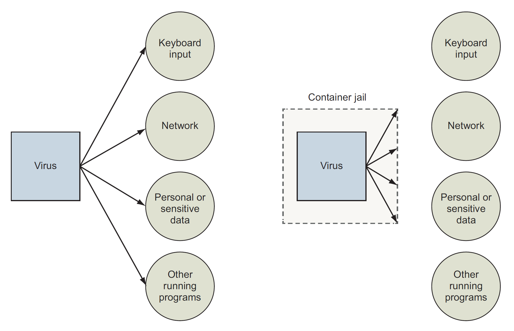

## :whale: Docker Introduction

[:arrow_backward:](../devops_index)

Docker is an open source project for building, shipping and running programs using an operating system technology called *containers*.

[toc]

##### Containers

Any software run with Docker is run inside a container. Dockers uses existing container engines to provide consistent containers built according to best practices.

##### Containers are not virtualization

Unlike virtual machines, which run a whole operating system, Docker containers don't use any hardware virtualization. Programs running inside Docker containers interface directly with the host's Linux kernel. Many programs can run in isolation without running redundant operating system.

While virtual machines provide hardware abstractions to run OS, containers are an OS feature (for Linux). for Mac and Windows Docker will run inside virtual machine.

##### Containers for isolation

- Running Docker means running two programs in user space. The first is the Docker engine and second is Docker CLI (user interacts with it)
- Each container is running as child process of the Docker engine, wrapped in container and the delegate process is running in its own memory subspace of the user space. Programs inside a container can access only their own memory

Docker build containers using 10 system features:

- PID *namespace* - process identifiers and capabilities
- UTS *namespace* - host and domain name
- MNT *namespace* - filesystem access and structure
- IPC *namespace* - process communication over shared memory
- NET *namespace* - network access and structure
- USR *namespace* - user names and identifiers
- `chroot` *syscall* - controls the location of the filesystem root
- *cgroups* - resource protection
- CAP *drop* - operating system feature restrictions
- *Security modules* - mandatory access controls

##### Images

Docker *image* is a bundled snapshot of all the files that should be available to a program running inside a container. Docker provides *registries* and *indexes* for distributing images.

#### What problems does Docker solve?

##### Getting organized

Without Docker, applications are spread all over the filesystem and they end up creating a messy web of dependency interactions:

In contrast, with Docker we create copies of needed dependencies for each container to achieve isolation and have things more organized (much easier to understand a system):

Docker packaging system reduces the storage overhead.

##### Improving portability

Applications dependencies typically include a specific operating system. Docker runs natively on Linux and comes with a single virtual machine for macOS and Windows. This small vm is used to run all the containers.

##### Protecting the computer

Containers limit the scope of impact that a program can have on other running programs, the data it can access, and system resources.

