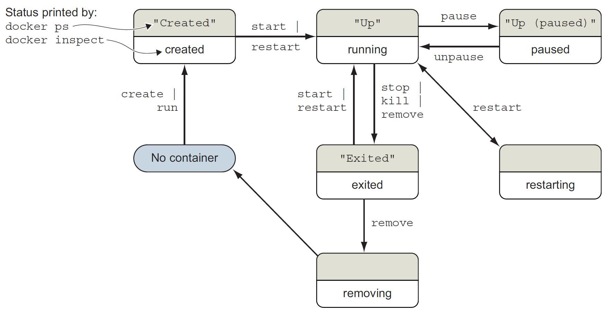
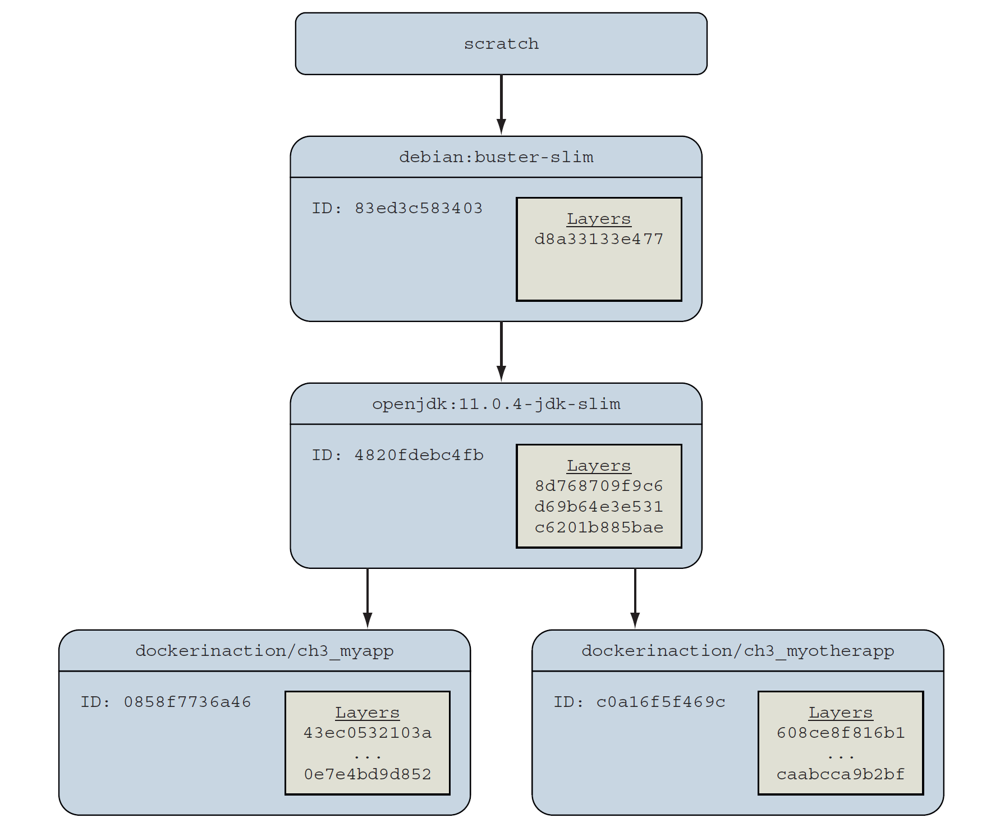
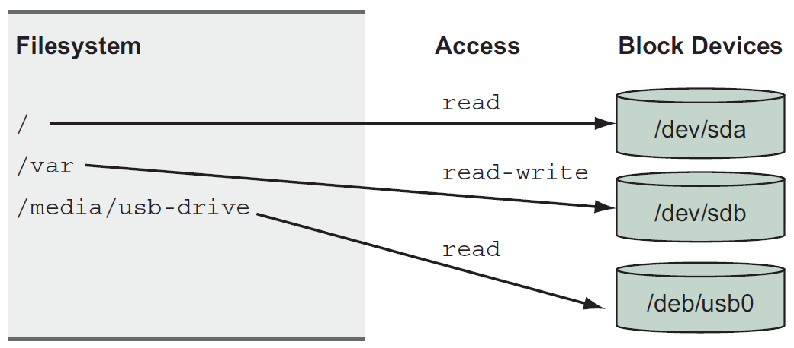
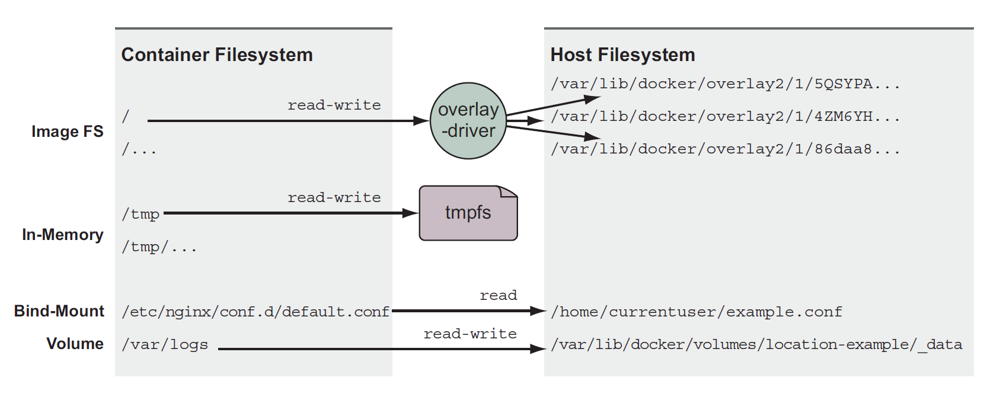
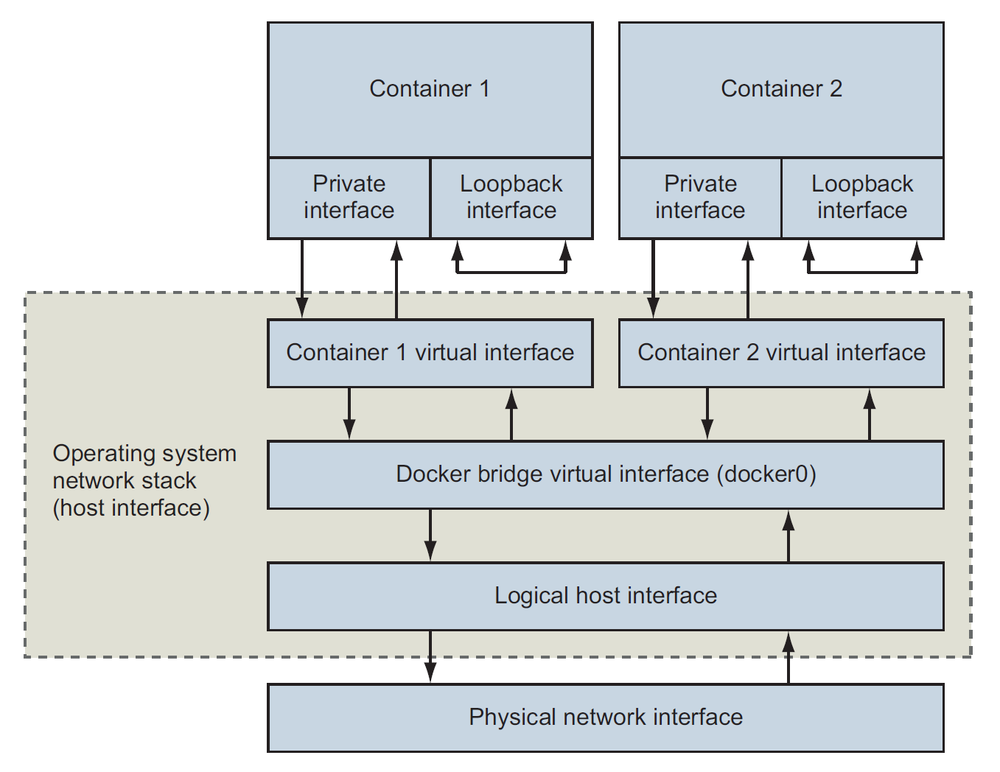
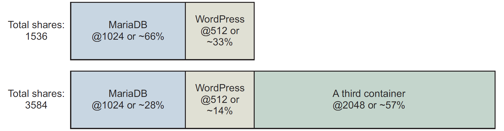

## :gear: Process isolation & Environment-independent computing

[:arrow_backward:](../devops_index)

[toc]

### Running software in containers

An example of running a container:

```shell
docker run --detach \
--name web nginx:latest
```

- `--detach` (`-d`) means that the container will run in the background, without being attached to any input or output stream
- *Detached* type of program is called a *daemon* or a *service*. A daemon generally interacts over a network or other channels

An example of running *interactive* container such as terminal-based text editor:

```shell
docker run --interactive --tty \
--link web:web \
--name web_test \
busybox:1.29 /bin/sh
```

- `--interactive` (`-i`) tells Docker to keep the standard input stream (stdin) open for the container
- `--tty` option tells Docker to allocate a virtual terminal for the container, which will allow to pass signals to the container
- At the end we specified to run a shell program `sh`

> It's possible to create an interactive container, start a process inside of it and then detach the terminal by holding down the CTRL + P + Q. Works only with `--tty` option.

> Command `-it` creates a virtual terminal and binds stdin.


#### Operations on containers

Which containers are currently running:

```shell
docker ps
```

It will show id, used image, command executed in the container, timestamp, duration, exposed network ports and container name.

Check logs for a container:

```shell
docker logs web	
```

##### PID namespace

A PID *namespace* is a set of unique number that identify processes. Linux provides tools to create multiple PID namespaces. A container's PID namespace isolates processes in that container from other processes in other containers. 

Check container PID's:

```shell
docker exec namespaceA ps
```

If we'll check the second container PID's the result will differ because each container has it's own isolated list of processes. 

> `docker run --pid host busybox:1.29 ps` should list all processes running on the computer. Useful when performing a system administration task.


##### Eliminating metaconflicts

Conflicts between containers in the Docker layer is called *metaconflicts*. For example it can be conflict in names. We resolve it with the `docker rename` command.

##### CIDs

We can write container ID to a CID file using `--cidfile` when `docker create` (create container but not start) or `docker run`:

```shell
docker create --cidfile /tmp/web.cid nginx
```

The reason to use CID files instead of names is that CID files can be shared with containers easily. 

To avoid name conflicts we create folders such as `/containers/web/customer1/web.cid` or `/containers/web/customer8/web.cid`.

An example script with assigning CIDs to variables:

```shell
MAILER_CID=$(docker run -d dockerinaction/ch2_mailer)

WEB_CID=$(docker run -d nginx)

AGENT_CID=$(docker run -d \
	--link $WEB_CID:insideweb \
	--link $MAILER_CID:insidemailer \
	dockerinaction/ch2_agent)
```


#### Container state and dependencies



To see all the containers (including those in created state) use `docker ps -a`.


#### Environment variable injection

Key/value pairs that let us change a program's configuration without modifying any files or changing the command used to start the program:

```shell
docker run --env MY_ENVIRONMENT_VAR="this is a test" \
busybox:1.29 \
env
```


#### Building durable containers

Using the `--restart` flag at container-creation time we can set next actions:

- never restart (default)
- attempt to restart when a failure is detected
- attempt for some predetermined time to restart when a failure
- always restart the container regardless of the condition

Docker doesn't always attempt to immediately restart a container. A *backoff strategy* is used so at first time restarting Docker waits 1 second, then on the second attempt wait 2 seconds, 4 seconds and so on. 

##### Using PID 1 and init systems

An *init system* is a program that's used to launch and maintain the state of other programs. Any process with PID 1 is treated like an init process. There are several init systems that could be used inside a container such as `runit`, `supervisors`, `tini` and other.

> Which processes are running inside a container:
>
> ```shell
> docker top container_name
> ```


---

### Software installation simplified

The three main ways to install Docker images:

- Using Docker registries

- Using image files with `docker save` and `docker load`

- Building images with Dockerfiles

  > ```
  > git clone https://github.com/dockerinaction/ch3_dockerfile.git
  > docker build -t dia_ch3/dockerfile:latest ch3_dockerfile
  > ```
  >
  > `-t` option value provides the repository where to install the image. 

  

#### Installation files and isolation

Most of the time an image is actually a collection of image layers. A *layer* is set of files and file metadata that is packaged and distributed as an atomic unit. Docker treats each layer like an image, and layers are often called *intermediate images*.

If you specify the `-a` flag in the `docker images` command, the list will include every installed intermediate image or layer. Some can be listed as `<none>` - unnamed images that in process of building weren't tagged. 

##### Layers relationships



##### Container filesystem abstraction and isolation

Programs running inside containers know nothing about image layers. From inside a container, the filesystem operates as though it's not running in a container. From the perspective of the container, it has exclusive copies of the files provided by the image. It's called *union filesystem (UFS)*.

A union filesystem is part of a critical set of tools that combine to create effective filesystem isolation. The other tools are MNT namespaces and the `chroot` system call.

##### MNT namespaces

> [Linux namespaces](https://en.wikipedia.org/wiki/Linux_namespaces#Namespace_kinds) are a feature that partitions kernel resources such that one set of processes sees one set of resources while another set of processes sees a different set of resources. The feature works like that:
>
> - many namespaces for a set of resources and processes 
> - namespaces refer to distinct resources 
>
> A Linux system starts out with a single namespace of each type, used by all processes. Processes can create additional namespaces and join different namespaces.

Mount namespaces (MNT) is one of those types, which control mount points (mount point is simply a directory, that is created as part of the root filesystem, for example the home filesystem is mounted on the `directory/home`; the Linux root filesystem is mounted on the root directory (`/`) very early in the boot sequence). When creating mount from the current one, the namespace is copied to the new one, and those mount points do not propagate between namespaces.   

##### `chroot`

It's used to make the root of the image filesystem the root in the container's context. This prevents anything running inside the container form referencing any other part of the host filesystem.


---

### Working with storage and volumes

#### File trees and mount points

Linux unifies all storage into a single tree. Storage devices such as disk partition or USB disk partitions are attached to specific locations in that tree. Those locations are called *mount points*.



A mount point defines the location in the tree, the access properties to the data at that point, and the source of the data mounted at that point.

Every container has something called a MNT *namespace* and a unique file tree root. We can also mount nonimage-related storage at other points. That's how containers get access to storage on the host filesystem and share storage between containers. 

There are 3 types of storage mounted into containers:

- Bind mounts
- In-memory storage
- Docker volumes



All 3 types can be created using the `--mount` flag.


#### Bind mounts

*Bind mounts* are mount points used to remount parts of a filesystem tree onto other locations (a user-specific location on the host to a specific point in a container file tree):

```shell
LOG_SRC=~/example.log; \
LOG_DST=/var/log/nginx/custom.host.access.log; \
docker run -d --name diaweb \
	--mount type=bind,src=${CONF_SRC},dst=${CONF_DST},readonly=true \
	--mount type=bind,src=${LOG_SRC},dst=${LOG_DST} \
	-p 80:80 \
	nginx:latest
```

#### In-memory storage

We can add *in-memory storage* to containers with a special type of mount to have our private keys there, database passwords and other sensitive information:

```shell
docker run --rm \
	--mount type=tmpfs,dst=/tmp \
	--entrypoint mount \
	alpine:latest -v
```

This command creates an empty `tmpfs` device and attaches it to the new container's file tree at `/tmp`. Any files created under this file tree will be written to memory instead of disk. This mount point is created with sensible default configuration:

```sh
tmpfs on /tmp type tmpfs (rw,nosuid,nodev,noexec,relatime)
```

#### Docker volumes

*Docker volumes* are named filesystem *trees* managed by Docker. They can be implemented with disk storage on the host filesystem or in cloud:

```shell
docker volume create \
	--driver local \
	--label example=cassandra \
	cass-shared
	
docker run -d \
	--volume cass-shared:/var/lib/cassandra/data \
	--name cass1 \
	cassandra:2.2
```

First command creates volume named `cass-shared` and second mounts the volume into the container.

The `docker run` command provides a flag, `--volumes-from`, that will copy the mount definitions from one or more containers to the new container. 


---

### Single-host networking

The default local Docker network topology and 2 attached containers:



Each container is assigned a unique private IP address that's not directly reachable from the external network. Connections are routed through another Docker network that routes traffic between container and may connect to the host's network to form a *bridge*. 

If we run `docker network ls` it displays a list of all the networks. By default, Docker includes 3 networks:

- `bridge` is the default network and provided by a `bridge` driver
- `host` is provided by the `host` driver, which instructs Docker not to create any special networking namespace for attached containers
- `none` uses the `null` driver, containers attached to this network won't have any network connectivity outside themselves. 

The *scope* of a network can take 3 values: 

- `local` : the network is constrained to the machine where the network exists
- `global` : should be created on every node in a cluster but not route between them
- `swarm` : spams all of the hosts participating in a Docker swarm (multi-host or cluster-wide)


#### Building and exploring network

```shell
docker network create \
	--driver bridge \
	--label project=dockerinaction \
	--label chapter=5 \
	--attachable \
	--scope local \
	--subnet 10.0.42.0/24 \
	--ip-range 10.0.42.128/25 \
	user-network
```

- Marking as `attachable` allows to attach and detach containers to the network at any time
- A custom subnet and assignable address range was defined; as we add containers to this network, they will receive IP addresses in the range from 10.0.42.128 to 10.0.42.255

Attach a new container to that network:

```shell
docker run -it \
	--network user-network \
	--name network-explorer \
	alpine:3.8 \
	sh
```

Get a list of the IPv4 addresses available in the container:

```shell
ip -f inet -4 -o addr
```

The result will show 2 network devices: loopback interface and a virtual Ethernet device, which is connected to bridge. 


#### Handling inbound traffic with NodePort publishing

To forward traffic from the external network interfaces we need to specify a TCP or UDP port on the host interface and a target container and container port.

Port publication configuration is provided at container creation time with a `-p` or `--publish` list option. That argument specifies the host interface, the port on the host to forward, the target port, and the port protocol:

- `0.0.0.0:8080:8080/tcp`
- `8080:8080` is the same

Both option will forward TCP port 8080 from all host interfaces to TCP port 8080 in the new container.

> If we specify as `-p 8080` then it will select a random host port, and traffic will be routed to port 8080 in the container. The benefit is that ports are scarce resources and it allows to avoid potential conflicts.

See the ports forwarded to any given container:

```shell
docker port listener	
```


#### Container network caveats and customizations

##### No firewalls or network policies

Docker container networks do not provide any access control or firewall mechanisms between containers. We need to secure containers with appropriate application-level access-control mechanisms because containers on the same container network will have bidirectional unrestricted network access.

##### Custom DNS configuration

Docker provides different options for customizing the DNS configuration for a new container. 

The `docker run` command has a `--hostname` flag to set the hostname of a new container. This flag adds an entry to the DNS override system inside the container. 

Setting the hostname is useful when programs running inside a container need to look up their own IP address. To share those hostnames with other containers we need to use an external DNS server. 

We can also specify a DNS server to use (for example to Google's public DNS server):

```shell
docker run --rm \
	--dns 8.8.8.8 \
	alpine:3.8 \
	nslookup docker.com
```


---

### Limiting risk with resource controls

#### Setting resource allowances

By default, Docker containers may use unlimited CPU, memory, and device I/O resources. We can set those parameters in `docker create` or `run` commands.

##### Memory limits

Set a limit memory:

```shell
docker container run -d --name ch6_mariadb \
	--memory 256m \
	--cpu-shares 1024 \
	--cap-drop net_raw \
	-e MYSQL_ROOT_PASSWORD=test \
	mariadb:5.5
```

##### CPU

`--cpu-shares` sets the CPU shares and establish its relative weight.



If we set relative weight for MariaDB to 1024 and WordPress to 512 then the first container gets two CPU cycles for every one for other container cycle. 

`--cpus` limits the total amount of CPU used by container:

```shell
docker container run -d -P --name ch6_wordpress \
	--cpus 0.75 \
	wordpress:5.0.0-php7.2-apache
```

With `--cpuset-cpus` we limit a container to execute only on a specific set of CPU cores. 

##### Access to devices

```shell
docker container run -it --rm \
	--device /dev/video0:/dev/video0 \
	ubuntu:16.04 ls -al /dev
```


#### Sharing memory

If we need to run programs that communicate with shared memory in different containers, then we'll need to join their IPC namespaces with the `--ipc` flag:

```shell
docker container rm -v ch6_ipc_consumer

docker container run -d --name ch6_ipc_consumer \
	--ipc container:ch6_ipc_producer \
	dockerinaction/ch6_ipc -consumer
```

On the example the consumer should be able to access the same memory location where the server is writing.

> Sharing memory between containers is a safer alternative than sharing memory with the host (`--ipc=host`).


#### Users

Docker starts containers as the user that is specified by the image metadata by default. To inspect image metadata use `docker inspect` command. Show the run-as user defined in the image:

```shell
docker inspect --format "{{.Config.User}}" busybox:1.29
```

Get a list of available users in an image:

```shell
docker container run --rm busybox:1.29 awk -F: '$0=$1' /etc/passwd
```

We specify a run-as-user with the `--user` or `-u` command on `docker container run` and `create`. The value can accept any user (name or UID) or group pair.

##### Users and volumes

File permissions on files in volumes are respected inside the container and the user ID space is shared. It means that both root on the host and root in the container have user ID 0 and they can access a root file. 

##### Linux user (*USR*) namespace

It maps users in one namespace to users in another. The mappings determine how user IDs on the host correspond to user IDs in a container namespace. For example we map all host UIDs starting from 0 to container UIDs starting with 5000 and a range of 1000. The result is that UID 0 on host is UID 5000 in a container which means that root privileges' were gone. 

> By default, Docker containers are not using this feature. 


#### Adjusting OS feature access with capabilities

Docker can adjust a container's authorization to use individual operating system features (*capabilities*). When a container starts there are list of capabilities that are necessary and safe to run most applications. Using the `--cap-drop` flag we may drop some of them:

```shell
docker container run --rm -u nobody \
	--cap-drop net_raw \
	ubuntu:16.04 \
	/bin/bash -c "capsh --print | grep net_raw"
```

Add capabilities with the `--cap-add` flag.


#### Running a container with full privileges

```shell
docker container run --rm \
	--privileged \
	ubuntu:16.04 ls /dev
```

Use it to run a privileged container in which we change something on a host that needs root privileges'. 
