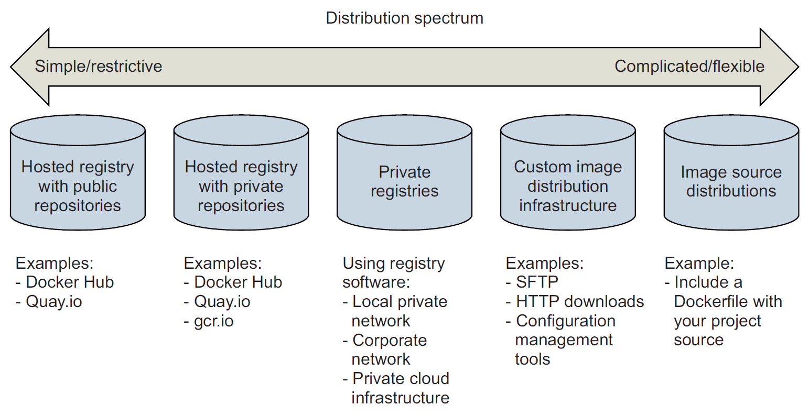
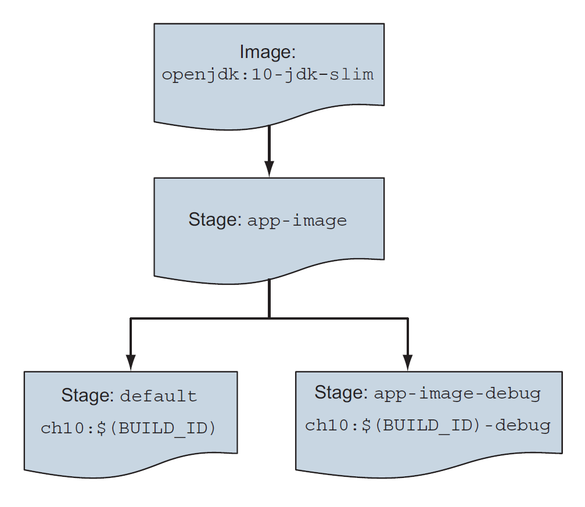

## :package: Packaging software for distribution

[:arrow_backward:](../devops_index)

[toc]

### Packaging software in images

The basic workflow for building an image from a container:

- create a container from an existing image
- modify the filesystem of the container; these changes will be written to a new layer of the container's union filesystem
- commit those changes

##### Reviewing filesystem changes

```shell
docker container diff image-dev
```

##### Committing a new image

```shell
docker container commit -a "@dockerinaction" -m "Added git" \
image-dev ubuntu-git
```

- `-a` flag signs the image with an author
- `-m` flag sets a commit message

##### Configuring image attributes

The filesystem snapshot isn't the only thing included with commit. Each layer also includes metadata describing the execution context including:

- All environment variables
- The working directory
- The set of exposed ports
- All volume definitions
- Container entrypoint
- Command and arguments


---

### Going deep on Docker images and layers

#### Exploring union filesystems

A union filesystem contains of layers. Each time a change is made, that change is recorded on a new layer on top all of the others. The *union* or top-down view, is what container (and user) sees when accessing the filesystem.

Reading files that are located on different layers:


The changes made to the filesystem of a container are listed with the `docker container diff`. It shows a file and action on it: A (add), C (change), D (delete). Changes to filesystem attributes such as file ownership and permissions are recorded same way.

When a file in a read-only layer is modified, the whole file is first copied from the read-only layer into the writable layer before the change is made.

When commit the layer, a new ID is generated for it, it copies all the file changes are saved and some metadata including that generated identifier, parent layer identifier, and the execution context of the container that the layer was created from.

*Repositories* are location/name pairs that point to a set of specific layer identifiers. Each repository contains at least one tag that points to a specific layer identifier - an image definition:


> All layers below the writable layer created for a container are immutable. This property makes it possible to share access to images instead of creating independent copies for every container. It also makes individual layers highly reusable.

By default, if we don't specify any tag it will become *latest*.

We can examine all the layers in an image using the `docker image history`.

##### Tagging a local image

```shell
docker tag 0e5574283393 fedora/httpd:version1.0
```

Tagged a local image with such id to "fedora" repository with "version1.0".


#### Managing image size

We won't be able to decrease container size by deleting some libs because UFS will mark a file as deleted by actually adding a file to the top layer. The original file and any copies that existed in other layers will still be present in the image.

To solve both the size and layer growth problems we use layer system to create branches. If we don't want some lib we just start from some previous image without it and create a new one. To solve the problem of repeating all steps that were made in peer branch we automate image builds with Dockerfiles.


#### Exporting and importing flat filesystems

Export to get a flattened copy of a filesystem:

```shell
docker container create --name export-test \
dockerinaction/ch7_packed:latest ./echo For Export

docker container export --output contents.tar export-test

docker container rm export-test
tar -tf contents.tar
```

Import:

```shell
docker import -c "ENTRYPOINT [\"/hello\"]" - \
dockerinaction/ch7_static < static_hello.tar
```


---

### Building images with Dockerfiles

A *Dockerfile* is a text file that contains instructions for building an image. An example Dockerfile for installing Git on Ubuntu:

```dockerfile
FROM ubuntu:latest
LABEL maintainer="dia@allingeek.com"
RUN apt-get update && apt-get install -y git
ENTRYPOINT ["git"]
```

- FROM - tells Docker to start from the latest Ubuntu image
- LABEL - sets the maintainer name and email for the image
- RUN - tells the builder to run the provided commands
- ENTRYPOINT - sets the entrypoint for the image to git

Build a new image and tag it with `auto`:

```shell
docker image build . --tag ubuntu-git:auto
```

At each step we create a new container from changed existing one:

```
Sending build context to Docker daemon 2.048kB
Step 1/4 : FROM ubuntu:latest
---> 452a96d81c30
...
Step 2/4 : LABEL maintainer="dia@allingeek.com"
---> Running in 11140b391074
Removing intermediate container 11140b391074
...
Step 4/4 : ENTRYPOINT ["git"]
---> Running in 6151803c388a
Removing intermediate container 6151803c388a
---> e397ecfd576c
Successfully built e397ecfd576c
Successfully tagged ubuntu-git:auto
```

If we run those steps again then it will use cache results. For a full rebuild we use `--no-cache flag` on `docker image build`.


#### Dockerfile primer

##### Metadata instructions

The first thing to do when starting a new project is to define which files should never be copied into any other images. We set them in `.dockerignore` file.

```dockerfile
FROM debian:buster-20190910
LABEL maintainer="dia@allingeek.com"
RUN groupadd -r -g 2200 example && \
	useradd -rM -g example -u 2200 example
ENV APPROOT="/app" \
	APP="mailer.sh" \
	VERSION="0.6"
LABEL base.name="Mailer Archetype" \
	base.version="${VERSION}"
WORKDIR $APPROOT
ADD . $APPROOT
ENTRYPOINT ["/app/mailer.sh"]
EXPOSE 33333
```

- LABEL - define key/value pairs for additional metadata
- ENV - environmental variables
- WORKDIR - default working directory; if a location doesn't exist it will create that automatically
- EXPOSE - open ports
- ENTRYPOINT - has two forms: 
  - *shell form* looks like a shell command with whitespace-delimited arguments
  - *exec form* is a string array in which the first value is the command to execute and the remaining values are arguments
- ADD - similar to COPY but with 2 differences:
  - it can fetch remote source files if a URL is specified (but isn't a good practice because no mechanism for cleaning up unused files and results in additional layers; instead use RUN)
  - extract the files of any source determined to be an archive file

##### Filesystem instructions

Dockerfile defines 3 instructions that modify the filesystem: COPY, VOLUME, and ADD. An example:

```dockerfile
FROM dockerinaction/mailer-base:0.6
RUN apt-get update && \
	apt-get install -y netcat
COPY ["./log-impl", "${APPROOT}"]
RUN chmod a+x ${APPROOT}/${APP} && \
	chown example:example /var/log
USER example:example
VOLUME ["/var/log"]
CMD ["/var/log/mailer.log"]
```

- COPY - copy files from the filesystem where the image is being built, into the build container; takes at least 2 arguments and next ones are source files;
  Has one unexpected feature: any files copied with file ownership set to root (better to delay RUN instructions to change file ownership until copy all files)

- VOLUME - create the defined location in the filesystem and add a volume definition to the image metadata; same as `--volume`

- CMD - list of passed default arguments to the ENTRYPOINT command:
  

  CMD command can also be overridden within the `docker run` command, ENTRYPOINT doesn't have such option

Build an image from the directory containing `mailer-logging.df`:

```shell
docker image build -t dockerinaction/mailer-logging -f mailer-logging.df .
```


#### Injecting downstream build-time behavior

ONBUILD instruction defines other instructions to execute if the resulting image is used as a base of another build. For example we could use ONBUILD instructions to compile a program that's provided by a downstream layer. The upstream Dockerfile would use a set of instructions after FROM like this:

```dockerfile
ONBUILD COPY [".", "/var/myapp"]
ONBUILD RUN go build /var/myapp
```

The instructions following ONBUILD aren't executed when their containing Dockerfile is built. Instead, those instructions are recorded in the resulting image's metadata. 


#### Creating maintainable Dockerfiles

##### ARG

ARG instruction defines a variable that users can provide to Docker as an argument when building an image. For example it can be useful for the version metadata that goes into the image tag, environment variable, and label metadata:

```dockerfile
FROM debian:buster-20190910
ARG VERSION=unknown
LABEL maintainer="dia@allingeek.com"
RUN groupadd -r -g 2200 example && \
	useradd -rM -g example -u 2200 example
ENV APPROOT="/app" \
	APP="mailer.sh" \
	VERSION="${VERSION}"
LABEL base.name="Mailer Archetype" \
	base.version="${VERSION}"
WORKDIR $APPROOT
ADD . $APPROOT
ENTRYPOINT ["/app/mailer.sh"]
EXPOSE 33333
```

Now the version can be defined once as a shell variable and passed on the command line as both the image tag and a build argument for use within the image:

```dockerfile
version=0.6; docker image build -t dockerinaction/mailer-base:${version} \
-f mailer-base.df \
--build-arg VERSION=${version} \
```

If we hadn't specified VERSION as a build argument it will use default `unknown` value.

##### Multistage Dockerfile

We can define stages in one Dockerfile, for example `builder` and `runtime`. First one gather dependencies and builds the program and the next stage copies the certificate authority and other files into the runtime image execution:

```dockerfile
#################################################
# Define a Builder stage and build app inside it
FROM golang:1-alpine as builder

# Install CA Certificates
RUN apk update && apk add ca-certificates

# Copy source into Builder
ENV HTTP_CLIENT_SRC=$GOPATH/src/dia/http-client/
COPY . $HTTP_CLIENT_SRC
WORKDIR $HTTP_CLIENT_SRC

# Build HTTP Client
RUN CGO_ENABLED=0 GOOS=linux GOARCH=amd64 \
	go build -v -o /go/bin/http-client
	
#################################################
# Define a stage to build a runtime image.
FROM scratch as runtime
ENV PATH="/bin"
# Copy CA certificates and application binary from builder stage
COPY --from=builder \
	/etc/ssl/certs/ca-certificates.crt /etc/ssl/certs/ca-certificates.crt
COPY --from=builder /go/bin/http-client /http-client
ENTRYPOINT ["/http-client"]
```

Defined a stage with `as builder` which also allows for easy referencing to filesystem.


#### Using startup scripts and multiprocess containers

##### Environmental preconditions validation

Docker containers have no control over the environment where they're created but they have control of their execution. An image author may introduce environment and dependency validation prior to execution of the main task. At the startup we should validate as much context as possible, including the following:

- Presumed links (and aliases)
- Environment variables
- Secrets
- Network access
- Network port availability
- Root filesystem mount parameters (read-write or read-only)
- Volumes
- Current user

We may use shell script at container startup:

```shell
#!/bin/bash
set -e
if [ -n "$WEB_PORT_80_TCP" ]; then
	if [ -z "$WEB_HOST" ]; then
		WEB_HOST='web'
	else
		echo >&2 '[WARN]: Linked container, "web" overridden by $WEB_HOST.'
		echo >&2 "===> Connecting to WEB_HOST ($WEB_HOST)"
	fi
fi
if [ -z "$WEB_HOST" ]; then
	echo >&2 '[ERROR]: specify container to link; "web" or WEB_HOST env var'
	exit 1
fi
exec "$@" # run the default command
```

##### Initialization processes

Using an init process is the best way to launch multiple programs, clean up orphaned processes, automatically restart any failed processes. Init processes typically use a file. We may use a startup script for the runit program.

Docker provides an `--init` option to run an init process inside the container. Docker uses `tini` program as an init process by default.

##### Health checks

Two ways to specify the health check command:

- Use a HEALTHCHECK instruction 
- On the command-line when running a container

```shell
FROM nginx:1.13-alpine
HEALTHCHECK --interval=5s --retries=2 \
	CMD nc -vz -w 2 localhost 80 || exit 1 #it means "or exit 1"
```

The command exit status is used to determine the container's health. Options:

- 0: *success*
- 1: *unhealthy*
- 2: *reserved* - do not use this exit code

Checks run frequently and to find containers health run `docker ps` command.

Health check facility also supports options for the following:

- *time-out* : time-out for the health check command to run and exit
- *start period* : period at the start of a container when the health status wasn't defined yet

`--health-cmd` to provide health checks at container runtime.


#### Building hardened application images

*Hardening* an image is the process of shaping it in a way that will reduce the attack surface inside any Docker containers based on it. A general strategy for hardening is to minimize the software included with it to reduce vulnerabilities. Besides that you can do following:

- Enforce that your images are built from a specific image
- Regardless of how container are build they will have a sensible default user
- Eliminate a common path for root user escalation from programs with `setuid` or `setgid` attributes set


---

### Public and private software distribution

#### Choosing a distribution method




---

### Image pipelines

CI process for a Docker image:


1) Check out a clean copy of the source code defining the image and build scripts
2) Retrieve or generate artifacts that will be included in the image 
3) Build the image by using a Dockerfile
4) Verify that the image is structured and functions as intended
5) (Optional) Verify that the image does not contain known vulnarabilites
6) Tag the image so that it can be consumed easily
7) Publish the image to a registry or another distribution channel

#### Patterns for building images

- *All-in-One* - use an all-in-one image to build and run the application
- *Build plus Runtime* - use a build image with a separate, slimmer runtime image to build a containerized application
- *Build Plus Multiple Runtimes* -  use a slim runtime image with variations for debugging and other use cases in a multi-stage build

##### All-in-One pattern

```shell
FROM maven:3.6-jdk-11
ENV WORKDIR=/project
RUN mkdir -p ${WORKDIR}
COPY . ${WORKDIR}
WORKDIR ${WORKDIR}
RUN mvn -f pom.xml clean verify
RUN cp ${WORKDIR}/target/ch10-0.1.0.jar /app.jar
ENTRYPOINT ["java","-jar","/app.jar"]
```

And build the project:

```shell
docker image build -t dockerinaction/ch10:all-in-one \
	--file all-in-one.df .
```

##### Separate build and runtime images

Run maven container to build an application artifact:

```shell
docker container run -it --rm \
-v "$(pwd)":/project/ \
-w /project/ \
maven:3.6-jdk-11 \
mvn clean verify
```

Dockerfile for building the runtime image:

```dockerfile
FROM openjdk:11-jdk-slim
COPY target/ch10-0.1.0.jar /app.jar
ENTRYPOINT ["java","-jar","/app.jar"]
```

Build and run:

```shell
docker image build -t dockerinaction/ch10:simple-runtime \
--file simple-runtime.df

docker container run --rm -it -p 8080:8080 dockerinaction/ch10:simple-runtime
```

##### Variations of runtime image via multi-stage builds

Sometimes it's useful to create small variations of an application image to support use cases such as debugging, specialized testing or profiling.

Multi-stage build example:




#### Record metadata at image build time

Should use labels to capture at least the following data:

- Application name
- Application version
- Build date and time
- Version-control commit identifier

The Docker community Label Schema has defined [commonly used labels](http://label-schema.org/rc1/).


#### Patterns for tagging images

Multiple tags may point to a single image ID and tags are *mutable* and may be moved between images or removed. There are common tagging and deployment schemes.

##### Continuous delivery with unique tags

Pipelines promote a single image with a unique tag through delivery stages:


##### Configuration image per deployment stage

Pipelines produce environment-specific artifacts and promote them through stages:


We create two kinds of images:

- a generic, environment-agnostic application image
- a set of environment-specific configuration images, with each image containing environment specific configuration files
- They both should be build at the same time and tagged with the same BUILD_ID

At deployment, the application container is created from the generic application image, and that container mounts the config container's filesystem as a volume.

##### Semantic versioning

Tag and publish images with a `Major.Minor.Patch` scheme that communicates the level of change in a release. It helps both publishers and consumers manage expectations for the kind of changes a consumer is getting when updating an image dependency.
