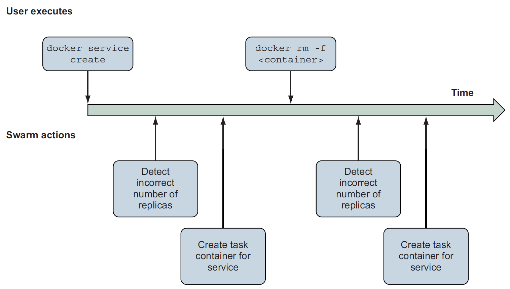
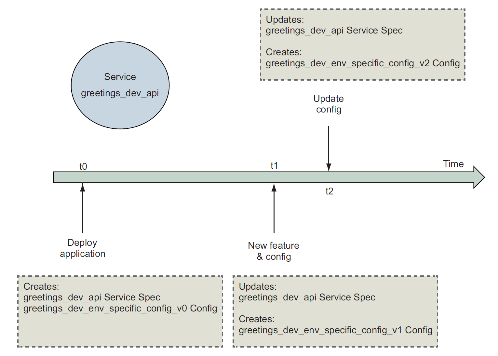

## :thinking: Higher-level abstractions and orchestration

[:arrow_backward:](../devops_index)

### Services with Docker and Compose

[toc]

Any processes, functionality, or data that must be discoverable and available over a network is called a service.

##### A service "Hello World!"

```shell
docker swarm init
docker service create \
 --publish 8080:80 \
 --name hello-world \
 dockerinaction/ch11_service_hw:v1
```

Services are available only when Docker is running in swarm mode. Initializing swarm mode starts an internal database as well as a long-running loop in the Docker Engine that performs service orchestration.


Running the `init` enables the service management subcommands.

> A *task* is a swarm concept that represents a unit of work. Each task has one associated container.


The swarm node automatically creates a container to run the service software. 

##### Automated resurrection and replication

When we stop the container then after a short period the swarm node will automatically create a container for the specific running service again. 

Timeline of Swarm reactions to services:



- To see running services run `docker service ls`. 
- Inspect service with `docker service inspect hello-world`

There are 2 replication modes: 

- *replicated mode* - create and maintain fixed number of replicas; set the number of replicas with `docker service scale`
- *global* - run one replica on each node in the swarm cluster

##### Automated rollout

For automating a process we should describe the characteristics of the deployment. Those include order, batch sizes, and delays.


```shell
docker service update \
 --image dockerinaction/ch11_service_hw:v2 \
 --update-order stop-first \
 --update-parallelism 1 \
 --update-delay 30s \
 hello-world
```

- This command tells Docker to change the `hello_world` service to use the image tagged `v2`
- Wait for 30 seconds between updating each batch of replicas (allow new service instances to become stable before starting)
- Each replica should be stopped before its replacement is started
- Only one replica should be updated at a time

If everything goes then the service becomes *converged* - current state of the service is the same as the desired state. 

In the case of a failure old replicas will still work but the other third - new version, which failed, will keep cycling through starting and failed states. We fix it with `--rollback` flag on the `update` command. This command will ask Docker to reconcile the current state with the previous desired state. We can automate this with the `--update-failure-action` flag.


#### Declarative service environments with Compose V3

Docker services are *declarative* abstractions. When we create a service, we *declare* that we want a certain number of replicas of that service.

> It's very useful to adopt a higher-level declarative abstractions when it comes to building more complex systems because the huge number of *imperative* commands are required to achieve goals. We can automate them.

Declarative processing loop:


The Swarm orchestration system continuously compares the declared state of the system with the current state. When in detects a difference, it uses set of rules to change the system to match the desired state.

A *stack* describes collection of services, volumes, networks and other abstractions. Stacks are created from a declarative description of an entire environment, which are described using the Docker Compose files.

An example:

```yaml
version: "3.7"
services:
	postgres:
		image: dockerinaction/postgres:11-alpine
		environment:
			POSTGRES_PASSWORD: example
	mariadb:
		image: dockerinaction/mariadb:10-bionic
		environment:
			MYSQL_ROOT_PASSWORD: example
	adminer:
		image: dockerinaction/adminer:4
		ports:
			- 8080:8080
```

Deploy the services:

```yaml
docker stack deploy -c databases.yml my-databases
```

This command is also used to update stacks (compares old yml with the new one).

List all of the tasks and their ages:

```shell
docker stack ps \
 --format '{{.Name}}\t{{.CurrentState}}' \
 my-databases
```

##### Removing a service

Use `docker service remove` to manually remove a service. But the problem is that with the next `docker stack deploy` this service will start again. Better to remove the service definition from the Compose file and then execute `docker stack deploy` with the `--prune` flag:

```shell
docker stack deploy \
 -c databases.yml \
 --prune \
 my-databases
```

The `--prune` flag will clean up any resource in the stack that isn't explicitly referenced in the Compose file used for the deploy.


#### Stateful services and preserving data

```yaml
version: "3.7"
volumes:
	pgdata: # empty definition uses volume defaults
services:
	postgres:
		image: dockerinaction/postgres:11-alpine
		volumes:
			- type: volume
			  source: pgdata # The named volume above
			  target: /var/lib/postgresql/data
		environment:
			POSTGRES_PASSWORD: example
	adminer:
		image: dockerinaction/adminer:4
		ports:
			- 8080:8080
		deploy:
			replicas: 1 # Scale down to 1 replica so you can test
```

We define a volume `pgdata`, and the `postgres` service mounts that volume at `/var/lib/postgresql/data`. That location is where the PostgreSQL will store any database schema or data.


#### Load balancing, service discovery, and networks with Compose

Port publishing for a service is different from publishing port on a container. Docker accommodates services by creating virtual IP (VIP) addresses and is balancing requests for a specific service:


When using services, we're using at least two Docker networks:

- `ingress` handles all port forwarding from the host to services
- default network that is shared between all of the services in a stack

```yaml
version: "3.7"
networks:
	foo:
	driver: overlay
volumes:
	pgdata: # empty definition uses volume defaults
services:
	postgres:
		image: dockerinaction/postgres:11-alpine
		volumes:
			- type: volume
		    source: pgdata # The named volume above
		    target: /var/lib/postgresql/data
		networks:
			- foo
		environment:
			POSTGRES_PASSWORD: example
adminer:
	image: dockerinaction/adminer:4
	networks:
		- foo
	ports:
		- 8080:8080
	deploy:
		replicas: 1
```

If we manage multiple stack and want to use shared network, instead of specifying a driver we would use `external:true` property. 

In the case when need to isolate multiple groups of services we define the network at the top level and use different network attachments.


---

### First-class configuration abstractions

#### Separating application and configuration

```yaml
version: '3.7'
configs:
	env_specific_config:
		file: ./api/config/config.${DEPLOY_ENV:-prod}.yml
services:
	api:
		image: ${IMAGE_REPOSITORY:-dockerinaction/ch12_greetings}:api
		ports:
			- '8080:8080'
			- '8443:8443'
		user: '1000'
		configs:
			- source: env_specific_config
			  target: /config/config.${DEPLOY_ENV:-prod}.yml
			  uid: '1000'
			  gid: '1000'
			  mode: 0400 #default is 0444 - readonly for all users
		secrets: []
		environment:
			DEPLOY_ENV: ${DEPLOY_ENV:-prod}
```

This Compose file loads the application's environment-specific configuration files into the `api` service's containers. The `DEPLOY_ENV` environment variable parameterized this deployment definition. If it's set to `dev`, Docker will reference to `config.dev.yml`.

##### Working with the config resource

A *config resource* is a Swarm cluster object that's used to store runtime data. When a Docker service uses a config resource, Swarm mounts a file inside the service's container filesystems populated with the config resource's contents. 

To give a service access to a config you must map it under the service's own `configs` key.

The config mapping may customize the location (`target`), ownership (`uid` and `gid`), and permissions (`mode`) of the resulting file in a container's filesystem.

>By default, config resources are mounted into the container filesystem at /<config_name>.

##### Deploying the application

```shell
DEPLOY_ENV=dev docker stack deploy \
	--compose-file docker-compose.yml greetings_dev
```

Inspect what config does service use:

```shell
docker service inspect \
	--format '{{ json .Spec.TaskTemplate.ContainerSpec.Configs }}' \
	greetings_dev_api
```

##### Update a config

It's impossible to delete or update a config directly because our services heavily depend on them. But creating a new one and referencing it in deployment should do the job:




#### Secrets

If an application is started without secret information such as a password credential to authenticate to the secret vault, how can the vault authorize access to the application's secrets? It can't. This is the *First Secret Problem*. Docker solves it.

Docker Swarm includes a secure secret vault that is tightly integrated with the cluster's identity and services. Docker service ID serves as the application's identity. Docker Swarm uses the service ID to determine which secrets the service's tasks should have access to. 

Files are mounted to a container-specific, in-memory, read-only `tmpfs` filesystem. By default, secrets will be placed in the `/run/secrets` directory.

A common pattern is to pass an environmental variable with secrets location. Only processes running inside the container will have access to that file.


The secret is mapped into container almost identically as configs:

```yaml
secrets:
	ch12_greetings-svc-prod-TLS_PRIVATE_KEY_V1:
		external: true

services:
	api:
		environment:
		CERT_PRIVATE_KEY_FILE: '/run/secrets/cert_private_key.pem'
		CERT_FILE: '/config/svc.crt'
	secrets:
		- source: ch12_greetings-svc-prod-TLS_PRIVATE_KEY_V1
		  target: cert_private_key.pem
		  uid: '1000'
		  gid: '1000'
		  mode: 0400
	# ... snip ...
```

- `external:true` means that the value of the secret is not defined by this deployment definition, instead secret must be created by the docker CLI command:

  ```shell
  cat api/config/insecure.key | \
    docker secret create ch12_greetings-svc-prod-TLS_PRIVATE_KEY_V1 -
  ```

  The value may be specified either by providing the location of a file, or by using the - (hyphen) to indicate that the value is provided via standard input.

- Reading a secret from `source`, we define a `target` file name into which secret will be copied to; the default location for secret files is `/run/secrets/`
- Define an environment variable `CERT_PRIVATE_KEY_FILE` with a full location of the secret file for our application to access


---

### Orchestrating services on a cluster of Docker hosts with Swarm